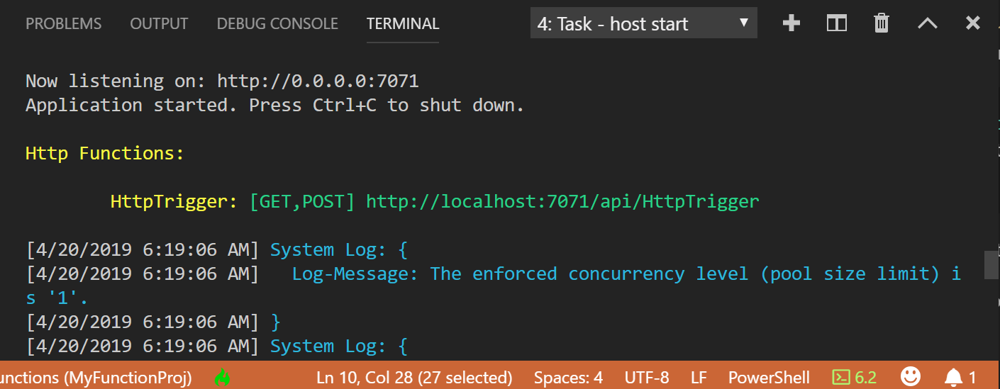

# Create your first PowerShell function in Azure

This quickstart article walks you through how to create your first [serverless](https://azure.com/serverless) PowerShell function using Visual Studio Code.


You use the [Azure Functions extension for Visual Studio Code] to create a PowerShell function locally and then deployed it to a new function app in Azure. The extension is currently in preview. To learn more, see the [Azure Functions extension for Visual Studio Code] extension page.

> [!NOTE]  
> PowerShell support for the [Azure Functions extension][Azure Functions extension for Visual Studio Code] is currently disabled by default. Enabling PowerShell support is one of the steps in this article.

The following steps are supported on macOS, Windows, and Linux-based operating systems.

## Prerequisites

To complete this quickstart:

* Install [PowerShell Core](/powershell/scripting/install/installing-powershell-core-on-windows)

* Install [Visual Studio Code](https://code.visualstudio.com/) on one of the [supported platforms](https://code.visualstudio.com/docs/supporting/requirements#_platforms). 

* Install [PowerShell extension for Visual Studio Code](https://marketplace.visualstudio.com/items?itemName=ms-vscode.PowerShell).

* Install [.NET Core SDK 2.2+](https://www.microsoft.com/net/download) (required by Azure Functions Core Tools and available on all supported platforms).

* Install version 2.x of the [Azure Functions Core Tools](functions-run-local.md#v2).

* You also need an active Azure subscription.

[!INCLUDE [quickstarts-free-trial-note](../../includes/quickstarts-free-trial-note.md)]

[!INCLUDE [functions-install-vs-code-extension](../../includes/functions-install-vs-code-extension.md)] 

## Create a function app project

The Azure Functions project template in Visual Studio Code creates a project that can be published to a function app in Azure. A function app lets you group functions as a logical unit for management, deployment, and sharing of resources. 

1. In Visual Studio Code, select the Azure logo to display the **Azure: Functions** area, and then select the Create New Project icon.

    

1. Choose a location for your Functions project workspace and choose **Select**.

    > [!NOTE]
    > This article was designed to be completed outside of a workspace. In this case, do not select a project folder that is part of a workspace.

1. Select the **Powershell** as the language for your function app project and then **Azure Functions v2**.

1. Choose **HTTP Trigger** as the template for your first function, use `HTTPTrigger` as the function name, and choose an authorization level of **Function**.

    > [!NOTE]
    > The **Function** authorization level requires a [function key](functions-bindings-http-webhook.md#authorization-keys) value when calling the function endpoint in Azure. This makes it harder for just anyone to call your function.

1. When prompted, choose **Add to workspace**.

Visual Studio Code creates the PowerShell function app project in a new workspace. This project contains the [host.json](functions-host-json.md) and [local.settings.json](functions-run-local.md#local-settings-file) configuration files, which apply to all function in the project. This [PowerShell project](functions-reference-powershell.md#folder-structure) is the same as a function app running in Azure.

## Run the function locally

Azure Functions Core Tools integrates with Visual Studio Code to let you run and debug an Azure Functions project locally.  

1. To debug your function, insert a call to the [`Wait-Debugger`] cmdlet in the function code before you want to attach the debugger, then press F5 to start the function app project and attach the debugger. Output from Core Tools is displayed in the **Terminal** panel.

1. In the **Terminal** panel, copy the URL endpoint of your HTTP-triggered function.

    

1. Append the query string `?name=<yourname>` to this URL, and then use `Invoke-RestMethod` to execute the request, as follows:

    ```powershell
    PS > Invoke-RestMethod -Method Get -Uri http://localhost:7071/api/HttpTrigger?name=PowerShell
    Hello PowerShell
    ```

    You can also execute the GET request from a browser.

    When you call the HttpTrigger endpoint without passing a `name` parameter either as a query parameter or in the body, the function returns a [HttpStatusCode]::BadRequest error. When you review the code in run.ps1, you see that this error occurs by design.

1. To stop debugging, press Shift + F5.

After you've verified that the function runs correctly on your local computer, it's time to publish the project to Azure.

> [!NOTE]
> Remember to remove any calls to `Wait-Debugger` before you publish your functions to Azure. 

> [!NOTE]
> Creating a Function App in Azure will only prompt for Function App name. 
> Set azureFunctions.advancedCreation to true to be prompted for all other values.

[!INCLUDE [functions-publish-project-vscode](../../includes/functions-publish-project-vscode.md)]

## <a name="test"></a>Run the function in Azure

To verify that your published function runs in Azure, execute the following PowerShell command, replacing the `Uri` parameter with the URL of the HTTPTrigger function from the previous step. As before, append the query string `&name=<yourname>` to the URL, as in the following example:

```powershell
PS > Invoke-WebRequest -Method Get -Uri "https://glengatest-vscode-powershell.azurewebsites.net/api/HttpTrigger?code=nrY05eZutfPqLo0som...&name=PowerShell"

StatusCode        : 200
StatusDescription : OK
Content           : Hello PowerShell
RawContent        : HTTP/1.1 200 OK
                    Content-Length: 16
                    Content-Type: text/plain; charset=utf-8
                    Date: Thu, 25 Apr 2019 16:01:22 GMT

                    Hello PowerShell
Forms             : {}
Headers           : {[Content-Length, 16], [Content-Type, text/plain; charset=utf-8], [Date, Thu, 25 Apr 2019 16:01:22 GMT]}
Images            : {}
InputFields       : {}
Links             : {}
ParsedHtml        : mshtml.HTMLDocumentClass
RawContentLength  : 16
```

## Next steps

You have used Visual Studio Code to create a PowerShell function app with a simple HTTP-triggered function. You may also want to learn more about [debugging a PowerShell function locally](functions-debug-powershell-local.md) using the Azure Functions Core Tools. Check out the [Azure Functions PowerShell developer guide](functions-reference-powershell.md).

> [!div class="nextstepaction"]
> [Enable Application Insights integration](functions-monitoring.md#manually-connect-an-app-insights-resource)

[Azure portal]: https://portal.azure.com
[Azure Functions Core Tools]: functions-run-local.md
[Azure Functions extension for Visual Studio Code]: https://marketplace.visualstudio.com/items?itemName=ms-azuretools.vscode-azurefunctions
[`Wait-Debugger`]: /powershell/module/microsoft.powershell.utility/wait-debugger?view=powershell-6
