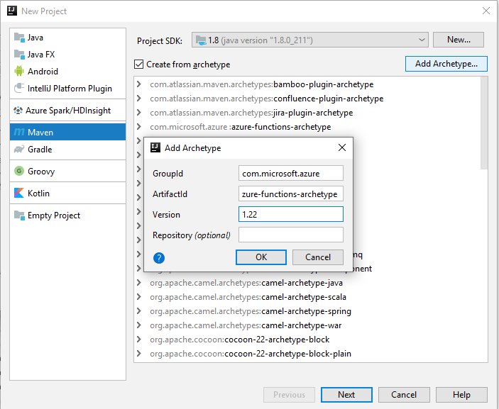
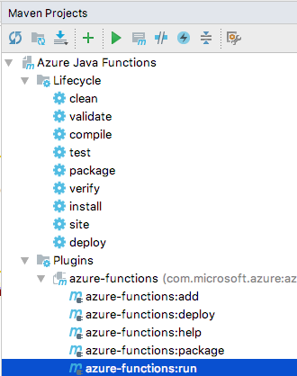

# Create your first function with Java and IntelliJ (Preview)

> [!NOTE] 
> Java for Azure Functions is currently in preview.

This article shows you how to create a [serverless](https://azure.microsoft.com/overview/serverless-computing/) function project with IntelliJ IDEA and Apache Maven, test and debug it on your own computer from the IDE, and deploy it to Azure Functions. 

<!-- TODO  -->

[!INCLUDE [quickstarts-free-trial-note](../../includes/quickstarts-free-trial-note.md)]

## Set up your development environment

To develop a functions app with Java and IntelliJ, you must have the following installed:

-  [Java Developer Kit](https://www.azul.com/downloads/zulu/), version 8.
-  [Apache Maven](https://maven.apache.org), version 3.0 or above.
-  [IntelliJ IDEA](https://www.jetbrains.com/idea/download), Community or Ultimate with Maven tooling.
-  [Azure CLI](https://docs.microsoft.com/cli/azure)

> [!IMPORTANT] 
> The JAVA_HOME environment variable must be set to the install location of the JDK to complete this quickstart.

It is highly reccommended to also install [Azure Functions Core Tools, version 2](functions-run-local.md#v2), which provide a local development environment for writing, running, and debugging Azure Functions. 


## Create a Functions project

1. In IntelliJ IDEA, click to **Create New Project**.  
1. Select to create from **Maven**
1. Select the checkbox to **Create from archetype** and **Add Archetype** for the [azure-functions-archetype](https://mvnrepository.com/artifact/com.microsoft.azure/azure-functions-archetype).
    - GroupId: com.microsoft.azure
    - ArtifactId: azure-functions-archetype
    - Version: Use latest version from [the central repository](https://mvnrepository.com/artifact/com.microsoft.azure/azure-functions-archetype)
      
1. Click **Next** and enter details for current project, and eventually **Finish**.

Maven creates the project files in a new folder with a name of _artifactId_. The generated code in the project is a simple [HTTP triggered](/azure/azure-functions/functions-bindings-http-webhook) function that echoes the body of the triggering HTTP request.

## Run functions locally in the IDE

> [!NOTE]
> [Azure Functions Core Tools, version 2](functions-run-local.md#v2) must be installed to run and debug functions locally.

1. Select to import changes or make sure that [auto import](https://www.jetbrains.com/help/idea/creating-and-optimizing-imports.html) is enables.
1. Open the **Maven Projects** toolbar
1. Under Lifecycle, double-click **package** to package and build the solution and create a target directory.
1. Under Plugins -> azure-functions double-click **azure-functions:run** to start the azure functions local runtime.  
    

Close the run dialog when you're done testing your function. Only one function host can be active and running locally at a time.

### Debug the function in IntelliJ

You can debug functions in IntelliJ by attaching to the function host after startup.  Run the Azure Function locally using the steps above, and then in the **Run** menu select **Attach to local process**.  You should see a process on port 5005 available.  After attaching you can have breakpoints hit and debug inside your function app.

When finished stop the debugger and the running process. Only one function host can be active and running locally at a time.

## Deploy the function to Azure

The deploy process to Azure Functions uses account credentials from the Azure CLI. [Log in with the Azure CLI](/cli/azure/authenticate-azure-cli?view=azure-cli-latest) before continuing using your computer's command prompt.

```azurecli
az login
```

Deploy your code into a new Function app using the `azure-functions:deploy` Maven target, or select the azure-functions:deploy option in the Maven Projects window.

```
mvn azure-functions:deploy
```

When the deploy is complete, you see the URL you can use to access your Azure function app:

```output
[INFO] Successfully deployed Function App with package.
[INFO] Deleting deployment package from Azure Storage...
[INFO] Successfully deleted deployment package fabrikam-function-20170920120101928.20170920143621915.zip
[INFO] Successfully deployed Function App at https://fabrikam-function-20170920120101928.azurewebsites.net
[INFO] ------------------------------------------------------------------------
```

## Next steps

- Review the  [Java Functions developer guide](functions-reference-java.md) for more information on developing Java functions.
- Add additional functions with different triggers to your project using the `azure-functions:add` Maven target.
