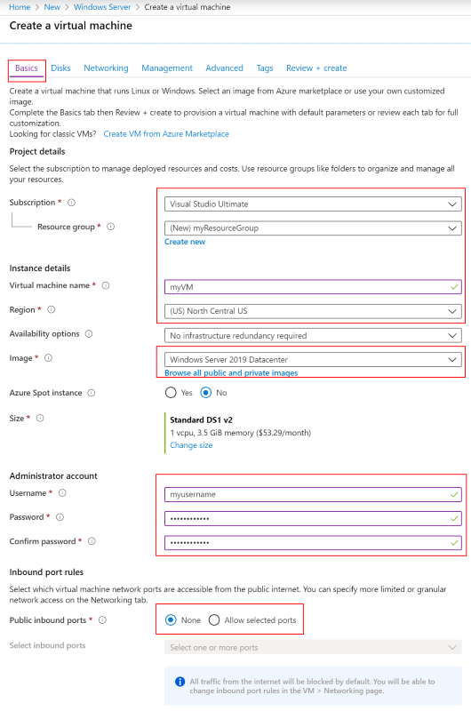
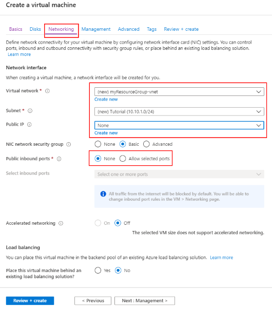
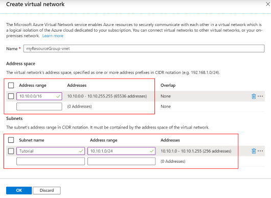
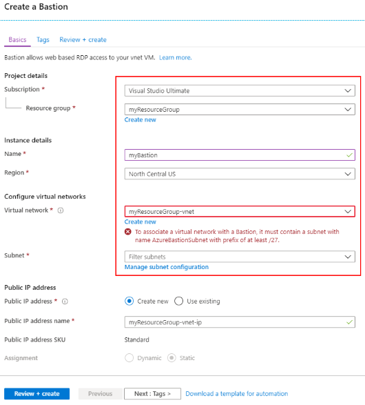
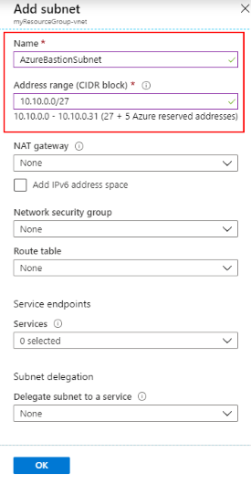
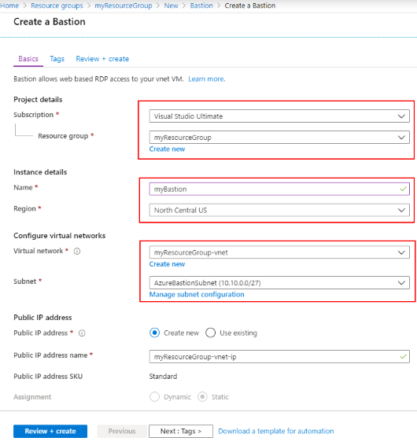
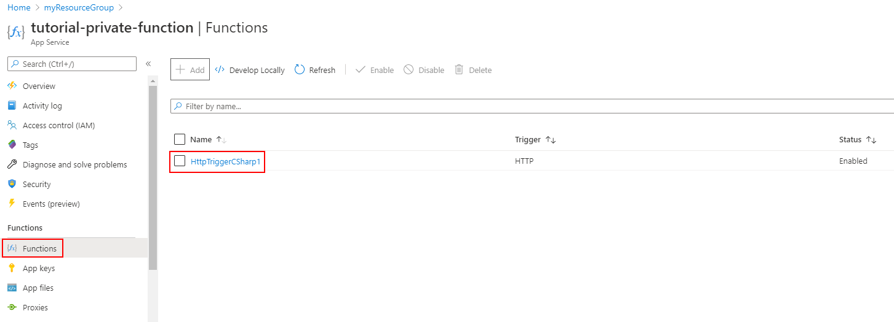
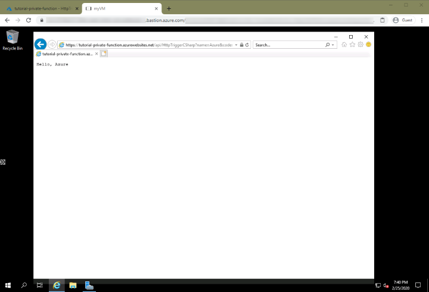

# Tutorial: Establish Azure Functions private site access

This tutorial shows you how to enable [private site access](./functions-networking-options.md#private-site-access) with Azure Functions. By using private site access, you can require that your function code is only triggered from a specific virtual network.

Private site access is useful in scenarios when access to the function app needs to be limited to a specific virtual network. For example, the function app may be applicable to only employees of a specific organization, or services which are within the specified virtual network (such as another Azure Function, Azure Virtual Machine, or an AKS cluster).

If a Functions app needs to access Azure resources within the virtual network, or connected via [service endpoints](../virtual-network/virtual-network-service-endpoints-overview.md), then [virtual network integration](./functions-create-vnet.md) is needed.

In this tutorial, you learn how to configure private site access for your function app:

> [!div class="checklist"]
> * Create a virtual machine
> * Create an Azure Bastion service
> * Create an Azure Functions app
> * Configure a virtual network service endpoint
> * Create and deploy an Azure Function
> * Invoke the function from outside and within the virtual network

If you don’t have an Azure subscription, create a [free account](https://azure.microsoft.com/free/?WT.mc_id=A261C142F) before you begin.

## Topology

The following diagram shows the architecture of the solution to be created:

## Prerequisites

For this tutorial, it's important that you understand IP addressing and subnetting. You can start with [this article that covers the basics of addressing and subnetting](https://support.microsoft.com/help/164015/understanding-tcp-ip-addressing-and-subnetting-basics). Many more articles and videos are available online.

## Sign in to Azure portal

Sign in to the [Azure portal](https://portal.azure.com).

## Create a virtual machine

The first step in this tutorial is to create a new virtual machine inside a virtual network.  The virtual machine will be used to access your function once you've restricted it's access to only be available from within the virtual network.

1. Select the **Create a resource** button.

2. In the search field, type `Windows Server`, and select **Windows Server** in the search results.

3. Select **Windows Server 2019 Datacenter** from the list of Windows Server options, and press the **Create** button.

4. In the **Basics** tab, use the VM settings as specified in the table below the image:

    >[!div class="mx-imgBorder"]
    >

    | Setting      | Suggested value  | Description      |
    | ------------ | ---------------- | ---------------- |
    | **Subscription** | Your subscription | The subscription under which your resources are created. |
    | [**Resource group**](../azure-resource-manager/management/overview.md) | myResourceGroup | Choose the resource group to contain all the resources for this tutorial.  Using the same resource group makes it easier to clean up resources when you're done with this tutorial. |
    | **Virtual machine name** | myVM | The VM name needs to be unique in the resource group |
    | [**Region**](https://azure.microsoft.com/regions/) | (US) North Central US | Choose a region near you or near the functions to be accessed. |
    | **Public inbound ports** | None | Select **None** to ensure there is no inbound connectivity to the VM from the internet. Remote access to the VM will be configured via the Azure Bastion service. |

5. Choose the **Networking** tab and select **Create new** to configure a new virtual network.

    >[!div class="mx-imgBorder"]
    >

6. In **Create virtual network**, use the settings in the table below the image:

    >[!div class="mx-imgBorder"]
    >

    | Setting      | Suggested value  | Description      |
    | ------------ | ---------------- | ---------------- |
    | **Name** | myResourceGroup-vnet | You can use the default name generated for your virtual network. |
    | **Address range** | 10.10.0.0/16 | Use a single address range for the virtual network. |
    | **Subnet name** | Tutorial | Name of the subnet. |
    | **Address range** (subnet) | 10.10.1.0/24 | The subnet size defines how many interfaces can be added to the subnet. This subnet is used by the VM. A `/24` subnet provides 254 host addresses. |

7. Select **OK** to create the virtual network.
8. Back in the **Networking** tab, ensure **None** is selected for **Public IP**.
9. Choose the **Management** tab, then in **Diagnostic storage account**, choose **Create new** to create a new Storage account.
10. Leave the default values for the **Identity**, **Auto-shutdown**, and **Backup** sections.
11. Select **Review + create**. After validation completes, select **Create**. The VM create process takes a few minutes.

## Configure Azure Bastion

[Azure Bastion](https://azure.microsoft.com/services/azure-bastion/) is a fully managed Azure service which provides secure RDP and SSH access to virtual machines directly from the Azure portal. Using the Azure Bastion service removes the need to configure network settings related to RDP access.

1. In the portal, choose **Add** at the top of the resource group view.
1. In the search field, type **Bastion**.
1. Select **Bastion** in the search results.
3. Select **Create** to begin the process of creating a new Azure Bastion resource. You will notice an error message in the **Virtual network** section as there is not yet an `AzureBastionSubnet` subnet. The subnet is created in the following steps. Use the settings in the table below the image:

    >[!div class="mx-imgBorder"]
    >

    | Setting      | Suggested value  | Description      |
    | ------------ | ---------------- | ---------------- |
    | **Name** | myBastion | The name of the new Bastion resource |
    | **Region** | North Central US | Choose a [region](https://azure.microsoft.com/regions/) near you or near other services your functions access. |
    | **Virtual network** | myResourceGroup-vnet | The virtual network in which the Bastion resource will be created in |
    | **Subnet** | AzureBastionSubnet | The subnet in your virtual network to which the new Bastion host resource will be deployed. You must create a subnet using the name value `AzureBastionSubnet`. This value lets Azure know which subnet to deploy the Bastion resources to. You must use a subnet of at least `/27` or larger (`/27`, `/26`, and so on). |

    > [!NOTE]
    > For a detailed, step-by-step guide to creating an Azure Bastion resource, refer to the [Create an Azure Bastion host](../bastion/bastion-create-host-portal.md) tutorial.

4. Create a subnet in which Azure can provision the Azure Bastion host. Choosing **Manage subnet configuration** opens a new pane where you can define a new subnet.  Choose **+ Subnet** to create a new subnet.
5. The subnet must be of the name `AzureBastionSubnet` and the subnet prefix must be at least `/27`.  Select **OK** to create the subnet.

    >[!div class="mx-imgBorder"]
    >

6. On the **Create a Bastion** page, select the newly created `AzureBastionSubnet` from the list of available subnets.

    >[!div class="mx-imgBorder"]
    >

7. Select **Review & Create**. Once validation completes, select **Create**. It will take a few minutes for the Azure Bastion resource to be created.

## Create an Azure Functions app

The next step is to create a function app in Azure using the [Consumption plan](functions-scale.md#consumption-plan). You deploy your function code to this resource later in the tutorial.

1. In the portal, choose **Add** at the top of the resource group view.
2. Select **Compute > Function App**
3. On the **Basics** section, use the function app settings as specified in the table below.

    | Setting      | Suggested value  | Description      |
    | ------------ | ---------------- | ---------------- |
    | **Resource Group** | myResourceGroup | Choose the resource group to contain all the resources for this tutorial.  Using the same resource group for the function app and VM makes it easier to clean up resources when you're done with this tutorial. |
    | **Function App name** | Globally unique name | Name that identifies your new function app. Valid characters are a-z (case insensitive), 0-9, and -. |
    | **Publish** | Code | Option to publish code files or a Docker container. |
    | **Runtime stack** | Preferred language | Choose a runtime that supports your favorite function programming language. |
    | **Region** | North Central US | Choose a [region](https://azure.microsoft.com/regions/) near you or near other services your functions access. |

    Select the **Next: Hosting >** button.
4. For the **Hosting** section, select the proper **Storage account**, **Operating system**, and **Plan** a described in the following table.

    | Setting      | Suggested value  | Description      |
    | ------------ | ---------------- | ---------------- |
    | **Storage account** | Globally unique name | Create a storage account used by your function app. Storage account names must be between 3 and 24 characters in length and may contain numbers and lowercase letters only. You can also use an existing account, which must meet the [storage account requirements](./functions-scale.md#storage-account-requirements). |
    | **Operating system** | Preferred operating system | An operating system is pre-selected for you based on your runtime stack selection, but you can change the setting if necessary. |
    | **Plan** | Consumption | The [hosting plan](./functions-scale.md) dictates how the function app is scaled and resources available to each instance. |
5. Select **Review + Create** to review the app configuration selections.
6. Select **Create** to provision and deploy the function app.

## Configure access restrictions

The next step is to configure [access restrictions](../app-service/app-service-ip-restrictions.md) to ensure only resources on the virtual network can invoke the function.

[Private site](functions-networking-options.md#private-site-access) access is enabled by creating an Azure Virtual Network [service endpoint](../virtual-network/virtual-network-service-endpoints-overview.md) between the function app and the specified virtual network. Access restrictions are implemented via service endpoints. Service endpoints ensure only traffic originating from within the specified virtual network can access the designated resource. In this case, the designated resource is the Azure Function.

1. Within the function app, select the **Networking** link under the _Settings_ section header.
1. The _Networking_ page is the starting point to configure Azure Front Door, the Azure CDN, and also Access Restrictions.
1. Select **Configure Access Restrictions** to configure private site access.
3. On the **Access Restrictions** page, you see only the default restriction in place. The default doesn't place any restrictions on access to the function app.  Select **Add rule** to create a private site access restriction configuration.
4. In the **Add Access Restriction** pane, provide a **Name**, **Priority**, and **Description** for the new rule. Select **Virtual Network** from the **Type** drop-down box, then select the previously created virtual network, and then select the **Tutorial** subnet. 
    > [!NOTE]
    > It may take several minutes to enable the service endpoint.
5. The **Access Restrictions** page now shows that there is a new restriction. It may take a few seconds for the **Endpoint status** to change from `Disabled` through `Provisioning` to `Enabled`.

    >[!IMPORTANT]
    > Each function app has an [Advanced Tool (Kudu) site](../app-service/app-service-ip-restrictions.md#scm-site) that is used to manage function app deployments. This site is accessed from a URL like: `<FUNCTION_APP_NAME>.scm.azurewebsites.net`. Enabling access restrictions on the Kudu site will prevent deployment of the project code from a local developer workstation (an alterative is to provision an agent within the virtual network).

## Access the functions app

1. Return to the previously created function app.  In the **Overview** section, copy the URL.

    >[!div class="mx-imgBorder"]
    >

2. If you try to access the function app now from your computer outside of your virtual network, you'll receive an HTTP 403 page indicating that access is forbidden.
3. Return to the resource group and select the previously created virtual machine. In order to access the site from the VM, you'll need to connect to the VM via the Azure Bastion service.  First select **Connect** and then choose **Bastion**.
4. Provide the required username and password to log into the virtual machine.  Select **Connect**. A new browser window will pop up to allow you to interact with the virtual machine.
5. It is possible to access the site from the web browser on the VM because the VM is accessing the site through the virtual network.  It is important to note that while the site is only accessible from within the designated virtual network, a public DNS entry remains.

## Create a function

The next step in this tutorial is to create an HTTP-triggered Azure Function. Invoking the function via an HTTP GET or POST should result in a response of "Hello, {name}".  

1. Follow one of the following quickstarts to create and deploy your Azure Functions app.

    * [Visual Studio Code](./functions-create-first-function-vs-code.md)
    * [Visual Studio](./functions-create-your-first-function-visual-studio.md)
    * [Command line](./functions-create-first-azure-function-azure-cli.md)
    * [Maven (Java)](./functions-create-first-java-maven.md)

2. When publishing your Azure Functions project, choose the function app resource that you created earlier in this tutorial.
3. Verify the function is deployed.

    >[!div class="mx-imgBorder"]
    >

## Invoke the function directly

1. In order to test access to the function, you need to copy the function URL. Select the deployed function, and then select **Get Function Url**. Then click the **Copy** button to copy the URL to your clipboard.

    >[!div class="mx-imgBorder"]
    >

2. Paste the URL into a web browser. When you now try to access the function app from a computer outside of your virtual network, you receive an HTTP 403 response indicating access to the app is forbidden.

## Invoke the function from the virtual network

Accessing the function via a web browser (by using the Azure Bastion service) on the configured VM on the virtual network results in success!

>[!div class="mx-imgBorder"]
>

[!INCLUDE [clean-up-section-portal](../../includes/clean-up-section-portal.md)]

## Next steps

> [!div class="nextstepaction"]
> [Learn more about the networking options in Functions](./functions-networking-options.md)
