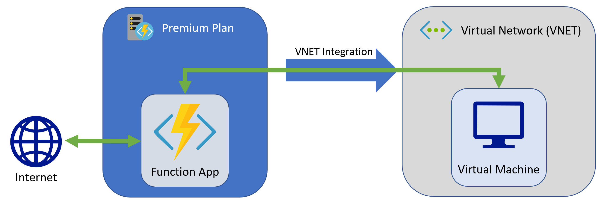
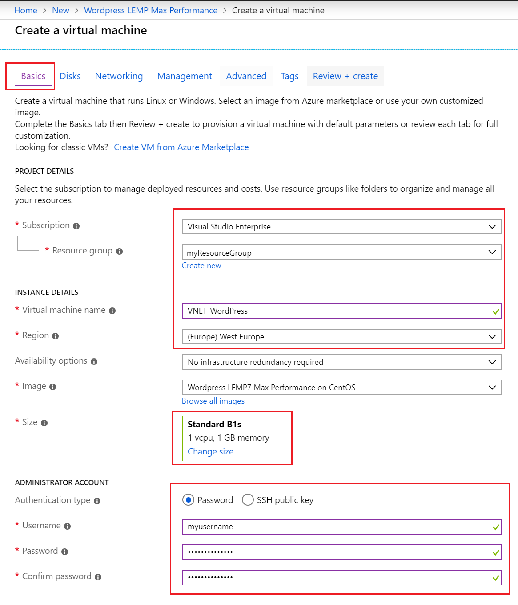
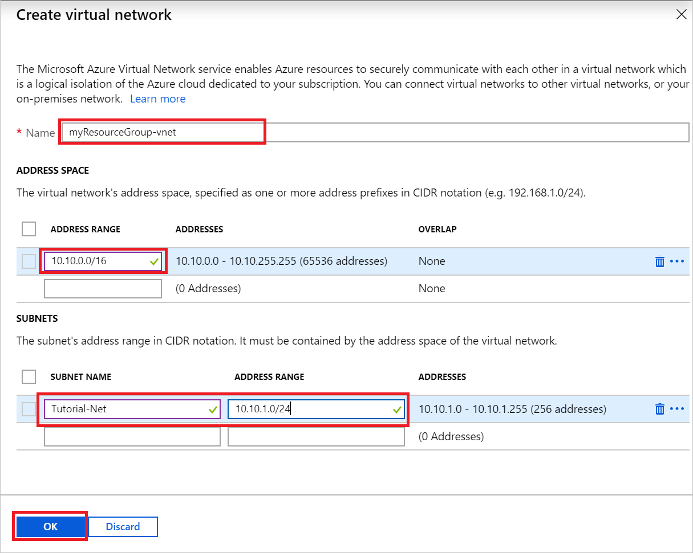
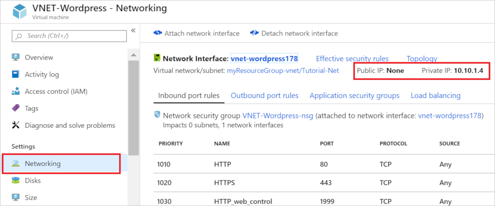
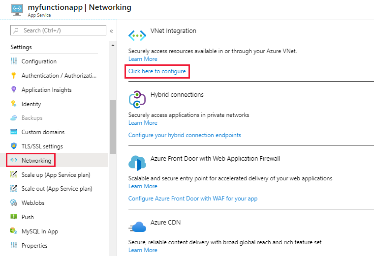
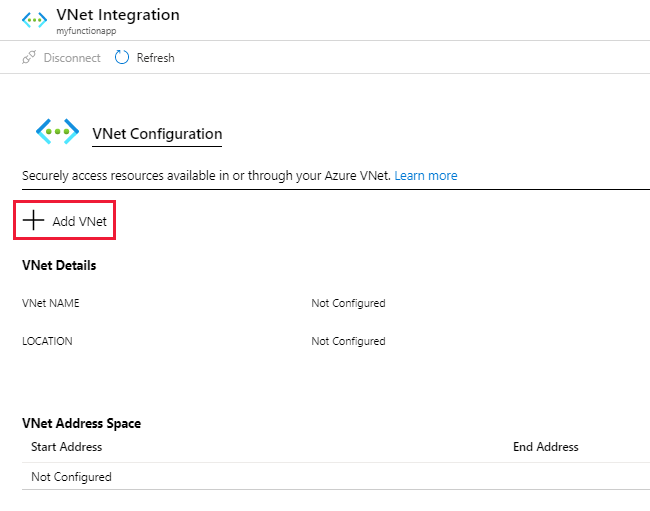
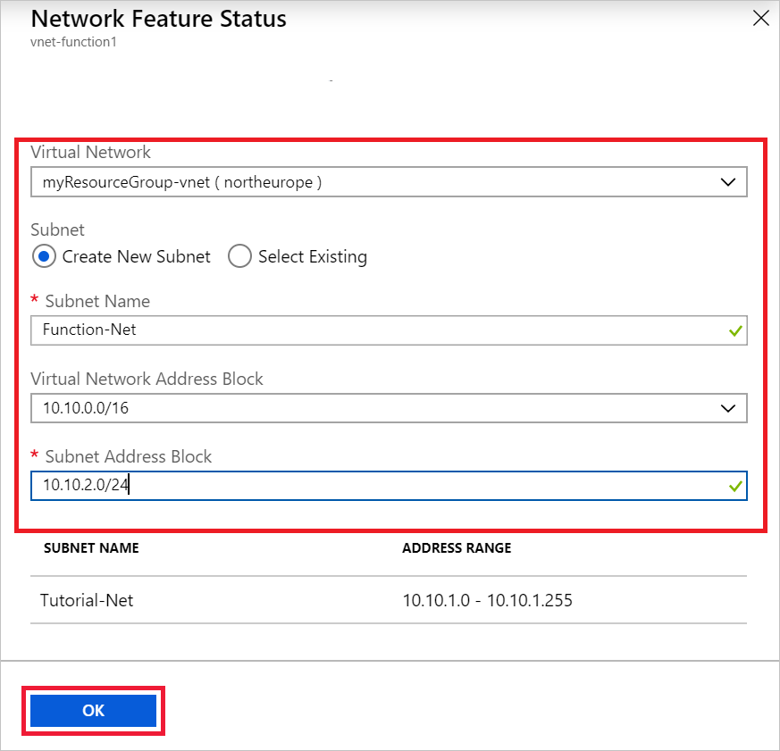
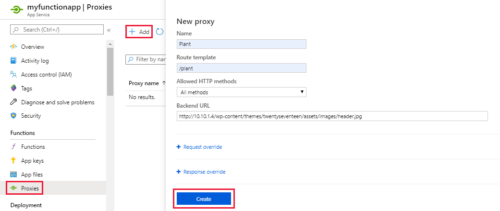
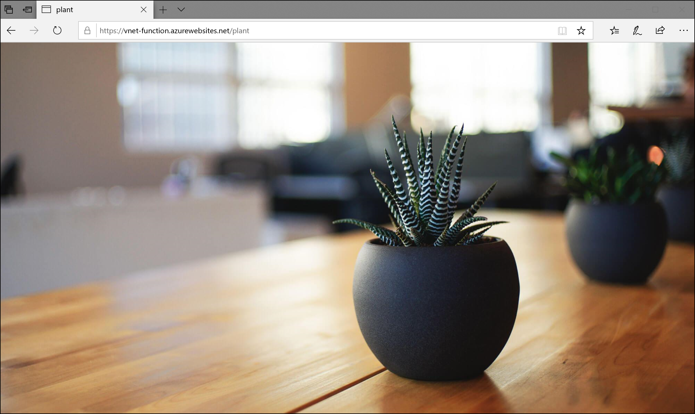

# Tutorial: integrate Functions with an Azure virtual network

This tutorial shows you how to use Azure Functions to connect to resources in an Azure virtual network. you'll create a function that has access to both the internet and to a VM running WordPress in virtual network.

> [!div class="checklist"]
> * Create a function app in the Premium plan
> * Deploy a WordPress site to VM in a virtual network
> * Connect the function app to the virtual network
> * Create a function proxy to access WordPress resources
> * Request a WordPress file from inside the virtual network

> [!NOTE]  
> This tutorial creates a function app in the Premium plan. This hosting plan is currently in preview. For more information, see [Premium plan].

## Topology

The following diagram shows the architecture of the solution that you create:

 

Functions running in the Premium plan have the same hosting capabilities as web apps in Azure App Service, which includes the VNet Integration feature. To learn more about VNet Integration, including troubleshooting and advanced configuration, see [Integrate your app with an Azure virtual network](../app-service/web-sites-integrate-with-vnet.md).

## Prerequisites

For this tutorial, it's important that you understand IP addressing and subnetting. You can start with [this article that covers the basics of addressing and subnetting](https://support.microsoft.com/help/164015/understanding-tcp-ip-addressing-and-subnetting-basics). Many more articles and videos are available online.

If you don’t have an Azure subscription, create a [free account](https://azure.microsoft.com/free/?WT.mc_id=A261C142F) before you begin.

## Create a function app in a Premium plan

First, you create a function app in the [Premium plan]. This plan provides serverless scale while supporting virtual network integration.

[!INCLUDE [functions-premium-create](../../includes/functions-premium-create.md)]  

You can pin the function app to the dashboard by selecting the pin icon in the upper right-hand corner. Pinning makes it easier to return to this function app after you create your VM.

## Create a VM inside a virtual network

Next, create a preconfigured VM that runs WordPress inside a virtual network ([WordPress LEMP7 Max Performance](https://jetware.io/appliances/jetware/wordpress4_lemp7-170526/profile?us=azure) by jetware). A WordPress VM is used because of its low cost and convenience. This same scenario works with any resource in a virtual network, such as REST APIs, App Service Environments, and other Azure services. 

1. In the portal, choose **+ Create a resource** on the left navigation pane, in the search field type `WordPress LEMP7 Max Performance`, and press Enter.

1. Choose **Wordpress LEMP Max Performance** in the search results. Select a software plan of **Wordpress LEMP Max Performance for CentOS** as the **Software Plan** and select **Create**.

1. In the **Basics** tab, use the VM settings as specified in the table below the image:

    

    | Setting      | Suggested value  | Description      |
    | ------------ | ---------------- | ---------------- |
    | **Subscription** | Your subscription | The subscription under which your resources are created. | 
    | **[Resource group](../azure-resource-manager/resource-group-overview.md)**  | myResourceGroup | Choose `myResourceGroup`, or the resource group you created with your function app. Using the same resource group for the function app, WordPress VM, and hosting plan makes it easier to clean up resources when you are done with this tutorial. |
    | **Virtual machine name** | VNET-Wordpress | The VM name needs to be unique in the resource group |
    | **[Region](https://azure.microsoft.com/regions/)** | (Europe) West Europe | Choose a region near you or near the functions that access the VM. |
    | **Size** | B1s | Choose **Change size** and then select the B1s standard image, which has 1 vCPU and 1 GB of memory. |
    | **Authentication type** | Password | To use password authentication, you must also specify a **Username**, a secure **Password**, and then **Confirm password**. For this tutorial, you won't need to sign in to the VM unless you need to troubleshoot. |

1. Choose the **Networking** tab and under Configure virtual networks select **Create new**.

1. In **Create virtual network**, use the settings in the table below the image:

    

    | Setting      | Suggested value  | Description      |
    | ------------ | ---------------- | ---------------- |
    | **Name** | myResourceGroup-vnet | You can use the default name generated for your virtual network. |
    | **Address range** | 10.10.0.0/16 | Use a single address range for the virtual network. |
    | **Subnet name** | Tutorial-Net | Name of the subnet. |
    | **Address range** | 10.10.1.0/24   | The subnet size determines how many VMs can be used by the App Service plan. A `/24` subnet, which provides 254 host addresses, is used to make it easier to calculate which subnets are available in the 10.10.0.0/16 network.  |

1. Select **OK** to create the virtual network.

1. Back in the **Networking** tab, choose **None** for **Public IP**.

1. Choose the **Management** tab, then in **Diagnostics storage account**, choose the Storage account you created with your function app.

1. Select **Review + create**. After validation completes, select **Create**. The VM create process takes a few minutes. The created VM can only access the virtual network.

1. After the VM is created, choose **Go to resource** to view the page for your new VM, then choose **Networking** under **Settings**.

1. Verify that there's no **Public IP**. Make a note the **Private IP**, which you use to connect to the VM from your function app.

    

You now have a WordPress site deployed entirely within your virtual network. This site isn't accessible from the public internet.

## Connect your function app to the virtual network

With a WordPress site running in a VM in a virtual network, you can now connect your function app to that virtual network.

1. In your new function app, select **Platform features** > **Networking**.

    

1. Under **VNet Integration**, select **Click here to configure**.

    

1. On the virtual network integration page, select **Add VNet (preview)**.

    

1. In **Network Feature Status**, use the settings in the table below the image:

    

    | Setting      | Suggested value  | Description      |
    | ------------ | ---------------- | ---------------- |
    | **Virtual Network** | MyResourceGroup-vnet | This virtual network is the one you created earlier. |
    | **Subnet** | Create New Subnet | Create a subnet in the virtual network for your function app to use. It doesn't matter that your function uses a different subnet than your VM. The virtual network automatically routes traffic between the two subnets. |
    | **Subnet name** | Function-Net | Name of the new subnet. |
    | **Virtual network address block** | 10.10.0.0/16 | This address block is the default; there is only one defined. | 
    | **Address range** | 10.10.2.0/24   | The subnet size restricts the total number of VMs that you can add to your App Service plan. |

1. Select **OK** to add the subnet. Close the VNet Integration and Network Feature Status pages to return to your function app page.

The function app can now access the virtual network where the WordPress site is running. Next, you use [Azure Functions Proxies](functions-proxies.md) to return a file from the WordPress site.

## Create a proxy to access VM resources

With VNet Integration enabled, you can create a proxy in your function app to forward requests to the VM running in the virtual network.

1. In your function app, select  **Proxies** > **+**, then use the proxy settings in the table below the image:

    

    | Setting  | Suggested value  | Description      |
    | -------- | ---------------- | ---------------- |
    | **Name** | Plant | The name can be any value. It's used to identify the proxy. |
    | **Route Template** | /plant | Route that maps to a VM resource. |
    | **Backend URL** | http://<YOUR_VM_IP>/wp-content/themes/twentyseventeen/assets/images/header.jpg | Replace `<YOUR_VM_IP>` with the IP address of your WordPress VM that you created earlier. This mapping returns a single file from the site. |

1. Select **Create** to add the proxy to your function app.

## Try it out

1. In your browser, try to access the URL you used as the **Backend URL**. As expected, the request times out. A timeout occurs because your WordPress site is connected only to your virtual network and not the internet.

1. Copy the **Proxy URL** value from your new proxy and paste it into the address bar of your browser. The returned image is from the WordPress site running inside your virtual network.

    

Your function app is connected to both the internet and your virtual network. The proxy is receiving a request over the public internet, and then acting as a simple HTTP proxy to forward that request to the connected virtual network. The proxy then relays the response back to you publicly over the internet.

[!INCLUDE [clean-up-section-portal](../../includes/clean-up-section-portal.md)]

## Next steps

In this tutorial, the WordPress site serves as an API that is called by using a proxy in the function app. This scenario makes a good tutorial because it's easy to set up and visualize. You could use any other API deployed within a virtual network. You could also have created a function with code that calls APIs deployed within the virtual network. A more realistic scenario is a function that uses data client APIs to call a SQL Server instance deployed in the virtual network.

Functions running in a Premium plan share the same underlying App Service infrastructure as web apps on PremiumV2 plans. All the documentation for [web apps in Azure App Service](../app-service/overview.md) applies to your Premium plan functions.

> [!div class="nextstepaction"]
> [Learn more about the networking options in Functions](./functions-networking-options.md)

[Premium plan]: functions-scale.md#premium-plan-public-preview