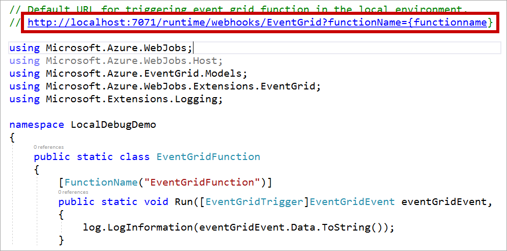
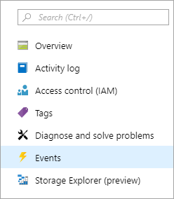

# Azure Function Event Grid Trigger Local Debugging

This article demonstrates how to debug a local function that handles an Azure Event Grid event raised by a storage account. 

## Prerequisites

- Download [ngrok](https://ngrok.com/) to allow Azure to call your local function

## Create a function app

To begin, create a new function app that responds to an Event Grid event.  Open Visual Studio and select **File > New > Project**.

In the *New Project* window, open the template pane to **Other Languages > Visual C# > Cloud** and select **Azure Functions**. 


Give your project a name and click **OK**.

In the *New Project* window, select **Empty** and click **OK**.


Next, right-click on the project name in the Solution Explorer and click **Add > New Azure Function**.

In the *New Azure Function* window, select **Event Grid trigger** and click **OK**.


Once the function is created, open the code file and copy the URL commented out at the top of the file. This location is used when configuring the Event Grid trigger.



Then, set a breakpoint on the line that begins with `log.LogInformation`.


Next, **press F5** to start a debugging session.

## Allow Azure to call your local function

To break into a function being debugged on your machine, you must enable a way for Azure to communicate with your local function from the cloud.

The [ngrok](https://ngrok.com/) utility provides a way for Azure to call the function running on your machine. Start *ngrok* using the following command:

```bash
ngrok http -host-header=localhost 7071
```
As the utility is set up, the command window will look similar to the following screenshot:


Copy the **HTTPS** URL generated when *ngrok* is run. This value is used when configuring the event grid event endpoint.

 ## Create a storage account

Next, [create a new storage account](../storage/common/storage-quickstart-create-account.md) and name it **functionlocaldebug**. Once the account is created, click on the **Events** option to create a new event subscription.



In the *Events* window, click on the **\+ Event Subscription** button. In the Even Subscription window, click on the **Endpoint Type** dropdown and select **Web Hook**.


Once the endpoint type is configured, click on **Select an endpoint** to configure the endpoint value.


The Subscriber Endpoint value is made up from three different values. The prefix is the HTTPS URL generated by *ngrok*. The  remainder of the URL comes from the URL found in the function code file, with the function name added at the end. Starting with the URL from the function code file, the *ngrok* URL replaces `http://localhost:7071` and the function name replaces `{functionname}`.

The following screenshot shows how the final URL should look:


Once you've entered the appropriate value, click **Confirm Selection**.

> [!IMPORTANT]
> Every time you start *ngrok*, the HTTPS URL is regenerated and the value changes. Therefore you must create a new Event Subscription each time you expose your function to Azure via *ngrok*.

## Upload a file

Now you can upload a file to your storage account to trigger an Event Grid event for your local function to handle. 

Open [Storage Explorer](https://azure.microsoft.com/features/storage-explorer/) and connect to the **functionlocaldebug** account. 

- Expand **Blob Containers** 
- Right-click and select **Create Blob Container**.
- Name the container **test**
- Select the test container
- Click the **Upload** button
- Click **Upload Files**
- Select a file and upload it to the blob container

## Debug the function

Once the Event Grid recognizes a new file is uploaded to the storage container, the break point is hit in your local function.


## Clean up resources

To clean up the resources created in this article, delete the **functionlocaldebug** storage account.


