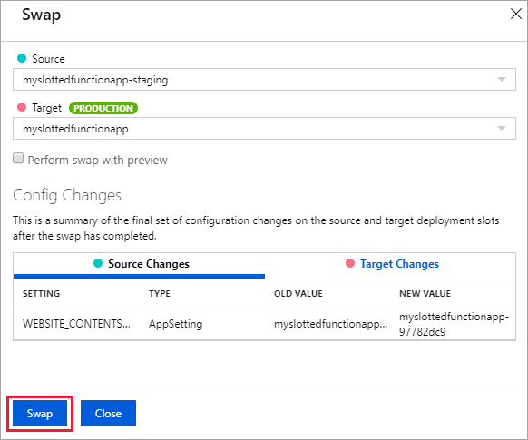
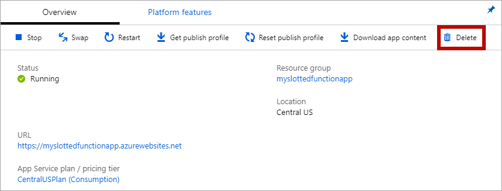
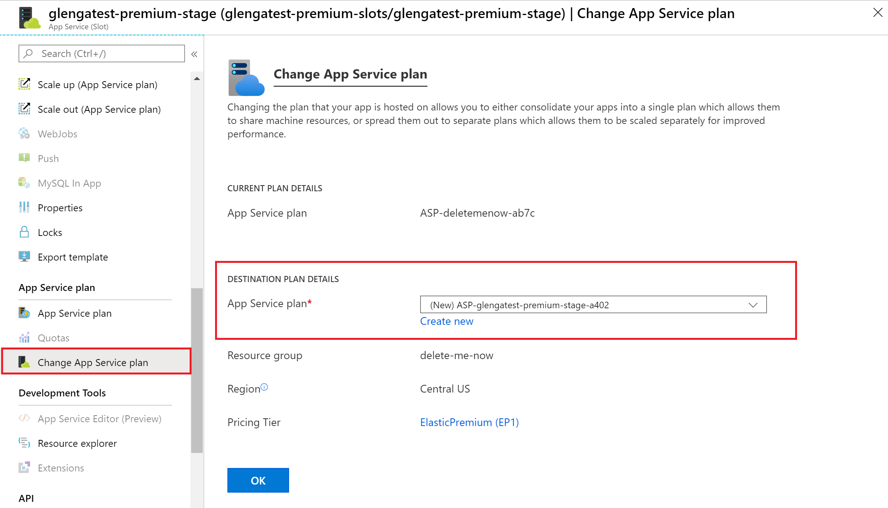
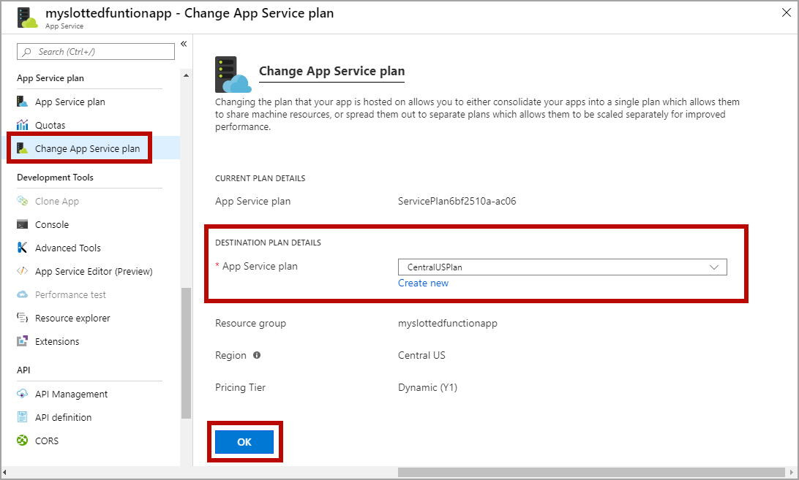

# Azure Functions deployment slots

Azure Functions deployment slots allow your function app to run different instances called "slots". Slots are different environments exposed via a publicly available endpoint. One app instance is always mapped to the production slot, and you can swap instances assigned to a slot on demand. Function apps running under the Apps Service plan may have multiple slots, while under the Consumption plan only one slot is allowed.

The following reflect how functions are affected by swapping slots:

- Traffic redirection is seamless; no requests are dropped because of a swap.
- If a function is running during a swap, execution continues and subsequent triggers are routed to the swapped app instance.

> [!NOTE]
> Slots are currently not available for the Linux Consumption plan.

## Why use slots?

There are a number of advantages to using deployment slots. The following scenarios describe common uses for slots:

- **Different environments for different purposes**: Using different slots gives you the opportunity to differentiate app instances before swapping to production or a staging slot.
- **Prewarming**: Deploying to a slot instead of directly to production allows the app to warm up before going live. Additionally, using slots reduces latency for HTTP-triggered workloads. Instances are warmed up before deployment which reduces the cold start for newly-deployed functions.
- **Easy fallbacks**: After a swap with production, the slot with a previously staged app now has the previous production app. If the changes swapped into the production slot aren't as you expect, you can immediately reverse the swap to get your "last known good instance" back.

## Swap operations

During a swap, one slot is considered the source and the other the target. The source slot has the instance of the application that is applied to the target slot. The following steps ensure the target slot doesn't experience downtime during a swap:

1. **Apply settings:** Settings from the target slot are applied to all instances of the source slot. For example, the production settings are applied to the staging instance. The applied settings include the following categories:
    - [Slot-specific](#manage-settings) app settings and connection strings (if applicable)
    - [Continuous deployment](../app-service/deploy-continuous-deployment.md) settings (if enabled)
    - [App Service authentication](../app-service/overview-authentication-authorization.md) settings (if enabled)

1. **Wait for restarts and availability:** The swap waits for every instance in the source slot to complete its restart and to be available for requests. If any instance fails to restart, the swap operation reverts all changes to the source slot and stops the operation.

1. **Update routing:** If all instances on the source slot are warmed up successfully, the two slots complete the swap by switching routing rules. After this step, the target slot (for example, the production slot) has the app that's previously warmed up in the source slot.

1. **Repeat operation:** Now that the source slot has the pre-swap app previously in the target slot, perform the same operation by applying all settings and restarting the instances for the source slot.

Keep in mind the following points:

- At any point of the swap operation, initialization of the swapped apps happens on the source slot. The target slot remains online while the source slot is being prepared, whether the swap succeeds or fails.

- To swap a staging slot with the production slot, make sure that the production slot is *always* the target slot. This way, the swap operation doesn't affect your production app.

- Settings related to event sources and bindings need to be configured as [deployment slot settings](#manage-settings) *before you initiate a swap*. Marking them as "sticky" ahead of time ensures events and outputs are directed to the proper instance.

## Manage settings

[!INCLUDE [app-service-deployment-slots-settings](../../includes/app-service-deployment-slots-settings.md)]

### Create a deployment setting

You can mark settings as a deployment setting which makes it "sticky". A sticky setting does not swap with the app instance.

If you create a deployment setting in one slot, make sure to create the same setting with a unique value in any other slot involved in a swap. This way, while a setting's value doesn't change, the setting names remain consistent among slots. This name consistency ensures your code doesn't try to access a setting that is defined in one slot but not another.

Use the following steps to create a deployment setting:

1. Navigate to **Deployment slots** in the function app, and then select the slot name.

    :::image type="content" source="./media/functions-deployment-slots/functions-navigate-slots.png" alt-text="Find slots in the Azure portal." border="true":::

1. Select **Configuration**, and then select the setting name you want to stick with the current slot.

    :::image type="content" source="./media/functions-deployment-slots/functions-configure-deployment-slot.png" alt-text="Configure the application setting for a slot in the Azure portal." border="true":::

1. Select **Deployment slot setting**, and then select **OK**.

    :::image type="content" source="./media/functions-deployment-slots/functions-deployment-slot-setting.png" alt-text="Configure the deployment slot setting." border="true":::

1. Once setting section disappears, select **Save** to keep the changes

    :::image type="content" source="./media/functions-deployment-slots/functions-save-deployment-slot-setting.png" alt-text="Save the deployment slot setting." border="true":::

## Deployment

Slots are empty when you create a slot. You can use any of the [supported deployment technologies](./functions-deployment-technologies.md) to deploy your application to a slot.

## Scaling

All slots scale to the same number of workers as the production slot.

- For Consumption plans, the slot scales as the function app scales.
- For App Service plans, the app scales to a fixed number of workers. Slots run on the same number of workers as the app plan.

## Add a slot

You can add a slot via the [CLI](https://docs.microsoft.com/cli/azure/functionapp/deployment/slot?view=azure-cli-latest#az-functionapp-deployment-slot-create) or through the portal. The following steps demonstrate how to create a new slot in the portal:

1. Navigate to your function app.

1. Select **Deployment slots**, and then select **+ Add**.

    :::image type="content" source="./media/functions-deployment-slots/functions-deployment-slots-add.png" alt-text="Add Azure Functions deployment slot." border="true":::

1. Type the name of the slot and select **Add**.

    :::image type="content" source="./media/functions-deployment-slots/functions-deployment-slots-add-name.png" alt-text="Name the Azure Functions deployment slot." border="true":::

## Swap slots

You can swap slots via the [CLI](https://docs.microsoft.com/cli/azure/functionapp/deployment/slot?view=azure-cli-latest#az-functionapp-deployment-slot-swap) or through the portal. The following steps demonstrate how to swap slots in the portal:

1. Navigate to the function app.
1. Select **Deployment slots**, and then click **Swap**.

    :::image type="content" source="./media/functions-deployment-slots/functions-swap-deployment-slot.png" alt-text="Swap the deployment slot." border="true":::

1. Verify the configuration settings for your swap and click **Swap**
    
    :::image type="content" source="./media/functions-deployment-slots/functions-swap-deployment-slot.png" alt-text="Swap the deployment slot." border="true":::

    

The operation may take a moment while the swap operation is executing.

## Roll back a swap

If a swap results in an error or you simply want to "undo" a swap, you can roll back to the initial state. To return to the pre-swapped state, do another swap to reverse the swap.

## Remove a slot

You can remove a slot via the [CLI](https://docs.microsoft.com/cli/azure/functionapp/deployment/slot?view=azure-cli-latest#az-functionapp-deployment-slot-delete) or through the portal. The following steps demonstrate how to remove a slot in the portal:

1. Navigate to the function app Overview

1. Click on the **Delete** button

    

## Automate slot management

Using the [Azure CLI](https://docs.microsoft.com/cli/azure/functionapp/deployment/slot?view=azure-cli-latest), you can automate the following actions for a slot:

- [create](https://docs.microsoft.com/cli/azure/functionapp/deployment/slot?view=azure-cli-latest#az-functionapp-deployment-slot-create)
- [delete](https://docs.microsoft.com/cli/azure/functionapp/deployment/slot?view=azure-cli-latest#az-functionapp-deployment-slot-delete)
- [list](https://docs.microsoft.com/cli/azure/functionapp/deployment/slot?view=azure-cli-latest#az-functionapp-deployment-slot-list)
- [swap](https://docs.microsoft.com/cli/azure/functionapp/deployment/slot?view=azure-cli-latest#az-functionapp-deployment-slot-swap)
- [auto-swap](https://docs.microsoft.com/cli/azure/functionapp/deployment/slot?view=azure-cli-latest#az-functionapp-deployment-slot-auto-swap)

## Change App Service plan

With a function app that is running under an App Service plan, you have the option to change the underlying App Service plan for a slot.

> [!NOTE]
> You can't change a slot's App Service plan under the Consumption plan.

Use the following steps to change a slot's App Service plan:

1. Navigate to a slot

1. Under *Platform Features*, click **All Settings**

    

1. Click on **App Service plan**

1. Select a new App Service plan, or create a new plan

1. Click **OK**

    

## Limitations

Azure Functions deployment slots have the following limitations:

- The number of slots available to an app depends on the plan. The Consumption plan is only allowed one deployment slot. Additional slots are available for apps running under the App Service plan.
- Swapping a slot resets keys for apps that have an `AzureWebJobsSecretStorageType` app setting equal to `files`.
- Slots are not available for the Linux Consumption plan.

## Support levels

There are two levels of support for deployment slots:

- **General availability (GA)**: Fully supported and approved for production use.
- **Preview**: Not yet supported, but is expected to reach GA status in the future.

| OS/Hosting plan           | Level of support     |
| ------------------------- | -------------------- |
| Windows Consumption       | General availability |
| Windows Premium           | General availability  |
| Windows Dedicated         | General availability |
| Linux Consumption         | Unsupported          |
| Linux Premium             | General availability  |
| Linux Dedicated           | General availability |

## Next steps

- [Deployment technologies in Azure Functions](./functions-deployment-technologies.md)
