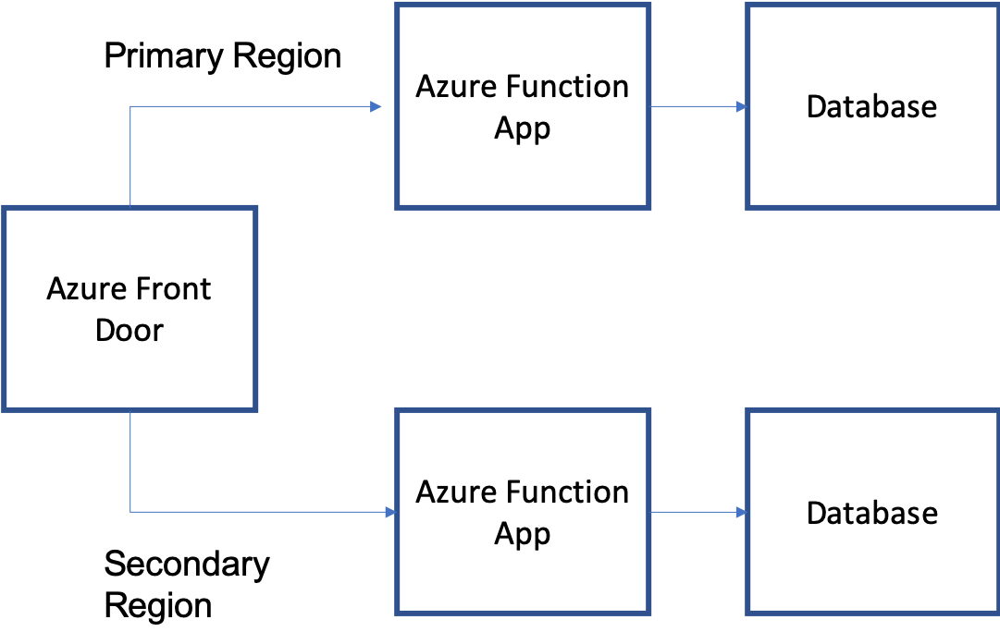

# Azure Functions Geo-Disaster Recovery

When entire Azure regions or datacenters experience downtime, it is critical for compute to continue processing in a different region.  This article will explain some of the strategies that you can use to deploy functions to allow for disaster recovery.

## Basic concepts

Azure Functions run in a specific region.  To get higher availability, you can deploy the same functions to multiple regions.  When in multiple regions you can have your functions running in the *active/active* pattern or *active/passive* pattern.  

* Active/active. Both regions are active and receiving events (duplicate or rotationally). Active/active is recommended for HTTPS functions in combination with Azure Front Door.
* Active/passive. One region is active and receiving events, while a secondary is idle.  When failover is required, the secondary region is activated and takes over processing.  This is recommended for non-HTTP functions like Service Bus and Event Hubs.

Read how to [run apps in multiple regions](https://docs.microsoft.com/azure/architecture/reference-architectures/app-service-web-app/multi-region) for more information on multi-region deployments.

## Active/active and HTTPS functions

To achieve active/active deployments of functions, it requires some component that can coordinate the events between both regions.  For HTTPS functions, this coordination is accomplished using [Azure Front Door](../frontdoor/front-door-overview.md).  Azure Front Door can route and round-robin HTTPS requests between multiple regional functions.  It also periodically checks the health of each endpoint.  If a regional function stops responding to health checks, Azure Front Door will take it out of rotation and only forward traffic to healthy functions.  

  

### Active/active for non-HTTPS functions

You can still achieve active/active deployments for non-HTTPS functions.  However, you need to consider how the two regions will interact or coordinate with one another.  If you deployed the same function app into two regions, each triggering on the same Service Bus queue, they would act as competing consumers on de-queueing that queue.  While this means each message is only being processed by one of the instances, it also means there is still a single point of failure on the single service bus.  If you deploy two service bus queues (one in a primary region, one in a secondary region), and the two function apps pointed to their region queue, the challenge now comes in how the queue messages are distributed between the two regions.  Often this means that each publisher attempts to publish a message to *both* regions, and each message is processed by both active function apps.  While this creates an active/active pattern, it creates other challenges around duplication of compute and when or how data is consolidated.  For these reasons, it is recommended for non-HTTPS triggers to use the active/passive pattern.

## Active/passive for non-HTTPS functions

Active/passive provides a way for only a single function to process each message, but provides a mechanism to fail over to a secondary region in case of a disaster.  Azure Functions works alongside [Azure Service Bus geo-recovery](../service-bus-messaging/service-bus-geo-dr.md) and [Azure Event Hubs geo-recovery](../event-hubs/event-hubs-geo-dr.md).

Using Azure Event Hubs triggers as an example, the active/passive pattern would involve the following:

* Azure Event Hub deployed to both a primary and secondary region.
* Geo-disaster enabled to pair the primary and secondary Event Hub.  This also creates an "alias" you can use to connect to event hubs and switch from primary to secondary without changing the connection info.
* Function apps deployed to both a primary and secondary region.
* The function apps are triggering on the *direct* (non-alias) connection string for its respective event hub. 
* Publishers to the event hub should publish to the alias connection string. 

Before failover, publishers sending to the shared alias will route to the primary event hub.  The primary function app is listening exclusively to the primary event hub.  The secondary function app will be passive and idle.  As soon as failover is initiated, publishers sending to the shared alias will now route to the secondary event hub.  The secondary function app will now become active and start triggering automatically.  Effective failover to a secondary region can be driven entirely from the event hub, with the functions becoming active only when the respective event hub is active.

Read more on information and considerations for failover with [service bus](../service-bus-messaging/service-bus-geo-dr.md) and [event hubs](../event-hubs/event-hubs-geo-dr.md).

## Next Steps

* [Create Azure Front Door](../frontdoor/quickstart-create-front-door.md)
* [Event Hubs failover considerations](../event-hubs/event-hubs-geo-dr.md#considerations)
