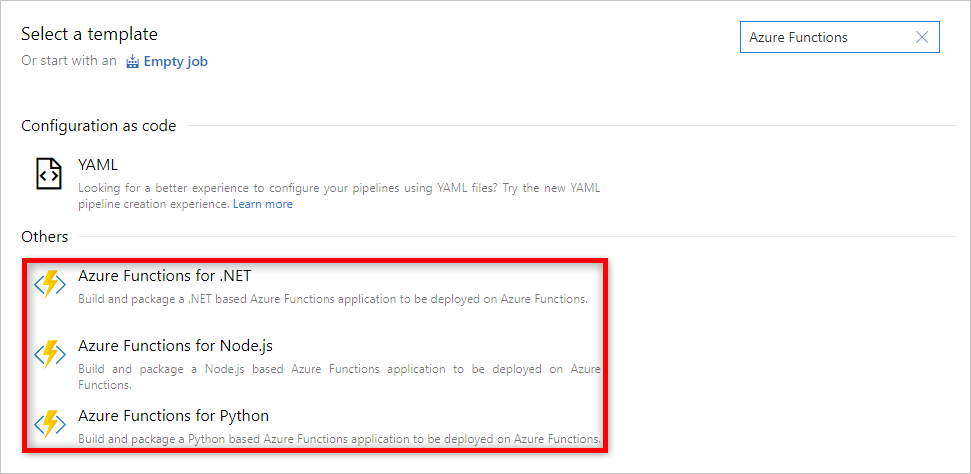

# Continuous delivery using Azure DevOps

You can automatically deploy your function to an Azure Function app using [Azure Pipelines](https://docs.microsoft.com/azure/devops/pipelines/?toc=%2Fazure%2Fdevops%2Fpipelines%2Ftoc.json&view=azure-devops).

## Build your app

# [YAML .NET](#tab/yamldotnet)

You can use the following samples to create your YAML file to build your .NET app targeting:

- Windows Function App: [Sample](https://github.com/Azure/azure-functions-devops-build/blob/master/sample_yaml_builds/windows/node-windows.yml)

- Dedicated Linux Function App: [Sample](https://github.com/Azure/azure-functions-devops-build/blob/master/sample_yaml_builds/linux/dedicated/dotnet-dedicated.yml)

- Consumption Linux Function App (In Preview): [Sample](https://github.com/Azure/azure-functions-devops-build/blob/master/sample_yaml_builds/linux/consumption/dotnet-consumption.yml)

# [YAML Java Script](#tab/yamljs)

You can use the following samples to create your YAML file to build your Java Script app targeting:

- Windows Function App: [Sample](https://github.com/Azure/azure-functions-devops-build/blob/master/sample_yaml_builds/windows/node-windows.yml)

- Dedicated Linux Function App: [Sample](https://github.com/Azure/azure-functions-devops-build/blob/master/sample_yaml_builds/linux/dedicated/node-dedicated.yml)

- Consumption Linux Function App (In Preview): [Sample](https://github.com/Azure/azure-functions-devops-build/blob/master/sample_yaml_builds/linux/consumption/node-consumption.yml) 

# [YAML Python](#tab/yamlpy)

You can use the following samples to create your YAML file to build your Python app targeting:

- Dedicated Linux Function App: [Sample](https://github.com/Azure/azure-functions-devops-build/blob/master/sample_yaml_builds/linux/dedicated/python-dedicated.yml)

- Consumption Linux Function App (In Preview): [Sample](https://github.com/Azure/azure-functions-devops-build/blob/master/sample_yaml_builds/linux/consumption/python-consumption.yml)

# [Designer Templates](#tab/designer)

When creating a new build pipeline, choose "Use the classic editor" to create a pipeline using the designer templates


After configuring the source of your code, search for Azure Functions build templates, and choose the template that matches your app language.



---

## Deploying your app

# [YAML Windows Function App](#tab/yamlwin)

The following snippet can be used to deploy to a Windows function app

```yaml
steps:
- task: AzureFunctionApp@1
  inputs:
    azureSubscription: '<Azure service connection>'
    appType: functionApp
    appName: '<Name of function app>'
```

# [YAML Linux Function App](#tab/yamllinux)

The following snippet can be used to deploy to a Linux function app

```yaml
steps:
- task: AzureFunctionApp@1
  inputs:
    azureSubscription: '<Azure service connection>'
    appType: functionAppLinux
    appName: '<Name of function app>'
```

# [Designer Template](#tab/designer)

When creating a new release pipeline, search for Azure Functions release template.


---

## Using Azure CLI

Using [Azure CLI](https://docs.microsoft.com/cli/azure/get-started-with-azure-cli) you can create a build and release pipeline using YAML files.

### Creating an Azure Pipeline

Using the `devops-build create` [command](https://docs.microsoft.com/cli/azure/functionapp/devops-build#az-functionapp-devops-build-create) a pipeline will be created to build and release any code changes in your repo. There are some pre-requisites for this command:

- You need to have write access to the repo.

- You need to have owner access to the function app.
