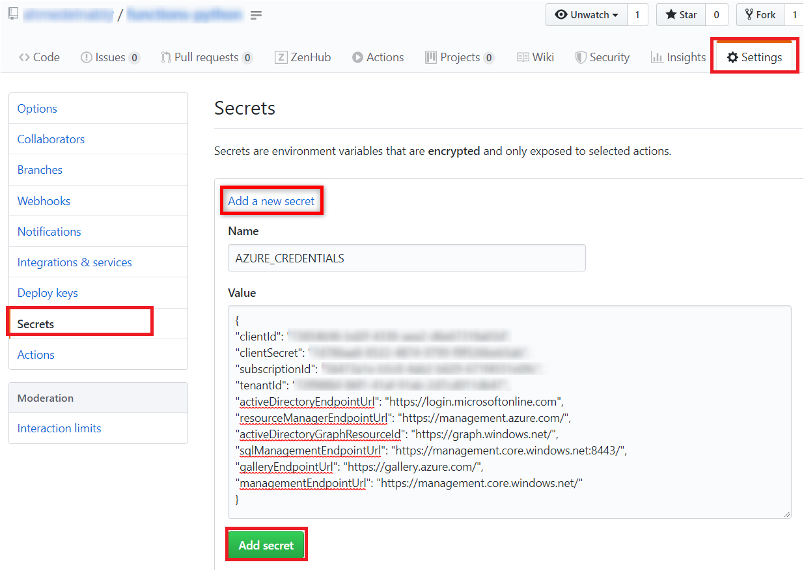

# Continuous delivery by using GitHub Action

You can automatically deploy your function to an Azure Functions app by using [GitHub Actions](https://github.com/features/actions). As GitHub Actions still in a closed beta, you'll need to sign-up [here]{https://github.com/features/actions}.

## Create a Workflow

For a Workflow to be executed you need a `{whatever name you like}.yml` file under the `/.github/workflows/` path in your repo, this file contains the different steps and parameters for that workflow. For Azure Functions, we separate that file in three sections: authentication, build section, and deploy section.

### Authentication

To give the workflow the ability to deploy to you function app you will need to setup two things: 1- A service principle 2- A secret under your GitHub repo called **AZURE_CREDENTIALS**

**Setting up a service principle**

you can do that by executing the following [Azure CLI]{https://docs.microsoft.com/cli/azure/}, this can be easily done from the [Azure Cloud Shell]{https://shell.azure.com}.

```azurecli-interactive
az ad sp create-for-rbac --name "myApp" --role contributor --scopes /subscriptions/<SUBSCRIPTION_ID>/resourceGroups/<RESOURCE_GROUP>/providers/Microsoft.Web/sites/<APP_NAME>                --sdk-auth
```

> [!IMPORTANT]
> It is always a good practice to grant minimum access, in this case only for the site not the whole resource group.

**Setting up a GitHub secret**

Using the output of the Azure CLI command, browse your repo webpage.

Click on Settings 


Click on Secrets


Add the **AZURE_CREDENTIALS** secrets with the value from the output from the Azure CLI command




### Build

To build you functionapp, you'll need to: 1- setup the environment, 2- build your app

**Setting up** 

Setting up the environment can be done using one of the publish setup actions.

|Language | Setup Action |
|---------|---------|
|.Net     | actions/setup-dotnet |
|NodeJS     | actions/setup-node |
|Python   | actions/setup-python |
|Java    | actions/setup-java |

**Build the app**

This depends on the language and for languages supported by Azure Functions, this section should be the standard build steps of each language

### Deploy

To deploy your code to a function app, you will need to use the `Azure/functions-action` action, there are a number of parameters that this action need


|Parameter |Explanation  |
|---------|---------|
|app-name | mandatory: that's the name of the azure function app |
|slot-name | optional: that's the name of the slot you want to deploy to, it should already be created under `app-name` |

There are a number of samples available under the [Azure Functions Action repo]{https://github.com/Azure/functions-action/tree/master/templates}, you can use these samples a starting point for your workflow.

## Next steps

- Review the [Azure Functions overview](functions-overview.md).
- Review the [GitHub Actions page](https://github.com/features/actions).
