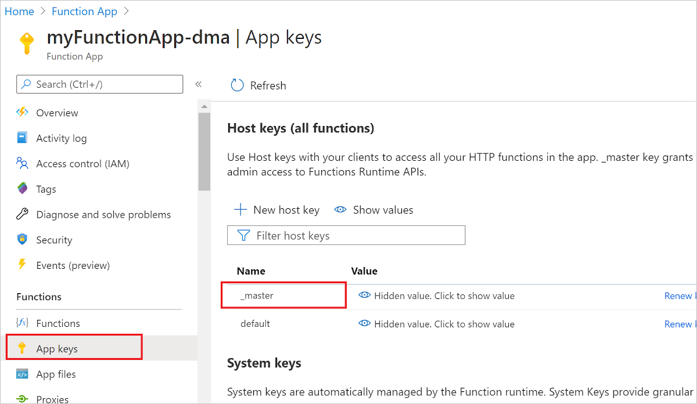
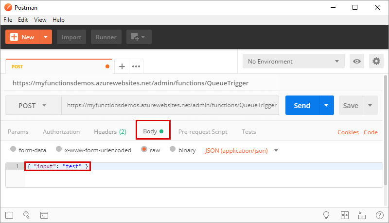
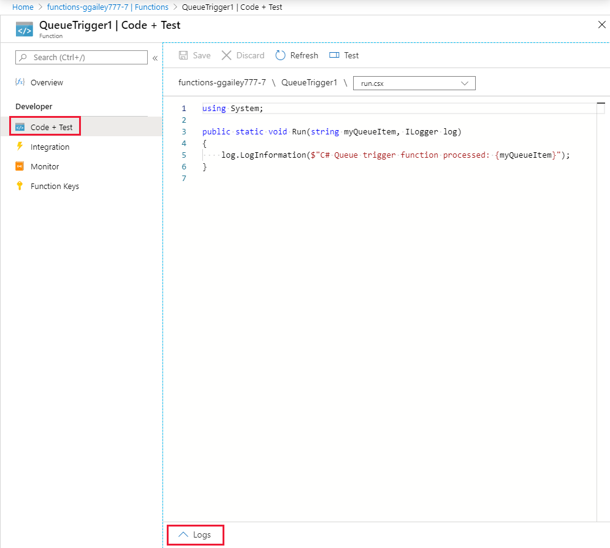

# Manually run a non HTTP-triggered function

This article demonstrates how to manually run a deployed non HTTP-triggered function.

In some contexts you may need to run on-demand an Azure Function that is triggered as a result of a timed schedule or as a result of an action on another resource. This article demonstrates how you can manually run a non HTTP-triggered function by sending a specially-formatted HTTP request to the Function app.

[Postman](https://www.getpostman.com/) is used in the following example, but you may use [Fiddler](https://www.telerik.com/fiddler) or any other like tool to initiate HTTP requests.

## Define the request location

To run a non HTTP-triggered function, you need to a way to send a request to Azure to run the function. The URL used to initiate this request takes a specific form.

- **Host name:** The function app's public location which is made up from the function app's name plus *azurewebsites.net*.
- **Folder path:** To access non HTTP-triggered functions via a HTTP request you have to send the request through the folders *admin/functions*.
- **Function name:** The name of the function you want to run.

You use this request location in Postman along with the master key to send a request to Azure to run the function.

## Get the Function master key

Navigate to your function in the Azure Portal and click on **Manage** and find the **Host Keys** section. Click on the **Copy** button in the *_master* row to copy the master key to your clipboard.

After copying the master key, click on the function name to return to the code file window and click on **Logs**. You will see messages from the function logged here when you manually run the function from Postman.

### Set up the request

Open Postman and follow these steps:

1. Enter the **request location in the URL text box**. 
2. **Click** on the **Headers** tab.
3. Enter **x-functions-key** as the first **key** and paste the master key (from the clipboard) into the **value** box.
4. Enter **Content-Type** as the second **key** and enter **application/json** as the **value**.

5. **Click** on the **Body** tab.
6. Enter **{ "input": "test" }** as the body for the request.

7. Click **Send**.

Postman should return with a **Status of 202 Accepted**.

Next, return to your function in the Azure Portal. Locate the *Logs* window and you will see messages from the function as a result of the manual call from Postman.

## Next steps

- [Strategies for testing your code in Azure Functions](./functions-test-a-function.md)
- [Azure Function Event Grid Trigger Local Debugging](./functions-debug-event-grid-trigger-local.md)