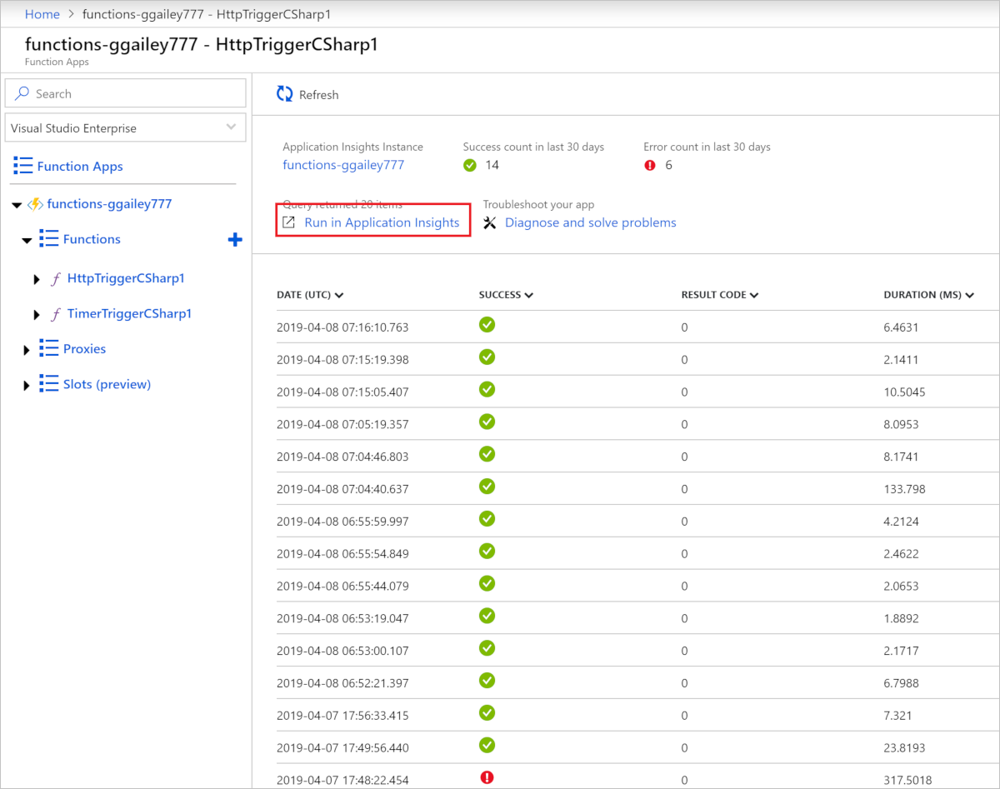
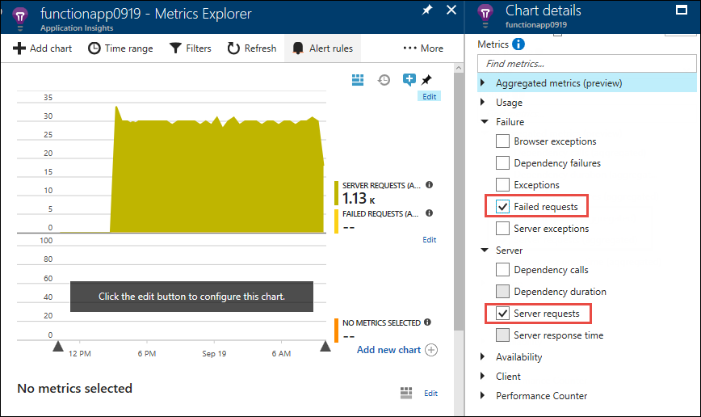
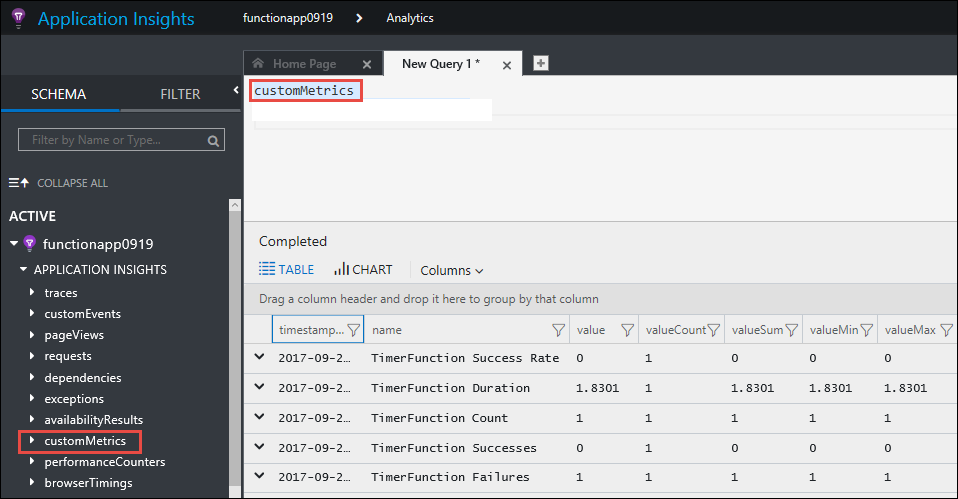
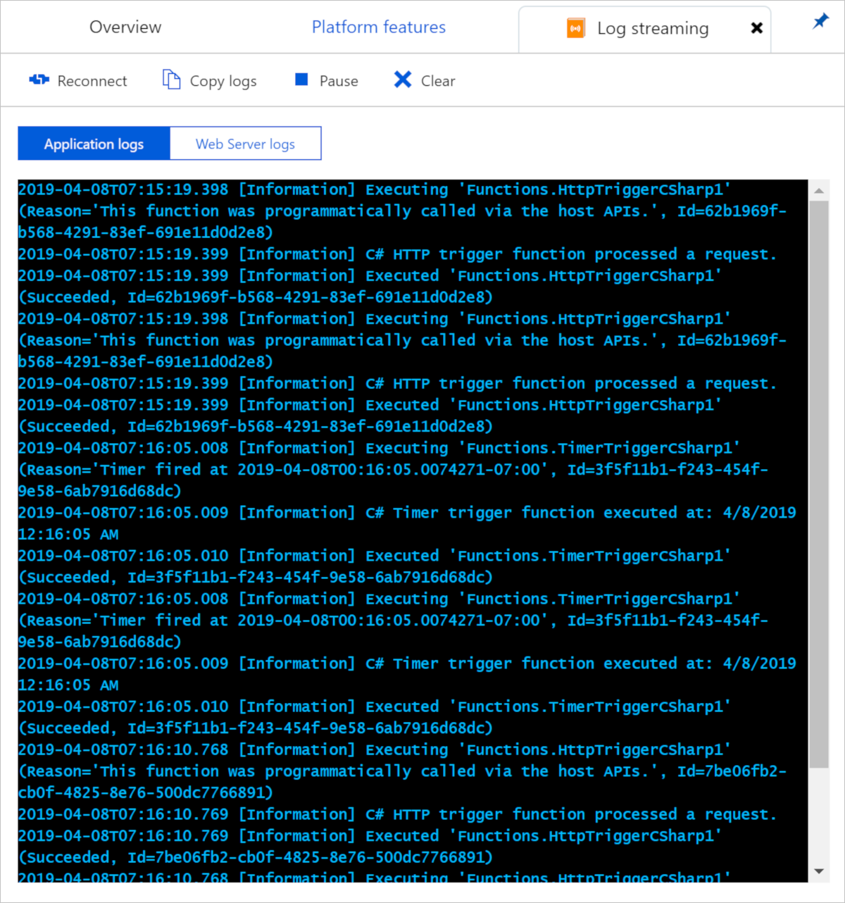
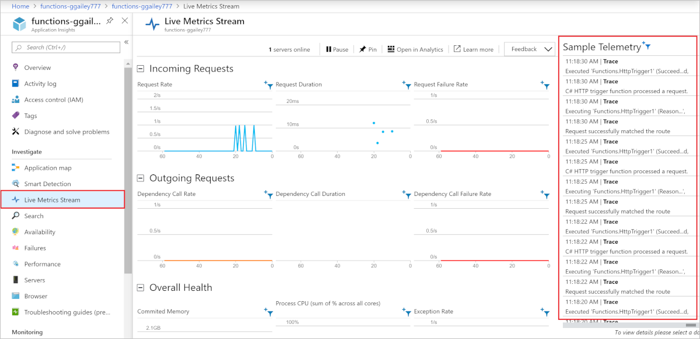

# Monitor Azure Functions

[Azure Functions](functions-overview.md) offers built-in integration with [Azure Application Insights](../azure-monitor/app/app-insights-overview.md) to monitor functions. This article shows you how to configure Azure Functions to send system-generated log files to Application Insights.

We recommend using Application Insights because it collects log, performance, and error data. It automatically detects performance anomalies and includes powerful analytics tools to help you diagnose issues and to understand how your functions are used. It's designed to help you continuously improve performance and usability. You can even use Application Insights during local function app project development. For more information, see [What is Application Insights?](../azure-monitor/app/app-insights-overview.md).

As the required Application Insights instrumentation is built into Azure Functions, all you need is a valid instrumentation key to connect your function app to an Application Insights resource.

## Application Insights pricing and limits

You can try out Application Insights integration with Function Apps for free. There's a daily limit to how much data can be processed for free. You might hit this limit during testing. Azure provides portal and email notifications when you're approaching your daily limit. If you miss those alerts and hit the limit, new logs won't appear in Application Insights queries. Be aware of the limit to avoid unnecessary troubleshooting time. For more information, see [Manage pricing and data volume in Application Insights](../azure-monitor/app/pricing.md).

The full list of Application Insights features available to your function app is detailed in [Application Insights for Azure Functions supported features](../azure-monitor/app/azure-functions-supported-features.md).

## Enable Application Insights integration

For a function app to send data to Application Insights, it needs to know the instrumentation key of an Application Insights resource. The key must be in an app setting named **APPINSIGHTS_INSTRUMENTATIONKEY**.

### New function app in the portal

When you [create your function app in the Azure portal](functions-create-first-azure-function.md), Application Insights integration is enabled by default. The Application Insights resource has the same name as your function app, and it's created either in the same region or in the nearest region.

To review the Application Insights resource being created, select it to expand the **Application Insights** window. You can change the **New resource name** or choose a different **Location** in an [Azure geography](https://azure.microsoft.com/global-infrastructure/geographies/) where you want to store your data.


When you choose **Create**, an Application Insights resource is created with your function app, which has the `APPINSIGHTS_INSTRUMENTATIONKEY` set in application settings. Everything is ready to go.

<a id="manually-connect-an-app-insights-resource"></a>
### Add to an existing function app 

When you create a function app using the [Azure CLI](functions-create-first-azure-function-azure-cli.md), [Visual Studio](functions-create-your-first-function-visual-studio.md), or [Visual Studio Code](functions-create-first-function-vs-code.md), you must create the Application Insights resource. You can then add the instrumentation key from that resource as an application setting in your function app.

[!INCLUDE [functions-connect-new-app-insights.md](../../includes/functions-connect-new-app-insights.md)]

Early versions of Functions used built-in monitoring, which is no longer recommended. When enabling Application Insights integration for such a function app, you must also [disable built-in logging](#disable-built-in-logging).  

## View telemetry in Monitor tab

With [Application Insights integration enabled](#enable-application-insights-integration), you can view telemetry data in the **Monitor** tab.

1. In the function app page, select a function that has run at least once after Application Insights was configured. Then select the **Monitor** tab.

   

1. Select **Refresh** periodically, until the list of function invocations appears.

   It can take up to five minutes for the list to appear while the telemetry client batches data for transmission to the server. (The delay doesn't apply to the [Live Metrics Stream](../azure-monitor/app/live-stream.md). That service connects to the Functions host when you load the page, so logs are streamed directly to the page.)

   

1. To see the logs for a particular function invocation, select the **Date** column link for that invocation.

   

   The logging output for that invocation appears in a new page.

   

You can see that both pages have a **Run in Application Insights** link to the Application Insights Analytics query that retrieves the data.



The following query is displayed. You can see that the query results are limited to the last 30 days (`where timestamp > ago(30d)`). In addition, the results show no more than 20 rows (`take 20`). In contrast, the invocation details list for your function is for the last 30 days with no limit.


For more information, see [Query telemetry data](#query-telemetry-data) later in this article.

## View telemetry in Application Insights

To open Application Insights from a function app in the Azure portal, go to the function app's **Overview** page. Under **Configured features**, select **Application Insights**.


For information about how to use Application Insights, see the [Application Insights documentation](https://docs.microsoft.com/azure/application-insights/). This section shows some examples of how to view data in Application Insights. If you're already familiar with Application Insights, you can go directly to [the sections about how to configure and customize the telemetry data](#configure-categories-and-log-levels).


The following areas of Application Insights can be helpful when evaluating the behavior, performance, and errors in your functions:

| Tab | Description |
| ---- | ----------- |
| **[Failures](../azure-monitor/app/asp-net-exceptions.md)** |  Create charts and alerts based on function failures and server exceptions. The **Operation Name** is the function name. Failures in dependencies aren't shown unless you implement custom telemetry for dependencies. |
| **[Performance](../azure-monitor/app/performance-counters.md)** | Analyze performance issues. |
| **Servers** | View resource utilization and throughput per server. This data can be useful for debugging scenarios where functions are bogging down your underlying resources. Servers are referred to as **Cloud role instances**. |
| **[Metrics](../azure-monitor/app/metrics-explorer.md)** | Create charts and alerts that are based on metrics. Metrics include the number of function invocations, execution time, and success rates. |
| **[Live Metrics Stream](../azure-monitor/app/live-stream.md)** | View metrics data as it's created in near real-time. |

## Query telemetry data

[Application Insights Analytics](../azure-monitor/app/analytics.md) gives you access to all telemetry data in the form of tables in a database. Analytics provides a query language for extracting, manipulating, and visualizing the data.


Here's a query example that shows the distribution of requests per worker over the last 30 minutes.

```
requests
| where timestamp > ago(30m) 
| summarize count() by cloud_RoleInstance, bin(timestamp, 1m)
| render timechart
```

The tables that are available are shown in the **Schema** tab on the left. You can find data generated by function invocations in the following tables:

| Table | Description |
| ----- | ----------- |
| **traces** | Logs created by the runtime and by function code. |
| **requests** | One request for each function invocation. |
| **exceptions** | Any exceptions thrown by the runtime. |
| **customMetrics** | The count of successful and failing invocations, success rate, and duration. |
| **customEvents** | Events tracked by the runtime, for example: HTTP requests that trigger a function. |
| **performanceCounters** | Information about the performance of the servers that the functions are running on. |

The other tables are for availability tests, and client and browser telemetry. You can implement custom telemetry to add data to them.

Within each table, some of the Functions-specific data is in a `customDimensions` field.  For example, the following query retrieves all traces that have log level `Error`.

```
traces 
| where customDimensions.LogLevel == "Error"
```

The runtime provides the `customDimensions.LogLevel` and `customDimensions.Category` fields. You can provide additional fields in logs that you write in your function code. See [Structured logging](#structured-logging) later in this article.

## Configure categories and log levels

You can use Application Insights without any custom configuration. The default configuration can result in high volumes of data. If you're using a Visual Studio Azure subscription, you might hit your data cap for Application Insights. Later in this article, you learn how to configure and customize the data that your functions send to Application Insights. For a function app, logging is configured in the [host.json] file.

### Categories

The Azure Functions logger includes a *category* for every log. The category indicates which part of the runtime code or your function code wrote the log. 

The Functions runtime creates logs with a category that begin with "Host." In version 1.x, the `function started`, `function executed`, and `function completed` logs have the category `Host.Executor`. Starting in version 2.x, these logs have the category `Function.<YOUR_FUNCTION_NAME>`.

If you write logs in your function code, the category is `Function` in version 1.x of the Functions runtime. In version 2.x, the category is `Function.<YOUR_FUNCTION_NAME>.User`.

### Log levels

The Azure Functions logger also includes a *log level* with every log. [LogLevel](/dotnet/api/microsoft.extensions.logging.loglevel) is an enumeration, and the integer code indicates relative importance:

|LogLevel    |Code|
|------------|---|
|Trace       | 0 |
|Debug       | 1 |
|Information | 2 |
|Warning     | 3 |
|Error       | 4 |
|Critical    | 5 |
|None        | 6 |

Log level `None` is explained in the next section. 

### Log configuration in host.json

The [host.json] file configures how much logging a function app sends to Application Insights. For each category, you indicate the minimum log level to send. There are two examples: the first example targets [version 2.x and later](functions-versions.md#version-2x) of the Functions runtime (with .NET Core), and the second example is for the version 1.x runtime.

### Version 2.x and higher

Version v2.x and later versions of the Functions runtime use the [.NET Core logging filter hierarchy](https://docs.microsoft.com/aspnet/core/fundamentals/logging/?view=aspnetcore-2.1#log-filtering). 

```json
{
  "logging": {
    "fileLoggingMode": "always",
    "logLevel": {
      "default": "Information",
      "Host.Results": "Error",
      "Function": "Error",
      "Host.Aggregator": "Trace"
    }
  }
}
```

### Version 1.x

```json
{
  "logger": {
    "categoryFilter": {
      "defaultLevel": "Information",
      "categoryLevels": {
        "Host.Results": "Error",
        "Function": "Error",
        "Host.Aggregator": "Trace"
      }
    }
  }
}
```

This example sets up the following rules:

* For logs with category `Host.Results` or `Function`, send only `Error` level and above to Application Insights. Logs for `Warning` level and below are ignored.
* For logs with category `Host.Aggregator`, send all logs to Application Insights. The `Trace` log level is the same as what some loggers call `Verbose`, but use `Trace` in the [host.json] file.
* For all other logs, send only `Information` level and above to Application Insights.

The category value in [host.json] controls logging for all categories that begin with the same value. `Host` in [host.json] controls logging for `Host.General`, `Host.Executor`, `Host.Results`, and so on.

If [host.json] includes multiple categories that start with the same string, the longer ones are matched first. Suppose you want everything from the runtime except `Host.Aggregator` to log at `Error` level, but you want `Host.Aggregator` to log at the `Information` level:

### Version 2.x and later

```json
{
  "logging": {
    "fileLoggingMode": "always",
    "logLevel": {
      "default": "Information",
      "Host": "Error",
      "Function": "Error",
      "Host.Aggregator": "Information"
    }
  }
}
```

### Version 1.x 

```json
{
  "logger": {
    "categoryFilter": {
      "defaultLevel": "Information",
      "categoryLevels": {
        "Host": "Error",
        "Function": "Error",
        "Host.Aggregator": "Information"
      }
    }
  }
}
```

To suppress all logs for a category, you can use log level `None`. No logs are written with that category and there's no log level above it.

The following sections describe the main categories of logs that the runtime creates. 

### Category Host.Results

These logs show as "requests" in Application Insights. They indicate success or failure of a function.



All of these logs are written at `Information` level. If you filter at `Warning` or above, you won't see any of this data.

### Category Host.Aggregator

These logs provide counts and averages of function invocations over a [configurable](#configure-the-aggregator) period of time. The default period is 30 seconds or 1,000 results, whichever comes first. 

The logs are available in the **customMetrics** table in Application Insights. Examples are the number of runs, success rate, and duration.



All of these logs are written at `Information` level. If you filter at `Warning` or above, you won't see any of this data.

### Other categories

All logs for categories other than the ones already listed are available in the **traces** table in Application Insights.


All logs with categories that begin with `Host` are written by the Functions runtime. The "Function started" and "Function completed" logs have category `Host.Executor`. For successful runs, these logs are `Information` level. Exceptions are logged at `Error` level. The runtime also creates `Warning` level logs, for example: queue messages sent to the poison queue.

Logs written by your function code have category `Function` and can be any log level.

## Configure the aggregator

As noted in the previous section, the runtime aggregates data about function executions over a period of time. The default period is 30 seconds or 1,000 runs, whichever comes first. You can configure this setting in the [host.json] file.  Here's an example:

```json
{
    "aggregator": {
      "batchSize": 1000,
      "flushTimeout": "00:00:30"
    }
}
```

## Configure sampling

Application Insights has a [sampling](../azure-monitor/app/sampling.md) feature that can protect you from producing too much telemetry data on completed executions at times of peak load. When the rate of incoming executions exceeds a specified threshold, Application Insights starts to randomly ignore some of the incoming executions. The default setting for maximum number of executions per second is 20 (five in version 1.x). You can configure sampling in [host.json].  Here's an example:

### Version 2.x and later

```json
{
  "logging": {
    "applicationInsights": {
      "samplingSettings": {
        "isEnabled": true,
        "maxTelemetryItemsPerSecond" : 20
      }
    }
  }
}
```

### Version 1.x 

```json
{
  "applicationInsights": {
    "sampling": {
      "isEnabled": true,
      "maxTelemetryItemsPerSecond" : 5
    }
  }
}
```

> [!NOTE]
> [Sampling](../azure-monitor/app/sampling.md) is enabled by default. If you appear to be missing data, you might need to adjust the sampling settings to fit your particular monitoring scenario.

## Write logs in C# functions

You can write logs in your function code that appear as traces in Application Insights.

### ILogger

Use an [ILogger](https://docs.microsoft.com/dotnet/api/microsoft.extensions.logging.ilogger) parameter in your functions instead of a `TraceWriter` parameter. Logs created by using `TraceWriter` go to Application Insights, but `ILogger` lets you do [structured logging](https://softwareengineering.stackexchange.com/questions/312197/benefits-of-structured-logging-vs-basic-logging).

With an `ILogger` object, you call `Log<level>` [extension methods on ILogger](https://docs.microsoft.com/dotnet/api/microsoft.extensions.logging.loggerextensions#methods) to create logs. The following code writes `Information` logs with category "Function."

```cs
public static async Task<HttpResponseMessage> Run(HttpRequestMessage req, ILogger logger)
{
    logger.LogInformation("Request for item with key={itemKey}.", id);
```

### Structured logging

The order of placeholders, not their names, determines which parameters are used in the log message. Suppose you have the following code:

```csharp
string partitionKey = "partitionKey";
string rowKey = "rowKey";
logger.LogInformation("partitionKey={partitionKey}, rowKey={rowKey}", partitionKey, rowKey);
```

If you keep the same message string and reverse the order of the parameters, the resulting message text would have the values in the wrong places.

Placeholders are handled this way so that you can do structured logging. Application Insights stores the parameter name-value pairs and the message string. The result is that the message arguments become fields that you can query on.

If your logger method call looks like the previous example, you can query the field `customDimensions.prop__rowKey`. The `prop__` prefix is added to ensure there are no collisions between fields the runtime adds and fields your function code adds.

You can also query on the original message string by referencing the field `customDimensions.prop__{OriginalFormat}`.  

Here's a sample JSON representation of `customDimensions` data:

```json
{
  customDimensions: {
    "prop__{OriginalFormat}":"C# Queue trigger function processed: {message}",
    "Category":"Function",
    "LogLevel":"Information",
    "prop__message":"c9519cbf-b1e6-4b9b-bf24-cb7d10b1bb89"
  }
}
```

### Custom metrics logging

In C# script functions, you can use the `LogMetric` extension method on `ILogger` to create custom metrics in Application Insights. Here's a sample method call:

```csharp
logger.LogMetric("TestMetric", 1234);
```

This code is an alternative to calling `TrackMetric` by using the Application Insights API for .NET.

## Write logs in JavaScript functions

In Node.js functions, use `context.log` to write logs. Structured logging isn't enabled.

```
context.log('JavaScript HTTP trigger function processed a request.' + context.invocationId);
```

### Custom metrics logging

When you're running on [version 1.x](functions-versions.md#creating-1x-apps) of the Functions runtime, Node.js functions can use the `context.log.metric` method to create custom metrics in Application Insights. This method isn't currently supported in version 2.x and later. Here's a sample method call:

```javascript
context.log.metric("TestMetric", 1234);
```

This code is an alternative to calling `trackMetric` by using the Node.js SDK for Application Insights.

## Log custom telemetry in C# functions

You can use the [Microsoft.ApplicationInsights](https://www.nuget.org/packages/Microsoft.ApplicationInsights/) NuGet package to send custom telemetry data to Application Insights. The following C# example uses the [custom telemetry API](../azure-monitor/app/api-custom-events-metrics.md). The example is for a .NET class library, but the Application Insights code is the same for C# script.

### Version 2.x and later

Version 2.x and later versions of the runtime use newer features in Application Insights to automatically correlate telemetry with the current operation. There's no need to manually set the operation `Id`, `ParentId`, or `Name` fields.

```cs
using System;
using System.Linq;
using System.Threading.Tasks;
using Microsoft.ApplicationInsights;
using Microsoft.ApplicationInsights.DataContracts;
using Microsoft.AspNetCore.Http;
using Microsoft.AspNetCore.Mvc;
using Microsoft.Azure.WebJobs;
using Microsoft.Azure.WebJobs.Extensions.Http;
using Microsoft.Extensions.Logging;

namespace functionapp0915
{
    public class HttpTrigger2
    {
        private readonly TelemetryClient telemetryClient;

        /// Using dependency injection will guarantee that you use the same configuration for telemetry collected automatically and manually.
        public HttpTrigger2(TelemetryConfiguration telemetryConfiguration)
        {
            this.telemetryClient = new TelemetryClient(telemetryConfiguration);
        }

        [FunctionName("HttpTrigger2")]
        public Task<IActionResult> Run(
            [HttpTrigger(AuthorizationLevel.Anonymous, "get", Route = null)]
            HttpRequest req, ExecutionContext context, ILogger log)
        {
            log.LogInformation("C# HTTP trigger function processed a request.");
            DateTime start = DateTime.UtcNow;

            // Parse query parameter
            string name = req.Query
                .FirstOrDefault(q => string.Compare(q.Key, "name", true) == 0)
                .Value;

            // Track an Event
            var evt = new EventTelemetry("Function called");
            evt.Context.User.Id = name;
            this.telemetryClient.TrackEvent(evt);

            // Track a Metric
            var metric = new MetricTelemetry("Test Metric", DateTime.Now.Millisecond);
            metric.Context.User.Id = name;
            this.telemetryClient.TrackMetric(metric);

            // Track a Dependency
            var dependency = new DependencyTelemetry
            {
                Name = "GET api/planets/1/",
                Target = "swapi.co",
                Data = "https://swapi.co/api/planets/1/",
                Timestamp = start,
                Duration = DateTime.UtcNow - start,
                Success = true
            };
            dependency.Context.User.Id = name;
            this.telemetryClient.TrackDependency(dependency);

            return Task.FromResult<IActionResult>(new OkResult());
        }
    }
}
```

### Version 1.x

```cs
using System;
using System.Net;
using Microsoft.ApplicationInsights;
using Microsoft.ApplicationInsights.DataContracts;
using Microsoft.ApplicationInsights.Extensibility;
using Microsoft.Azure.WebJobs;
using System.Net.Http;
using System.Threading.Tasks;
using Microsoft.Azure.WebJobs.Extensions.Http;
using Microsoft.Extensions.Logging;
using System.Linq;

namespace functionapp0915
{
    public static class HttpTrigger2
    {
        private static string key = TelemetryConfiguration.Active.InstrumentationKey = 
            System.Environment.GetEnvironmentVariable(
                "APPINSIGHTS_INSTRUMENTATIONKEY", EnvironmentVariableTarget.Process);

        private static TelemetryClient telemetryClient = 
            new TelemetryClient() { InstrumentationKey = key };

        [FunctionName("HttpTrigger2")]
        public static async Task<HttpResponseMessage> Run(
            [HttpTrigger(AuthorizationLevel.Anonymous, "get", "post", Route = null)]
            HttpRequestMessage req, ExecutionContext context, ILogger log)
        {
            log.LogInformation("C# HTTP trigger function processed a request.");
            DateTime start = DateTime.UtcNow;

            // Parse query parameter
            string name = req.GetQueryNameValuePairs()
                .FirstOrDefault(q => string.Compare(q.Key, "name", true) == 0)
                .Value;

            // Get request body
            dynamic data = await req.Content.ReadAsAsync<object>();

            // Set name to query string or body data
            name = name ?? data?.name;
         
            // Track an Event
            var evt = new EventTelemetry("Function called");
            UpdateTelemetryContext(evt.Context, context, name);
            telemetryClient.TrackEvent(evt);
            
            // Track a Metric
            var metric = new MetricTelemetry("Test Metric", DateTime.Now.Millisecond);
            UpdateTelemetryContext(metric.Context, context, name);
            telemetryClient.TrackMetric(metric);
            
            // Track a Dependency
            var dependency = new DependencyTelemetry
                {
                    Name = "GET api/planets/1/",
                    Target = "swapi.co",
                    Data = "https://swapi.co/api/planets/1/",
                    Timestamp = start,
                    Duration = DateTime.UtcNow - start,
                    Success = true
                };
            UpdateTelemetryContext(dependency.Context, context, name);
            telemetryClient.TrackDependency(dependency);
        }
        
        // Correlate all telemetry with the current Function invocation
        private static void UpdateTelemetryContext(TelemetryContext context, ExecutionContext functionContext, string userName)
        {
            context.Operation.Id = functionContext.InvocationId.ToString();
            context.Operation.ParentId = functionContext.InvocationId.ToString();
            context.Operation.Name = functionContext.FunctionName;
            context.User.Id = userName;
        }
    }    
}
```

Don't call `TrackRequest` or `StartOperation<RequestTelemetry>` because you'll see duplicate requests for a function invocation.  The Functions runtime automatically tracks requests.

Don't set `telemetryClient.Context.Operation.Id`. This global setting causes incorrect correlation when many functions are running simultaneously. Instead, create a new telemetry instance (`DependencyTelemetry`, `EventTelemetry`) and modify its `Context` property. Then pass in the telemetry instance to the corresponding `Track` method on `TelemetryClient` (`TrackDependency()`, `TrackEvent()`). This method ensures that the telemetry has the correct correlation details for the current function invocation.

## Log custom telemetry in JavaScript functions

Here is a sample code snippet that sends custom telemetry with the [Application Insights Node.js SDK](https://github.com/microsoft/applicationinsights-node.js):

```javascript
const appInsights = require("applicationinsights");
appInsights.setup();
const client = appInsights.defaultClient;

module.exports = function (context, req) {
    context.log('JavaScript HTTP trigger function processed a request.');

    client.trackEvent({name: "my custom event", tagOverrides:{"ai.operation.id": context.invocationId}, properties: {customProperty2: "custom property value"}});
    client.trackException({exception: new Error("handled exceptions can be logged with this method"), tagOverrides:{"ai.operation.id": context.invocationId}});
    client.trackMetric({name: "custom metric", value: 3, tagOverrides:{"ai.operation.id": context.invocationId}});
    client.trackTrace({message: "trace message", tagOverrides:{"ai.operation.id": context.invocationId}});
    client.trackDependency({target:"http://dbname", name:"select customers proc", data:"SELECT * FROM Customers", duration:231, resultCode:0, success: true, dependencyTypeName: "ZSQL", tagOverrides:{"ai.operation.id": context.invocationId}});
    client.trackRequest({name:"GET /customers", url:"http://myserver/customers", duration:309, resultCode:200, success:true, tagOverrides:{"ai.operation.id": context.invocationId}});

    context.done();
};
```

The `tagOverrides` parameter sets the `operation_Id` to the function's invocation ID. This setting enables you to correlate all of the automatically generated and custom telemetry for a given function invocation.

## Dependencies

Functions v2 automatically collects dependencies for HTTP requests, ServiceBus, and SQL.

You can write custom code to show the dependencies. For examples, see the sample code in the [C# custom telemetry section](#log-custom-telemetry-in-c-functions). The sample code results in an *application map* in Application Insights that looks like the following image:


## Report issues

To report an issue with Application Insights integration in Functions, or to make a suggestion or request, [create an issue in GitHub](https://github.com/Azure/Azure-Functions/issues/new).

## Streaming Logs

While developing an application, you often want to see what's being written to the logs in near real-time when running in Azure.

There are two ways to view a stream of log files being generated by your function executions.

* **Built-in log streaming**: the App Service platform lets you view a stream of your application log files. This is equivalent to the output seen when you debug your functions during [local development](functions-develop-local.md) and when you use the **Test** tab in the portal. All log-based information is displayed. For more information, see [Stream logs](../app-service/troubleshoot-diagnostic-logs.md#stream-logs). This streaming method supports only a single instance, and can't be used with an app running on Linux in a Consumption plan.

* **Live Metrics Stream**: when your function app is [connected to Application Insights](#enable-application-insights-integration), you can view log data and other metrics in near real-time in the Azure portal using [Live Metrics Stream](../azure-monitor/app/live-stream.md). Use this method when monitoring functions running on multiple-instances or on Linux in a Consumption plan. This method uses [sampled data](#configure-sampling).

Log streams can be viewed both in the portal and in most local development environments. 

### Portal

You can view both types of log streams in the portal.

#### Built-in log streaming

To view streaming logs in the portal, select the **Platform features** tab in your function app. Then, under **Monitoring**, choose **Log streaming**.


This connects your app to the log streaming service and application logs are displayed in the window. You can toggle between **Application logs** and **Web server logs**.  



#### Live Metrics Stream

To view the Live Metrics Stream for your app, select the **Overview** tab of your function app. When you have Application Insights enables, you see an **Application Insights** link under **Configured features**. This link takes you to the Application Insights page for your app.

In Application Insights, select **Live Metrics Stream**. [Sampled log entries](#configure-sampling) are displayed under **Sample Telemetry**.

 

### Visual Studio Code

[!INCLUDE [functions-enable-log-stream-vs-code](../../includes/functions-enable-log-stream-vs-code.md)]

### Core Tools

[!INCLUDE [functions-streaming-logs-core-tools](../../includes/functions-streaming-logs-core-tools.md)]

### Azure CLI

You can enable streaming logs by using the [Azure CLI](/cli/azure/install-azure-cli). Use the following commands to sign in, choose your subscription, and stream log files:

```azurecli
az login
az account list
az account set --subscription <subscriptionNameOrId>
az webapp log tail --resource-group <RESOURCE_GROUP_NAME> --name <FUNCTION_APP_NAME>
```

### Azure PowerShell

You can enable streaming logs by using [Azure PowerShell](/powershell/azure/overview). For PowerShell, use the following commands to add your Azure account, choose your subscription, and stream log files:

```powershell
Add-AzAccount
Get-AzSubscription
Get-AzSubscription -SubscriptionName "<subscription name>" | Select-AzSubscription
Get-AzWebSiteLog -Name <FUNCTION_APP_NAME> -Tail
```

## Disable built-in logging

When you enable Application Insights, disable the built-in logging that uses Azure Storage. The built-in logging is useful for testing with light workloads, but isn't intended for high-load production use. For production monitoring, we recommend Application Insights. If built-in logging is used in production, the logging record might be incomplete because of throttling on Azure Storage.

To disable built-in logging, delete the `AzureWebJobsDashboard` app setting. For information about how to delete app settings in the Azure portal, see the **Application settings** section of [How to manage a function app](functions-how-to-use-azure-function-app-settings.md#settings). Before you delete the app setting, make sure no existing functions in the same function app use the setting for Azure Storage triggers or bindings.

## Next steps

For more information, see the following resources:

* [Application Insights](/azure/application-insights/)
* [ASP.NET Core logging](/aspnet/core/fundamentals/logging/)

[host.json]: functions-host-json.md
