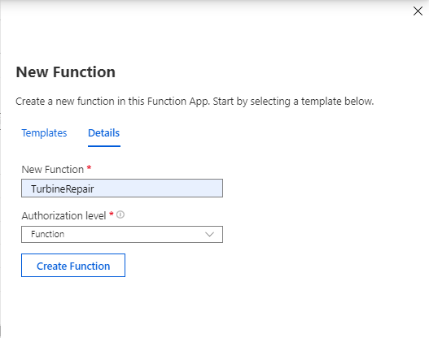
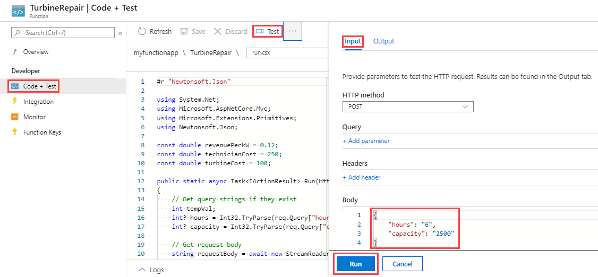
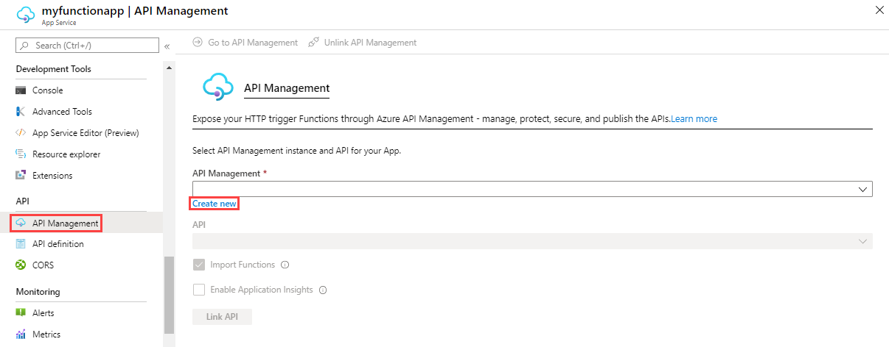
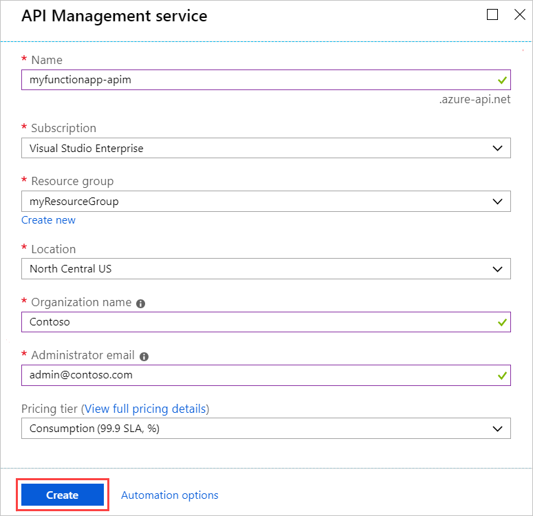
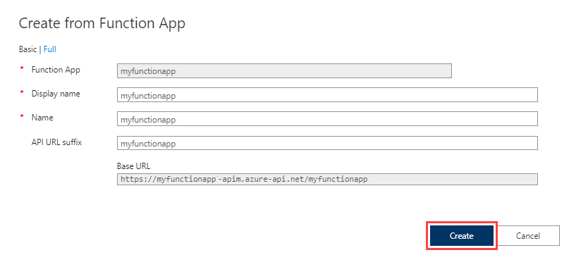
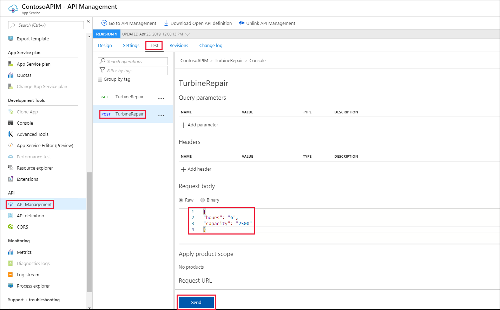

# Create an OpenAPI definition for a function with Azure API Management

REST APIs are often described using an OpenAPI definition. This definition contains information about what operations are available in an API and how the request and response data for the API should be structured.

In this tutorial, you create a function that determines whether an emergency repair on a wind turbine is cost-effective. You then create an OpenAPI definition for the function app using [Azure API Management](../api-management/api-management-key-concepts.md) so that the function can be called from other apps and services.

In this tutorial, you learn how to:

> [!div class="checklist"]
> * Create a function in Azure
> * Generate an OpenAPI definition using Azure API Management
> * Test the definition by calling the function

## Create a function app

You must have a function app to host the execution of your functions. A function app lets you group functions as a logical unit for easier management, deployment, scaling, and sharing of resources.

[!INCLUDE [Create function app Azure portal](../../includes/functions-create-function-app-portal.md)]

## Create the function

This tutorial uses an HTTP triggered function that takes two parameters:

* The estimated time to make a turbine repair, in hours.
* The capacity of the turbine, in kilowatts. 

The function then calculates how much a repair will cost, and how much revenue the turbine could make in a 24 hour period. TO create the HTTP triggered function in the [Azure portal](https://portal.azure.com).

1. Expand your function app and select the **+** button next to **Functions**. Select **In-portal** > **Continue**.

1. Select **More templates...**, then select **Finish and view templates**

1. Select HTTP trigger, type `TurbineRepair` for the function **Name**, choose `Function` for **[Authentication level](functions-bindings-http-webhook.md#http-auth)**, and then select **Create**.  

    

1. Replace the contents of the run.csx C# script file with the following code, then choose **Save**:

    ```csharp
    #r "Newtonsoft.Json"
    
    using System.Net;
    using Microsoft.AspNetCore.Mvc;
    using Microsoft.Extensions.Primitives;
    using Newtonsoft.Json;
    
    const double revenuePerkW = 0.12;
    const double technicianCost = 250;
    const double turbineCost = 100;
    
    public static async Task<IActionResult> Run(HttpRequest req, ILogger log)
    {
        // Get query strings if they exist
        int tempVal;
        int? hours = Int32.TryParse(req.Query["hours"], out tempVal) ? tempVal : (int?)null;
        int? capacity = Int32.TryParse(req.Query["capacity"], out tempVal) ? tempVal : (int?)null;
    
        // Get request body
        string requestBody = await new StreamReader(req.Body).ReadToEndAsync();
        dynamic data = JsonConvert.DeserializeObject(requestBody);
    
        // Use request body if a query was not sent
        capacity = capacity ?? data?.capacity;
        hours = hours ?? data?.hours;
    
        // Return bad request if capacity or hours are not passed in
        if (capacity == null || hours == null){
            return new BadRequestObjectResult("Please pass capacity and hours on the query string or in the request body");
        }
        // Formulas to calculate revenue and cost
        double? revenueOpportunity = capacity * revenuePerkW * 24;  
        double? costToFix = (hours * technicianCost) +  turbineCost;
        string repairTurbine;
    
        if (revenueOpportunity > costToFix){
            repairTurbine = "Yes";
        }
        else {
            repairTurbine = "No";
        };
    
        return (ActionResult)new OkObjectResult(new{
            message = repairTurbine,
            revenueOpportunity = "$"+ revenueOpportunity,
            costToFix = "$"+ costToFix
        });
    }
    ```

    This function code returns a message of `Yes` or `No` to indicate whether an emergency repair is cost-effective, as well as the revenue opportunity that the turbine represents, and the cost to fix the turbine.

1. To test the function, click **Test** at the far right to expand the test tab. Enter the following value for the **Request body**, and then click **Run**.

    ```json
    {
    "hours": "6",
    "capacity": "2500"
    }
    ```

    

    The following value is returned in the body of the response.

    ```json
    {"message":"Yes","revenueOpportunity":"$7200","costToFix":"$1600"}
    ```

Now you have a function that determines the cost-effectiveness of emergency repairs. Next, you generate an OpenAPI definition for the function app.

## Generate the OpenAPI definition

Now you're ready to generate the OpenAPI definition.

1. Select the function app, then in **Platform features**, choose **API Management** and select **Create new** under **API Management**.

    

1. Use the API Management settings as specified in the table below the image.

    

    | Setting      | Suggested value  | Description                                        |
    | ------------ |  ------- | -------------------------------------------------- |
    | **Name** | Globally unique name | A name is generated based on the name of your function app. |
    | **Subscription** | Your subscription | The subscription under which this new resource is created. |  
    | **[Resource Group](../azure-resource-manager/resource-group-overview.md)** |  myResourceGroup | The same resource as your function app, which should get set for you. |
    | **Location** | West US | Choose the West US location. |
    | **Organization name** | Contoso | The name of the organization used in the developer portal and for email notifications. |
    | **Administrator email** | your email | Email that received system notifications from API Management. |
    | **Pricing tier** | Consumption (preview) | Consumption tier is in preview and isn't available in all regions. For complete pricing details, see the [API Management pricing page](https://azure.microsoft.com/pricing/details/api-management/) |

1. Choose **Create** to create the API Management instance, which may take several minutes.

1. Select **Enable Application Insights** to send logs to the same place as the function application, then accept the remaining defaults and select **Link API**.

1. The **Import Azure Functions** opens with the **TurbineRepair** function highlighted. Choose **Select** to continue.

    

1. In the **Create from Function App** page, accept the defaults and select **Create**

    

The API is now created for the function.

## Test the API

Before you use the OpenAPI definition, you should verify that the API works.

1. On the **Test** tab of your function, select **POST** operation.

1. Enter values for **hours** and **capacity**

    ```json
    {
    "hours": "6",
    "capacity": "2500"
    }
    ```

1. Click **Send**, then view the HTTP response.

    

## Download the OpenAPI definition

If your API works as expected, you can download the OpenAPI definition.

1. Click on the "Download OpenAPI definition" button in the top bar.
   
   

[!INCLUDE [clean-up-section-portal](../../includes/clean-up-section-portal.md)]

## Next steps

> [!div class="nextstepaction"]
> [Learn more about API Management](../api-management/api-management-key-concepts.md)
> [Edit the OpenAPI definition in API Management](../api-management/edit-api.md)
