# Create a function that integrates with Azure Logic Apps

Azure Functions integrates with Azure Logic Apps in the Logic Apps Designer. This integration lets you use the computing power of Functions in orchestrations with other Azure and third-party services. 

This tutorial shows you how to use Azure Functions with Logic Apps and Cognitive Services on Azure to run sentiment analysis from Twitter posts. An HTTP trigger function categorizes tweets as green, yellow, or red based on the sentiment score. An email is sent when poor sentiment is detected. 

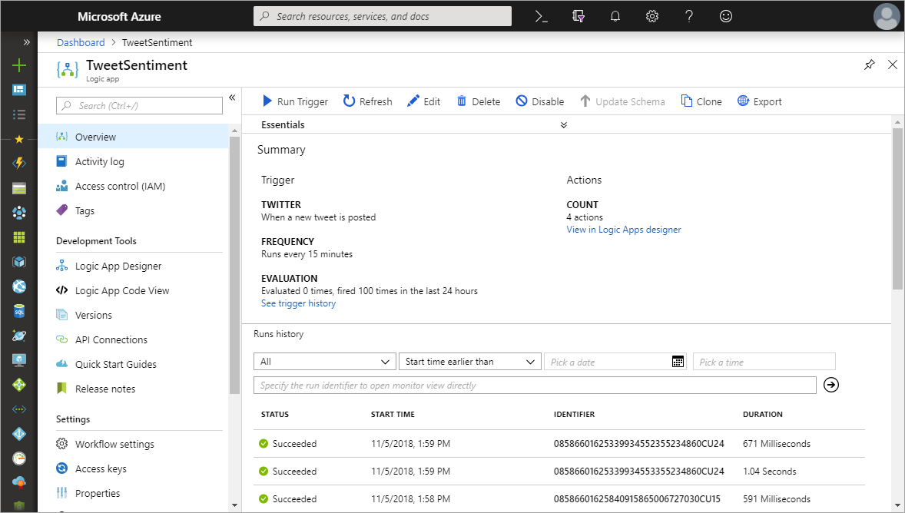

In this tutorial, you learn how to:

> [!div class="checklist"]
> * Create a Cognitive Services API Resource.
> * Create a function that categorizes tweet sentiment.
> * Create a logic app that connects to Twitter.
> * Add sentiment detection to the logic app. 
> * Connect the logic app to the function.
> * Send an email based on the response from the function.

## Prerequisites

+ An active [Twitter](https://twitter.com/) account. 
+ An [Outlook.com](https://outlook.com/) account (for sending notifications).

> [!NOTE]
> If you want to use the Gmail connector, only G-Suite business accounts can use this connector without restrictions in logic apps. 
> If you have a Gmail consumer account, you can use the Gmail connector with only specific Google-approved apps and services, 
> or you can [create a Google client app to use for authentication in your Gmail connector](/connectors/gmail/#authentication-and-bring-your-own-application). 
> For more information, see [Data security and privacy policies for Google connectors in Azure Logic Apps](../connectors/connectors-google-data-security-privacy-policy.md).

+ This article uses as its starting point the resources created in [Create your first function from the Azure portal](functions-create-first-azure-function.md).
If you haven't already done so, complete these steps now to create your function app.

## Create a Cognitive Services resource

The Cognitive Services APIs are available in Azure as individual resources. Use the Text Analytics API to detect the sentiment of the tweets being monitored.

1. Sign in to the [Azure portal](https://portal.azure.com/).

2. Click **Create a resource** in the upper left-hand corner of the Azure portal.

3. Click **AI + Machine Learning** > **Text Analytics**. Then, use the settings as specified in the table to create the resource.

    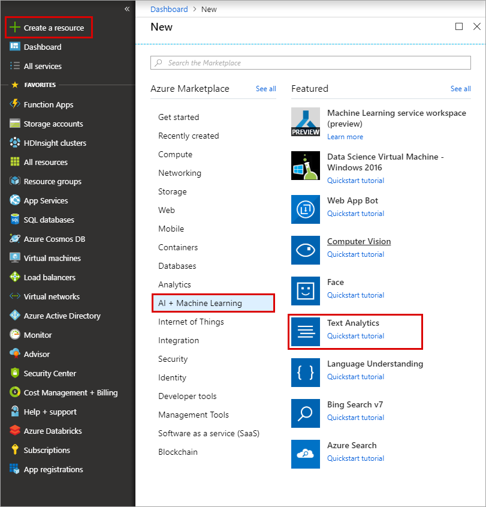

    | Setting      |  Suggested value   | Description                                        |
    | --- | --- | --- |
    | **Name** | MyCognitiveServicesAccnt | Choose a unique account name. |
    | **Location** | West US | Use the location nearest you. |
    | **Pricing tier** | F0 | Start with the lowest tier. If you run out of calls, scale to a higher tier.|
    | **Resource group** | myResourceGroup | Use the same resource group for all services in this tutorial.|

4. Click **Create** to create your resource. 

5. Click **Overview** and copy the value of the **Endpoint** to a text editor. This value is used when creating a connection to the Cognitive Services API.

    

6. In the left navigation column, click **Keys**, and then copy the value of **Key 1** and set it aside in a text editor. You use the key to connect the logic app to your Cognitive Services API. 
 
    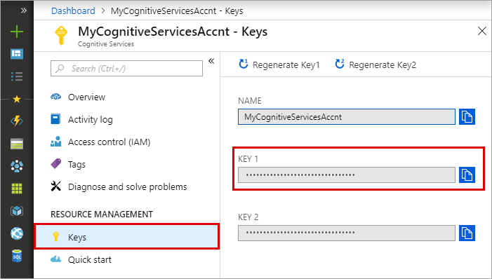

## Create the function app

Azure Functions provides a great way to offload processing tasks in a logic apps workflow. This tutorial uses an HTTP trigger function to process tweet sentiment scores from Cognitive Services and return a category value.  

[!INCLUDE [Create function app Azure portal](../../includes/functions-create-function-app-portal.md)]

## Create an HTTP trigger function  

1. From the left menu of the **Functions** window, select **Functions**, then select **Add** from the top menu.

2. From the **New Function** window, select **HTTP trigger**.

    

3. From the **New Function** page, select **Create Function**.

4. In your new HTTP trigger function, select **Code + Test** from the left menu, replace the contents of the `run.csx` file with the following code, and then select **Save**:

    ```csharp
    #r "Newtonsoft.Json"
    
    using System;
    using System.Net;
    using Microsoft.AspNetCore.Mvc;
    using Microsoft.Extensions.Logging;
    using Microsoft.Extensions.Primitives;
    using Newtonsoft.Json;
    
    public static async Task<IActionResult> Run(HttpRequest req, ILogger log)
    {
        string category = "GREEN";
    
        string requestBody = await new StreamReader(req.Body).ReadToEndAsync();
        log.LogInformation(string.Format("The sentiment score received is '{0}'.", requestBody));
    
        double score = Convert.ToDouble(requestBody);
    
        if(score < .3)
        {
            category = "RED";
        }
        else if (score < .6) 
        {
            category = "YELLOW";
        }
    
        return requestBody != null
            ? (ActionResult)new OkObjectResult(category)
            : new BadRequestObjectResult("Please pass a value on the query string or in the request body");
    }
    ```

    This function code returns a color category based on the sentiment score received in the request. 

5. To test the function, select **Test** from the top menu. On the **Input** tab, enter a value of `0.2` in the **Body**, and then select **Run**. A value of **RED** is returned in the **HTTP response content** on the **Output** tab. 

    :::image type="content" source="./media/functions-twitter-email/07-function-test.png" alt-text="Define the proxy settings":::

Now you have a function that categorizes sentiment scores. Next, you create a logic app that integrates your function with your Twitter and Cognitive Services API. 

## Create a logic app   

1. In the Azure portal, click the **Create a resource** button found on the upper left-hand corner of the Azure portal.

2. Click **Web** > **Logic App**.
 
3. Then, type a value for **Name** like `TweetSentiment`, and use the settings as specified in the table.

    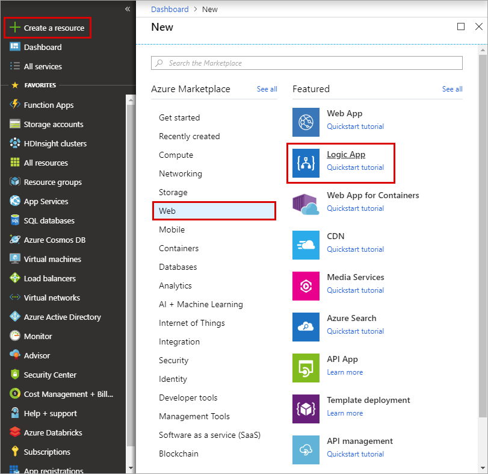

    | Setting      |  Suggested value   | Description                                        |
    | ----------------- | ------------ | ------------- |
    | **Name** | TweetSentiment | Choose an appropriate name for your app. |
    | **Resource group** | myResourceGroup | Choose the same existing resource group as before. |
    | **Location** | East US | Choose a location close to you. |    

4. Once you have entered the proper settings values, click **Create** to create your logic app. 

5. After the app is created, click your new logic app pinned to the dashboard. Then in the Logic Apps Designer, scroll down and click the **Blank Logic App** template. 

    

You can now use the Logic Apps Designer to add services and triggers to your app.

## Connect to Twitter

First, create a connection to your Twitter account. The logic app polls for tweets, which trigger the app to run.

1. In the designer, click the **Twitter** service, and click the **When a new tweet is posted** trigger. Sign in to your Twitter account and authorize Logic Apps to use your account.

2. Use the Twitter trigger settings as specified in the table. 

    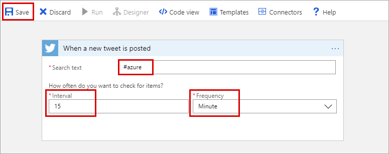

    | Setting      |  Suggested value   | Description                                        |
    | ----------------- | ------------ | ------------- |
    | **Search text** | #Azure | Use a hashtag that is popular enough to generate new tweets in the chosen interval. When using the Free tier and your hashtag is too popular, you can quickly use up the transaction quota in your Cognitive Services API. |
    | **Interval** | 15 | The time elapsed between Twitter requests, in frequency units. |
    | **Frequency** | Minute | The frequency unit used for polling Twitter.  |

3.  Click  **Save** to connect to your Twitter account. 

Now your app is connected to Twitter. Next, you connect to text analytics to detect the sentiment of collected tweets.

## Add sentiment detection

1. Click **New Step**, and then **Add an action**.

2. In **Choose an action**, type **Text Analytics**, and then click the **Detect sentiment** action.
    
    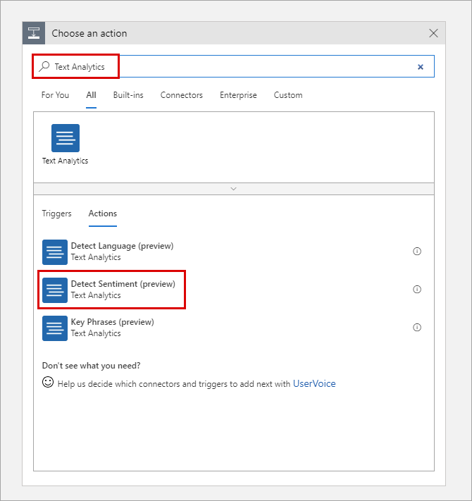

3. Type a connection name such as `MyCognitiveServicesConnection`, paste the key for your Cognitive Services API and the Cognitive Services endpoint you set aside in a text editor, and click **Create**.

    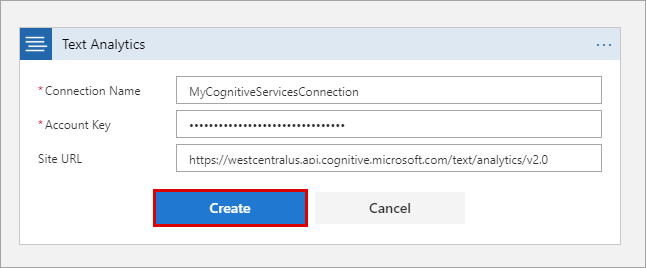

4. Next, enter **Tweet text** in the text box and then click **New Step**.

    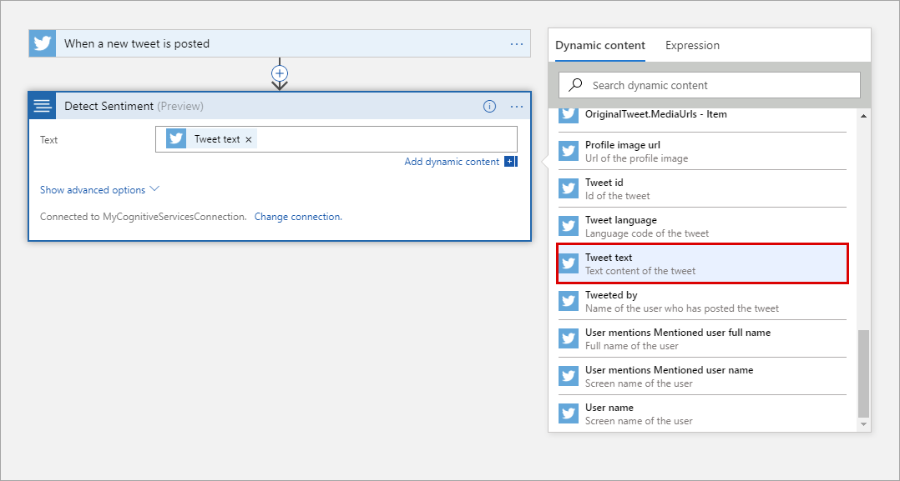

Now that sentiment detection is configured, you can add a connection to your function that consumes the sentiment score output.

## Connect sentiment output to your function

1. In the Logic Apps Designer, click **New step** > **Add an action**, filter on **Azure Functions** and click **Choose an Azure function**.

    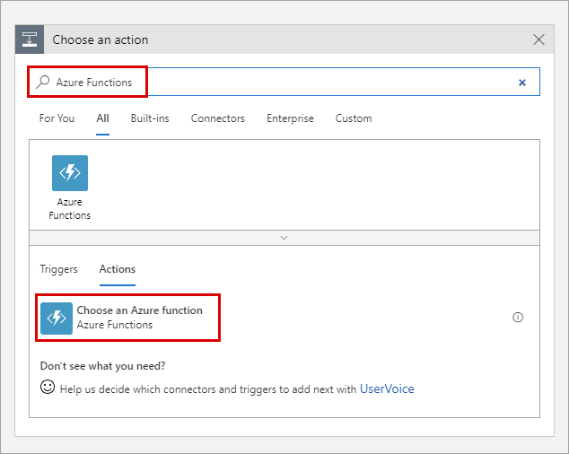
  
4. Select the function app you created earlier.

    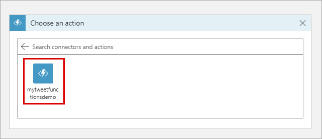

5. Select the function you created for this tutorial.

    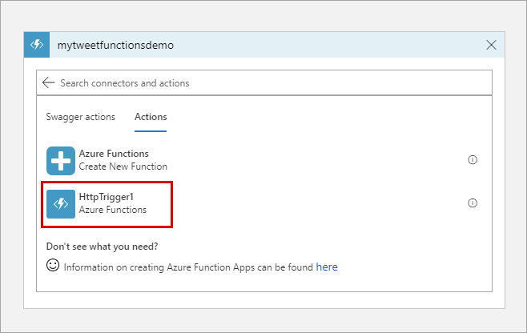

4. In **Request Body**, click **Score** and then **Save**.

    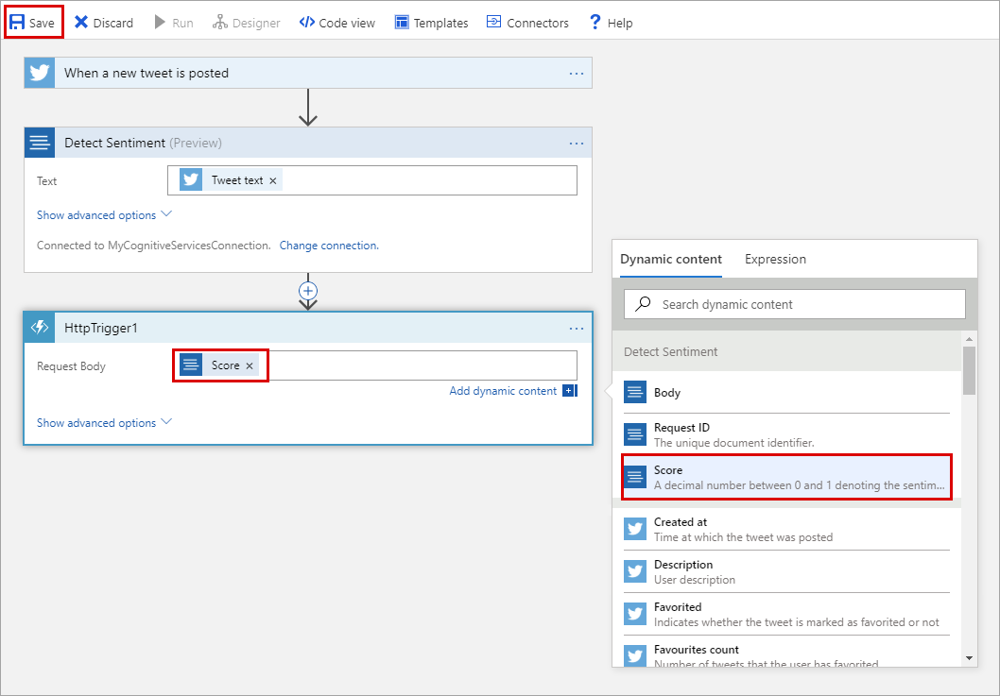

Now, your function is triggered when a sentiment score is sent from the logic app. A color-coded category is returned to the logic app by the function. Next, you add an email notification that is sent when a sentiment value of **RED** is returned from the function. 

## Add email notifications

The last part of the workflow is to trigger an email when the sentiment is scored as _RED_. This article uses an Outlook.com connector. You can perform similar steps to use a Gmail or Outlook for Microsoft 365 connector.   

1. In the Logic Apps Designer, click **New step** > **Add a condition**. 

    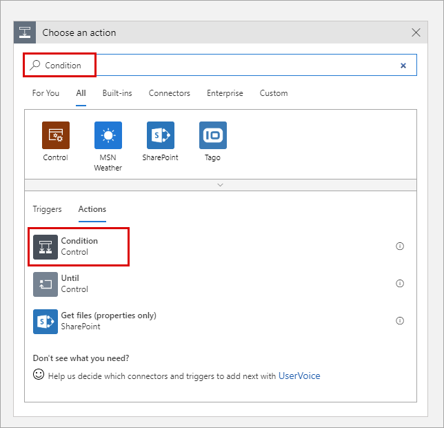

2. Click **Choose a value**, then click **Body**. Select **is equal to**, click **Choose a value** and type `RED`, and click **Save**. 

    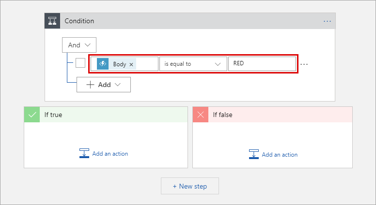    

3. In **IF TRUE**, click **Add an action**, search for `outlook.com`, click **Send an email**, and sign in to your Outlook.com account.

    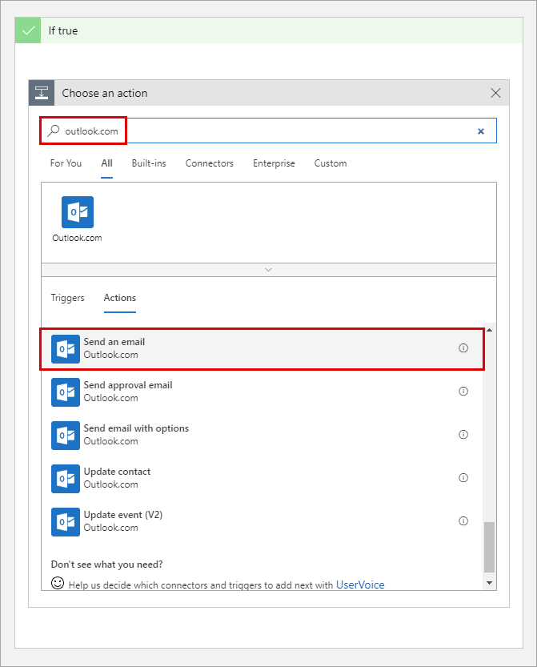

    > [!NOTE]
    > If you don't have an Outlook.com account, you can choose another connector, such as Gmail or Outlook for Microsoft 365.

4. In the **Send an email** action, use the email settings as specified in the table. 

    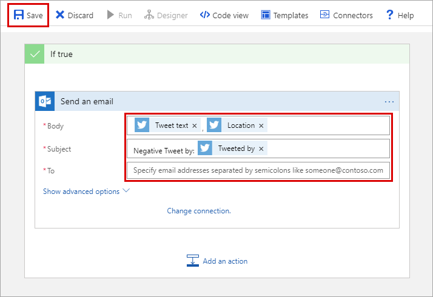
    
| Setting      |  Suggested value   | Description  |
| ----------------- | ------------ | ------------- |
| **To** | Type your email address | The email address that receives the notification. |
| **Subject** | Negative tweet sentiment detected  | The subject line of the email notification.  |
| **Body** | Tweet text, Location | Click the **Tweet text** and **Location** parameters. |

1. Click **Save**.

Now that the workflow is complete, you can enable the logic app and see the function at work.

## Test the workflow

1. In the Logic App Designer, click **Run** to start the app.

2. In the left column, click **Overview** to see the status of the logic app. 
 
    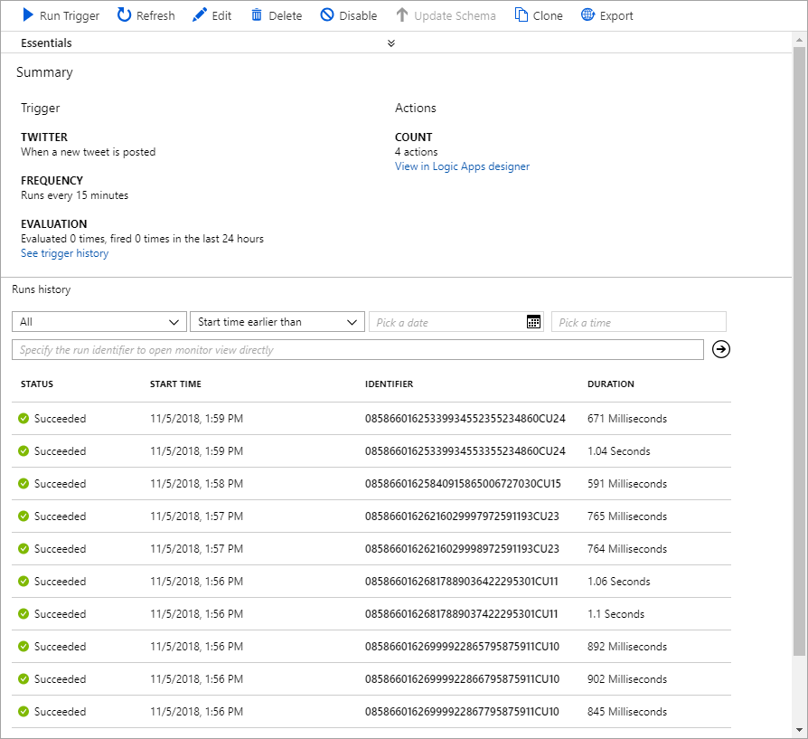

3. (Optional) Click one of the runs to see details of the execution.

4. Go to your function, view the logs, and verify that sentiment values were received and processed.
 
    

5. When a potentially negative sentiment is detected, you receive an email. If you haven't received an email, you can change the function code to return RED every time:

    ```csharp
    return (ActionResult)new OkObjectResult("RED");
    ```

    After you have verified email notifications, change back to the original code:

    ```csharp
    return requestBody != null
        ? (ActionResult)new OkObjectResult(category)
        : new BadRequestObjectResult("Please pass a value on the query string or in the request body");
    ```

    > [!IMPORTANT]
    > After you have completed this tutorial, you should disable the logic app. By disabling the app, you avoid being charged for executions and using up the transactions in your Cognitive Services API.

Now you've seen how easy it is to integrate Functions into a Logic Apps workflow.

## Disable the logic app

To disable the logic app, click **Overview** and then click **Disable** at the top of the screen. Disabling the app stops it from running and incurring charges without deleting the app.

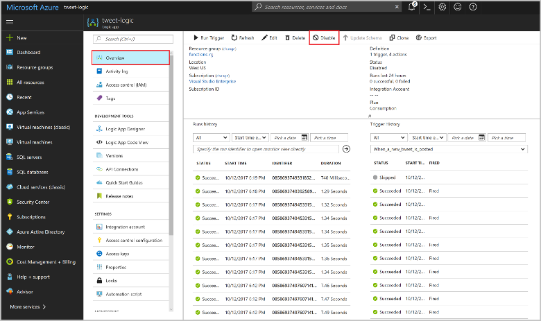

## Next steps

In this tutorial, you learned how to:

> [!div class="checklist"]
> * Create a Cognitive Services API Resource.
> * Create a function that categorizes tweet sentiment.
> * Create a logic app that connects to Twitter.
> * Add sentiment detection to the logic app. 
> * Connect the logic app to the function.
> * Send an email based on the response from the function.

Advance to the next tutorial to learn how to create a serverless API for your function.

> [!div class="nextstepaction"] 
> [Create a serverless API using Azure Functions](functions-create-serverless-api.md)

To learn more about Logic Apps, see [Azure Logic Apps](../logic-apps/logic-apps-overview.md).
