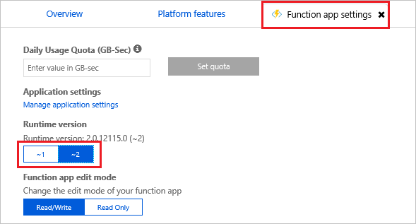

# How to target Azure Functions runtime versions

A function app runs on a specific version of the Azure Functions runtime. There are two major versions: [1.x and 2.x](functions-versions.md). By default, function apps that are created version 2.x of the runtime. This article explains how to configure a function app in Azure to run on the version you choose. For information about how to configure a local development environment for a specific version, see [Code and test Azure Functions locally](functions-run-local.md).

> [!NOTE]
> You can't change the runtime version for a function app that has one or more functions. You should use the Azure portal to change the runtime version.

## Automatic and manual version updates

Functions lets you target a specific version of the runtime by using the `FUNCTIONS_EXTENSION_VERSION` application setting in a function app. The function app is kept on the specified major version until you explicitly choose to move to a new version.

If you specify only the major version ("~2" for 2.x or "~1" for 1.x), the function app is automatically updated to new minor versions of the runtime when they become available. New minor versions do not introduce breaking changes. If you specify a minor version (for example, "2.0.12345"), the function app is kept on that version until you explicitly change it. 

When a new version is publicly available, a prompt in the portal gives you the chance to move up to that version. After moving to a new version, you can always use the `FUNCTIONS_EXTENSION_VERSION` application setting to move back to a previous version.

A change to the runtime version causes a function app to restart.

The values you can set in the `FUNCTIONS_EXTENSION_VERSION` app setting to enable automatic updates are currently "~1" for the 1.x runtime and "~2" for 2.x.

## View and update the current runtime version

Use the following procedure to view the runtime version currently used by a function app.

1. In the [Azure portal](https://portal.azure.com), browse to your function app.

1. Under **Configured Features** choose **Function app settings**.

    

1. In the **Function app settings** tab, locate the **Runtime version**. Note the specific runtime version and the requested major version. In the example below, the version is set to `~2`.

   

1. To pin your function app to the version 1.x runtime, choose **~1** under **Runtime version**. This switch is disabled when you have functions in your app.

1. If you changed the runtime version, go back to the **Overview** tab and choose **Restart** to restart the app.  The function app restarts running on the version 1.x runtime, and the version 1.x templates are used when you create functions.

## View and update the runtime version using Azure CLI

You can also view and set the `FUNCTIONS_EXTENSION_VERSION` from the Azure CLI.

>[!NOTE]
>Because other settings may be impacted by the runtime version, you should change the version in the portal. The portal automatically makes the other needed updates, such as Node.js version, when you change runtime versions.  

Using the Azure CLI, view the current runtime version with the [az functionapp config appsettings set](/cli/azure/functionapp/config/appsettings#set) command.

```azurecli-interactive
az functionapp config appsettings list --name <function_app> \
--resource-group <my_resource_group>
```

In this code, replace `<function_app>` with the name of your function app. Also replace `<my_resource_group>` with the name of the resource group for your function app. 

You see the `FUNCTIONS_EXTENSION_VERSION` in the following output, which has been truncated for clarity:

```output
[
  {
    "name": "FUNCTIONS_EXTENSION_VERSION",
    "slotSetting": false,
    "value": "~2"
  },
  {
    "name": "FUNCTIONS_WORKER_RUNTIME",
    "slotSetting": false,
    "value": "dotnet"
  },
  
  ...
  
  {
    "name": "WEBSITE_NODE_DEFAULT_VERSION",
    "slotSetting": false,
    "value": "8.11.1"
  }
]
```

You can update the `FUNCTIONS_EXTENSION_VERSION` setting in the function app with the [az functionapp config appsettings set](/cli/azure/functionapp/config/appsettings#set) command.

```azurecli-interactive
az functionapp config appsettings set --name <function_app> \
--resource-group <my_resource_group> \
--settings FUNCTIONS_EXTENSION_VERSION=<version>
```

Again, replace `<function_app>` with the name of your function app. Also replace `<my_resource_group>` with the name of the resource group for your function app. Also, replace `<version>` with a valid version of the 1.x runtime or `~2` for version 2.x.

You can run this command from the [Azure Cloud Shell](../cloud-shell/overview.md) by choosing **Try it** in the preceding code sample. You can also use the [Azure CLI locally](/cli/azure/install-azure-cli) to execute this command after executing [az login](/cli/azure/reference-index#az-login) to sign in.

## Next steps

> [!div class="nextstepaction"]
> [Target the 2.0 runtime in your local development environment](functions-run-local.md)

> [!div class="nextstepaction"]
> [See Release notes for runtime versions](https://github.com/Azure/azure-webjobs-sdk-script/releases)
