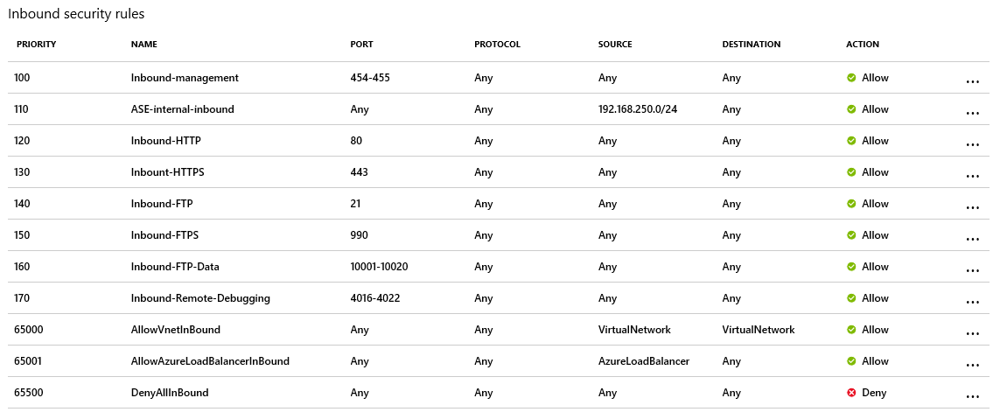
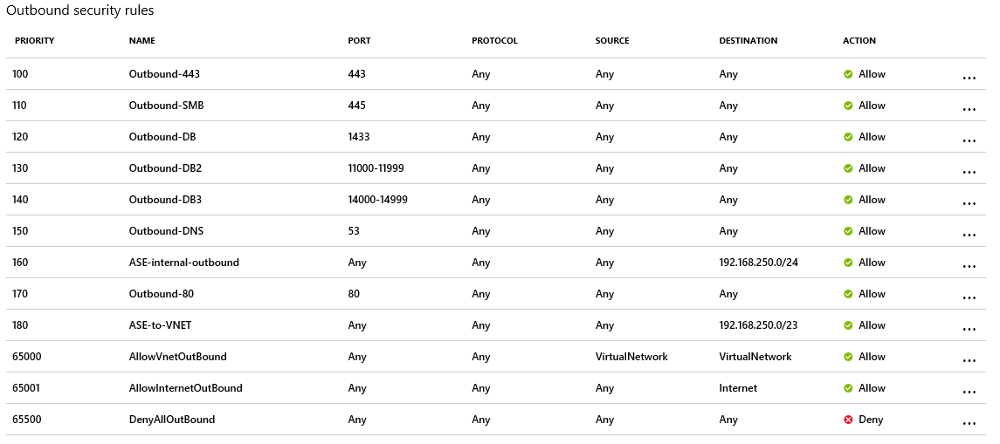

# App Service Environment Reference for DoD customers using a DISA CAP Connection

## Purpose

The purpose of this document is to document the correct configuration for an App Service Environment (ASE) configured with an internal load balancer (ILB) for customers who use the DISA CAP connection to Azure.

## Environment Configuration

### Assumptions

The customer has deployed an ASE with an ILB and has implemented an ExpressRoute connection via the DISA Cloud Access Point (CAP) process.

### Route Table

When the creating the ASE via the portal, a route table with a default route of 0.0.0.0/0 and next hop “Internet” is created.  However, the DISA BGP routes will advertise for 0.0.0.0/0 and this route table should be removed from the ASE subnet.

### NSG

The ASE will be created with inbound and outbound security rules as shown below.  The inbound security rules MUST allow ports 454-455 with an ephemeral source port range (*).  Source IPs must include the following Azure Government ranges see [App Service Environment management addresses](../app-service/environment/management-addresses
)

* 23.97.29.209
* 23.97.0.17
* 23.97.16.184
* 13.72.180.105
* 13.72.53.37

#### Default NSG security rules

The images below describe the default NSG rules created during the ASE creation.  For more information, see [Networking considerations for an App Service Environment](../app-service/environment/network-info#network-security-groups)

## FAQs

* Some configuration changes may take some time to take effect.  Allow for several hours for changes to routing, NSGs, ASE Health, etc. to propagate and take effect.

## Resource Manager Template Sample

This template deploys an **ILB ASE** into the Azure Government DoD regions.