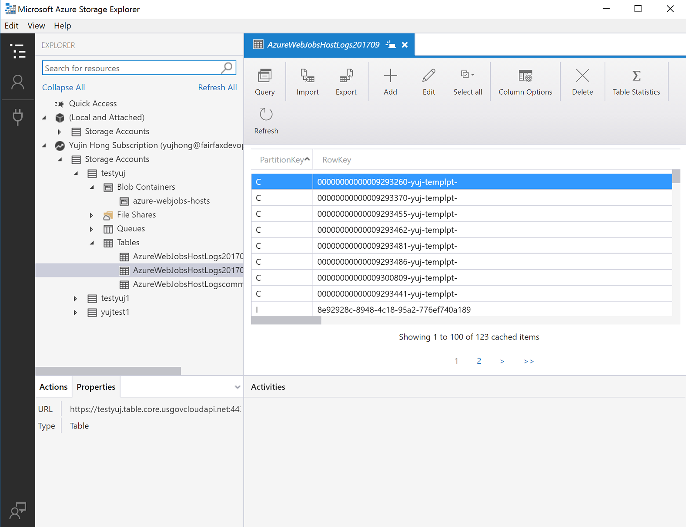
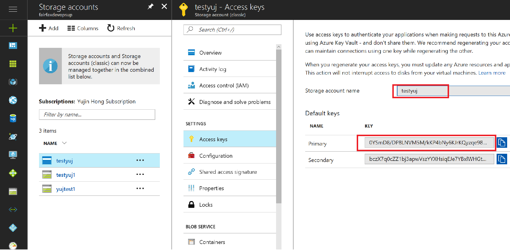

# Develop with Storage API on Azure Government

Azure Government uses the same underlying technologies as commercial Azure, enabling you to use the development tools you’re already familiar with.
To use these services in Azure Government, you must define different endpoint mappings, as shown below for the Storage service. 

If you don't have an Azure Government subscription, create a [free account](https://azure.microsoft.com/global-infrastructure/government/request/) before you begin.

## Prerequisites

* Review [Guidance for developers](documentation-government-developer-guide.md).<br/> This article discusses Azure Government's unique URLs and endpoints for managing your environment. You must know about these endpoints to connect to Azure Government. 
* Review [Compare Azure Government and global Azure](compare-azure-government-global-azure.md) and click on a service of interest to see variations between Azure Government and global Azure.
* Download and install the latest version of Azure Storage Explorer [here](https://azure.microsoft.com/features/storage-explorer/). 

## Connecting Storage Explorer to Azure Government
[The Microsoft Azure Storage Explorer](https://azure.microsoft.com/features/storage-explorer/) is a cross-platform tool for working with Azure Storage. Government customers can now take advantage of all the latest features of the Azure Storage Explorer such as creating and managing blobs, queues, tables, and file shares.

### Getting Started with Storage Explorer
1. Open the Azure Storage Explorer desktop application.

2. You'll be prompted to add an Azure account; in the dropdown choose the “Azure US Government” option:

    
3. Log in to your Azure Government account and you can see all of your resources. The Storage Explorer should look similar to the screenshot below. Click on your Storage Account to see the blob containers, file shares, Queues, and Tables. 

    

For more information on Azure Storage Explorer, click [here](https://docs.microsoft.com/azure/vs-azure-tools-storage-manage-with-storage-explorer?toc=%2fazure%2fstorage%2fblobs%2ftoc.json).

## Connecting to the Storage API 

### Prerequisites
* Have an active Azure Government subscription.
If you don't have an Azure Government subscription, create a [free account](https://azure.microsoft.com/overview/clouds/government/) before you begin.
* Download Visual Studio 2019

### Getting Started with Storage API
One important difference to note when connecting with the Storage API is that the URL for storage is different than the URL for storage in commercial Azure – specifically, the domain ends with “core.usgovcloudapi.net”, rather than “core.windows.net”.

These endpoint differences must be taken into account when you connect to storage in Azure Government with C#.
1. Go to the [Azure Government portal](https://portal.azure.us) and select your storage account and then click the “Access Keys” tab:

    
2. Copy/paste the storage account connection string.

#### C# 
1. Open up Visual Studio and create a new project. Add a reference to the [WindowsAzure.Storage NuGet package](https://www.nuget.org/packages/WindowsAzure.Storage/). This NuGet package contains classes we will need to connect to your storage account.

2. Add these two lines of C# code to connect:
	```cs
	var credentials = new StorageCredentials(storageAccountName, storageAccountKey);

    var storageAccount = new CloudStorageAccount(credentials, "core.usgovcloudapi.net", useHttps: true);   
    ```

    -   Notice on the second line we had to use a [particular constructor for the CloudStorageAccount](https://docs.microsoft.com/java/api/com.microsoft.azure.storage._cloud_storage_account.cloudstorageaccount) – enabling us to explicitly pass in the endpoint suffix of “core.usgovcloudapi.net”. This constructor is the **only difference** your code requires to connect to storage in Azure Government as compared with commercial Azure.

3. At this point, we can interact with storage as we normally would. For example, if we want to retrieve a specific record from our table storage we could do it like this:

   ```cs
    var tableClient = storageAccount.CreateCloudTableClient();

    var table = tableClient.GetTableReference("Contacts");
    var retrieveOperation = TableOperation.Retrieve<ContactEntity>("gov-partition1", "0fb52a6c-3784-4dc5-aa6d-ecda4426dbda");
    var result = await table.ExecuteAsync(retrieveOperation);
    var contact = result.Result as ContactEntity;
    Console.WriteLine($"Contact: {contact.FirstName} {contact.LastName}");
    ```

#### Java
1. Download the [Azure Storage SDK for Java](https://github.com/azure/azure-storage-java) and configure your project correctly.
2. Create a `CustomerEntity` class in your project and paste the code below:

    ```java
    import com.microsoft.azure.storage.table.TableServiceEntity;
    
    public class CustomerEntity extends TableServiceEntity {
            public CustomerEntity(String lastName, String firstName) {
                this.partitionKey = lastName;
                this.rowKey = firstName;
            }
    
            public CustomerEntity() { }
    
            String email;
            
            public String getEmail() {
                return this.email;
            }
    
            public void setEmail(String email) {
                this.email = email;
            }
    
    	}
    ``` 
3. Create a "test" class where we'll access Azure Table Storage using the Azure Storage API. 
 Copy and paste the code below, and **paste** your Storage Account connection string into the storageConnectionString variable. 

    ```java
    import com.microsoft.azure.storage.*;
    import com.microsoft.azure.storage.table.*;
	
    public class test {

	    public static final String storageConnectionString = //Paste in your Storage Account connection string

	    public static void main(String[] args) {

		try
		{
		    // Retrieve storage account from connection-string.
		    CloudStorageAccount storageAccount =
			CloudStorageAccount.parse(storageConnectionString);

		    // Create the table client.
		    CloudTableClient tableClient = storageAccount.createCloudTableClient();

		    // Create the table if it doesn't exist.
		    String tableName = "Contacts";
		    CloudTable cloudTable = tableClient.getTableReference(tableName);
		    cloudTable.createIfNotExists();
		    // Create a new customer entity.
		    CustomerEntity customer1 = new CustomerEntity("Brown", "Walter");
		    customer1.setEmail("Walter@contoso.com");

		    // Create an operation to add the new customer to the people table.
		    TableOperation insertCustomer1 = TableOperation.insertOrReplace(customer1);

		    // Submit the operation to the table service.
		    cloudTable.execute(insertCustomer1);
		}
		catch (Exception e)
		{
		    // Output the stack trace.
		    e.printStackTrace();
		}
	  }	
    }   
    ```

#### Node.js
1. Download the [Azure Storage SDK for Node.js](../storage/blobs/storage-quickstart-blobs-nodejs.md#configure-your-storage-connection-string) and configure your application correctly.
2. The following code below connects to Azure Blob Storage and creates a Container using the Azure Storage API. 
    **Paste** your Azure Storage account connection string into the storageConnectionString variable below. 

	```javascript
	var azure = require('azure-storage');
	var storageConnectionString = //Paste Azure Storage connection string here
	var blobSvc = azure.createBlobService(storageConnectionString);
	blobSvc.createContainerIfNotExists('testing', function(error, result, response){
	if(!error){
	// Container exists and is private
	}
	});
    ```

#### Python
1. Download the [Azure Storage SDK for Python](https://github.com/Azure/azure-storage-python).
2. When using the Storage SDK for Python to connect to Azure Government, you **must separately define an "endpoint_suffix" parameter**. 
    **Paste** in your Azure storage account name and key in the placeholders below.
    
	```python
	# Create the BlockBlockService that is used to call the Blob service for the storage account
	block_blob_service = BlockBlobService(account_name='#your account name', account_key='#your account key', endpoint_suffix="core.usgovcloudapi.net") 
	container_name ='ml-gov-demo'
	generator = block_blob_service.list_blobs(container_name)
	for blob in generator:
		print(blob.name)
    ```

#### PHP
1. Download the [Azure Storage SDK for PHP](../php-download-sdk.md).
2. The code below accesses Azure Table Storage using the Azure Storage API.
   In the `connectionString` variable, you'll notice that there's a `TableEndpoint` parameter. 
   Depending on which service you're using, you must define the parameter and set it to the endpoint for that service:
   
   - BlobEndpoint= //ends with 'blob.core.usgovcloudapi.net'
   - QueueEndpoint= //ends with 'queue.core.usgovcloudapi.net'
   - TableEndpoint= //ends with 'table.core.usgovcloudapi.net'
     >[!Note]
     > You can find these endpoints by navigating to your Storage Account from the [portal](https://portal.azure.us). 
     > **Paste** in your storage account name, key, and service endpoint in the `connectionString` variable. 
     >
	
     ```php
     <?php
     require_once "vendor/autoload.php";
     use WindowsAzure\Common\ServicesBuilder;
     use MicrosoftAzure\Storage\Common\ServiceException; 
     $connectionString = 'DefaultEndpointsProtocol=http;AccountName=<accountname>;AccountKey=<accountkey>;TableEndpoint=http://<storageaccountname>.table.core.usgovcloudapi.net/';

     $tableRestProxy = ServicesBuilder::getInstance()->createTableService($connectionString);
     try {
     // Create table.
     $tableRestProxy->createTable("test");
     }
     catch(ServiceException $e){
     $code = $e->getCode();
     $error_message = $e->getMessage();
     }
     ?>
     ```

## Get help and provide feedback

* Read more about [Azure Storage](https://docs.microsoft.com/azure/storage/). 
* Subscribe to the [Azure Government blog](https://blogs.msdn.microsoft.com/azuregov/)
* Get help on Stack Overflow by using the "[azure-gov](https://stackoverflow.com/questions/tagged/azure-gov)" tag
* Give us feedback or request new features via the [Azure Government feedback forum](https://feedback.azure.com/forums/558487-azure-government)
