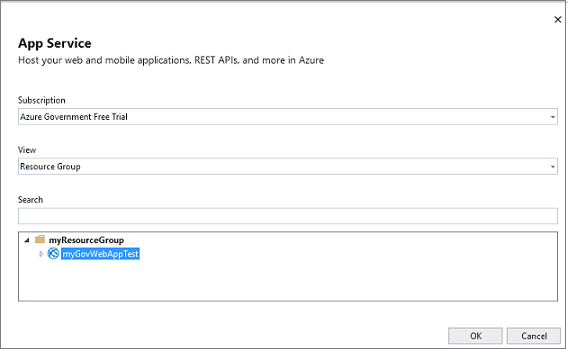

# Tutorial: Deploy an Azure App Services app

Microsoft Azure Government delivers a dedicated cloud with world-class security and compliance, enabling US government agencies and their partners to transform their workloads to the cloud. For example, your may want to provision and deploy a web app in the Azure Government cloud. To learn more about Azure App Service and see end-to-end scenarios, see [App Service - API Apps Documentation](../app-service/index.yml)

This article describes how to deploy an Azure App Services app to Azure Government using Visual Studio 2019.

In this tutorial, you learn how to:

> [!div class="checklist"]
> * Connect to Azure Government
> * Provision a Web App in portal
> * Deploy using Visual Studio

If you don't have an Azure Government subscription, create a [free account](https://azure.microsoft.com/global-infrastructure/government/request/) before you begin.

## Prerequisites

* Review [Guidance for developers](documentation-government-developer-guide.md).  This article discusses Azure Government's unique URLs and endpoints for managing your environment. You must know about these endpoints in order to connect to Azure Government. 
* Review [Compare Azure Government and global Azure](compare-azure-government-global-azure.md) and click on a service of interest to see variations between Azure Government and global Azure.
* Install <a href="https://www.visualstudio.com/downloads/" target="_blank">Visual Studio 2019</a> with the **ASP.NET and web development** workload.

    If you've installed Visual Studio already, add the workload in Visual Studio by clicking **Tools** > **Get Tools and Features**.

* Follow [these instructions](documentation-government-get-started-connect-with-vs.md) to configure Visual Studio to connect to Azure Government account.

## Sign in to Azure Government 

To connect, browse to the portal at [https://portal.azure.us](https://portal.azure.us) and sign in with your Azure Government credentials. 

Once you sign in, you should see "Microsoft Azure Government" in the upper left of the main navigation bar.

## Provision a Web App 

In the Azure Government portal, click the **Create a resource** button on the top left-hand corner and choose to create **Web App**:

In the **Web App** dialog, specify *myGovWebAppTest* for the app name and *myResourceGroup* as a resource group name.

When creating the Web App, you must also have an App Service Plan. When creating a new App Service Plan, you should be able to see the different Azure Government regions in the **App Service Environment** box. If your subscription has not been approved for DoD regions, you will not see all of the DoD regions.

Once the app has been successfully created go into the **App Services** section and you will be able to see your new web app.
Click on your web app and you should see that the url ends in **azurewebsites.us**, and the location should also be an Azure Government region.

When you click on your app url, a blue page appears in the browser. 

## Deploy a Web App to Azure Government using VS

In Visual Studio, make sure the **Azure Government** environment is selected. To check, select **Tools** -> **Azure Environment Selector**. The selector should show **Azure Government**.

### Publish from Visual Studio

In Visual Studio, click **File** -> **New** -> **Project**. Select **ASP.NET Core Web Application** as the project type and give the application a name.

Once it is created, right-click on your web app in the **Solution Explorer** and click **Publish**.

Select **Select Existing** because we want to use the existing Web App that we have created in the preceding section.

Press **Publish**. In the **App Service** dialog, if not signed in yet, sign-in to your Azure Government account. Then, select the app you created in the preceding section.

It could take a minute or so to publish your web app. Once it has been published to Azure Government, you the browser will appear with a screen of the app at URL ending in **azurewebsites.us**. 

We just published our app to the existing Azure Web App that we previously created. 

## Clean up resources

In the preceding steps, you created Azure resources in a resource group. If you don't expect to need these resources in the future, you can delete them by deleting the resource group.

From the left menu in the Azure Government portal, select Resource groups and then select **myResourceGroup**.

On the resource group page, make sure that the listed resources are the ones you want to delete.

Select **Delete**, type **myResourceGroup** in the text box, and then select **Delete**.

## Next steps

This tutorial showed you how to deploy an Azure App Services app to Azure Government. To see the latest information and insights on building cloud solution for the Azure Government Cloud, check out Azure Government blog.

> [!div class="nextstepaction"]
> [Microsoft Azure Government Blog](https://blogs.msdn.microsoft.com/azuregov/).

