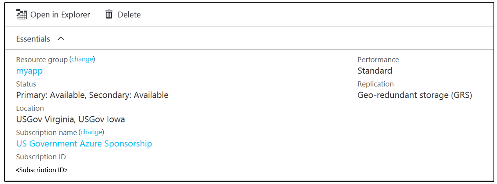

# Azure Government Storage
## Azure Storage
For details on this service and how to use it, see [Azure Storage public documentation](../storage/index.md).

### Storage pairing in Azure Government
The map below shows the primary and secondary region pairings used for Geo-redundant storage (GRS) and Read-access geo-redundant storage (RA-GRS) accounts in Azure Government

> [!NOTE]
> US Gov Virginia secondary region is US Gov Texas. Previously, US Gov Virginia utilized US Gov Iowa as a secondary region. Storage accounts still leveraging US Gov Iowa as a secondary region are being migrated to US Gov Texas as a seconday region.
>
>

### Checking secondary region for RA-GRS and GRS storage accounts
To view the current secondary region of your storage account through the Azure Portal, click the storage account blade then click on the name of the storage account. This will bring up the storage account overview blade which lists the primary and secondary regions.

### Storage service availability by Azure Government region

| Service | USGov Virginia | USGov Iowa | Notes
| --- | --- | --- | --- |
| [Blob Storage] (../storage/storage-introduction.md#blob-storage) |GA |GA |
| [Table Storage] (../storage/storage-introduction.md#table-storage) |GA  |GA |
| [Queue Storage] (../storage/storage-introduction.md#queue-storage) |GA | GA |
| [File Storage] (../storage/storage-introduction.md#file-storage) |GA |GA |
| [Hot/Cool Blob Storage] (../storage/storage-blob-storage-tiers.md) |NA |NA |
| [Storage Service Encryption] (../storage/storage-service-encryption.md) |GA |GA |
| [Premium Storage] (../storage/storage-premium-storage.md) |GA |NA | Includes DS-series Virtual Machines. |
| [Blob Import/Export] (../storage/storage-import-export-service.md) |GA |GA |
| [StorSimple] (../storsimple/storsimple-ova-overview.md) |GA |GA |

> [!NOTE]
> Zone Redundant Storage (ZRS) is not available in US Gov Virginia and US Gov Iowa.
>
>

### Variations
The URLs for storage accounts in Azure Government are different:

| Service Type | Azure Public | Azure Government |
| --- | --- | --- |
| Blob Storage |*.blob.core.windows.net |*.blob.core.usgovcloudapi.net |
| Queue Storage |*.queue.core.windows.net |*.queue.core.usgovcloudapi.net |
| Table Storage |*.table.core.windows.net |*.table.core.usgovcloudapi.net |
| File Storage |*.file.core.windows.net |*.file.core.usgovcloudapi.net | 

> [!NOTE]
> All your scripts and code needs to account for the appropriate endpoints.  See [Configure Azure Storage Connection Strings](../storage/storage-configure-connection-string.md). 
>
>

For more information on APIs, see the <a href="https://msdn.microsoft.com/library/azure/mt616540.aspx"> Cloud Storage Account Constructor</a>.

The endpoint suffix to use in these overloads is core.usgovcloudapi.net

> [!NOTE]
> If error 53 "The network path was not found." is returned, while [mounting the file share] (../storage/storage-dotnet-how-to-use-files.md). It could be due to firewall blocking the outbound port. Try mounting the file share on VM that's in the same Azure Subscription as storage account.
>
>

> [!NOTE]
> When deploying StorSimple Manager Service, use https://portal.azure.us/ and https://manage.windowsazure.us/ URLs for Azure portal and Classic portal respectively. For deployment instructions for StorSimple Virtual Array, see [StorSimple Virtual Array system requirements] (../storsimple/storsimple-ova-system-requirements.md) and for StorSimple 8000 series, see [StorSimple software, high availability, and networking requirements] (../storsimple/storsimple-system-requirements.md) and go to Deploy section from left navigation. For more information on StorSimple, please see the [StorSimple Documentation] (../storsimple/index.md).
>
>

### Considerations
The following information identifies the Azure Government boundary for Azure Storage:

| Regulated/controlled data permitted | Regulated/controlled data not permitted |
| --- | --- |
| Data entered, stored, and processed within an Azure Storage product can contain export controlled data. Static authenticators, such as passwords and smartcard PINs for access to Azure platform components. Private keys of certificates used to manage Azure platform components. Other security information/secrets, such as certificates, encryption keys, master keys, and storage keys stored in Azure services. |Azure Storage metadata is not permitted to contain export controlled data. This metadata includes all configuration data entered when creating and maintaining your storage product.  Do not enter Regulated/controlled data into the following fields:  Resource groups, Deployment names, Resource names, Resource tags |

## Azure Import/Export

Import/Export is Generally available for Azure Goverenment.

### Variation

Texas/Arizona storage accounts will have drives mailed to Virignia.

### Consideration

Shipping information and other files will leave the boundary.

For DoD L5 data they must use the a DoD region storage acocunt to ensure it is 

## Next Steps
For supplemental information and updates subscribe to the
<a href="https://blogs.msdn.microsoft.com/azuregov/">Microsoft Azure Government Blog. </a>
