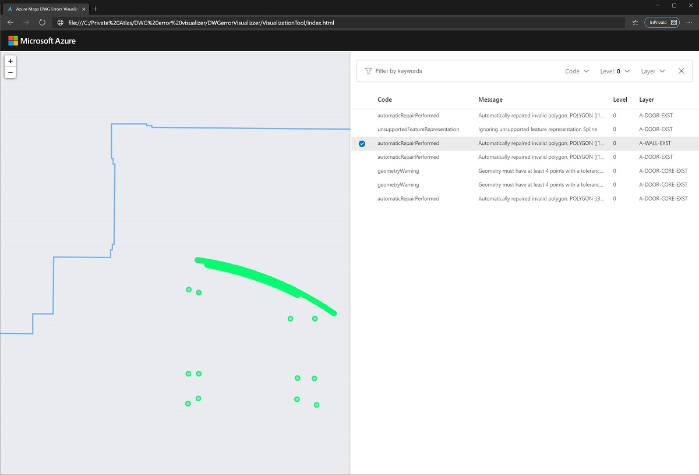

# Using the Azure Maps Drawing Error Visualizer

The [Azure Maps Conversion service](https://docs.microsoft.com/rest/api/maps/data/conversion) lets you download a stand-alone web application to visualize [Drawing package warnings and errors](drawing-conversion-error-codes.md). The web application has a static page that you can use without connecting to an internet network. It is a convenient visual tool to inspect warnings and errors in your Drawing package that are detected by the Conversion service.  The goal is to fix them to meet the [Drawing package requirements](drawing-requirements.md) in order to successfully convert your package into map data. For more information on the Drawing conversion process see the [Creator for indoor maps concept article](creator-for-indoor-maps.md).

## Prerequisites

Before you can download the Drawing Error Visualizer, you will need to:

1. [Obtain a primary subscription key](quick-demo-map-app.md#get-the-primary-key-for-your-account) by [making an Azure Maps account](quick-demo-map-app.md#create-an-account-with-azure-maps)

2. [Enable the Creator resource](tutorial-creator-indoor-maps.md) in your Azure Maps account

3. Upload your Drawing package to the Azure Maps service, and obtain a `udid` for the uploaded package. For more details on uploading a Drawing package, see [Uploading a Drawing package](creator-for-indoor-maps.md#upload-a-drawing-package).

## Download

Now that you have the `udid` for the uploaded package, make a request to the Azure Maps Conversion service.

Under the response **Headers** tab, look for the `diagnosticPackageLocation` property, returned by [Azure Maps Conversion service](https://docs.microsoft.com/rest/api/maps/data/conversion). The Drawing Error Visualizer can be downloaded by executing a `HTTP-GET` request on the `diagnosticPackageLocation`. For more details on how to to download, see the [Azure Maps Conversion service](https://docs.microsoft.com/rest/api/maps/data/conversion).

## Setup

Inside the downloaded zipped package from the `diagnosticPackageLocation` link, you'll find two files. The _ConversionWarningsAndErrors.json_ containing a formatted list of warnings, errors, and additional details that is used by the _VisualizationTool.zip_. The _VisualizationTool.zip_ is the standalone web application for Drawing Error Visualizer.

Unzip the _VisualizationTool.zip_ folder. It contains an _assets_ folder with images and media files, a _static_ folder with source code, and an index.html file of the web page.

Open the _index.html_ file using any of the browsers below, with the respective version number. You may use a different version, if the version offers equally compatible behavior as the listed version.

- Microsoft Edge 80
- Safari 13
- Chrome 80
- Firefox 74

## Using the Drawing Error Visualizer tool

After launching the Drawing Error Visualizer tool, you will be presented with the upload page. The upload page contains a drag & drop box. The drag & drop box also functions as button that launches a File Explorer dialog.

The  _ConversionWarningsAndErrors.json_ file has been placed at the root of the downloaded directory. To load the _ConversionWarningsAndErrors.json_ you can either drag & drop the file onto the box or click on the box, find the file in the File Explorer dialogue, and then upload the file.

Once the _ConversionWarningsAndErrors.json_ file loads, you'll see a list of your Drawing package errors and warnings. Each error or warning is specified by the layer, level, and a detailed message. You may now navigate to each error to learn more details in order to resolve the error.  

## Next steps

Once your [Drawing package meets the requirements](drawing-requirements.md), you may use the [Azure Maps Conversion service](https://docs.microsoft.com/rest/api/maps/data/conversion) to convert the Drawing package to a map data set. Then, you can use the Indoor Maps web module to develop your application. Learn more  by reading the following articles:

> [!div class="nextstepaction"]
> [Drawing Conversion error codes](drawing-conversion-error-codes.md)

> [!div class="nextstepaction"]
> [Creator for indoor maps](creator-for-indoor-maps.md)

> [!div class="nextstepaction"]
> [Use the Indoor Maps module](how-to-use-indoor-module.md)

> [!div class="nextstepaction"]
> [Implement indoor map dynamic styling](indoor-map-dynamic-styling.md)