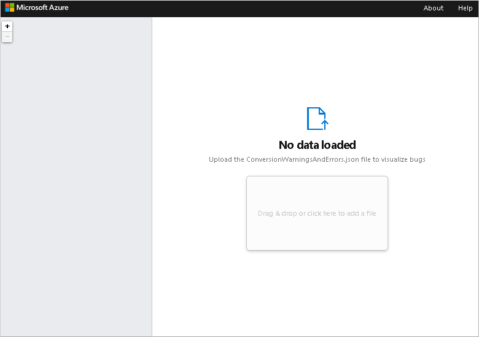
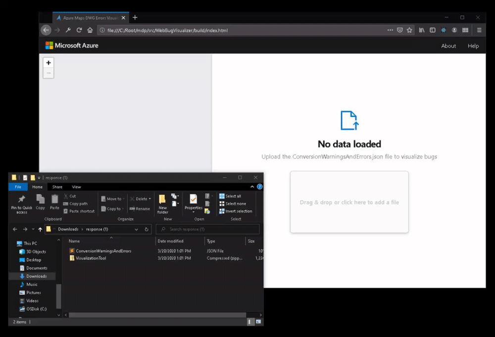

# Use Azure Maps DWG Error Visualizer

Azure Maps Conversion API lets you download a stand-alone web application to visualize [DWG package warnings and errors](dwg-conversion-error-codes.md). The web application has a static page that you can use without connecting to an internet network. It is a convenient visual tool to inspect warnings and errors in your DWG package that are detected by the Conversion API.  In order to successfully convert your DWG package into map data, it must meet the [DWG package requirements](dwg-requirements.md).

## Prerequisites

Before you can download the DWG Error Visualizer, you need to:

1. [Obtain a primary subscription key](quick-demo-map-app.md#get-the-primary-key-for-your-account) by [making an Azure Maps account](quick-demo-map-app.md#create-an-account-with-azure-maps)

2. [Enable the Private Atlas resource](tutorial-private-atlas-indoor-maps.md) in your Azure Maps account

3. Upload your DWG package to the Azure Maps service, and obtain a `udid` for the uploaded package. This procedure is detailed in the [Data Upload section of the Private Atlas tutorial](tutorial-private-atlas-indoor-maps.md#upload-a-dwg-package) article.

## Download

Now that you have the `udid` for the uploaded package, make a request to the Azure Maps Conversion API. The procedure is detailed in the [Data Conversion section of the Private Atlas tutorial](tutorial-private-atlas-indoor-maps.md#convert-a-dwg-package) article.

Under the response **Headers** tab, look for the `diagnosticPackageLocation` property, returned by Azure Maps Conversion API. The DWG Error Visualizer can be downloaded by executing a `HTTP-GET` request on the `diagnosticPackageLocation`. See Azure Maps Conversion API for more details on how to to download.

## Setup

Inside the downloaded zipped package from the `diagnosticPackageLocation` link, you'll find two files. The _ConversionWarningsAndErrors.json_ containing a formatted list of warnings, errors, and additional details that is used by the _VisualizationTool.zip_. The _VisualizationTool.zip_ is the standalone web application for DWG Error Visualizer.

    

Unzip the _VisualizationTool.zip_ folder. It contains an _assets_ folder with images and media files, a _static_ folder with source code, and an index.html file of the web page.

    

Open the _index.html_ file using any of the browsers below, with the respective version number. You may use a different version, if the version offers equally compatible behavior as the listed version.

- Microsoft Edge 80
- Safari 13
- Chrome 80
- Firefox 74

## Use the Visualization tool

Upon launching the Visualization tool, you'll see a box to load your data, as shown in the image below. To view the warnings and errors, load the _ConversionWarningsAndErrors.json_ file, placed at the root of the downloaded directory. 

    

You may load it by dragging and dropping it into the specified box. Or by clicking on the box, navigating your file system, and selecting it. 

Once the file loads, you will see a list of your DWG package errors and warnings. Each error and warning includes the layer, the level, and message. To see a more detailed message, you can navigate to a more detailed message.

*DWG Error Visualizer App - Error and warning navigation controls*

## Next steps

Once your [DWG package meets the requirements](dwg-requirements.md), you may use the Azure Maps Conversion API to convert the DWG file to a map data set. Then, you can use the Indoor Maps web module to develop your application. Learn more  by reading the following articles:

> [!div class="nextstepaction"]
> [DWG Conversion error codes](dwg-conversion-error-codes.md)

> [!div class="nextstepaction"]
> [Indoor Maps data management]()

> [!div class="nextstepaction"]
> [Use the Indoor Maps module](how-to-use-indoor-module.md)

> [!div class="nextstepaction"]
> [Implement indoor map dynamic styling](indoor-map-dynamic-styling.md)