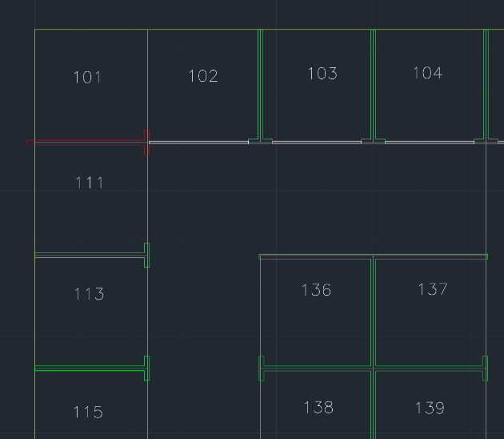
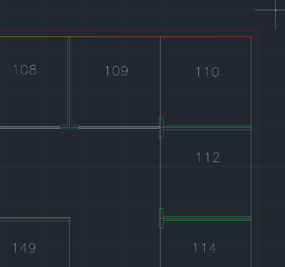
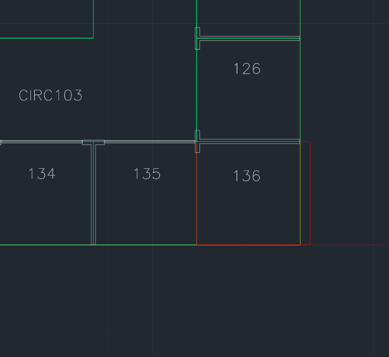
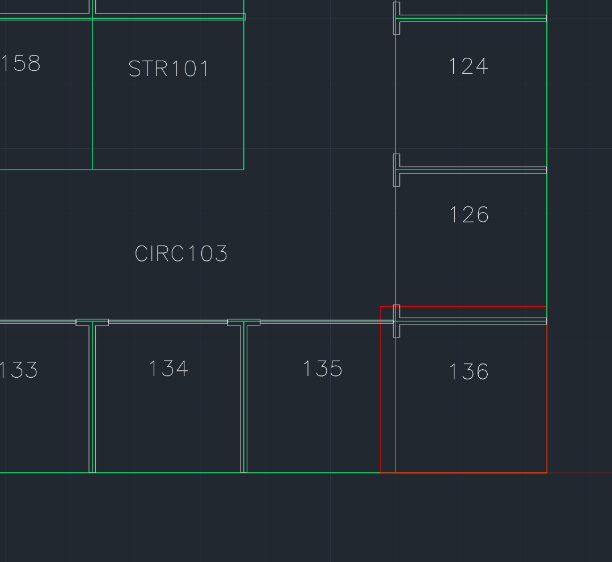

# DWG conversion errors and warnings

The Azure Maps Conversion service lets you convert uploaded DWG designs into map data. However, the DWG files and the manifest describing the DWG files must adhere to the [DWG package requirements](dwg-requirements.md). If a requirement or more aren't met, then the Conversion service will return errors or warnings. This article lists DWG conversion error and warning codes, with recommendations on how to resolve them. We'll also describe some examples that cause the Conversion service to return these codes.

## Codes overview

The table contains the possible error codes you may come across. Click on an error category or a specific error to see more details. The Conversion service won't let you convert your designs into map data, unless you resolve all the errors.

| Error | Location |
|:----------|:----------|
| [invalidArchiveFormat](#invalidarchiveformat) | [Package](#package-errors) |
| [invalidUserData](#invaliduserdata) | [Package](#package-errors) |
| [dwgError](#dwgerror) | [Package](#package-errors) |
| [invalidJsonFormat](#invalidjsonformat) | [Manifest](#manifest-errors) |
| [missingRequiredField](#missingrequiredfield) | [Manifest](#manifest-errors) |
| [missingManifest](#missingmanifest) | [Manifest](#manifest-errors) |
| [conflict](#conflict) | [Manifest](#manifest-errors) |
| [invalidGeoreference](#invalidgeoreference) | [Manifest](#manifest-errors) |
| [wallError](#wallError) | [wall](#wall-errors) |
| [verticalPenetrationError](#verticalpenetrationerror) | [Vertical Penetration](#vertical-penetration-errors) |

The table lists the possible warning codes you may meet. Click on a warning category or a specific warning to see more details. The Conversion service will let you convert your designs into map data with warnings, but it's recommended you resolve all warnings. Failing to resolve the warnings could mean your map won't render as expected.

| Warning | Location |
|:-------|:----------|
| [geometryWarning](#geometrywarning) | [General](#general-warnings) |
| [unexpectedGeometryInLayer](#unexpectedgeometryinlayer) | [General](#general-warnings) |
| [unsupportedFeatureRepresentation](#unsupportedfeaturerepresentation) | [General](#general-warnings) |
| [automaticRepairPerformed](#automaticrepairperformed) | [General](#general-warnings) |
| [wallOutsideLevel](#walloutsidelevel ) | [Level](#level-warnings) |
| [unitOutsideLevel](#unitoutsidelevel) | [Unit](#unit-warnings) |
| [partiallyOverlappingUnit](#partiallyoverlappingunit) | [Unit](#unit-warnings) |
| [doorOutsideLevel](#doorOutsideLevel) | [Door](#door-warnings) |
| [zoneWarning](#zoneWarning ) | [Zone](#zone-warnings) |

## General warnings

### geometryWarning

Failed to build a feature from a DWG entity because a geometric constraint isn't met. For example, a self-intersecting polygon or other invalid topologies is used.

Manually inspect the `geometryWarning` warning for each geometry to ensure the geometry is the correct type. Check for topological errors; such as, PolyLine features not meeting perfectly at a point. Other mistakes include: unclosed polygons, gaps between polygon borders, or overlapping polygon border.

### unexpectedGeometryInLayer

The Conversion service came across a geometry of an unexpected type, and the service ignored it. For example:

* Non-closed PolyLine is found in the level outline layer, unit layer, zone layer, or wall layer
* Non-text entity is found in the zoneLabel layer or the unitLabel layer

Inspect each error and remove the incompatible geometry. Otherwise, move the incompatible geometry to a layer in which it's compatible.

### unsupportedFeatureRepresentation

The Conversion service came across a DWG entity of an unsupported type. For example:

* A multi-line text object in a label layer
* A 3D Face in the unit layer
* An old-style Polyline2D entity that hasn't been converted to a regular Polyline

Only use the supported entity types listed under the [DWG files requirements section in the DWG package requirements article](dwg-requirements.md#dwg-files-requirements).

### automaticRepairPerformed

Geometry, which would have otherwise caused an error, was automatically modified to resolve the potential error. The following are cases that raise an `automaticRepairPerformed` warning:

* A self-intersecting polygon was repaired
* A non-closed PolyLine with first and last vertices closer than 1 mm were snapped to make a closed PolyLine
* In a layer that only supports closed PolyLines, multiple non-closed PolyLines were combined to create a single closed Polyline. This fix was done to avoid discarding the PolyLines.

To resolve an `automaticRepairPerformed` warning:

1. Inspect each warning's geometry and the specific warning text
2. Determine if the automated repair is correct
3. If the repair is correct, continue. Otherwise, go to the design file and resolve the warning manually

To suppress a warning in the future, make changes to the original drawing such that the original drawing matches the repaired drawing.

## Package errors

### invalidArchiveFormat

Invalid archive format detected. Archive isn't a valid ZIP file. For example:

* When the user called the Data upload service, the data wasn't inside a zip file or the data wasn't inside a supported zip format. GZip and 7Zip aren't supported file formats.

To resolve this error:

1. Make sure your archive file name ends in .zip
2. Make sure you can open your zip file'

### invalidUserData

Unable to read user data object from storage. For example:

* User provided an incorrect `udid` parameter

Make sure you provide a correct `udid` for the uploaded package. The Private Atlas subscription that you use to make the conversion request must match with the subscription you used to upload your package.

### dwgError

Error when reading one or more DWG files from the archive. For example, the DWG file is:

* Not a valid AutoCAD drawing
* Corrupt
* Listed in the manifest, but it's missing from the archive

Check your manifest.json file, and make sure to only list the DWG files in your folder. Repair your corrupt DWG file or discard it.

There are many reasons why a file may not be a valid AutoCAD drawing. And although a file could have the .dwg extension, the content of the file may not be a valid AutoCAD drawing. Check that your file content is valid.

## Manifest errors

### invalidJsonFormat

The JSON file can't be read. For example:

* Manifest.json doesn't contain any JSON text
* Manifest.json contains non-JSON text
* Manifest.json has JSON syntax errors

Use a JSON linter to detect any JSON errors and resolve them.

### missingRequiredField

Manifest is missing a required data. For example:

* Manifest is missing a "version" object
* Manifest is missing a "dwgLayers" object

Verify that the manifest contains all required properties. For a full list of required manifest object, see the [manifest section in the DWG package requirements](dwg-requirements.md#manifest-file-requirements)  

### missingManifest

Manifest is missing from archive. It could be because manifest.json is:

* Misspelled
* Missing
* Not inside the root directory of the archive

Ensure the archive has a file named _manifest.json_ at the root level.

### conflict

Manifest contains conflicting information. For example, it could be that more than one level is defined with the same level ordinal.

Read through your _manifest.json_ and remove conflicts.

### invalidGeoreference

Manifest georeference is invalid. For example, the user could be georeferencing:

* Out of range latitude or longitude value
* Out of range rotation value

Check your georefereced values.

For GeoJSON, the coordinates order is longitude and latitude. If you don't use the correct order, you may accidentally refer to an out of range latitude or longitude value.

## Manifest warnings

### redundantAttribution

More than one definition was found for a given zone or unit. For example, the manifest contains: 

* Two `unitProperties` objects with the same `name`
* Two `zoneProperties` objects with the same `name`

Remove redundant or conflicting object properties.

## Level warnings

### wallOutsideLevel

Wall geometry occurs outside the bounds of the level outline. 

The following two images show the error in red. The interior wall is outside the level boundary in the first image. In the second image, the exterior wall is outside the level boundary.

    

    

To fix `wallOutsideLevel` warnings, expand the level geometry to include all walls. Or, modify walls to fit inside level.

## Unit warnings

### unitOutsideLevel

Unit geometry occurs outside the bounds of the level outline. The image below shows one example. The red segments of the unit are outside the level yellow boundary.

    

Expand level geometry to include all units or modify unit to fit inside level.

### partiallyOverlappingUnit

The Conversion service came across a unit that's partially overlapping on another unit. Below is an example image, the overlaps are highlighted in red. UNIT 136 overlaps CIRC103, UNIT 126, and UNIT 135.

    

The Conversion service doesn't support partially overlapping units. Redraw each partially overlapping unit, so that it doesn't overlap any other units.

## Wall errors

### wallError

Error creating a wall feature. For example, this error occurs when a wall feature doesn't overlap any units.

Redraw the wall so that it overlaps at least one unit. Otherwise, create a new unit that overlaps the wall.

## Door warnings

### doorOutsideLevel

Door geometry occurs completely outside the bounds of the level geometry. Resolve this warning by placing your door inside the level geometry.

## Zone warnings

### zoneWarning

Error creating a zone feature. For example, this warning is raised when a zone contains multiple zone labels or no zone labels.

Make sure each zone has one and only one label.

## Vertical Penetration errors

### verticalPenetrationError

Error creating a vertical penetration feature. For example:

* A vertical penetration area with no overlapping vertical penetration areas on any levels above or below it
* There exists a level with two or more vertical penetration features on it that overlap this one

Read about how to use a vertical penetration feature in the [DWG package requirements](dwg-requirements.md) article.

## Next steps

After you resolve your DWG conversion errors, try to resolve your warnings.

Once you successfully convert your uploaded DWG design into map data, you can use your converted data to render indoor maps. Learn more by reading the following articles:

> [!div class="nextstepaction"]
> [Private Atlas tutorial](tutorial-private-atlas-indoor-maps.md)

> [!div class="nextstepaction"]
> [Indoor Maps dynamic styling](indoor-map-dynamic-styling.md)

> [!div class="nextstepaction"]
> [Indoor Maps module](how-to-use-indoor-module.md)