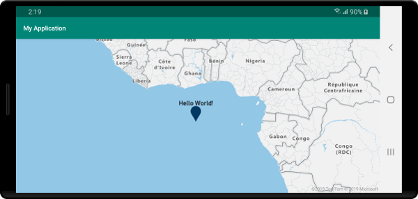

# Add a symbol layer to a map using Azure Maps Android SDK

This article shows you how to render point data from a data source as a symbol layer on a map using the Azure Maps Android SDK.

## Prerequisites

To completely follow steps in this article, you need to install [Azure Maps Android SDK](https://docs.microsoft.com/azure/azure-maps/how-to-use-android-map-control-library) to load a map.

## Add a symbol layer

To add a marker on the map using the symbol layer, follow the steps below:

1. Edit **res** > **layout** > **activity_main.xml** so it looks like the following XML:
    
    ```XML
    <?xml version="1.0" encoding="utf-8"?>
    <FrameLayout
        xmlns:android="http://schemas.android.com/apk/res/android"
        xmlns:app="http://schemas.android.com/apk/res-auto"
        android:layout_width="match_parent"
        android:layout_height="match_parent"
        >

        <com.microsoft.azure.maps.mapcontrol.MapControl
            android:id="@+id/mapcontrol"
            android:layout_width="match_parent"
            android:layout_height="match_parent"
            app:mapcontrol_centerLat="47.64"
            app:mapcontrol_centerLng="-122.33"
            app:mapcontrol_zoom="12"
            />

    </FrameLayout>
    ```

2. Copy the following code snippet into the **onCreate()** method of your `MainActivity.java` class.

    ```Java
    mapControl.onReady(map -> {
    
        //Create a data source and add it to the map.
        DataSource dataSource = new DataSource();
        map.sources.add(dataSource);
    
        //Create a point feature and add it to the data source.
        dataSource.add(Feature.fromGeometry(Point.fromLngLat(-122.33, 47.64)));
    
        //Add a custom image icon to the map resources.
        map.images.add("my-icon", R.drawable.mapcontrol_marker_red);
    
        //Create a symbol layer and add it to the map.
        map.layers.add(new SymbolLayer(dataSource,
            iconImage("my-icon")));
        });
    
    ```
    
    The code snippet above first obtains an Azure Maps map control instance using the **onReady()** callback method. It then creates a data source object using the **DataSource** class and adds it to the map. It then adds a **Feature** containing a Point geometry to it. A red marker image is then set as icon for the symbol. A **symbol layer** uses text or icons to render point-based data wrapped in the data source as symbol on the map. A symbol layer is then created and the data source is passed to it to render, and is then added to the map's layers.
    
    After adding the code snippet above, your `MainActivity.java` should look like the one below:
    
    ```Java
    package com.example.myapplication;
    
    import android.app.Activity;
    import android.os.Bundle;
    import com.mapbox.geojson.Feature;
    import com.mapbox.geojson.Point;
    import com.microsoft.azure.maps.mapcontrol.AzureMaps;
    import com.microsoft.azure.maps.mapcontrol.MapControl;
    import com.microsoft.azure.maps.mapcontrol.layer.SymbolLayer;
    import com.microsoft.azure.maps.mapcontrol.source.DataSource;
    import static com.microsoft.azure.maps.mapcontrol.options.SymbolLayerOptions.iconImage;
    public class MainActivity extends AppCompatActivity {
        
        static{
                AzureMaps.setSubscriptionKey("<Your Azure Maps subscription key>");
            }
    
        MapControl mapControl;
        @Override
        protected void onCreate(Bundle savedInstanceState) {
            super.onCreate(savedInstanceState);
            setContentView(R.layout.activity_main);
    
            mapControl = findViewById(R.id.mapcontrol);
    
            mapControl.onCreate(savedInstanceState);
    
            mapControl.onReady(map -> {
    
                //Create a data source and add it to the map.
                DataSource dataSource = new DataSource();
                map.sources.add(dataSource);
            
                //Create a point feature and add it to the data source.
                dataSource.add(Feature.fromGeometry(Point.fromLngLat(-122.33, 47.64)));
            
                //Add a custom image icon to the map resources.
                map.images.add("my-icon", R.drawable.mapcontrol_marker_red);
            
                //Create a symbol layer and add it to the map.
                map.layers.add(new SymbolLayer(dataSource,
                    iconImage("my-icon")));
            });
        }
    
        @Override
        public void onStart() {
            super.onStart();
            mapControl.onStart();
        }
    
        @Override
        public void onResume() {
            super.onResume();
            mapControl.onResume();
        }
    
        @Override
        public void onPause() {
            super.onPause();
            mapControl.onPause();
        }
    
        @Override
        public void onStop() {
            super.onStop();
            mapControl.onStop();
        }
    
        @Override
        public void onLowMemory() {
            super.onLowMemory();
            mapControl.onLowMemory();
        }
    
        @Override
        protected void onDestroy() {
            super.onDestroy();
            mapControl.onDestroy();
        }
    
        @Override
        protected void onSaveInstanceState(Bundle outState) {
            super.onSaveInstanceState(outState);
            mapControl.onSaveInstanceState(outState);
        }
    }
    ```
    
At this point, if you run your application you should see a marker on the map, as shown here:

<center>

</center>


## Next steps

To add more stuff to your map, see:

> [!div class="nextstepaction"]
> [Add shapes to an Android map](https://docs.microsoft.com/azure/azure-maps/how-to-add-shapes-to-android-map)

> [!div class="nextstepaction"]
> [Display feature information](display-feature-information-android.md)