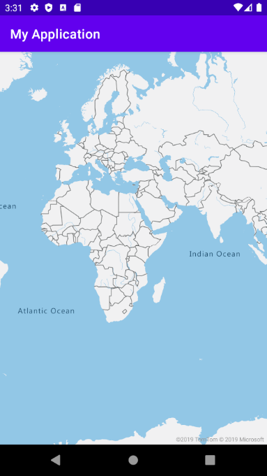

# How to use the Azure Maps Android SDK

The Azure Maps Android SDK is a vector map library for Android. This article guides you through the processes of installing the Azure Maps Android SDK and loading a map.

## Prerequisites

### Create an Azure Maps account

To complete the procedures in this article, you first need to [create an Azure Maps account](how-to-manage-account-keys.md) with S1 pricing tier.

### Download Android Studio

You need to download Android Studio and create a project with an empty activity before you can install the Azure Maps Android SDK. You can [download Android Studio](https://developer.android.com/studio/) from Google for free. 

## Create a project in Android Studio

First, you need to create a new project with an empty activity. Complete these steps to create an Android Studio project:

1. Under **Choose your project**, select **Phone and Tablet**. Your application will run on this form factor.
2. On the **Phone and Tablet** tab, select **Empty  Activity**, and then select **Next**.
3. Under **Configure your project**, select `API 21: Android 5.0.0 (Lollipop)` as the minimum SDK. This is the earliest version supported by the Azure Maps Android SDK.
4. Accept the default `Activity Name` and `Layout Name` and select **Finish**.

See the [Android Studio documentation](https://developer.android.com/studio/intro/) for more help with installing Android Studio and creating a new project.


## Set up a virtual device

Android Studio lets you set up a virtual Android device on your computer. Doing so can help you test your application during development. To set up a virtual device, select the Android Virtual Device (AVD) Manager icon in the upper-right corner of your project screen, and then select **Create Virtual Device**. You can also get to the AVD Manager by selecting **Tools** > **Android** > **AVD Manager** from the toolbar. In the **Phones** category, select **Nexus 5X**, and then select **Next**.

You can learn more about setting up an AVD in the [Android Studio documentation](https://developer.android.com/studio/run/managing-avds).


## Install the Azure Maps Android SDK

The next step in building your application is to install the Azure Maps Android SDK. Complete these steps to install the SDK:

1. Add the following code to the **all projects**, **repositories** block in your **build.gradle** file.

    ```
    maven {
            url "https://atlas.microsoft.com/sdk/android"
    }
    ```

2. Update your **app/build.gradle** and add the following code to it:

    1. Add the following code to the Android block:

        ```
        compileOptions {
            sourceCompatibility JavaVersion.VERSION_1_8
            targetCompatibility JavaVersion.VERSION_1_8
        }
        ```
    2. Update your dependencies block and add the following code to it:

        ```
        implementation "com.microsoft.azure.maps:mapcontrol:0.2"
        ```

3. Set up permissions by adding the following XML to your **AndroidManifest.xml** file:

    ```xml
    <?xml version="1.0" encoding="utf-8"?>
    <manifest>
        ...
        <uses-permission android:name="android.permission.ACCESS_FINE_LOCATION" />
        ...
    </manifest>
    ```

4. Edit **res** > **layout** > **activity_main.xml** so it looks like the one below:
    
    ```XML
    <?xml version="1.0" encoding="utf-8"?>
    <FrameLayout
        xmlns:android="http://schemas.android.com/apk/res/android"
        xmlns:app="http://schemas.android.com/apk/res-auto"
        android:layout_width="match_parent"
        android:layout_height="match_parent"
        >

        <com.microsoft.azure.maps.mapcontrol.MapControl
            android:id="@+id/mapcontrol"
            android:layout_width="match_parent"
            android:layout_height="match_parent"
            app:mapcontrol_centerLat="47.64"
            app:mapcontrol_centerLng="-122.33"
            app:mapcontrol_zoom="12"
            />

    </FrameLayout>
    ```

5. You can use your own Azure Maps account key or Azure Active Directory (AAD) credentials using [authentication options](https://docs.microsoft.com/javascript/api/azure-maps-control/atlas.authenticationoptions?view=azure-iot-typescript-latest) to authenticate the map. We discuss both below.

    * To set authenticate using a subscription key, you need to use the **setSubscriptionKey** method and provide your subscription key to authenticate the map.

        ```Java
        static {
                AzureMaps.setSubscriptionKey("{subscription-key}");
            }
        ```

    * Use the following method to authenticate using Azure Actice Directory (AAD):
        
        ```Java
        static{
        AzureMaps.setAadProperties("{clientId}", "{aadAppId}", "azuremaps");
        }
        ```

6. Edit **MainActivity.java** to create a map view activity class, so that it looks like the class below:

    ```java
    package com.example.myapplication;

    import android.support.v7.app.AppCompatActivity;
    import android.os.Bundle;
    import com.microsoft.azure.maps.mapcontrol.AzureMaps;
    import com.microsoft.azure.maps.mapcontrol.MapControl;
    import com.microsoft.azure.maps.mapcontrol.layer.SymbolLayer;
    import com.microsoft.azure.maps.mapcontrol.options.MapStyle;
    import com.microsoft.azure.maps.mapcontrol.source.DataSource;

    public class MainActivity extends AppCompatActivity {
        
        static {
            AzureMaps.setSubscriptionKey("{subscription-key}");
        }

        MapControl mapControl;

        @Override
        protected void onCreate(Bundle savedInstanceState) {
            super.onCreate(savedInstanceState);
            setContentView(R.layout.activity_main);

            mapControl = findViewById(R.id.mapcontrol);

            mapControl.onCreate(savedInstanceState);

        }

        @Override
        public void onResume() {
            super.onResume();
            mapControl.onResume();
        }

        @Override
        public void onPause() {
            super.onPause();
            mapControl.onPause();
        }

        @Override
        public void onStop() {
            super.onStop();
            mapControl.onStop();
        }

        @Override
        public void onLowMemory() {
            super.onLowMemory();
            mapControl.onLowMemory();
        }

        @Override
        protected void onDestroy() {
            super.onDestroy();
            mapControl.onDestroy();
        }

        @Override
        protected void onSaveInstanceState(Bundle outState) {
            super.onSaveInstanceState(outState);
            mapControl.onSaveInstanceState(outState);
        }

    }

    ```
    
## Import classes

After you complete the preceding steps, you'll probably get warnings from Android Studio about some of the code. To resolve these warnings, import the classes referenced in `MainActivity.java`.

You can automatically import these classes by selecting Alt+Enter (Option+Return on a Mac).

Select the run button, as shown in the following graphic (or press Control+R on a Mac), to build your application.


Android Studio will take a few seconds to build the application. After the build is complete, you can test your application in the emulated Android device. You should see a map like this one:




## Next steps

See the following articles to add symbols and shapes to your map

> [!div class="nextstepaction"]
> [Add symbols to Android maps](https://docs.microsoft.com/azure/azure-maps/how-to-add-symbol-to-android-map?branch=pr-en-us-74190)

> [!div class="nextstepaction"]
> [Add shapes to Android maps](https://docs.microsoft.com/azure/azure-maps/how-to-add-shapes-to-android-map?branch=pr-en-us-74190)