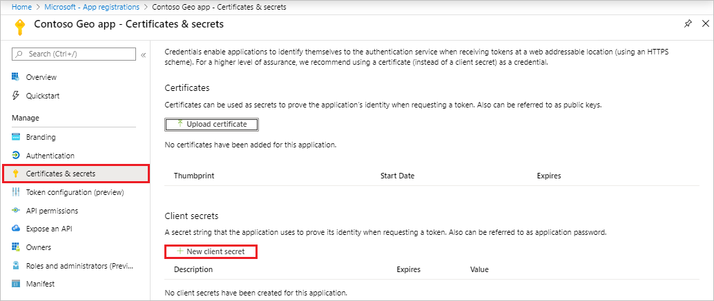
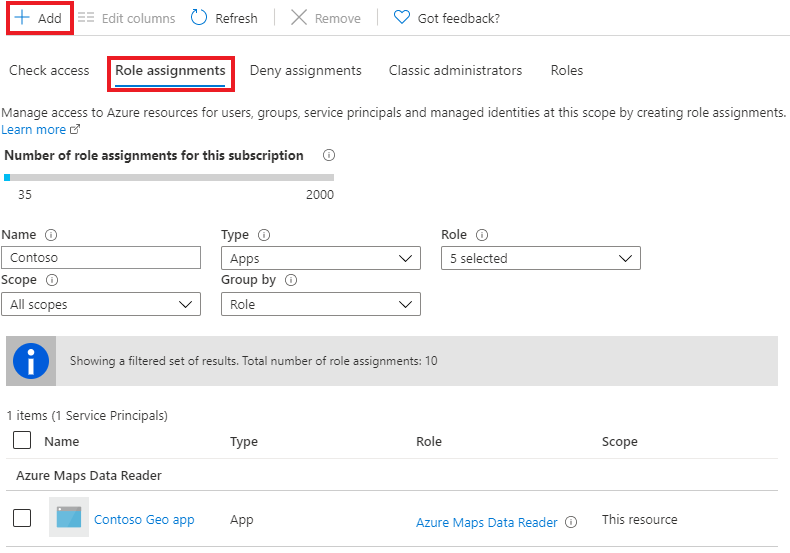

# Manage authentication in Azure Maps

After you create an Azure Maps account, a client ID and keys are created to support Azure Active Directory (Azure AD) and Shared Key authentication.

## View authentication details

After creation of the Azure Maps account, the primary and secondary keys are generated. Use the primary key as the subscription key, sometimes these names are used interchangeably. The secondary key can be used in scenarios such as rolling key changes. Either way, a key is needed to call Azure Maps. This process is called [shared key authentication](https://docs.microsoft.com/azure/azure-maps/azure-maps-authentication#shared-key-authentication). See [Authentication with Azure Maps](https://aka.ms/amauth) to learn more about Shared Key and Azure AD authentication.

You can view your authentication details on the Azure portal. Go to your account and select **Authentication** on the **Settings** menu.

## Set up Azure AD app registration

After you create an Azure Maps account, you need to establish a link between your Azure AD tenant and the Azure Maps resource.

1. Select **Azure Active Directory** from the portal menu. Provide a name for the registration. Click on **App registrations** then click on **New registration. In the **Redirect URI** box, provide the home page of the web app. for example, https://localhost/. If you already have a registered app, go to step 2.

    

    

2. To assign delegated API permissions to Azure Maps, go to the application under **App registrations**, and then select **API permissions**. Select **Add Permission**. Search for and select **Azure Maps** under **Select an API**.

    

3. Under **Select permissions**, check the box for **user impersonation**, then click the **Select** button at the bottom.

    

4. Complete step a or b, depending on your authentication method.

    1. If your application uses user-token authentication with the Azure Maps Web SDK, enable `oauth2AllowImplicitFlow` by setting it to true in the Manifest section of your app registration.
    
       

    2. If your application uses server/application authentication, go to the **Certificates & secrets** blade in app registration and either create a password or upload a public key certificate to the app registration. If you create a password, store it securely for later use. You'll use this password to acquire tokens from Azure AD.

       

## Grant role-based access control (RBAC) to Azure Maps

After you associate an Azure Maps account with your Azure AD tenant, you can grant access control. You grant access control by assigning a user, group, or application to one or more Azure Maps access control roles.

1. Go to your **Azure Maps Account**. Select **Access control (IAM)**, then select **Role assignment**.

    

2. In the **Role assignment** window, under **Role**, select **Azure Maps Date Reader (Preview)**. Under **Assign access to** select **Azure AD user, group, or service principle**. Select the user or application. Select **Save**.

    

## View available Azure Maps RBAC roles

To view role-based access control (RBAC) roles that are available for Azure Maps, go to **Access control (IAM)**, select **Roles**, and then search for roles beginning with **Azure Maps**. These roles are the roles, which you can grant access to.

## View Azure Maps RBAC

RBAC provides granular access control.

To view users and apps that have been granted RBAC for Azure Maps, go to **Access Control (IAM)**, select **Role assignments**, and then filter by **Azure Maps**.

## Request tokens for Azure Maps

After you register your app and associated it with Azure Maps, you can request access tokens.

* If your application uses user-token authentication with the Azure Maps Web SDK, you need to configure your HTML page with the Azure Maps client ID and the Azure AD app ID.

* If your application uses server/application authentication, you need to request a token from Azure AD token endpoint `https://login.microsoftonline.com` with the Azure AD resource ID `https://atlas.microsoft.com/`, the Azure Maps client ID, the Azure AD app ID, and the Azure AD app registration password or certificate.

| Azure Environment   | Azure AD token endpoint | Azure Resource ID |
| --------------------|-------------------------|-------------------|
| Azure Public        | https://login.microsoftonline.com | https://atlas.microsoft.com/ |
| Azure Government    | https://login.microsoftonline.us  | https://atlas.microsoft.com/ | 

For more information about requesting access tokens from Azure AD, for users and service principals, see [Authentication scenarios for Azure AD](https://docs.microsoft.com/azure/active-directory/develop/authentication-scenarios).

## Next steps

To learn more about Azure AD authentication and the Azure Maps Web SDK, see [Azure AD and Azure Maps Web SDK](https://docs.microsoft.com/azure/azure-maps/how-to-use-map-control).

Learn how to see the API usage metrics for your Azure Maps account:
> [!div class="nextstepaction"]	
> [View usage metrics](how-to-view-api-usage.md)

For a list of samples showing how to integrate Azure Active Directory (AAD) with Azure Maps, see:

> [!div class="nextstepaction"]
> [Azure AD authentication samples](https://github.com/Azure-Samples/Azure-Maps-AzureAD-Samples)