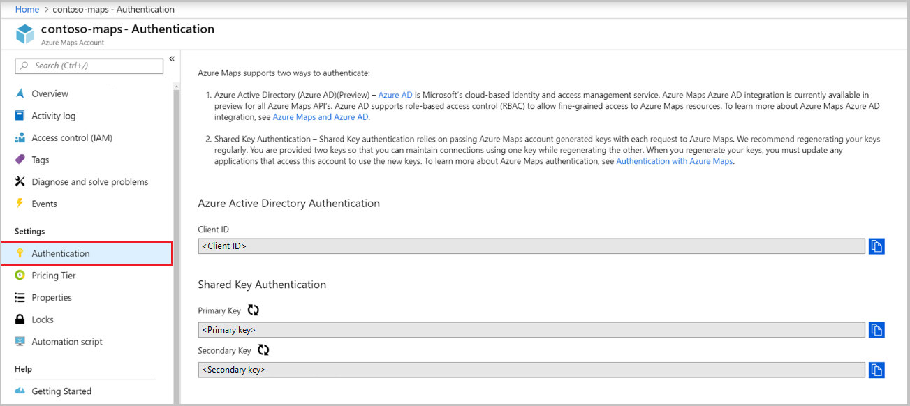
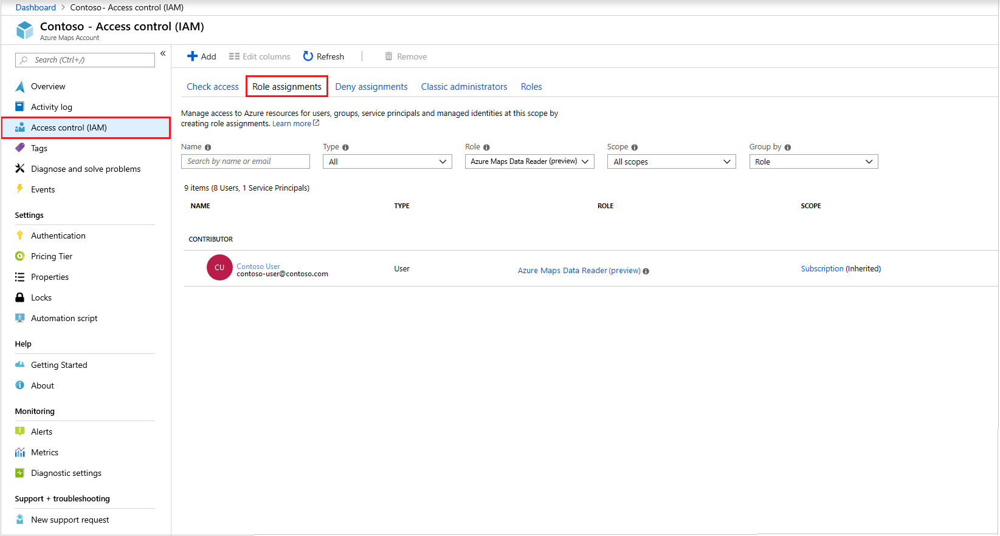
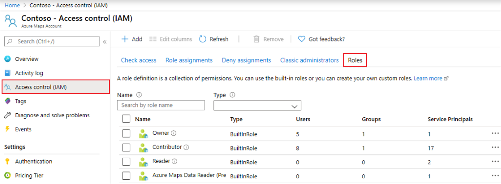
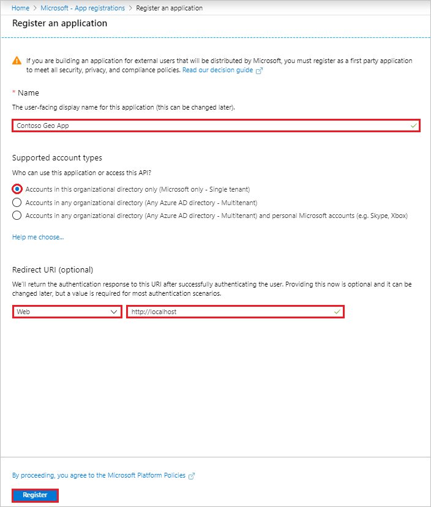
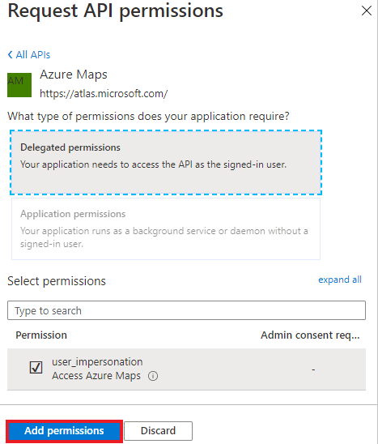

# Manage authentication in Azure Maps

After you create an Azure Maps account, three GUIDS are created to support either Azure Active Directory (Azure AD) or Shared Key authentication.

You can find your authentication details by navigating to the **Authentication** page under **Settings** in the Azure portal. Navigate to your account. Then select **Authentication** from the menu.

## View authentication details

To view your authentication details, navigate to the **Authentication** option in the settings menu.

 To learn about authentication and Azure Maps, see [Authentication with Azure Maps](https://aka.ms/amauth).

## View Azure Maps role-based access control (RBAC)

Azure AD allows for granular access control via role-based access control (RBAC). 

To view users or apps that have been granted RBAC for Azure Maps, navigate to **Access Control (IAM)** option, select **Role assignments**, and filter by **Azure Maps**. All available roles will appear below.

## Grant access RBAC to Azure Maps

Once an Azure Maps account has been associated with your Azure AD tenant, access control can be granted by assigning the user or application to available Azure Maps access control role(s).

1. Navigate to **Access Control** option, click **Role Assignments**, and **Add role assignment**.

2. On the Role Assignment pop out window, select Azure Maps **Role, Assign access to**: Azure AD user, group, or service principal, **Select** User or Application from dropdown, and **Save**.

## View available Azure Maps RBAC roles

To view available role-based access control roles for Azure Maps that access can be granted to, navigate to **Access Control (IAM)** option, click on **Roles**, and search for roles beginning with **Azure Maps**.

## Configure Azure AD App Registration

Once an Azure Map account is created, a link between your Azure AD tenant and the Azure Maps Azure resource is required. 

1. Go to the AAD blade and create an App Registration with a name and the sign in URL as the home page of the web app / API such as "https://localhost/" . If you already have a registered app, proceed to step 2.

2. Assign delegated API permissions to Azure Maps. Azure Maps can be found using the search box. Select Azure Maps under **Select an API** then **Access Azure Maps** under **Select Permissions**.

3. 
    1. If the application is intending to use user token authentication with our Azure Maps Map Control SDK (Web) you must enable the `oauthEnableImplicitFlow` by setting it to true in the Manifest section of your app registration detail page. 
    
    

    2. If your application uses server/application authentication go to the **Keys** blade in the app registration and either create a password or upload a public key certificate to the app registration. If you create a password, once you **Save**, copy the password for later and store it securely, you will use this to acquire tokens from AAD. 

    

## Request tokens for Azure Maps

Once your app is registered and associated with Azure Maps, you can now request access tokens.

1. If the application is intending to use user token authentication with our Azure Maps Web SDK (Web), you need to configure your html page with Azure Maps Client ID and Azure AD App ID.

2. For applications using server/application authentication, request a token from Azure AD login endpoint https://login.microsoftonline.com with Azure Maps Client ID, Azure AD App ID, and Azure AD App registration password or certificate.