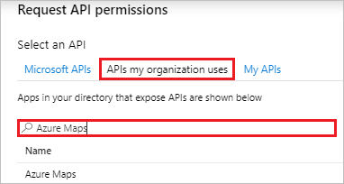
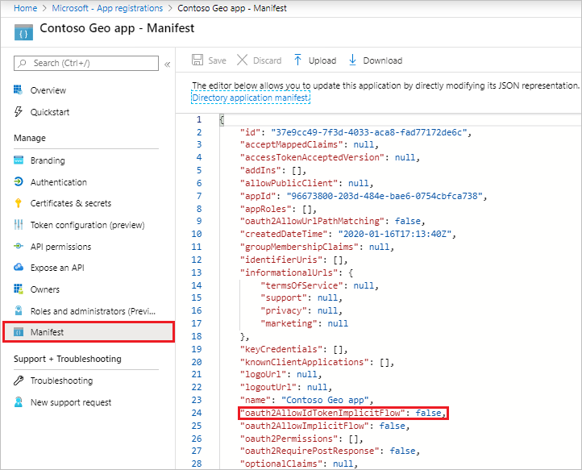
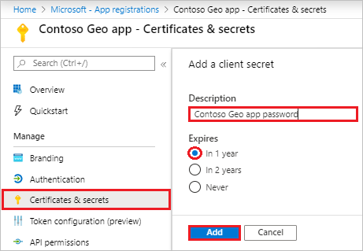

# Manage authentication in Azure Maps

After you create an Azure Maps account, a client ID and keys are created to support Azure Active Directory (Azure AD) authentication and Shared Key authentication.

## View authentication details

After you create an Azure Maps account, the primary and secondary keys are generated. We recommend that you use a primary key as a subscription key when you [use Shared Key authentication to call Azure Maps](https://docs.microsoft.com/azure/azure-maps/azure-maps-authentication#shared-key-authentication). You can use a secondary key in scenarios such as rolling key changes. For more information, see [Authentication in Azure Maps](https://aka.ms/amauth).

You can view your authentication details in the Azure portal. There, in your account, on the **Settings** menu, select **Authentication**.

## Register and configure an Azure AD app

1. In the Azure portal, in the list of Azure services, select **Azure Active Directory** > **App registrations** > **New registration**.  

    

1. If you've already registered your app, then continue to the next step. If you haven't registered your app, then enter a **Name**, choose a **Support account type**, and then select **Register**.  

    

1. To assign delegated API permissions to Azure Maps, go to the application. Then under **App registrations**, select **API permissions** > **Add a permission**. Under **APIs my organization uses**, search for and select **Azure Maps**.

    

1. Select the check box next to **Access Azure Maps**, and then select **Add permissions**.

    

1. Complete one of the following steps, depending on your authentication method. 

    * If your application uses user-token authentication with the Azure Maps Web SDK, then enable `oauth2AllowImplicitFlow`. To enable it, in the **Manifest** section of your app registration, set `oauth2AllowImplicitFlow` to true. 
    
       

    * If your application uses server or application authentication, then on your app registration page, go to **Certificates & secrets**. Then either upload a public key certificate or create a password by selecting **New client secret**. 
    
       

        If you create a password, then after you select **Add**, copy the password and store it securely. You'll use this password to get tokens from Azure AD.

       

## Grant role-based access control to Azure Maps

After you associate an Azure Maps account with your Azure AD tenant, you can grant access control. You grant *role-based access control* (RBAC) by assigning a user, group, or application to one or more Azure Maps access control roles. 

1. Go to your **Azure Maps Account**. Select **Access control (IAM)** > **Role assignment**.

    

1. On the **Role assignments** tab, under **Role**, select **Azure Maps Date Reader (Preview)**. Under **Assign access to**, select **Azure AD user, group, or service principal**. Select the user or application. Then select **Save**.

    

## View available Azure Maps RBAC roles

To view RBAC roles that are available for Azure Maps, go to **Access control (IAM)**. Select **Roles**, and then search for roles that begin with *Azure Maps*. These Azure Maps roles are the roles that you can grant access to.

## View Azure Maps RBAC

RBAC provides granular access control.

To view users and apps that have been granted RBAC for Azure Maps, go to **Access Control (IAM)**. There, select **Role assignments**, and then filter by **Azure Maps**.

## Request tokens for Azure Maps

After you register your app and associate it with Azure Maps, you can request access tokens.

If your application uses user-token authentication with the Azure Maps Web SDK, then configure your HTML page with the Azure Maps client ID and the Azure AD app ID.

If your application uses server or application authentication, then request a token from the Azure AD token endpoint `https://login.microsoftonline.com`. In your request, use the following details: 

* Azure AD resource ID `https://atlas.microsoft.com/`
* Azure Maps client ID
* Azure AD app ID
* Azure AD app registration password or certificate

| Azure environment   | Azure AD token endpoint | Azure resource ID |
| --------------------|-------------------------|-------------------|
| Azure public cloud        | `https://login.microsoftonline.com` | `https://atlas.microsoft.com/` |
| Azure Government    | `https://login.microsoftonline.us`  | `https://atlas.microsoft.com/` | 

For more information about requesting access tokens from Azure AD for users and service principals, see [Authentication scenarios for Azure AD](https://docs.microsoft.com/azure/active-directory/develop/authentication-scenarios).

## Next steps

For more information, see [Azure AD and Azure Maps Web SDK](https://docs.microsoft.com/azure/azure-maps/how-to-use-map-control).

Find the API usage metrics for your Azure Maps account:
> [!div class="nextstepaction"]	
> [View usage metrics](how-to-view-api-usage.md)

Explore samples that show how to integrate Azure AD with Azure Maps:

> [!div class="nextstepaction"]
> [Azure AD authentication samples](https://github.com/Azure-Samples/Azure-Maps-AzureAD-Samples)
