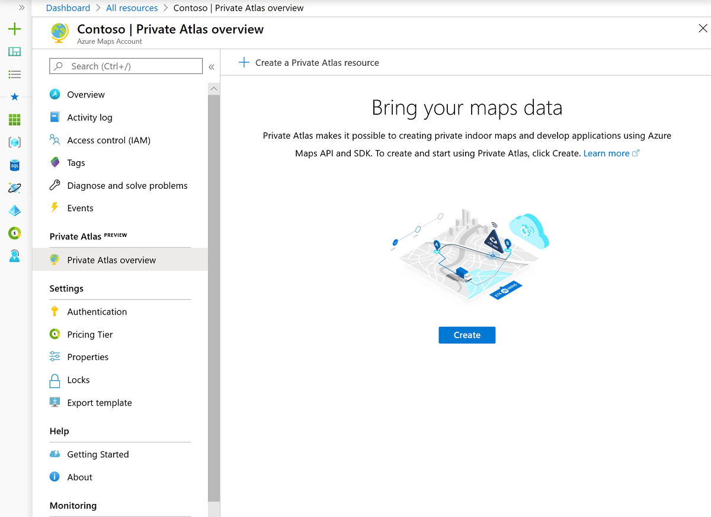
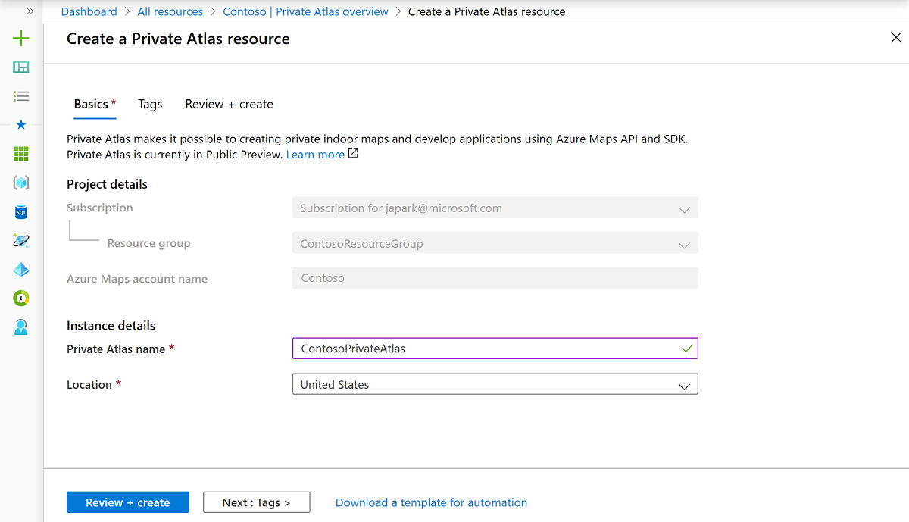
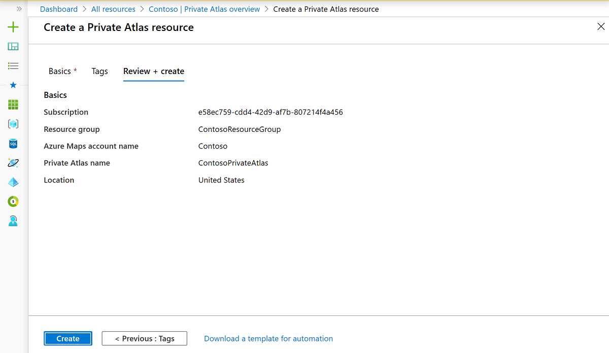
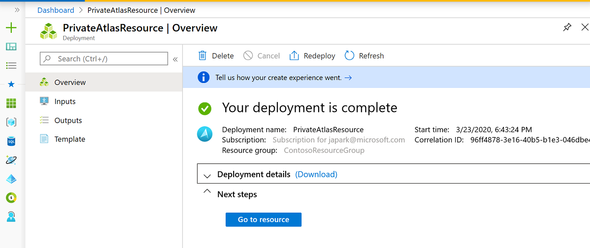
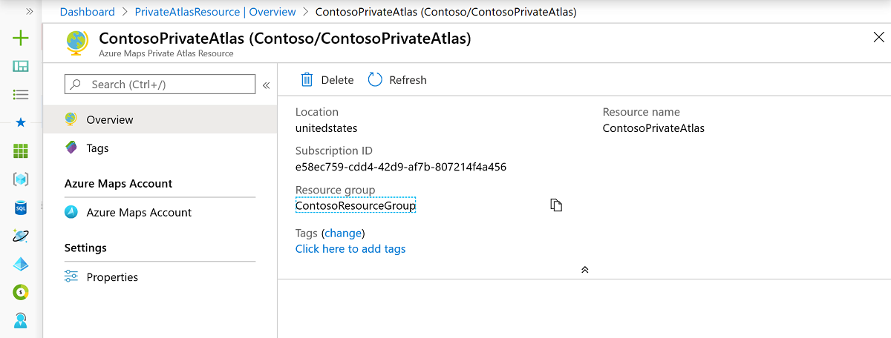
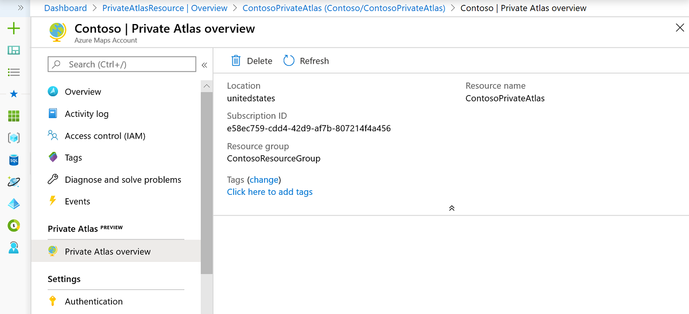
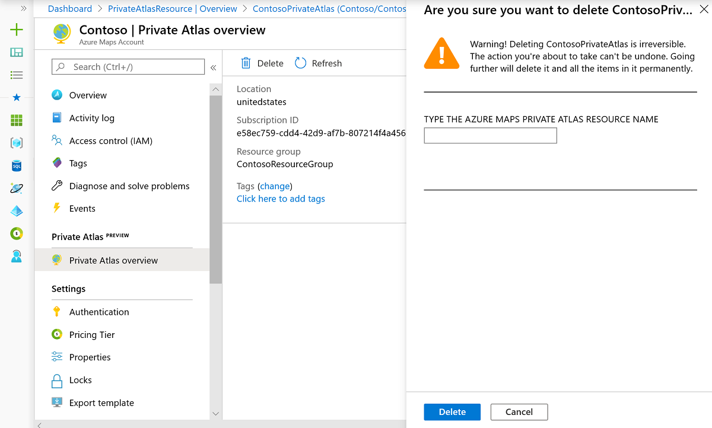

# Manage Private Atlas for your Azure Maps

Private Atlas (PA) makes it possible to create private indoor maps and develop web applications using the Azure Maps APIs and the Indoor Maps module. Currently, Private Atlas is only available in the United States.

You can manage the Private Atlas for your Azure Maps account through the [Azure portal](https://ms.portal.azure.com/). After you deploy the Private Atlas, you can implement the Indoor Maps module and the Azure Maps Private Atlas APIs in your web application.

To enable Private Atlas, your Azure Maps account must [use the S1 pricing tier](how-to-manage-pricing-tier.md), as Private Atlas isn't available for the S0 tier. You also can't change your Azure Maps account to the S0 pricing tier while the Private Atlas is active. To change to the S0 tier, delete your Private Atlas first, then switch.  

For each Azure Maps account, you can have up to one Private Atlas.  Private Atlas inherits your Azure Maps Access Control (IAM) settings. Meaning that all your permission and roles apply to the Private Atlas. Your Private Atlas usage data is incorporated with your Azure Maps usage charts and activity log. The next sections show you how to create a Private Atlas, and how to delete it. 

Before you begin, if you don't have an Azure subscription, [create an Azure account](https://azure.microsoft.com/free/?WT.mc_id=A261C142F). Once you make an Azure account, you need to [create an Azure Maps account](how-to-manage-account-keys.md) to access the Private Atlas resource.

## Create Private Atlas

1. Sign in to the [Azure portal](https://portal.azure.com)

2. Select your Azure Maps account. If you can't see your Azure Maps account under the **Recent resources**, then navigate to the Azure portal menu. Select **All resources**, find, and select your Azure Maps account.

    

3. Once you're on the Azure Maps account page, navigate to the **Overview** option under the **Private Atlas**.
  
    

4. Select the **create** button to create your Private Atlas. Enter the information for your Private Atlas account and select the location for your Private Atlas. Currently, the United States is the only supported geographical location.

    

5. Click Review + create.

     

6. Click Create.

7. When the deployment completes, you'll see a page with a success or a failure message.

    

    >[!TIP]
    >To troubleshoot any errors you may receive, see
    [Troubleshoot query issues when using Azure Cosmos DB](https://docs.microsoft.com/azure/cosmos-db/troubleshoot-query-performance)

8. Click **Go to resource**. Your Private Atlas page should look like the page in the image below. It should show the status of your Private Atlas and the chosen demographic region.

   

   >[!NOTE]
   >From the Private Atlas resource page, you can navigate back to the Azure Maps account it belongs to by clicking Azure Maps Account.

## Delete Private Atlas

You can delete the Private Atlas of your Azure Maps account using the Azure portal. 

Navigate to your Azure Maps account and select **Overview** under **Private Atlas**. If you have a Private Atlas for your Azure Maps account, then you'll see a **Delete** button.

>[!WARNING]
>When you delete the Private Atlas of your Azure Maps account, you will also delete the data sets, tile sets, and feature state sets created using the Private Atlas APIs.

Click the **Delete** button and type your Private Atlas name to confirm your desire to delete it. Once the resource is erased, you'll see a confirmation page, like in the image below:

## Authentication
Private Atlas inherits your Azure Maps Access Control (IAM) settings. Access to any data created and processed in Private Atlas such as converted data, Datasets, Tilesets, and Feature State sets is available via API calls only when passing the authentication and authorization rules defined in the IAM account to which Private Atlas belongs. In addition, Private Atlas usage data is incorporated in your Azure Maps usage charts and activity log.  See [Manage authentication in Azure Maps](https://docs.microsoft.com/azure/azure-maps/how-to-manage-authentication) for more detail.

## Next steps

Introduction to Private Atlas for Indoor mapping:

> [!div class="nextstepaction"]
> [Data Conversion]()

> [!div class="nextstepaction"]
> [Dataset]()

> [!div class="nextstepaction"]
> [Tileset]()

> [!div class="nextstepaction"]
> [Feature State set]()

Learn how to use the Private Atlas to render indoor maps in your application:

> [!div class="nextstepaction"]
> [Private Atlas tutorial](tutorial-private-atlas-indoor-maps.md)

> [!div class="nextstepaction"]
> [Indoor map dynamic styling](indoor-map-dynamic-styling.md)

> [!div class="nextstepaction"]
> [Use the Indoor Maps module](how-to-use-indoor-module.md)