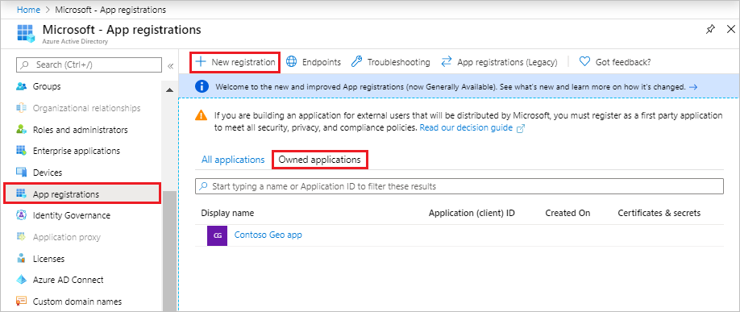
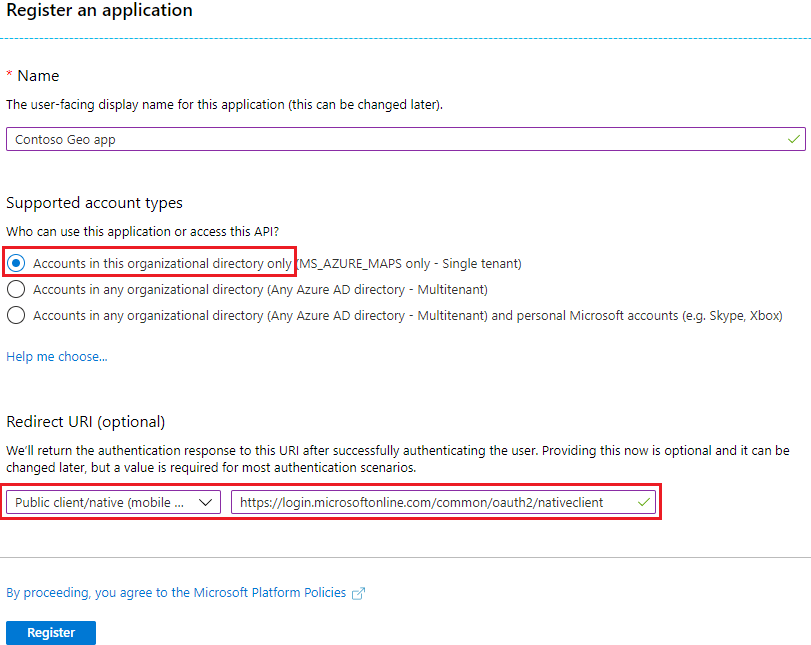

# Secure an input constrained device with Azure AD and Azure Maps REST APIs

An application or a device which is running in the public without the ability to securely store secrets and does not have the capability to accept browser input. These types of applications fall under the category of IoT or internet of things. Some examples of these applications may include: Smart TV devices or sensor data emitting applications. 

[!INCLUDE [authentication details](./includes/view-auth-details.md)]

## Create an application registration in Azure AD

> [!NOTE]
> * **Prerequisite Reading:** [Scenario: Desktop app that calls web APIs](https://docs.microsoft.com/azure/active-directory/develop/scenario-desktop-overview)
> * The following scenario we are interested in is the Device Code Flow which does not involve a web browser to acquire a token.

You must create the device based application in Azure AD to enable Azure AD sign in. This application will be granted access to Azure Maps REST APIs.

1. In the Azure portal, in the list of Azure services, select **Azure Active Directory** > **App registrations** > **New registration**.  

    

2. Enter a **Name**, choose **Accounts in this organizational directory only** as the **Support account type**. In **Redirect URIs**, specify **Public client / native (mobile & desktop)** then add `https://login.microsoftonline.com/common/oauth2/nativeclient` to the value. For more details please see Azure AD [Desktop app that calls web APIs: App registration](https://docs.microsoft.com/azure/active-directory/develop/scenario-desktop-app-registration).   

    

3. Navigate to **Authentication** and enable **Treat application as public client**. This will enable device code authentication with Azure AD.
    
    

4.  To assign delegated API permissions to Azure Maps, go to the application. Then select **API permissions** > **Add a permission**. Under **APIs my organization uses**, search for and select **Azure Maps**.

    

5. Select the check box next to **Access Azure Maps**, and then select **Add permissions**.

    

6. Configure Azure role based access control for users or groups. See the [following sections to enable RBAC](#grant-role-based-access-for-users-to-azure-maps).

7. Add code for acquiring token flow in the application, for implementation details see [Device code flow](https://docs.microsoft.com/azure/active-directory/develop/scenario-desktop-acquire-token#device-code-flow). When acquiring tokens, reference the scope: `user_impersonation` which was selected on earlier steps.

> [!Tip]
> Use Microsoft Authentication Library (MSAL) to acquire access tokens. See recommendations on [Desktop app that calls web APIs: Code configuration](https://docs.microsoft.com/azure/active-directory/develop/scenario-desktop-app-configuration)

8. Compose the HTTP request with the acquired token from Azure AD, and sent request with a valid HTTP client.

#### sample request
Here's a sample request body for uploading a simple Geofence represented as a circle geometry using a center point and a radius.

```http
POST /mapData/upload?api-version=1.0&dataFormat=geojson
Host: atlas.microsoft.com
x-ms-client-id: 30d7cc….9f55
Authorization: Bearer eyJ0e….HNIVN
```

 The sample request body below is in GeoJSON:
```json
{
    "type": "FeatureCollection",
    "features": [{
        "type": "Feature",
        "geometry": {
            "type": "Point",
            "coordinates": [-122.126986, 47.639754]
        },
        "properties": {
            "geometryId": "001",
            "radius": 500
        }
    }]
}
```

#### sample response:

Headers:
```http
Location: https://atlas.microsoft.com/mapData/metadata/{udid}?api-version=1.0
Access-Control-Expose-Headers: Location
```

Body:
```json
{
  "operationId": "{operationId}",
  "status": "Succeeded",
  "created": "2020-01-02 1:02:03 AM +00:00",
  "resourceLocation": "https://atlas.microsoft.com/mapData/metadata/{resourceId}?api-version=1.0"
}
```

[!INCLUDE [grant role access to users](./includes/grant-rbac-users.md)]

## Next steps

Find the API usage metrics for your Azure Maps account:
> [!div class="nextstepaction"]
> [View usage metrics](how-to-view-api-usage.md)
