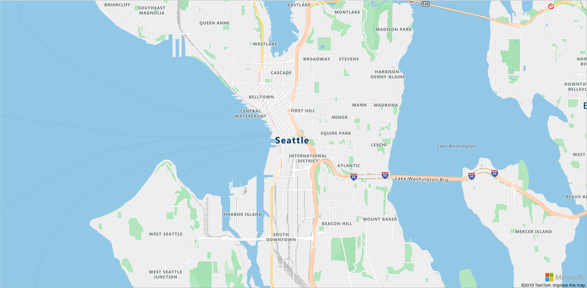
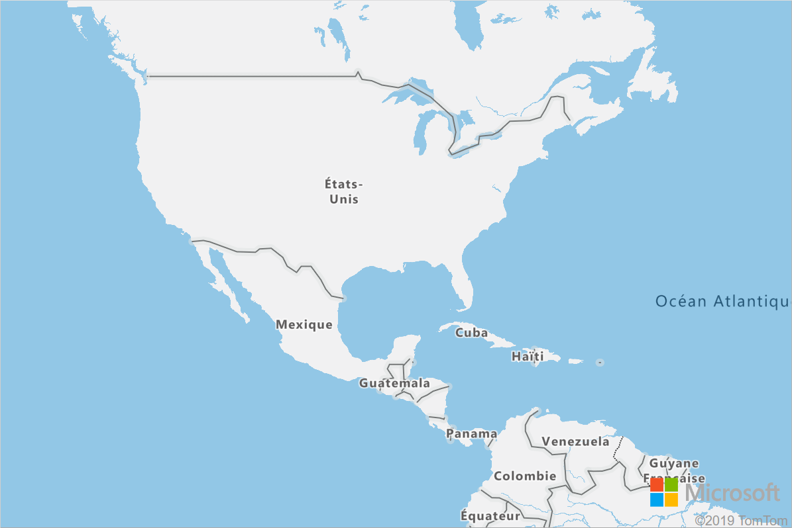

# Use the Azure Maps map control

The Map Control client-side Javascript library allows you to render maps and embedded Azure Maps functionality into your web or mobile application.

## Create a new map in a web page

You can embed a map in a web page by using the Map Control client-side Javascript library.

1. Create a new HTML file.

2. Load in the Azure Maps Web SDK. You can choose one of two options;

    a. Use the globally hosted CDN version of the Azure Maps Web SDK by adding the URL endpoints to the stylesheet and script references in the `<head>` element of the file:

    ```HTML
    <link rel="stylesheet" href="https://atlas.microsoft.com/sdk/javascript/mapcontrol/2/atlas.min.css" type="text/css">
    <script src="https://atlas.microsoft.com/sdk/javascript/mapcontrol/2/atlas.min.js"></script>
    ```

    b. Load the Azure Maps Web SDK source code locally using the [azure-maps-control](https://www.npmjs.com/package/azure-maps-control) NPM package and host it with your app. This package also includes TypeScript definitions.

    > **npm install azure-maps-control**

    Then add references to the Azure Maps stylesheet and script source references to the `<head>` element of the file:

    ```HTML
    <link rel="stylesheet" href="node_modules/azure-maps-control/dist/atlas.min.css" type="text/css"> 
    <script src="node_modules/azure-maps-control/dist/atlas.min.js"></script>
    ```

    >[!Note]
    > Typescript definitions can be imported into your application by adding the following code:
    > ```Javascript
    > import * as atlas from 'azure-maps-control';
    > ```

3. To render the map so that it fills the full body of the page, add the following `<style>` element to the `<head>` element.

    ```HTML
    <style>
        html, body {
            margin: 0;
        }

        #myMap {
            height: 100vh;
            width: 100vw;
        }
    </style>
    ```

4. In the body of the page, add a `<div>` element and give it an `id` of **myMap**.

    ```HTML
    <body>
        <div id="myMap"></div>
    </body>
    ```

5. To initialize the map control, define a new script tag in the html body. Pass in the `id` of the map `<div>` or an `HTMLElement` (for example, `document.getElementById('myMap')`) as the first parameter when creating an instance of the `Map` class. Use your own Azure Maps account key or Azure Active Directory (AAD) credentials to authenticate the map using [authentication options](https://docs.microsoft.com/javascript/api/azure-maps-control/atlas.authenticationoptions). 

If you need to create an account or find your key, follow instructions in [Create an account](quick-demo-map-app.md#create-an-account-with-azure-maps) and [get primary key](quick-demo-map-app.md#get-the-primary-key-for-your-account) . 

The **language** option specifies the language to be used for map labels and controls. For more information on supported languages, see [supported languages](supported-languages.md). 

    If you are using a subscription key for authentication, use the following:

    ```HTML
    <script type="text/javascript">
        var map = new atlas.Map('myMap', {
            center: [-122.33, 47.6],
            zoom: 12,
            language: 'en-US',
            authOptions: {
                authType: 'subscriptionKey',
                subscriptionKey: '<Your Azure Maps Key>'
            }
        });
    </script>
    ```

    If you are using Azure Active Directory (AAD) for authentication, use the following:

    ```HTML
    <script type="text/javascript">
        var map = new atlas.Map('myMap', {
            center: [-122.33, 47.6],
            zoom: 12,
            language: 'en-US',
            authOptions: {
                authType: 'aad',
                clientId: '<Your AAD Client Id>',
                aadAppId: '<Your AAD App Id>',
                aadTenant: '<Your AAD Tenant Id>'
            }
        });
    </script>
    ```

    A list of samples showing how to integrate Azure Active Directory (AAD) with Azure Maps can be found [here](https://github.com/Azure-Samples/Azure-Maps-AzureAD-Samples). 
    
    For more information, see the [Authentication with Azure Maps](azure-maps-authentication.md) document and also the [Azure Maps Azure AD authentication samples](https://github.com/Azure-Samples/Azure-Maps-AzureAD-Samples).

6. Optionally, you may find adding the following meta tag elements to the head of your page helpful:

    ```HTML
    <!-- Ensures that IE and Edge uses the latest version and doesn't emulate an older version -->
    <meta http-equiv="x-ua-compatible" content="IE=Edge">

    <!-- Ensures the web page looks good on all screen sizes. -->
    <meta name="viewport" content="width=device-width, initial-scale=1, shrink-to-fit=no">
    ```

7. Putting it all together your HTML file should look something like the following code:

    ```HTML
    <!DOCTYPE html>
    <html>
    <head>
        <title></title>

        <meta charset="utf-8">

        <!-- Ensures that IE and Edge uses the latest version and doesn't emulate an older version -->
        <meta http-equiv="x-ua-compatible" content="IE=Edge">

        <!-- Ensures the web page looks good on all screen sizes. -->
        <meta name="viewport" content="width=device-width, initial-scale=1, shrink-to-fit=no">

        <!-- Add references to the Azure Maps Map control JavaScript and CSS files. -->
        <link rel="stylesheet" href="https://atlas.microsoft.com/sdk/javascript/mapcontrol/2/atlas.min.css" type="text/css">
        <script src="https://atlas.microsoft.com/sdk/javascript/mapcontrol/2/atlas.min.js"></script>

        <style>
            html, body {
                margin: 0;
            }

            #myMap {
                height: 100vh;
                width: 100vw;
            }
        </style>
    </head>
    <body>
        <div id="myMap"></div>

        <script type="text/javascript">
            //Create an instance of the map control and set some options.
            var map = new atlas.Map('myMap', {
                center: [-122.33, 47.6],
                zoom: 12,
                language: 'en-US',
                authOptions: {
                    authType: 'subscriptionKey',
                    subscriptionKey: '<Your Azure Maps Key>'
                }
            });
        </script>
    </body>
    </html>
    ```

8. Open the file in your web browser and view the rendered map. It should look like the following picture:



## Localizing the map

Azure Maps provides two different ways of setting the language and regional view for the rendered map. The first option is to add this information to the global `atlas` namespace, which will result in all map control instances in your app defaulting to these settings. The following sets the language to French ("fr-FR") and the regional view to "Auto":

```javascript
atlas.setLanguage('fr-FR');
atlas.setView('Auto');
```

The second option is to pass this information into the map options when loading the map like this:

```javascript
map = new atlas.Map('myMap', {
    language: 'fr-FR',
    view: 'Auto',

    authOptions: {
        authType: 'aad',
        clientId: '<Your AAD Client Id>',
        aadAppId: '<Your AAD App Id>',
        aadTenant: '<Your AAD Tenant Id>'
    }
});
```

> [!Note]
> With the Web SDK it is possible to load multiple map instances on the same page with different language and region settings. Additionally, these settings can be updated after the map loads using the `setStyle` function of the map. 

Here is an example of Azure Maps with the language set to "fr-FR" and the regional view set to "Auto".



A complete list of supported languages and regional views is documented [here](supported-languages.md).

## Azure Government cloud support

The Azure Maps Web SDK supports the Azure Government cloud. All JavaScript and CSS URLs used to access the Azure Maps Web SDK remain the same. The following tasks will need to be done to connect to the Azure Government cloud version of the Azure Maps platform.

When using the interactive map control, add the following line of code before creating an instance of the `Map` class. 

```javascript
atlas.setDomain('atlas.azure.us');
```

Be sure to use Azure Maps authentication details from the Azure Government cloud platform when authenticating the map and services.

When using the services module, the domain for the services needs to be set when creating an instance of an API URL endpoint. For example, the following code creates an instance of the `SearchURL` class and points the domain to the Azure Government cloud.

```javascript
var searchURL = new atlas.service.SearchURL(pipeline, 'atlas.azure.us');
```

If directly accessing the Azure Maps REST services, change the URL domain to `atlas.azure.us`. For example, if using the search API service, change the URL domain from `https://atlas.microsoft.com/search/` to `https://atlas.azure.us/search/`.

## Next steps

Learn how to create and interact with a map:

> [!div class="nextstepaction"]
> [Create a map](map-create.md)

Learn how to style a map:

> [!div class="nextstepaction"]
> [Choose a map style](choose-map-style.md)

To add more data to your map:

> [!div class="nextstepaction"]
> [Create a map](map-create.md)

> [!div class="nextstepaction"]
> [Code samples](https://docs.microsoft.com/samples/browse/?products=azure-maps)

For a list of samples showing how to integrate Azure Active Directory (AAD) with Azure Maps, see:

> [!div class="nextstepaction"]
> [Azure AD authentication samples](https://github.com/Azure-Samples/Azure-Maps-AzureAD-Samples)