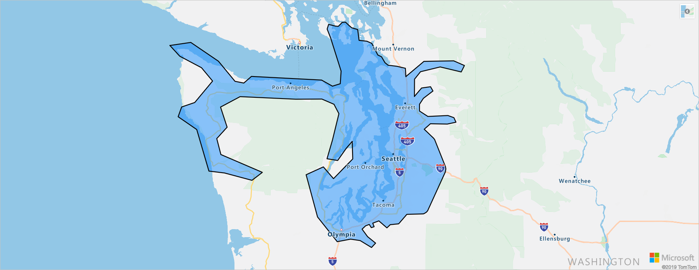

# Data structures in Azure Maps Mobility services (Preview) 

> [!IMPORTANT]
> Azure Maps Mobility services are currently in public preview.
> This preview version is provided without a service level agreement, and it's not recommended for production workloads. Certain features might not be supported or might have constrained capabilities. 
> For more information, see [Supplemental Terms of Use for Microsoft Azure (Preview) s](https://azure.microsoft.com/support/legal/preview-supplemental-terms/).

This article introduces the concept of Metro Area in [Azure Maps Mobility services](/rest/api/maps/mobility). We discuss some of common fields that are returned when this service is queried for public transit stops and lines. We recommend reading this article before developing with the Mobility services APIs.

## Metro area

Mobility services (Preview) data are grouped by supported metro areas. Metro areas don't follow city boundaries. A metro area can contain multiple cities, densely populated city, and surrounding cities. In fact, a country/region can be one metro area. 

The `metroID` is a metro area's ID that can be used to call the [Get Metro Area Info API](/rest/api/maps/mobility/getmetroareainfopreview). Use Azure Maps' "Get Metro" API to request transit types, transit agencies, active alerts, and additional details for the chosen metro. You can also request the supported metro areas and metroIDs. Metro area IDs are subject to change.

**metroID:** 522   **Name:** Seattle-Tacoma-Bellevue

## Stop IDs

Transit stops can be referred to by two types of IDs, the [General Transit Feed Specification (GFTS)](http://gtfs.org/) ID and the Azure Maps stop ID. The GFTS ID is referred to as the stopKey and the Azure Maps stop ID is referred to as stopID. When frequently referring to transit stops, you're encouraged to use the Azure Maps stop ID. stopID is more stable and likely to stay the same as long as the physical stop exists. The GTFS stop ID is updated more often. For example, GTFS stop ID can be updated per the GTFS provider request or when a new GTFS version is released. Although the physical stop had no change, the GTFS stop ID may change.

To start, you can request nearby transit stops using [Get Nearby Transit API](/rest/api/maps/mobility/getnearbytransitpreview).

## Line Groups and Lines

Mobility services (Preview) use a parallel data model for Lines and Line Groups. This model is used to better deal with changes inherited from [GTFS](http://gtfs.org/) routes and the trips data.

### Line Groups

A Line Group is an entity, which groups together all lines that are logically part of the same group. Usually, a line group contains two lines, one from point A to B, and the other returning from point B to A. Both lines would belong to the same Public Transport agency and have the same line number. However, there may be cases in which a line group has more than two lines or only a single line within it.

### Lines

As discussed above, each line group is composed of a set of lines. Each line group is composed of two lines, and each line describes a direction.  However, there are cases in which more lines compose a line group. For example, there's a line that sometimes detours through a certain neighborhood and sometimes doesn't. In both cases, it operates under the same line number. Also a line group can be composed of a single line. A circular line with a single direction is a ling group with one line.

To begin, you can request line groups by using the [Get Transit Line API](/rest/api/maps/mobility/gettransitlineinfopreview).

## Next steps

Learn how to request transit data using Mobility services (Preview):

> [!div class="nextstepaction"]
> [How to request transit data](how-to-request-transit-data.md)

Learn how to request real-time data using Mobility services (Preview):

> [!div class="nextstepaction"]
> [How to request real-time data](how-to-request-real-time-data.md)

Explore the Azure Maps Mobility services (Preview) API documentation

> [!div class="nextstepaction"]
> [Mobility services API documentation](/rest/api/maps/mobility)