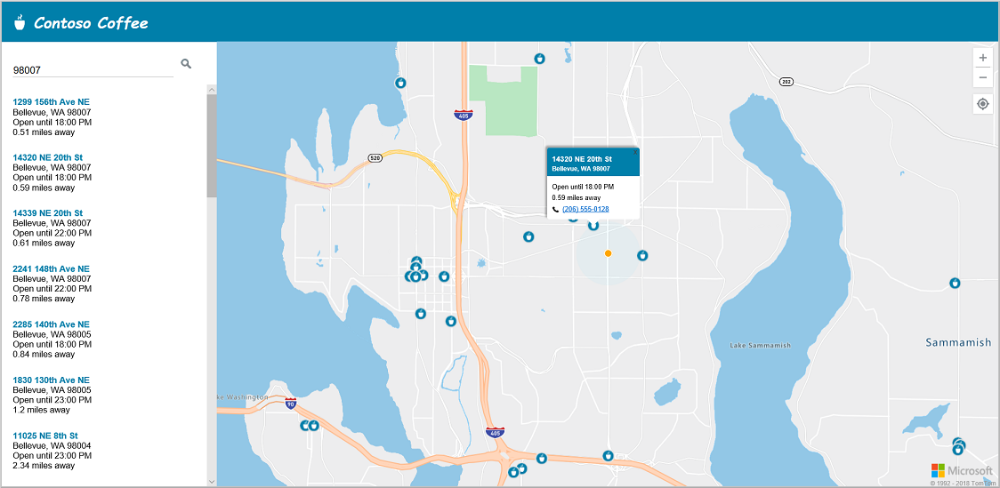
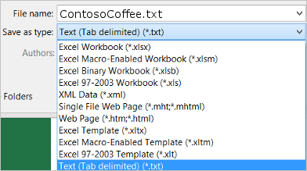
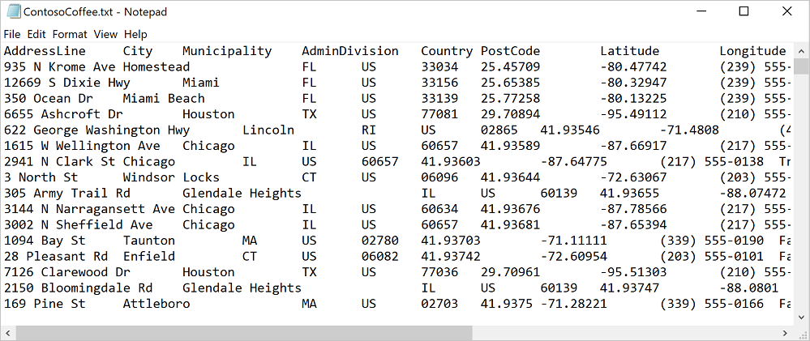
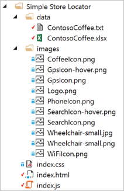
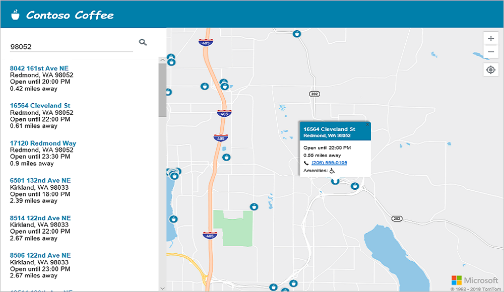

# Create a store locator using Azure Maps

This tutorial guides you through the process of creating a simple store locator using Azure Maps. Store locators are common and many of the same concepts used in this type of application are applicable to many others. Store Locators are a must for most businesses that sell directly to consumers. In this tutorial, you will learn how to:
    
> [!div class="checklist"]
* Create a new web page using the map control API
* Load custom data from a file and display it on the map.
* Use the Azure Maps search service to find an address or place a query.
* Get the users location from the browser and show it on the map.
* Combine multiple layers to create custom symbols on the map.  
* Clustering of data points.  
* Add zoom controls to the map.

<a id="Intro"></a>

Jump ahead to the [live sample](https://azuremapscodesamples.azurewebsites.net/?sample=Simple%20Store%20Locator) or the  [source code](https://github.com/Azure-Samples/AzureMapsCodeSamples/tree/master/AzureMapsCodeSamples/Tutorials/Simple%20Store%20Locator). 

## Prerequisites

Before you proceed, follow the steps in the first tutorial to [create your Azure Maps account](./tutorial-search-location.md#createaccount), and [get the subscription key for your account](./tutorial-search-location.md#getkey).

## Design

Before jumping into code, it is always good to start off with a design. Store locators can be as simple or as complicated as you want them to be. In this tutorial, we will focus on creating a store locator. We will include some tips along the way to help you extend certain functionalities if you desire. We will create a store locator for a fictional company called Contoso Coffee. Following is a wireframe of the general layout of the locator we will build.


<center></center>

To maximize the usefulness of this store locator, we will also include a responsive layout that adjusts when the screen width is fewer than 700 pixels wide. It makes it easy to use the store locator on small screens, such as mobile devices. Here is a wireframe of what this small screen layout will look like.  

<br/>
<center></center>

In the wireframes above you can see a fairly straight forward application, with a search box, a list of nearby stores, a map with some markers (symbols) and a popup with additional information when a marker is clicked. Going into a bit more detail here are the features we will build into this store locator:

* All locations from the imported tab-delimited data file will be loaded on the map.
* The user will be able to either pan and zoom the map, perform a search, or press the GPS button.
* The page layout will adjust depending on the width of the screen.  
* There will be a header with the logo for the store.  
* A search box and button will let users search for a location, such as an address, postal code, or city. 
* A key press event will be added to the search box that triggers a search if the user presses the enter key. This is something that is often over looked but makes for a much better user experience.
* When the map moves, the distance to each location from the center of the map will be calculated, and the result list updated to show the closest locations at the top.  
* When you click on a result in the result list, it will center the map over the selected location and open its popup.  
* Clicking on an individual location on the map will also display its popup.
* When zoomed out, the locations will be grouped into clusters, represented as a circle with a number written inside of it. The clusters will form and break apart as the zoom level changes.
* Clicking on a cluster will zoom in the map for two levels and center it over where the cluster was.

<a id="create a data-set"></a>

## Create the Store Location Data Set

Before we start developing an application, we first need to create a data set of the stores we want to display on the map. For this tutorial, we will be using a data set for a fictitious coffee shop called Contoso Coffee. In the spirit of creating a “simple” store locator, this data set is managed in an Excel spreadsheet and consists of 10,213 locations spread across nine countries; USA, Canada, UK, France, Germany, Italy, Netherlands, Denmark, and Spain. Here is a screenshot of what the data looks like.


<center></center>

You can download the spreadsheet [here](https://github.com/Azure-Samples/AzureMapsCodeSamples/tree/master/AzureMapsCodeSamples/Tutorials/Simple%20Store%20Locator/data). Looking at the screenshot we can make the following observations:
    
* Location information is stored using the AddressLine, City, Municipality (county), AdminDivision (state/province), PostCode (zip code), and Country columns.  
* There is a Latitude and Longitude column that has the coordinates for each coffee shop. If you do not have coordinate information, you can use the Search services in Azure Maps to determine it.
* There are some additional columns that contain some metadata related to the coffee shops; a phone number, boolean columns for Wi-Fi hotspot and wheel chair accessibility, opening and closing times in 24-hour format. You can create your own columns that contain metadata that’s more relevant to your location data.

There are many ways in which you can expose the data set to the application. One approach is to load the data into a database and expose a web service that can query the data and send the results to the user’s browser. It is ideal for large data sets, or data sets that are updated frequently, but require a lot more development work and have higher costs. Another approach is to convert this data set into a flat text file that we can easily parse in the browser. The file itself can be hosted with the rest of the application. This keeps things simple but is only a good option for smaller data sets as the user will download all the data. And it is a viable option for this data set, since the file size is less than 1 MB.  

To convert the spreadsheet into a flat text file, we will save it as a tab-delimited file.  It will spec each column out with a tab character, which will make it easy to parse in our code. You can use CSV (comma-separated value) but that would require more parsing logic as any field that has a comma around it would be wrapped with quotes. To export this data as a Tab-delimited file in Excel press the **Save As** button and in the **Save as type** drop-down select **Text (Tab delimited)(*.txt)**. We will call this file **ContosoCoffee.txt**. 


<center></center>

If you open the text file in notepad, it will look something like below;


<center></center>


## Set up the project

To create the project, you can use [Visual Studio](https://visualstudio.microsoft.com) or any editor of your choice. In your project folder, create three files; `index.html`, `index.css`, and `index.js`. These files will define the layout, styles, and logic for the application. Create a folder called `data` and add ContosoCoffee.txt file to it. Create another folder and call it `images`. There are 10 images we will use in this application for icons, buttons, and markers on the map. You can download these images [here](https://github.com/Azure-Samples/AzureMapsCodeSamples/tree/master/AzureMapsCodeSamples/Tutorials/Simple%20Store%20Locator/data). Your project folder should now look like the one below.


<center></center>

## Create the user interface

To create the user interface, you need to add the following blocks of code in the `index.html` file:

1. Add the following meta tags to the `head` of the file. These define the character set (UTF8), tell Internet Explorer and Edge to use the latest versions, and specify a viewport that is well suited for responsive layouts.

    ```HTML
    <meta charset="utf-8" /> 
    <meta http-equiv="x-ua-compatible" content="IE=Edge" /> 
    <meta name="viewport" content="width=device-width, initial-scale=1, shrink-to-fit=no" />
    ```

2. Add references to the Azure Maps Web Control JavaScript and CSS files.

    ```HTML
    <link rel="stylesheet" href="https://atlas.microsoft.com/sdk/css/atlas.min.css?api-version=1" type="text/css" /> 
    <script src="https://atlas.microsoft.com/sdk/js/atlas.min.js?api-version=1"></script> 
    ```
    
3. Add a reference to the Azure Maps Services Module. It is a JavaScript library that wraps the Azure Maps REST services and makes them easy to use in JavaScript and will be useful for powering the search functionality.

    ```HTML
    <script src="https://atlas.microsoft.com/sdk/js/atlas-service.js?api-version=1"></script>
    ```
    
4. Add references to the `index.js` and `index.css` files.

    ```HTML
    <link rel="stylesheet" href="index.css" type="text/css" /> 
    <script src="index.js"></script>
    ```
    
5. In the body of the document, add a header tag and inside it add the logo and company name.

    ```HTML
    <header> 
         
        <span>Contoso Coffee</span> 
    </header>
    ```

6. Add a main tag and create a search panel with a textbox and button. Also add divs for the map, the list panel, and the “My Location” button.

    ```HTML
    <main> 
        <div class="searchPanel"> 
            <div> 
                <input id="searchTbx" type="search" placeholder="Find a store" /> 
                <button id="searchBtn" title="Search"></button> 
            </div> 
        </div> 

        <div id="listPanel"></div> 

        <div id="myMap"></div> 

        <button id="myLocationBtn" title="My Location"></button> 

    </main>
    ```

Putting it all together your `index.html` should look like [index.html](https://github.com/Azure-Samples/AzureMapsCodeSamples/blob/master/AzureMapsCodeSamples/Tutorials/Simple%20Store%20Locator/index.html).

The next step is to define the CSS styles, which will define how everything is laid out and styled. Open the `index.css` file and add the following pieces of code to it. Note the `@media` style, which defines alternate styling options to be used when the page width is fewer than 700 pixels.  

    ```CSS
    html, body { 
        padding: 0; 
        margin: 0; 
        font-family: Gotham, Helvetica, sans-serif; 
        overflow-x: hidden; 
    } 

    header { 
        width: calc(100vw - 10px); 
        height: 30px; 
        padding: 15px 0 20px 20px; 
        font-size: 25px; 
        font-style: italic; 
        font-family: "Comic Sans MS", cursive, sans-serif; 
        line-height: 30px; 
        font-weight: bold;     
        color: white; 
        background-color: #007faa; 
    } 

    header span { 
        vertical-align: middle; 
    } 

    header img { 
        height: 30px; 
        vertical-align: middle; 
    } 

    .searchPanel { 
        position: relative; 
        width: 350px; 
    } 

        .searchPanel div { 
            padding: 20px; 
        } 

        .searchPanel input { 
            width: calc(100% - 50px); 
            font-size: 16px; 
            border: 0; 
            border-bottom: 1px solid #ccc; 
        } 

    #listPanel { 
        position: absolute; 
        top: 135px; 
        left: 0px; 
        width: 350px; 
        height: calc(100vh - 135px); 
        overflow-y: auto; 
    } 

    #myMap { 
        position: absolute; 
        top: 65px; 
        left: 350px; 
        width: calc(100vw - 350px); 
        height: calc(100vh - 65px); 
    } 

    .statusMessage { 
        margin: 10px; 
    } 

    #myLocationBtn, #searchBtn { 
        margin: 0; 
        padding: 0; 
        border: none; 
        border-collapse: collapse; 
        width: 32px; 
        height: 32px; 
        text-align: center; 
        cursor: pointer; 
        line-height: 32px; 
        background-repeat: no-repeat; 
        background-size: 20px; 
        background-position: center center; 
        z-index: 200;     
    } 

    #myLocationBtn { 
        position: absolute; 
        top: 150px; 
        right: 10px; 
        box-shadow: 0px 0px 4px rgba(0,0,0,0.16); 
        background-color: white; 
        background-image: url("images/GpsIcon.png"); 
    } 

        #myLocationBtn:hover { 
            background-image: url("images/GpsIcon-hover.png"); 
        } 

    #searchBtn { 
        background-color: transparent; 
        background-image: url("images/SearchIcon.png"); 
    } 

        #searchBtn:hover { 
            background-image: url("images/SearchIcon-hover.png"); 
        } 

    .listItem { 
        height: 50px; 
        padding: 20px; 
        font-size: 14px; 
    } 

        .listItem:hover { 
            cursor: pointer; 
            background-color: #f1f1f1; 
        } 

    .listItem-title { 
        color: #007faa; 
        font-weight: bold; 
    } 

    .storePopup { 
        min-width: 150px;   
    } 

        .storePopup .popupTitle { 
            border-top-left-radius: 4px; 
            border-top-right-radius: 4px; 
            padding: 8px; 
            height: 30px; 
            background-color: #007faa; 
            color: white; 
            font-weight: bold; 
        } 

        .storePopup .popupSubTitle { 
            font-size: 10px; 
            line-height: 12px; 
        } 

        .storePopup .popupContent { 
            font-size: 11px; 
            line-height: 18px; 
            padding: 8px; 
        } 

        .storePopup img { 
            vertical-align:middle; 
            height: 12px; 
            margin-right: 5px;     
        } 

    /* Adjust the layout of the page when the screen width is less than 800 pixels. */ 
    @media screen and (max-width: 700px) { 
        .searchPanel { 
            width: 100vw; 
        } 

        #listPanel { 
            top: 385px; 
            width: 100%; 
            height: calc(100vh - 385px); 
        } 

        #myMap { 
            width: 100vw; 
            height: 250px; 
            top: 135px; 
            left: 0px; 
        } 

        #myLocationBtn { 
            top: 220px; 
        } 
    } 

    .mapCenterIcon { 
        display: block; 
        width: 10px; 
        height: 10px; 
        border-radius: 50%; 
        background: orange; 
        border: 2px solid white;     
        cursor: pointer;     
        box-shadow: 0 0 0 rgba(0, 204, 255, 0.4);     
        animation: pulse 3s infinite;     
    } 

    @keyframes pulse { 
        0% {     
            box-shadow: 0 0 0 0 rgba(0, 204, 255, 0.4); 
        } 

        70% { 
            box-shadow: 0 0 0 50px rgba(0, 204, 255, 0);     
        } 

        100% { 
            box-shadow: 0 0 0 0 rgba(0, 204, 255, 0); 
        } 
    }
    ```

If you run the application now, you will see the header, search box, and search button, but the map will still not be visible because it hasn’t been loaded yet. And if you try to do a search, nothing will happen. We need to wire the JavaScript logic below for all the functionalities.

## Wire the application with JavaScript

At this point, we have all that we need from the user interface side of things. We now need to add the JavaScript to load and parse the data, then render it on the map. To get started open the `index.js` file and add the following blocks of code to it:

1. Add some global options to make it easier to update settings. Also define variables for the map, a popup, a data source, an icon layer, an HTML marker that will display the center of a search area, and an instance of the Azure Maps search service client.

    ```Javascript
    //The maximum zoom level to cluster data point data on the map. 
    var maxClusterZoomLevel = 11; 

    //The URL to the store location data. 
    var storeLocationDataUrl = 'data/ContosoCoffee.txt'; 

    //The URL to the icon image. 
    var iconImageUrl = 'images/CoffeeIcon.png'; 
    var map, popup, datasource, iconLayer, centerMarker, serviceClient;
    ```

2. Add the following to the `index.js`. The following block of code initializes the map, adds an [event listener](https://docs.microsoft.com/javascript/api/azure-maps-control/atlas.map?view=azure-iot-typescript-latest#events) that waits until the page has finished loading, wires up events to monitor the loading of the map and powers the search and “My location” buttons. When the search button is clicked, or the user presses the enter button in the search textbox, does a fuzzy search against the user's query. Pass in an array of Country ISO2 values into the `countrySet` option to limit the search results to those countries. It will help increase the accuracy of the results that are returned. When the search completes, take the first result and set the map camera over that area. When the user clicks the “My Location” button, use the HTML5 geolocation API built into the browser to retrieve the users location and center the map over their location.  

    **Tip:** When using popups, it is best to create a single Popup instance and reuse it by updating its content and position. The reason for doing this, instead of creating a popup for each point on the map is that for every popup created there are a number of DOM elements that are added to the page. The more DOM elements there are on a page the more things the browser has to keep track of. If there are too many items, the browser can become slow.

    ```Javascript
    function initialize() { 
    
        //Add your Azure Maps subscription key to the map SDK.  
        atlas.setSubscriptionKey('<Your Azure Maps Key>'); 

        //Initialize a map instance. 
        map = new atlas.Map('myMap', { 
            center: [-90, 40], 
            zoom: 2 
        }); 

        //Create a popup but leave it closed so we can update it and display it later. 
        popup = new atlas.Popup(); 

        //Create an instance of the services client. 
        serviceClient = new atlas.service.Client(atlas.getSubscriptionKey()); 

        //If the user presses the search button, geocode the value they passed in. 
        document.getElementById('searchBtn').onclick = performSearch; 

        //If the user presses enter in the search textbox, perform a search. 
        document.getElementById('searchTbx').onkeyup = function (e) {
            if (e.keyCode == 13) { 
                performSearch(); 
            } 
        }; 

        //If the user presses the My Location button, use the geolocation API to get the users location and center/zoom the map to that location. 
        document.getElementById('myLocationBtn').onclick = setMapToUserLocation; 

        //Wait until the map resources have fully loaded. 
        map.events.add('load', function () { 

        //Add your post map load functionality in here. 

        }); 
    } 

    //An array of country region ISO2 values to limit searches to. 
    var countrySet = ['US', 'CA', 'GB', 'FR','DE','IT','ES','NL','DK'];       

    function performSearch() { 
        var query = document.getElementById('searchTbx').value; 

        //Get the bounding box of the map. 
        var center = map.getCamera().center; 

        //Perform a fuzzy search on the users query. 
        serviceClient.search.getSearchFuzzy(query, { 

            //Pass in the array of country ISO2 for which we want to limit the search to. 
            countrySet: countrySet 
        }).then(response => { 

            //Parse the response into GeoJSON so that the map can understand. 
            var geojsonResponse = new atlas.service.geojson.GeoJsonSearchResponse(response); 
            var geojsonResults = geojsonResponse.getGeoJsonResults(); 

            if (geojsonResults.features.length > 0) { 
                //Set the camera to the bounds of the results. 
                map.setCamera({ 
                    bounds: geojsonResults.features[0].bbox, 
                    padding: 40 
                }); 
            } else { 
                document.getElementById('listPanel').innerHTML = '<div class="statusMessage">Unable to find the location you searched for.</div>'; 
            }  
        }); 
    } 

    function setMapToUserLocation() { 
        //Request the user's location. 
        navigator.geolocation.getCurrentPosition(function (position) { 
            //Convert the geolocation API position into a longitude/latitude position value the map can understand and center the map over it. 
            map.setCamera({ 
                center: [position.coords.longitude, position.coords.latitude], 
                zoom: maxClusterZoomLevel + 1 
            }); 
        }, function (error) { 
            //If an error occurs when trying to access the users position information, display an error message. 
            switch (error.code) { 
                case error.PERMISSION_DENIED: 
                    alert('User denied the request for Geolocation.'); 
                    break; 
                case error.POSITION_UNAVAILABLE: 
                    alert('Position information is unavailable.'); 
                    break; 
                case error.TIMEOUT: 
                    alert('The request to get user position timed out.'); 
                    break; 
                case error.UNKNOWN_ERROR: 
                    alert('An unknown error occurred.'); 
                    break; 
            } 
        }); 
    } 

    //Initialize the application when the page is loaded. 
    window.onload = initialize;
    ```

3. Within the map's load event listener, add a zoom control and an HTML marker to display the center of a search area.

    ```Javascript
    //Add the zoom control to the map. 
    map.controls.add(new atlas.control.ZoomControl(), { 
            position: 'top-right'
    }); 

    //Add an HTML marker to the map to indicate the center used for searching. 
    centerMarker = new atlas.HtmlMarker({ 
            htmlContent: '<div class="mapCenterIcon"></div>', 
            position: map.getCamera().center 
    });
    ```
4. Within the map's load event listener, add a data source then make a call to load and parse the data set. Enable clustering on the data source. It will group overlapping points together into a cluster. These clusters will separate into their individual points as you zoom in. It makes for a much more fluid user experience and provides increased performance.

    ```Javascript
    //Create a data source and add it to the map and enable clustering. 
    datasource = new atlas.source.DataSource(null, { 
    cluster: true, 
    clusterMaxZoom: maxClusterZoomLevel - 1 
    }); 

    map.sources.add(datasource); 

    //Load all the store data now that the data source has been defined.  
    loadStoreData();
    ```

5. After loading the data set within the map's load event listener, define a set of layers to render the data. A bubble layer will be used to render clustered data points and a symbol layer will be used to render the number of points in each cluster above the bubble layer. A second symbol layer will be used to render a custom icon for individual locations on the map. Mouse over and out events will be added to the bubble and icon layers to change the mouse cursor when the user hovers over a cluster or icon on the map. A click event will be added to the cluster bubble layer, which will zoom the map in two levels centered over a cluster when the user clicks on any cluster. A click event will be added to the icon layer, which will display a popup with details of a coffee shop when a user clicks on an individual location icon. Add an event to the map to monitor when it has finished moving. When this event fires, update the items in the list panel.  

    ```Javascript
    //Create a bubble layer for rendering clustered data points. 
    var clusterBubbleLayer = new atlas.layer.BubbleLayer(datasource, null, { 
                radius: 12, 
                color: '#007faa', 
                strokeColor: 'white', 
                strokeWidth: 2, 
                filter: ['has', 'point_count'] //Only render data points which have a point_count property, which clusters do. 
    }); 

    //Create a symbol layer to render the count of locations in a cluster. 
    var clusterLabelLayer = new atlas.layer.SymbolLayer(datasource, null, { 
                iconOptions: { 
                    image: 'none' //Hide the icon image. 
                }, 
                
                textOptions: { 
                    textField: '{point_count_abbreviated}', 
                    size: 12, 
                    font: ['StandardFont-Bold'], 
                    offset: [0, 0.4], 
                    color: 'white' 
                } 
    }); 

    map.layers.add([clusterBubbleLayer, clusterLabelLayer]); 

    //Load a custom image icon into the map resources.     
    map.imageSprite.add('myCustomIcon', iconImageUrl).then(function () {            

    //Create a layer to render a coffe cup symbol above each bubble for an individual location. 
    iconLayer = new atlas.layer.SymbolLayer(datasource, null, { 
                iconOptions: { 
                    //Pass in the id of the custom icon that was loaded into the map resources. 
                    image: 'myCustomIcon', 

                    //Optionally scale the size of the icon. 
                    font: ['SegoeUi-Bold'], 

                    //Anchor the center of the icon image to the coordinate. 
                    anchor: 'center', 

                    //Allow the icons to overlap. 
                    allowOverlap: true 
                }, 

                filter: ['!', ['has', 'point_count']] //Filter out clustered points from this layer. 
    }); 

    map.layers.add(iconLayer); 

    //When the mouse is over the cluster and icon layers, change the cursor to be a pointer. 
    map.events.add('mouseover', [clusterBubbleLayer, iconLayer], function () { 
                map.getCanvasContainer().style.cursor = 'pointer'; 
    }); 

    //When the mouse leaves the item on the cluster and icon layers, change the cursor back to the default which is grab. 
    map.events.add('mouseout', [clusterBubbleLayer, iconLayer], function () { 
                map.getCanvasContainer().style.cursor = 'grab'; 
    }); 

    //Add a click event to the cluster layer. When someone clicks on a cluster, zoom into it by 2 levels.  
    map.events.add('click', clusterBubbleLayer, function (e) { 
                map.setCamera({ 
                    center: e.position, 
                    zoom: map.getCamera().zoom + 2 
                }); 
    }); 

    //Add a click event to the icon layer and show the shape that was clicked. 
    map.events.add('click', iconLayer, function (e) { 
                showPopup(e.shapes[0]); 
    }); 

    //Add an event to monitor when the map has finished moving. 
    map.events.add('moveend', function () { 
                //Give the map a chance to move and render data before updating the list. 
                setTimeout(updateListItems, 500); 
    });
    ```

6. When loading the coffee shop data set, first it has to be downloaded, then the text file has to be split into lines. The first line contains the header information. To make the code easier to follow, we will parse the header into an object, which we can then use to for looking up the cell index of each property. After the first line, loop through the remaining lines and create a point feature and add it to the data source. Finally, update the list panel.

    ```Javascript
    function loadStoreData() { 

    //Download the sotre location data. 
    fetch(storeLocationDataUrl)     
        .then(response => response.text()) 
        .then(function (text) { 

            //Parse the Tab delimited file data into GeoJSON features. 
            var features = []; 

            //Split the lines of the file. 
            var lines = text.split('\n'); 

            //Grab the header row. 
            var row = lines[0].split('\t'); 

            //Parse the header row and index each column, so that when our code for parsing each row is easier to follow. 
            var header = {}; 
            var numColumns = row.length; 
            for (var i = 0; i < row.length; i++) { 
                header[row[i]] = i; 
            } 

            //Skip the header row and then parse each row into a GeoJSON feature. 
            for (var i = 1; i < lines.length; i++) { 
                row = lines[i].split('\t'); 

                //Ensure that the row has the right number of columns. 
                if (row.length >= numColumns) { 

                    features.push(new atlas.data.Feature(new atlas.data.Point([parseFloat(row[header['Longitude']]), parseFloat(row[header['Latitude']])]), { 

                            AddressLine: row[header['AddressLine']], 
                            City: row[header['City']], 
                            Municipality: row[header['Municipality']], 
                            AdminDivision: row[header['AdminDivision']], 
                            Country: row[header['Country']], 
                            PostCode: row[header['PostCode']], 
                            Phone: row[header['Phone']], 
                            StoreType: row[header['StoreType']], 
                            IsWiFiHotSpot: (row[header['IsWiFiHotSpot']].toLowerCase() == 'true') ? true : false, 
                            IsWheelchairAccessible: (row[header['IsWheelchairAccessible']].toLowerCase() == 'true') ? true : false, 
                            Opens: parseInt(row[header['Opens']]), 
                            Closes: parseInt(row[header['Closes']]) 
                    })); 
                } 
            } 

            //Add the features to the data source. 
            datasource.add(new atlas.data.FeatureCollection(features)); 

            //Initially update the list items. 
            updateListItems(); 
        }); 
    }
    ```

7. When the list panel is updated, the distance from the center of the map to all point features in the current map view is calculated. The features are then sorted by distance, and HTML generated to display each location in the list panel.

    ```Javascript
    var listItemTemplate = '<div class="listItem" onclick="itemSelected(\'{id}\')"><div class="listItem-title">{title}</div>{city}<br />Open until {closes}<br />{distance} miles away</div>'; 

    function updateListItems() { 
        //Remove the center marker from the map. 
        map.markers.remove(centerMarker); 

        //Get the current camera/view information for the map. 
        var camera = map.getCamera(); 
        var listPanel = document.getElementById('listPanel'); 

        //Check to see if the user is zoomed out a lot. If they are, tell them to zoom in closer, perform a search or press the My Location button. 
        if (camera.zoom < maxClusterZoomLevel) { 
            //Close the popup as clusters may be displayed on the map.  
            popup.close(); 
            listPanel.innerHTML = '<div class="statusMessage">Search for a location, zoom the map, or press the "My Location" button to see individual locations.</div>'; 
        } else { 
            //Update the location of the centerMarker. 
            centerMarker.setOptions({ 
                position: camera.center, 
                visible: true 
            }); 

            //Add the center marker to the map. 
            map.markers.add(centerMarker); 

            //Get all the shapes that have been rendered in the bubble layer.  
            var data = map.layers.getRenderedShapes(map.getCamera().bounds, [iconLayer]); 

            data.forEach(function (shape) { 
                if (shape instanceof atlas.Shape) { 
                    //Calculate the distance from the center of the map to each shape and store the data in a distance property.  
                    shape.distance = atlas.math.getDistanceTo(camera.center, shape.getCoordinates(), 'miles'); 
                } 
            }); 

            //Sort the data by distance. 
            data.sort(function (x, y) { 
                return x.distance - y.distance; 
            }); 

            //List the ten closest locations in the side panel. 
            var html = [], properties; 

            /* 
            Generating HTML for each item that looks like this: 
                <div class="listItem" onclick="itemSelected('id')"> 
                    <div class="listItem-title">1 Microsoft Way</div> 
                    Redmond, WA 98052<br /> 
                    Open until 9:00 PM<br /> 
                    0.7 miles away 
                </div> 
                */ 

            data.forEach(function (shape) { 
                    properties = shape.getProperties(); 
                    html.push('<div class="listItem" onclick="itemSelected(\'', shape.getId(), '\')"><div class="listItem-title">', 
                    properties['AddressLine'], 
                    '</div>', 
                    //Get a formatted address line 2 value that consists of City, Municipality, AdminDivision, and PostCode. 
                    getAddressLine2(properties), 
                    '<br />', 

                    //Convert the closing time into a nicely formated time. 
                    getOpenTillTime(properties), 
                    '<br />', 

                    //Route the distance to 2 decimal places.  
                    (Math.round(shape.distance * 100) / 100), 
                    ' miles away</div>'); 
            }); 

            listPanel.innerHTML = html.join(''); 

            //Scroll to the top of the list panel incase the user has scrolled down. 
            listPanel.scrollTop = 0; 
        } 
    } 

    //This converts a time in 2400 format into an AM/PM time or noon/midnight string. 
    function getOpenTillTime(properties) { 
        var time = properties['Closes']; 
        var t = time / 100; 
        var sTime; 

        if (time == 1200) { 
            sTime = 'noon'; 
        } else if (time == 0 || time == 2400) { 
            sTime = 'midnight'; 
        } else {     
            sTime = Math.round(t) + ':'; 

            //Get the minutes. 
            t = (t - Math.round(t)) * 100; 

            if (t == 0) { 
                sTime += '00'; 
            } else if (t < 10) { 
                sTime += '0' + t; 
            } else { 
                sTime += Math.round(t); 
            } 

            if (time < 1200) { 
                sTime += ' AM'; 
            } else { 
                sTime += ' PM'; 
            } 
        } 

        return 'Open until ' + sTime; 
    } 

    //Creates an addressLine2 string consisting of City, Municipality, AdminDivision, and PostCode. 
    function getAddressLine2(properties) { 
        var html = [properties['City']]; 

        if (properties['Municipality']) { 
            html.push(', ', properties['Municipality']); 
        } 

        if (properties['AdminDivision']) { 
            html.push(', ', properties['AdminDivision']); 
        } 

        if (properties['PostCode']) { 
            html.push(' ', properties['PostCode']); 
        } 

        return html.join(''); 
    }
    ```

8. When an item in the list panel is clicked, the shape to which the item is related is retrieved from the data source. A popup is generated based on the property information stored in the shape and the map centered over it. If the map is less than 700 pixels wide the map view will be offset to allow room for the popup to be displayed.

    ```Javascript
    //When a user clicks on a result in the side panel, look up the shape by its id value and show popup. 
    function itemSelected(id) { 
        //Get the shape from the data source using it's id.  
        var shape = datasource.getShapeById(id); 
        showPopup(shape); 

        //Center the map over the shape on the map. 
        var center = shape.getCoordinates(); 

        //If the map is less than 700 pixels wide, then the layout is set for small screens. 
        if (map.getCanvas().width < 700) { 

            /*When the map is small, offset the center of the map relative to the shape so that there is room for the popup to appear. 
                Calculate the pixel coordinate of the shapes cooridnate.*/ 
            var p = map.positionsToPixels([center]); 

            //Offset the y value. 
            p[0][1] -= 80; 

            //Calculate the coordinate on the map for the offset pixel value. 
            center = map.pixelsToPositions(p)[0]; 
        }      

        map.setCamera({ 
            center: center 
        }); 
    } 

    function showPopup(shape) { 
        var properties = shape.getProperties(); 

        /* Generating HTML for the popup that looks like this: 

                <div class="storePopup"> 
                    <div class="popupTitle"> 
                        3159 Tongass Avenue 
                        <div class="popupSubTitle">Ketchikan, AK 99901</div> 
                    </div> 
                    <div class="popupContent"> 
                        Open until 22:00 PM<br/> 
                         
                        <a href="tel:1-800-XXX-XXXX">1-800-XXX-XXXX</a> 
                        <br>Amenities: 
                         
                         
                    </div> 
                </div> 
            */ 

        var html = ['<div class="storePopup">']; 
        html.push('<div class="popupTitle">', 
            properties['AddressLine'], 
            '<div class="popupSubTitle">', 
            getAddressLine2(properties), 
            '</div></div><div class="popupContent">', 

            //Convert the closing time into a nicely formated time. 
            getOpenTillTime(properties), 

            //Route the distance to 2 decimal places.  
            '<br/>', (Math.round(shape.distance * 100) / 100), 
            ' miles away', 
            '<br /><a href="tel:', 
            properties['Phone'], 
            '">',  
            properties['Phone'], 
            '</a>' 
        ); 

        if (properties['IsWiFiHotSpot'] || properties['IsWheelchairAccessible']) { 
            html.push('<br/>Amenities: '); 
            
            if (properties['IsWiFiHotSpot']) { 
                html.push('') 
            } 

            if (properties['IsWheelchairAccessible']) { 
                html.push('') 
            } 
        } 

        html.push('</div></div>'); 

        //Update the content and position of the popup for the specified shape information. 
        popup.setOptions({ 

            //Create a table from the properties in the feature. 
            content:  html.join(''),     
            position: shape.getCoordinates() 
        }); 

        //Open the popup. 
        popup.open(map); 
    }
    ```

At this point, you should have a fully functional store locator. Open the `index.html` file in a web browser. Once the clusters are rendered on the map you can search for a location using the search box, press the “My Location” button, click on clusters, or zoom into the map to see individual locations. The first time a user presses the “My Location” button the browser will display a security warning asking for permission to access the user’s location. If they agree to share, then the map will zoom into their location and nearby coffee shops will be displayed. 

<center></center>


Once you zoom in close enough into an area that has locations, the clusters will break apart into their individual locations. Click on one of the icons on the map or an item in the side panel to see a popup with information for that location.


<center></center>


If you resize the browser window to less than 700 pixels wide or open the application on a mobile device, you will see the layout change to be better suited for smaller screens. 


<center></center>

## Next Steps

In this tutorial, you have seen how easy it is to create a store locator using Azure Maps. This may be all the functionality that you need. Following is a list of some additional and more advance features you may be interested in adding to your store locator for a more custom user experience. 

> [!div class="checklist"]
* Enable [suggestions as you type](https://azuremapscodesamples.azurewebsites.net/?sample=Search%20Autosuggest%20and%20JQuery%20UI) in the search box.  
* [Add support for multiple languages](https://azuremapscodesamples.azurewebsites.net/?sample=Map%20Localization). 
* Allow the user to [filter locations along route](https://azuremapscodesamples.azurewebsites.net/?sample=Filter%20Data%20Along%20Route). 
* Add the ability to [specify filters](https://azuremapscodesamples.azurewebsites.net/?sample=Filter%20Symbols%20by%20Property). 
* Add support to specify an initial search value using a query string. It will allow users to bookmark and share searches and will also provide an easy method for you to pass searches to this page from another page.  
* [Deploy as an Azure Web App](https://docs.microsoft.com/azure/app-service/app-service-web-get-started-html). 
* Store your data in a database and search for nearby locations. 
    - [SQL Server Spatial Data Types Overview](https://docs.microsoft.com/sql/relational-databases/spatial/spatial-data-types-overview?view=sql-server-2017) 
    - [Query Spatial Data for Nearest Neighbor](https://docs.microsoft.com/en-us/relational-databases/spatial/query-spatial-data-for-nearest-neighbor?view=sql-server-2017) 