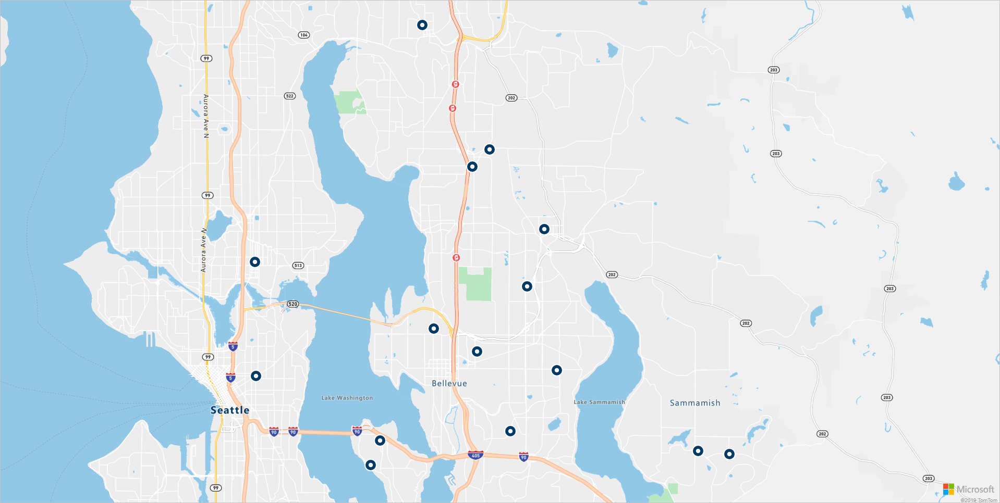
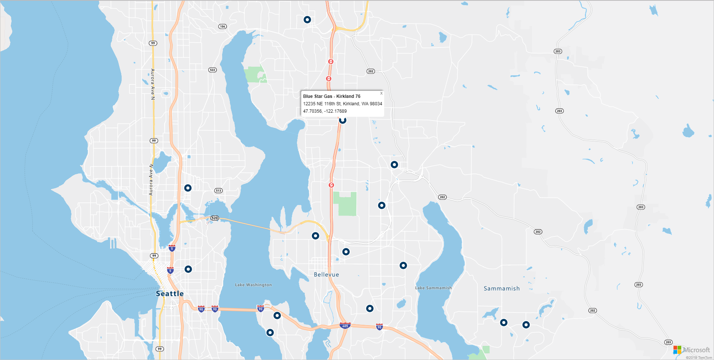

# Search nearby points of interest using Azure Maps

This tutorial shows how to set up an account with Azure Maps, and then use the provided APIs to search for a point of interest. In this tutorial, you learn how to:

> [!div class="checklist"]
> * Create an account with Azure Maps
> * Know the primary key for your Azure Maps account
> * Create a new web page using the map control API
> * Use the Maps search service to find a nearby point of interest

If you don't have an Azure subscription, create a [free account](https://azure.microsoft.com/free/) before you begin.

## Log in to the Azure portal
Log in to the [Azure portal](https://portal.azure.com).

<a id="createaccount"></a>

## Create an account with Azure Maps

Follow these steps to create a new Maps account.

1. In the upper left-hand corner of the [Azure portal](https://portal.azure.com), click **Create a resource**.
2. In the *Search the Marketplace* box, type **Maps**.
3. From the *Results*, select **Maps**. Click **Create** button that appears below the map. 
4. On the **Create Maps Account** page, enter the following values:
    - The *Name* of your new account. 
    - The *Subscription* that you want to use for this account.
    - The *Resource group* name for this account. You may choose to *Create new* or *Use existing* resource group.
    - Select the *Resource group location*.
    - Read the *License* and *Privacy Statement*, and check the checkbox to accept the terms. 
    - Finally, click the **Create** button.
   
    


<a id="getkey"></a>

## Get the primary key for your account

Once your Maps account is successfully created, follow the steps to link it to its map search APIs:

1. Open your Maps account in the portal.
2. Find your account's settings, and select **Keys**.
3. Copy the **Primary Key** to your clipboard. Save it locally to use in the following steps. 

    


<a id="createmap"></a>

## Create a new map 
The Map Control API is a convenient client library that allows you to easily integrate Maps into your web application. It hides the complexity of the bare REST service calls and boosts your productivity with styleable and customizable components. The following steps show you how to create a static HTML page embedded with the Map Control API. 

1. On your local machine, create a new file and name it **MapSearch.html**. 
2. Add the following HTML components to the file:

    ```HTML
    <!DOCTYPE html>
    <html lang="en">

    <head>
        <meta charset="utf-8" />
        <meta name="viewport" content="width=device-width, user-scalable=no" />
        <title>Map Search</title>

        <link rel="stylesheet" href="https://atlas.microsoft.com/sdk/css/atlas.min.css?api-version=1.0" type="text/css" />
        <script src="https://atlas.microsoft.com/sdk/js/atlas.min.js?api-version=1.0"></script>

        <style>
            html,
            body {
                width: 100%;
                height: 100%;
                padding: 0;
                margin: 0;
            }

            #map {
                width: 100%;
                height: 100%;
            }
        </style>
    </head>

    <body>
        <div id="map"></div>
        <script>
            // Embed Map Control JavaScript code here
        </script>
    </body>

    </html>
    ``` 
    Notice that the HTML header includes the CSS and JavaScript resource files hosted by the Azure Map Control library. Note the *script* segment added to the *body* of the HTML file. This segment will contain the inline JavaScript code to access the Azure Maps APIs.
 
3. Add the following JavaScript code to the *script* block of the HTML file. Replace the string **\<your account key\>** with the primary key that you copied from your Maps account.

    ```JavaScript
    // Instantiate map to the div with id "map"
    var MapsAccountKey = "<your account key>";
    var map = new atlas.Map("map", {
        "subscription-key": MapsAccountKey
    });
    ```
    This segment initiates the Map Control API for your Azure Maps account key. **Atlas** is the namespace that contains the API and related visual components. **Atlas.Map** provides the control for a visual and interactive web map. 
    
4. Save your changes to the file and opening the HTML page in a browser. This is the most basic map that you can make, by calling **atlas.map** and providing your account key. 

   


<a id="usesearch"></a>

## Add search capabilities

This section shows how to use the Maps Search API to find a point of interest on your map. It is a RESTful API designed for developers to search for addresses, points of interest, and other geographical information. The Search service assigns a latitude and longitude information to a specified address. 

1. First, add a new layer to your map that will display the search results. Add the following Javascript code to the *script* block, after the code that initializes the map. 

    ```JavaScript
    // Initialize the pin layer for search results to the map
    var searchLayerName = "search-results";
    map.addPins([], {
        name: searchLayerName,
        cluster: false,
        icon: "pin-round-darkblue"
    });
    ```

2. Create an [XMLHttpRequest](https://xhr.spec.whatwg.org/) and add an event handler to parse the JSON response that the Maps Search service sends. This code snippet builds the event handler to collect the addresses, names, and latitude and longitude information for each location returned in the `searchPins` variable. Finally, it adds this collection of location points to the `map` control as pins. 

    ```JavaScript
    // Perform a request to the search service and create a pin on the map for each result
    var xhttp = new XMLHttpRequest();
    xhttp.onreadystatechange = function () {
        var searchPins = [];

        if (this.readyState === 4 && this.status === 200) {
            var response = JSON.parse(this.responseText);

            var poiResults = response.results.filter((result) => { return result.type === "POI" }) || [];

            searchPins = poiResults.map((poiResult) => {
                var poiPosition = [poiResult.position.lon, poiResult.position.lat];
                return new atlas.data.Feature(new atlas.data.Point(poiPosition), {
                    name: poiResult.poi.name,
                    address: poiResult.address.freeformAddress,
                    position: poiResult.position.lat + ", " + poiResult.position.lon
                });
            });

            map.addPins(searchPins, {
                name: searchLayerName
            });

            var lons = searchPins.map((pin) => { return pin.geometry.coordinates[0] });
            var lats = searchPins.map((pin) => { return pin.geometry.coordinates[1] });

            var swLon = Math.min.apply(null, lons);
            var swLat = Math.min.apply(null, lats);
            var neLon = Math.max.apply(null, lons);
            var neLat = Math.max.apply(null, lats);

            map.setCameraBounds({
                bounds: [swLon, swLat, neLon, neLat],
                padding: 50
            });
        }
    };
    ```

3. Finally, add the following code to the *script* block, to build the XMLHttpRequest and send it to the Maps Search service:

    ```JavaScript
    var url = "https://atlas.microsoft.com/search/fuzzy/json?";
    url += "api-version=1.0";
    url += "&query=gasoline%20station";
    url += "&subscription-key=" + MapsAccountKey;
    url += "&lat=47.6292";
    url += "&lon=-122.2337";
    url += "&radius=100000";

    xhttp.open("GET", url, true);
    xhttp.send();
    ``` 
    This snippet uses the basic search API of the Search Service, called the **Fuzzy Search**. It handles the most fuzzy of inputs handling any combination of address or point of interest (POI) tokens. It searches for nearby **gasoline stations** within a specified radius of the given latitude and longitude coordinate. It uses your account's primary key provided earlier in the sample file, to make the call to the Maps. It returns the results as latitude/longitude pairs for the locations found. 
    
4. Save the **MapSearch.html** file, and refresh your browser. You should now see that the map is centered on Seattle, and blue pins mark the locations of gasoline stations in the area. 

   

5. You can see the raw data that the map is rendering by taking the XMLHTTPRequest that you build in the file and entering it in your browser. Replace \<your account key\> with your primary key. 

   ```http
   https://atlas.microsoft.com/search/fuzzy/json?api-version=1.0&query=gasoline%20station&subscription-key=<your account key>&lat=47.6292&lon=-122.2337&radius=100000
   ```

At this point, the MapSearch page can display the locations of points of interest that are returned from a fuzzy search query. Let's add some interactive capabilities and more information about the locations. 

## Add interactive data

The map that we've made so far only looks at the latitude/longitude data for the search results. If you looked at the raw JSON that the Maps Search service returns, however, you see that a lot of information is returned about each gas station, including the name and street address. You can incorporate that data into the map with interactive pop-up boxes. 

1. Add the following lines to the *script* block, to create pop-ups for the points of interest returned by the Search Service:

    ```JavaScript
    // Add a popup to the map which will display some basic information about a search result on hover over a pin
    var popup = new atlas.Popup();
    map.addEventListener("mouseover", searchLayerName, (e) => {
        var popupContentElement = document.createElement("div");
        popupContentElement.style.padding = "5px";

        var popupNameElement = document.createElement("div");
        popupNameElement.innerText = e.features[0].properties.name;
        popupContentElement.appendChild(popupNameElement);

        var popupAddressElement = document.createElement("div");
        popupAddressElement.innerText = e.features[0].properties.address;
        popupContentElement.appendChild(popupAddressElement);

        var popupPositionElement = document.createElement("div");
        popupPositionElement.innerText = e.features[0].properties.name;
        popupContentElement.appendChild(popupPositionElement);

        popup.setPopupOptions({
            position: e.features[0].geometry.coordinates,
            content: popupContentElement
        });

        popup.open(map);
    });
    ```
    The API **atlas.Popup** provides an information window anchored at the required position on the map. This code snippet sets the content and position for the popup, as well as adds an event listener to the `map` control, waiting for the _mouse_ to roll over the popup. 

4. Save the file, refresh your browser. Now the map in the browser shows information pop-ups when you hover over any of the search pins. 

    


## Next steps
In this tutorial, you learned how to:

> [!div class="checklist"]
> * Create an account with Azure Maps
> * Get the primary key for your account
> * Create new web page using Map Control API
> * Use Search Service to find nearby point of interest

> [!div class="nextstepaction"]
> [Route to a point of interest](./tutorial-route-location.md)
