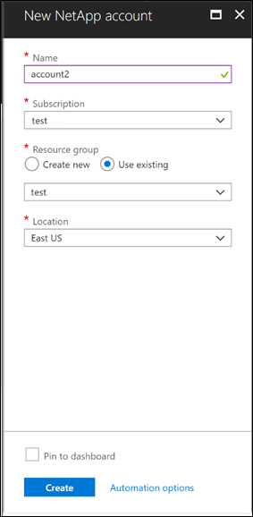

# Create a NetApp account
Creating a NetApp account enables you to set up a capacity pool and subsequently create a volume. You use the Azure NetApp Files blade to create a new NetApp account.

## Before you begin
You must have been whitelisted for accessing the Microsoft.NetApp Azure Resource Provider and configured for using the Azure NetApp Files service.  

[Azure NetApp Files Public Preview survey page](https://aka.ms/nfspublicpreview). 

## Steps 

1. Log in to the [Azure Portal](https://portal.azure.com/).
2.	Access the Azure NetApp Files blade by using one of the following methods:  
  * Search for **Azure NetApp Files** in the Azure Portal search box.  
  * Click **All services** in the navigation, and then filter to Azure NetApp Files.  

  You can "favorite" the Azure NetApp Files blade by clicking the star icon next to it. 

3. Click **+ Add** to create a new NetApp account.  
  The New NetApp account window appears.  

4. Provide the following information for your NetApp account: 
  * **Account name**  
    Specify a unique name for the subscription.
  *  **Subscription**  
    Select a subscription from your existing subscriptions.
  * **Resource group**   
    Use an existing Resource Group or create a new one.
  * **Location**  
    Select the region where you want the account and its child resources to be located.  
    Currently, the Azure NetApp Files service is supported only in the US East region.  

    

5. Click **Create**.     
  The NetApp account you created now appears in the Azure NetApp Files blade. 

## Next steps  

1. [Set up a capacity pool](azure-netapp-files-set-up-capacity-pool.md)
2. [Create a volume for Azure NetApp Files](azure-netapp-files-create-volumes.md)
3. [Configure export policy for a volume (optional)](azure-netapp-files-configure-export-policy.md)
