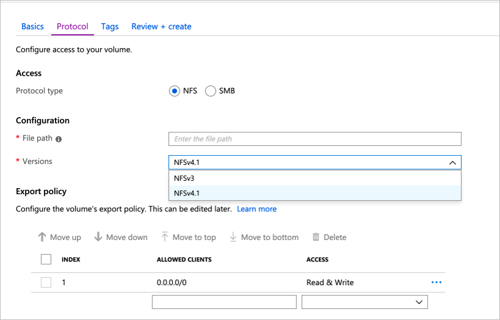
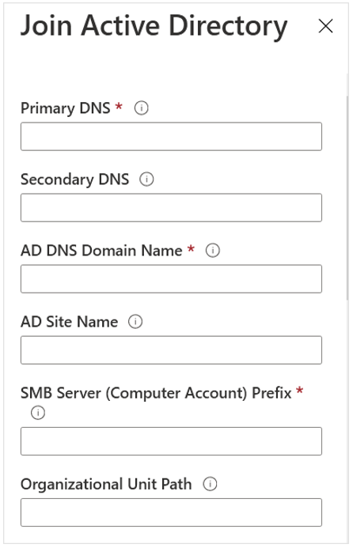
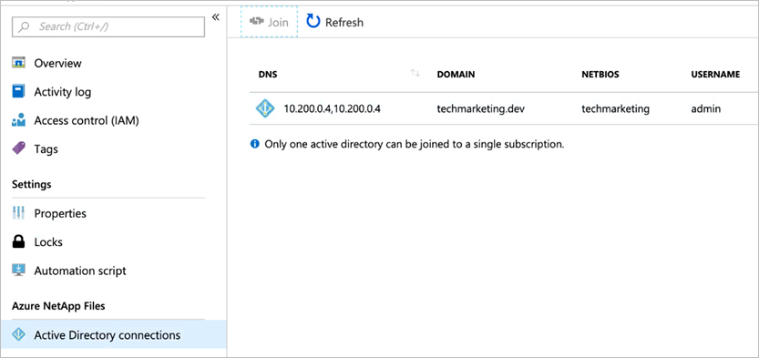
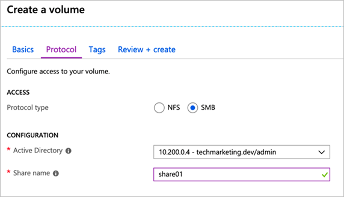

# Create a volume for Azure NetApp Files

Each capacity pool can have a maximum of 500 volumes. A volume's capacity consumption counts against its pool's provisioned capacity. Azure NetApp Files supports NFS and SMBv3 volumes. 

## Before you begin 
You must have already set up a capacity pool.   
[Set up a capacity pool](azure-netapp-files-set-up-capacity-pool.md)   
A subnet must be delegated to Azure NetApp Files.  
[Delegate a subnet to Azure NetApp Files](azure-netapp-files-delegate-subnet.md)

## Create an NFS volume

1.	Click the **Volumes** blade from the Capacity Pools blade. 

    

2.	Click **+ Add volume** to create a volume.  
    The Create a Volume window appears.

3.	In the Create a Volume window, click **Create** and provide information for the following fields:   
    * **Volume name**      
        Specify the name for the volume that you are creating.   

        The name must be unique within a resource group. It must be at least three characters long.  You can use any alphanumeric characters.

    * **Capacity pool**  
        Specify the capacity pool where you want the volume to be created.

    * **Quota**  
        Specify the amount of logical storage that is allocated to the volume.  

        The **Available quota** field shows the amount of unused space in the chosen capacity pool that you can use towards creating a new volume. The size of the new volume must not exceed the available quota.  

    * **Virtual network**  
        Specify the Azure virtual network (Vnet) from which you want to access the volume.  

        The Vnet you specify must have a subnet delegated to Azure NetApp Files. The Azure NetApp Files service can be accessed only from the same Vnet or from a Vnet that is in the same region as the volume through Vnet peering. You can also access the volume from  your on-premise network through Express Route.   

    * **Subnet**  
        Specify the subnet that you want to use for the volume.  
        The subnet you specify must be delegated to Azure NetApp Files. 
        
        If you have not delegated a subnet, you can click **Create new** on the Create a Volume page. Then in the Create Subnet page, specify the subnet information, and select **Microsoft.NetApp/volumes** to delegate the subnet for Azure NetApp Files. In each Vnet, only one subnet can be delegated to Azure NetApp Files.   
 
        
    
        

4. Click **Protocol**, then select **NFS** as the protocol type for the volume.   
    * Specify the **file path** that will be used to create the export path for the new volume. The export path is used to mount and access the volume.

        The file path name can contain letters, numbers, and hyphens ("-") only. It must be between 16 and 40 characters in length.  

    * Optionally, you can [configure export policy for an NFS volume](azure-netapp-files-configure-export-policy.md)

    

5. Click **Review + Create** to review the volume details.  Then click **Create** to create the NFS volume.

    The volume you created appears in the Volumes page. 
 
    A volume inherits subscription, resource group, location attributes from its capacity pool. To monitor the volume deployment status, you can use the Notifications tab.

## Create an SMB volume

Azure NetApp Files supports SMBv3 volumes. You need to create Active Directory connections before adding an SMB volume. 

### Create an Active Directory connection

1. From your NetApp account, click **Active Directory connections**, then click **Join**.  

    

2. In the Join Active Directory window, provide the following information:

    * **Primary DNS**   
        This is the domain controller IP address for the preferred Active Directory Domain Services for use with Azure NetApp Files. 
    * **Secondary DNS**  
        This is the domain controller IP address for the secondary Active Directory Domain Services for use with Azure NetApp Files. 
    * **Domain**  
        This is the domain name of your Active Directory Domain Services that you want to join.
    * **SMB server (computer account) prefix**  
        This is the naming prefix for the machine account in Active Directory that Azure NetApp Files will use for creation of new accounts.

        For example, if the naming standard that your organization uses for file servers is NAS-01, NAS-02..., NAS-045, then you would enter “NAS” for the prefix. 

        The service will create additional machine accounts in Active Directory as needed.

    * **Organizational unit path**  
        This is the LDAP path for the organizational unit (OU) where SMB server machine accounts will be created. That is, OU=second level, OU=first level. 
    * Credentials, including your **username** and **password**

    

3. Click **Join**.  

    The Active Directory connection you created appears.

    

### Add an SMB volume

1. Click the **Volumes** blade from the Capacity Pools blade. 

    

2. Click **+ Add volume** to create a volume.  
    The Create a Volume window appears.

3. In the Create a Volume window, click **Create** and provide information for the following fields:   
    * **Volume name**      
        Specify the name for the volume that you are creating.   

        The name must be unique within a resource group. It must be at least three characters long.  You can use any alphanumeric characters.

    * **File path**  
        Specify the file path that will be used to create the export path for the new volume. The export path is used to mount and access the volume.   
     
        The file path name can contain letters, numbers, and hyphens ("-") only. It must be between 16 and 40 characters in length.  

    * **Capacity pool**  
        Specify the capacity pool where you want the volume to be created.

    * **Quota**  
        Specify the amount of logical storage that is allocated to the volume.  

        The **Available quota** field shows the amount of unused space in the chosen capacity pool that you can use towards creating a new volume. The size of the new volume must not exceed the available quota.  

    * **Virtual network**  
        Specify the Azure virtual network (Vnet) from which you want to access the volume.  

        The Vnet you specify must have a subnet delegated to Azure NetApp Files. The Azure NetApp Files service can be accessed only from the same Vnet or from a Vnet that is in the same region as the volume through Vnet peering. You can also access the volume from  your on-premise network through Express Route.   

    * **Subnet**  
        Specify the subnet that you want to use for the volume.  
        The subnet you specify must be delegated to Azure NetApp Files. 
        
        If you have not delegated a subnet, you can click **Create new** on the Create a Volume page. Then in the Create Subnet page, specify the subnet information, and select **Microsoft.NetApp/volumes** to delegate the subnet for Azure NetApp Files. In each Vnet, only one subnet can be delegated to Azure NetApp Files.   
 
        
    
        

4. Click **Protocol** and complete the following information:  
    * Select **SMB** as the protocol type for the volume. 
    * Select your **Active Directory** connection from the drop-down list.
    * Specify the name of the shared volume in  **Share name**.

    

5. Click **Review + Create** to review the volume details.  Then click **Create** to create the SMB volume.

    The volume you created appears in the Volumes page. 
 
    A volume inherits subscription, resource group, location attributes from its capacity pool. To monitor the volume deployment status, you can use the Notifications tab.

## Next steps  

* [Mount or unmount a volume for Windows or Linux virtual machines](azure-netapp-files-mount-unmount-volumes-for-virtual-machines.md)
* [Configure export policy for an NFS volume](azure-netapp-files-configure-export-policy.md)
* [Learn about virtual network integration for Azure services](https://docs.microsoft.com/azure/virtual-network/virtual-network-for-azure-services)
