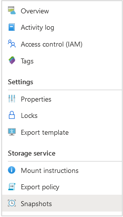
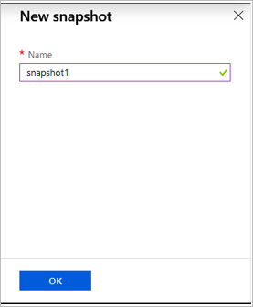
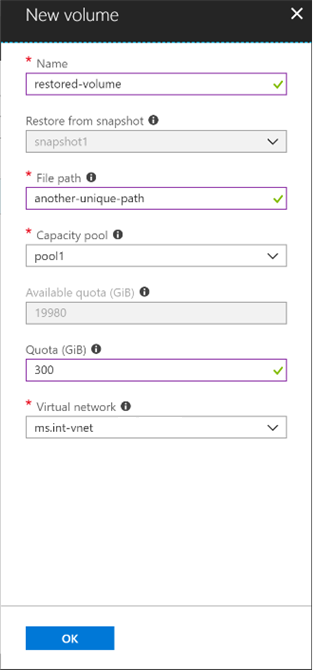

# Manage snapshots by using Azure NetApp Files

You can use Azure NetApp Files to create an on-demand snapshot for a volume or restore from a snapshot to a new volume.

## Create an on-demand snapshot for a volume

You can create snapshots only on demand. Snapshot policies are not currently supported.

1.	From the Volume blade, click **Snapshots**.

    

2.  Click **+ Add snapshot** to create an on-demand snapshot for a volume.

    

3.	In the New Snapshot window, provide a name for the new snapshot that you are creating.   

    

4. Click **OK**. 

## Restore a snapshot to a new volume

Currently, you can restore a snapshot only to a new volume. 
1. Go to the **Manage Snapshots** blade from the Volume blade to display the snapshot list. 
2. Select a snapshot to restore.  
3. Right-click the snapshot name and select **Restore to new volume** from the menu option.  

    

4. In the New Volume window, provide information for the new volume:  
    * **Name**   
        Specify the name for the volume that you are creating.  
        
        The name must be unique within a resource group. It must be at least three characters long.  It can use any alphanumeric characters.

    * **File path**     
        Specify the file path that will be used to create the export path for the new volume. The export path is used to mount and access the volume.   
        
        A mount target is the endpoint of the NFS service IP address. It is automatically generated.   
        
        The file path name can contain letters, numbers, and hyphens ("-") only. It must be between 16 and 40 characters in length. 

    * **Quota**  
        Specify the amount of logical storage that is allocated to the volume.  

        The **Available quota** field shows the amount of unused space in the chosen capacity pool that you can use towards creating a new volume. The size of the new volume must not exceed the available quota.

    *   **Virtual network**  
        Specify the Azure virtual network (Vnet) from which you want to access the volume.  
        The Vnet you specify must have a subnet delegated to Azure NetApp Files. You can access Azure NetApp Files only from the same Vnet or from a Vnet that is in the same region as the volume through Vnet peering. You can access the volume from your on-premises network through Express Route. 

    * **Subnet**  
        Specify the subnet that you want to use for the volume.  
        The subnet you specify must be delegated to the Azure NetApp Files service. 
        You can create a new subnet by selecting **Create new** under the Subnet field.  
   <!--
     
   -->

5. Click **OK**.   
    The new volume to which the snapshot is restored appears in the Volumes blade.

## Next steps

[Understand the storage hierarchy of Azure NetApp Files](azure-netapp-files-understand-storage-hierarchy.md)