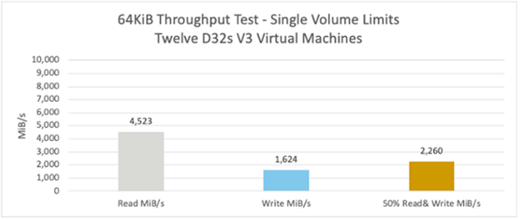
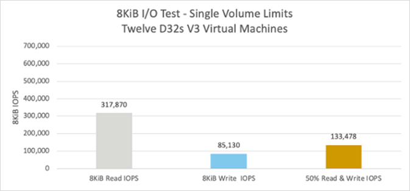
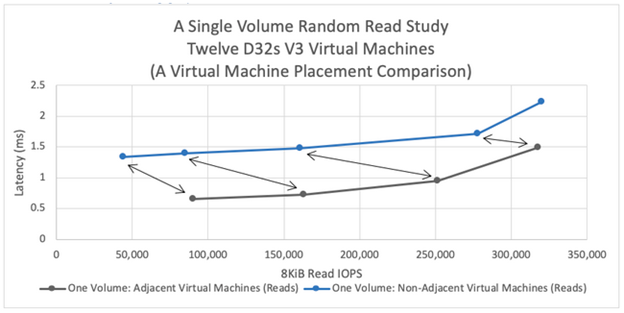

# Performance benchmarks for Azure NetApp Files

This article describes results of performance benchmark tests for Azure NetApp Files at the volume level. 

## Sample application used for the tests

Performance tests were run with a sample application with Azure NetApp Files. The application has the following characteristics: 

* A Linux-based application built for the cloud
* Can scale linearly with added virtual machines (VMs) to increase compute power as needed
* Requires rapid accessibility of the data lake
* Has I/O patterns that are sometimes random and sometimes sequential 
    * A random pattern requires low latency for large amounts of I/O. 
    * A sequential pattern requires large amounts of bandwidth. 

## About the workload generator

The results come from Vdbench summary files. [Vdbench](https://www.oracle.com/technetwork/server-storage/vdbench-downloads-1901681.html) is a command-line utility that generates disk I/O workloads for validating storage performance. The client-server configuration used is scalable.  It includes a single mixed master/client and 14 dedicated client VMs.

## About the tests

The tests were designed to identify the limits that the sample application might have and the response time that curves up to the limits.  

The following tests were run: 

* 100% 8 KiB random read
* 100% 8 KiB random write
* 100% 64 KiB sequential read
* 100% 64 KiB sequential write
* 50% 64 KiB sequential read, 50% 64 KiB sequential write
* 50% 8 KiB random read, 50% 8 KiB random write

## Bandwidth

Azure NetApp Files offers multiple [service levels](azure-netapp-files-service-levels.md). Each service level offers a different amount of bandwidth per TiB of provisioned capacity (storage quota).  Bandwidth for a volume is provisioned based on the combination of the service level and the storage quota.  

The bandwidth test uses the formula below.  With the Premium service level, the volume sampleVol in the test has 4500 MiB/s of provisioned bandwidth.  It has the highest throughput achieved by any workload driven against a single volume: 

## Throughput-intensive workloads

The throughput test used Vdbench and a combination of 12 D32s V3 storage VMs. The volume sampleVol in the test achieved the following throughput numbers:

## I/O-intensive workloads

The I/O test used Vdbench and a combination of 12 D32s V3 storage VMs. The volume sampleVol in the test achieved the following I/O numbers:

## Latency

Azure VMs do not support the concept of availability zones.  So VM placement is nondeterministic.  Reads against a volume can exceed 300,000 IOPS.  The arrows on the following graph connect similar thread counts: 

## Summary

Latency-sensitive workloads (databases) can have a submillisecond response time. The transactional performance can be over 300k IOPS for a single volume. 

Throughput-sensitive applications (for streaming and imaging) can have 4.5GiB/s throughput.  
