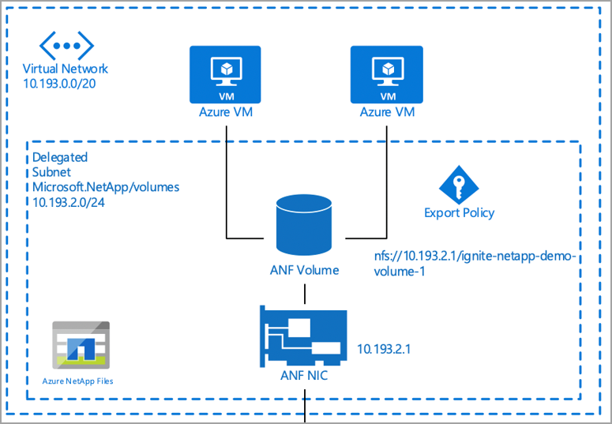
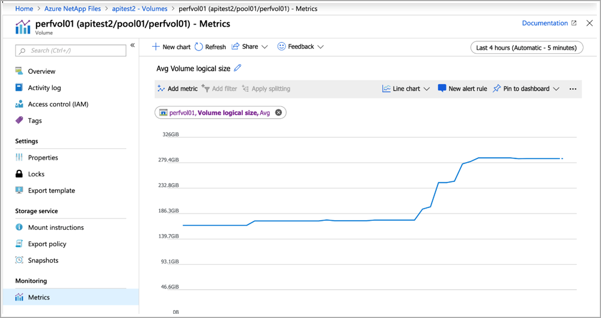
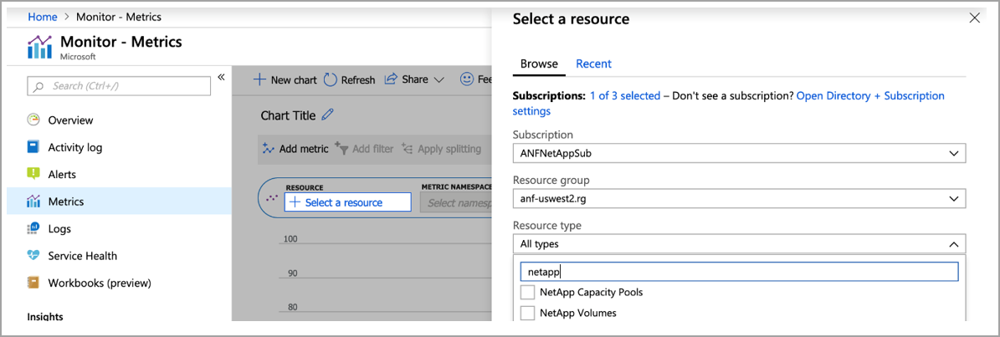

# Benchmark testing for volume performance and metrics using Azure NetApp Files

This article provides benchmark testing recommendations for volume performance and metrics using Azure NetApp Files.

## Overview

To understand the performance characteristics of an Azure NetApp Files volume, you can use the open source tool [FIO](https://github.com/axboe/fio) to run a series of benchmarks to simulate a variety of workloads. FIO can be installed on both Linux and Windows based operating systems.  It is an excellent tool to get a quick snapshot of both IOPS and throughput for a volume.

### VM instance Sizing

For best results, ensure that you are using a virtual machine (VM) instance that is appropriately sized to perform the tests. The following examples use a Standard_D32s_v3 instance. For more information about VM instance sizes, see [Sizes for Windows virtual machines in Azure](https://docs.microsoft.com/azure/virtual-machines/windows/sizes?toc=%2fazure%2fvirtual-network%2ftoc.json) for Windows-based VMs, and [Sizes for Linux virtual machines in Azure](https://docs.microsoft.com/azure/virtual-machines/linux/sizes?toc=%2fazure%2fvirtual-machines%2flinux%2ftoc.json) for Linux-based VMs.

### Azure NetApp Files volume sizing

Ensure that you choose the correct service level and volume quota size for the expected performance level. See [Service levels for Azure NetApp Files](azure-netapp-files-service-levels.md) for more information.

### Virtual Network (VNet) recommendations

You should perform the benchmark testing in the same VNet as Azure NetApp Files. The example below demonstrates the recommendation:

## Installation of FIO

FIO is available in binary format for both Linux and Windows. Follow the Binary Packages section in [FIO](https://github.com/axboe/fio) to install for the platform of your choice.

## FIO examples for IOPS 

The FIO examples in this section use the following setup:
* VM instance size: D32s_v3
* Capacity pool service level and size: Premium / 50 TiB
* Volume quota size: 48 TiB

The following examples show the FIO random reads and writes.

### FIO: 8k block size 100% random reads

`fio --name=8krandomreads --rw=randread --direct=1 --ioengine=libaio --bs=8k --numjobs=4 --iodepth=128 --size=4G --runtime=600 --group_reporting`

### Output: 68k read IOPS displayed

`Starting 4 processes`
`Jobs: 4 (f=4): [r(4)][84.4%][r=537MiB/s,w=0KiB/s][r=68.8k,w=0 IOPS][eta 00m:05s]`

### FIO: 8k block size 100% random writes

`fio --name=8krandomwrites --rw=randwrite --direct=1 --ioengine=libaio --bs=8k --numjobs=4 --iodepth=128  --size=4G --runtime=600 --group_reporting`

### Output: 73k write IOPS displayed

`Starting 4 processes`
`Jobs: 4 (f=4): [w(4)][26.7%][r=0KiB/s,w=571MiB/s][r=0,w=73.0k IOPS][eta 00m:22s]`

## FIO examples for bandwidth

The examples in this section show the FIO sequential reads and writes.

### FIO: 64k block size 100% sequential reads

`fio --name=64kseqreads --rw=read --direct=1 --ioengine=libaio --bs=64k --numjobs=4 --iodepth=128  --size=4G --runtime=600 --group_reporting`

### Output: 11.8 Gbit/s throughput displayed

`Starting 4 processes`
`Jobs: 4 (f=4): [R(4)][40.0%][r=1313MiB/s,w=0KiB/s][r=21.0k,w=0 IOPS][eta 00m:09s]`

### FIO: 64k block size 100% sequential writes

`fio --name=64kseqwrites --rw=write --direct=1 --ioengine=libaio --bs=64k --numjobs=4 --iodepth=128  --size=4G --runtime=600 --group_reporting`

### Output: 12.2 Gbit/s throughput displayed

`Starting 4 processes`
`Jobs: 4 (f=4): [W(4)][85.7%][r=0KiB/s,w=1356MiB/s][r=0,w=21.7k IOPS][eta 00m:02s]`

## Volume metrics

Azure NetApp Files performance data is available through Azure Monitor counters. The counters are available via the Azure portal and REST API GET requests. 

You can view historical data for the following information:
* Average read latency 
* Average write latency 
* Read IOPS (average)
* Write IOPS (average)
* Volume logical size (average)
* Volume snapshot size (average)

### Using Azure Monitor 

You can access Azure NetApp Files counters on a per-volume basis from the Metrics page, as shown below:

You can also create a dashboard in Azure Monitor for Azure NetApp Files by going to the Metrics page, filtering for NetApp, and specifying the volume counters of interest: 

### Azure Monitor API access

You can access Azure NetApp Files counters by using REST API calls. See [Supported metrics with Azure Monitor: Microsoft.NetApp/netAppAccounts/capacityPools/Volumes](https://docs.microsoft.com/azure/azure-monitor/platform/metrics-supported#microsoftnetappnetappaccountscapacitypoolsvolumes) for counters for capacity pools and volumes.

The following example shows a GET URL for viewing logical volume size:

`#get ANF volume usage`
`curl -X GET -H "Authorization: Bearer TOKENGOESHERE" -H "Content-Type: application/json" https://management.azure.com/subscriptions/SUBIDGOESHERE/resourceGroups/RESOURCEGROUPGOESHERE/providers/Microsoft.NetApp/netAppAccounts/ANFACCOUNTGOESHERE/capacityPools/ANFPOOLGOESHERE/Volumes/ANFVOLUMEGOESHERE/providers/microsoft.insights/metrics?api-version=2018-01-01&metricnames=VolumeLogicalSize`

## Next steps

- [Service levels for Azure NetApp Files](azure-netapp-files-service-levels.md)
- [Performance benchmarks for Azure NetApp Files](azure-netapp-files-performance-benchmarks.md)