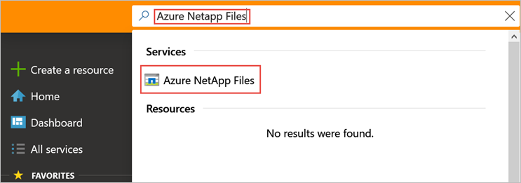
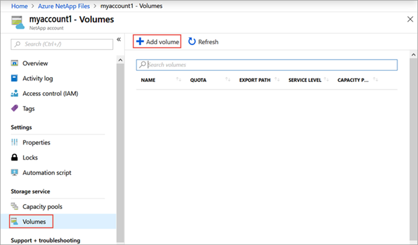
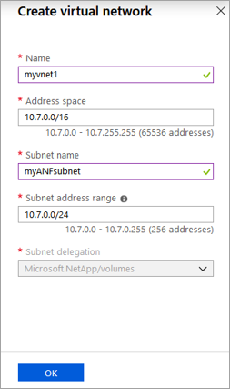
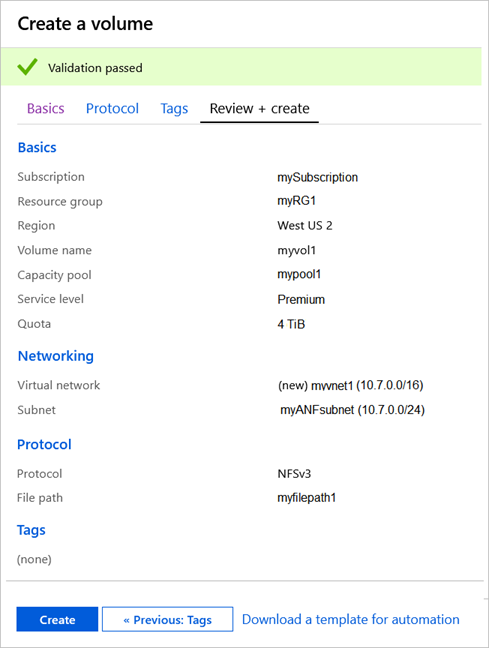
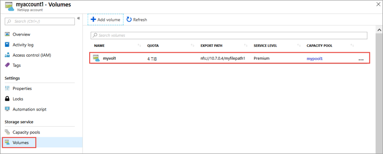

# Quickstart: Set up Azure NetApp Files and create an NFS volume 

This article shows you how to quickly set up Azure NetApp Files and create a volume. 

In this quickstart, you will set up the following items:

- Registration for Azure NetApp Files and NetApp Resource Provider
- A NetApp account
- A capacity pool
- An NFS volume for Azure NetApp Files

If you don't have an Azure subscription, create a [free account](https://azure.microsoft.com/free/?WT.mc_id=A261C142F) before you begin.

## Before you begin 

> [!IMPORTANT] 
> You need to be granted access to the Azure NetApp Files service.  To request access to the service, see the [Azure NetApp Files waitlist submission page](https://forms.office.com/Pages/ResponsePage.aspx?id=v4j5cvGGr0GRqy180BHbR8cq17Xv9yVBtRCSlcD_gdVUNUpUWEpLNERIM1NOVzA5MzczQ0dQR1ZTSS4u).  You must wait for an official confirmation email from the Azure NetApp Files team before continuing. 

[!INCLUDE [cloud-shell-try-it.md](../../includes/cloud-shell-try-it.md)]

---

## Register for Azure NetApp Files and NetApp Resource Provider

> [!NOTE]
> The registration process can take some time to complete.
>

# [Portal](#tab/azure-portal)

For registration steps using Portal, open a Cloud Shell session as indicated above and follow these Azure CLI steps:

[!INCLUDE [azure-netapp-files-cloudshell-include](../../includes/azure-netapp-files-azure-cloud-shell-window.md)]

# [PowerShell](#tab/azure-powershell)

This how-to article requires the Azure PowerShell module Az version 2.6.0 or later. Run `Get-Module -ListAvailable Az` to find your current version. If you need to install or upgrade, see [Install Azure PowerShell module](/powershell/azure/install-Az-ps). If you prefer, you can use Cloud Shell console in a PowerShell session instead.

1. In a PowerShell command prompt (or PowerShell Cloud Shell session), specify the subscription that has been whitelisted for Azure NetApp Files:
    ```powershell-interactive
    Select-AzSubscription -Subscription <subscriptionId>
    ```

2. Register the Azure Resource Provider:
    ```powershell-interactive
    Register-AzResourceProvider -ProviderNamespace Microsoft.NetApp
    ```

# [Azure CLI](#tab/azure-cli)

[!INCLUDE [azure-netapp-files-cloudshell-include](../../includes/azure-netapp-files-azure-cloud-shell-window.md)]

---

## Create a NetApp account

# [Portal](#tab/azure-portal)

1. In the Azure portal’s search box, enter **Azure NetApp Files** and then select **Azure NetApp Files** from the list that appears.

      

2. Click **+ Add** to create a new NetApp account.

     

3. In the New NetApp Account window, provide the following information: 
   1. Enter **myaccount1** for the account name. 
   2. Select your subscription.
   3. Select **Create new** to create new resource group. Enter **myRG1** for the resource group name. Click **OK**. 
   4. Select your account location.  

        

      

4. Click **Create** to create your new NetApp account.

# [PowerShell](#tab/azure-powershell)

1. Define some variables so we can refer to them throughout the rest of the examples:

    ```powershell-interactive
    $resourceGroup = "myRG1"
    $location = "eastus"
    $anfAccountName = "myaccount1"
    ``` 

    > [!NOTE]
    > Please refer to [Products available by region](https://azure.microsoft.com/en-us/global-infrastructure/services/?products=netapp&regions=all) for a list of supported regions.
    > To obtain the region name that is supported by our command line tools, please use `Get-AzLocation | select Location`
    >

1. Create a new resource group by using the [New-AzResourceGroup](/powershell/module/az.resources/new-azresourcegroup) command:

    ```powershell-interactive
    New-AzResourceGroup -Name $resourceGroup -Location $location
    ```

2. Create Azure NetApp Files account with [New-AzNetAppFilesAccount](/powershell/module/az.netappfiles/New-AzNetAppFilesAccount) command:
   
    ```powershell-interactive
    New-AzNetAppFilesAccount -ResourceGroupName $resourceGroup -Location $location -Name $anfAccountName
    ```

# [Azure CLI](#tab/azure-cli)

1. Define some variables so we can refer to them throughout the rest of the examples:

    ```azurecli-interactive
    RESOURCE_GROUP="myRG1"
    LOCATION="eastus"
    ANF_ACCOUNT_NAME="myaccount1"
    ``` 

    > [!NOTE]
    > Please refer to [Products available by region](https://azure.microsoft.com/en-us/global-infrastructure/services/?products=netapp&regions=all) for a list of supported regions.
    > To obtain the region name that is supported by our command line tools, please use `az account list-locations -query "[].{Region:name}" --out table`
    >

2. Create a new resource group by using the [az group create](/cli/azure/group#az-group-create) command:

    ```azurecli-interactive
    az group create \
        --name $RESOURCE_GROUP \
        --location $LOCATION
    ```

3. Create Azure NetApp Files account with [az netappfiles account create](/cli/azure/netappfiles/account#az-netappfiles-account-create) command:
   
    ```azurecli-interactive
    az netappfiles account create \
        --resource-group $RESOURCE_GROUP \
        --location $LOCATION \
        --account-name $ANF_ACCOUNT_NAME
    ```
---

## Set up a capacity pool

# [Portal](#tab/azure-portal)

1. From the Azure NetApp Files management blade, select your NetApp account (**myaccount1**).

      

2. From the Azure NetApp Files management blade of your NetApp account, click **Capacity pools**.

      

3. Click **+ Add pools**. 

      

4. Provide information for the capacity pool: 
    1. Enter **mypool1** as the pool name.
    2. Select **Premium** for the service level. 
    3. Specify **4 (TiB)** as the pool size. 

5. Click **OK**.

# [PowerShell](#tab/azure-powershell)

1. Defining some new variables for future reference

    ```powershell-interactive
    $poolName = "mypool1"
    $poolSizeBytes = 4398046511104 # 4TiB
    $serviceLevel = "Premium" # Valid values are Standard, Premium and Ultra
    ```

1. Create a new capacity pool by using the [New-AzNetAppFilesPool](/powershell/module/az.netappfiles/new-aznetappfilespool)

    ```powershell-interactive
    New-AzNetAppFilesPool -ResourceGroupName $resourceGroup -Location $location -AccountName $anfAccountName -Name $poolName -PoolSize $poolSizeBytes -ServiceLevel $serviceLevel
    ```

# [Azure CLI](#tab/azure-cli)

1. Defining some new variables for future reference

    ```azurecli-interactive
    POOL_NAME="mypool1"
    POOL_SIZE_TiB=4 # Size in Azure CLI needs to be in TiB unit (minimum 4 TiB)
    SERVICE_LEVEL="Premium" # Valid values are Standard, Premium and Ultra
    ```

2. Create a new capacity pool by using the [az netappfiles pool create](/cli/azure/netappfiles/pool#az-netappfiles-pool-create) 

    ```azurecli-interactive
    az netappfiles pool create \
        --resource-group $RESOURCE_GROUP \
        --location $LOCATION \
        --account-name $ANF_ACCOUNT_NAME \
        --pool-name $POOL_NAME \
        --size $POOL_SIZE_TiB \
        --service-level $SERVICE_LEVEL
    ```

---

## Create NFS volume for Azure NetApp Files

# [Portal](#tab/azure-portal)

1. From the Azure NetApp Files management blade of your NetApp account, click **Volumes**.

      

2. Click **+ Add volume**.

      

3. In the Create a Volume window, provide information for the volume: 
   1. Enter **myvol1** as the volume name. 
   2. Select your capacity pool (**mypool1**).
   3. Use the default value for quota. 
   4. Under virtual network, click **Create new** to create a new Azure virtual network (Vnet).  Then fill in the following information:
       * Enter **myvnet1** as the Vnet name.
       * Specify an address space for your setting, for example, 10.7.0.0/16
       * Enter **myANFsubnet** as the subnet name.
       * Specify the subnet address range, for example, 10.7.0.0/24. You cannot share the dedicated subnet with other resources.
       * Select **Microsoft.NetApp/volumes** for subnet delegation.
       * Click **OK** to create the Vnet.
   5. In subnet, select the newly created Vnet (**myvnet1**) as the delegate subnet.

        

        

4. Click **Protocol**, and then complete the following actions: 
    * Select **NFS** as the protocol type for the volume.  
    * Enter **myfilepath1** as the file path that will be used to create the export path for the volume.  
    * Select the NFS version (**NFSv3** or **NFSv4.1**) for the volume.  

    

5. Click **Review + create**.

      

6. Review information for the volume, then click **Create**.  
    The created volume appears in the Volumes blade.

      

# [PowerShell](#tab/azure-powershell)

1. Create a subnet delegation to "Microsoft.NetApp/volumes" with [New-AzDelegation](/powershell/module/az.network/new-azdelegation) command.

    ```powershell-interactive
    $anfDelegation = New-AzDelegation -Name ([guid]::NewGuid().Guid) -ServiceName "Microsoft.NetApp/volumes"
    ```

2. Create a subnet configuration by using [New-AzVirtualNetworkSubnetConfig](/powershell/module/az.network/new-azvirtualnetworksubnetconfig) command.

    ```powershell-interactive
    $subnet = New-AzVirtualNetworkSubnetConfig -Name "myANFSubnet" -AddressPrefix "10.7.0.0/24" -Delegation $anfDelegation
    ```

3. Create the virtual network by using the [New-AzVirtualNetwork](/powershell/module/az.network/new-azvirtualnetwork) command.
    
    ```powershell-interactive
    $vnet = New-AzVirtualNetwork -Name "myvnet1" -ResourceGroupName $resourceGroup -Location $location -AddressPrefix "10.7.0.0/16" -Subnet $subnet
    ```

4. Create the volume by using the [New-AzNetAppFilesVolume](/powershell/module/az.netappfiles/new-aznetappfilesvolume) command.
   
    ```powershell-interactive
    $volumeSizeBytes = 1099511627776 # 100GiB
    $subnetId = $vnet.Subnets[0].Id

    New-AzNetAppFilesVolume -ResourceGroupName $resourceGroup `
        -Location $location `
        -AccountName $anfAccountName `
        -PoolName $poolName `
        -Name "myvol1" `
        -UsageThreshold $volumeSizeBytes `
        -SubnetId $subnetId `
        -CreationToken "myfilepath1" `
        -ServiceLevel $serviceLevel `
        -ProtocolType NFSv3
    ```

# [Azure CLI](#tab/azure-cli)

1. Defining some variables for later usage.
    
    ```azurecli-interactive
    VNET_NAME="myvnet1"
    SUBNET_NAME="myANFSubnet"
    ```

1. Create virtual network without subnet by using the [az network vnet create](/cli/azure/network/vnet#az-network-vnet-create) command.
    
    ```azurecli-interactive
    az network vnet create \
        --resource-group $RESOURCE_GROUP \
        --name $VNET_NAME \
        --location $LOCATION \
        --address-prefix "10.7.0.0/16"

    ```

2. Create a delegated subnet by using [az network vnet subnet create](/cli/azure/network/vnet/subnet#az-network-vnet-subnet-create) command.

    ```azurecli-interactive
    az network vnet subnet create \
        --resource-group $RESOURCE_GROUP \
        --vnet-name $VNET_NAME \
        --name $SUBNET_NAME \
        --address-prefixes "10.7.0.0/24" \
        --delegations "Microsoft.NetApp/volumes"
    ```

3. Create the volume by using the [az netappfiles volume create](/cli/azure/netappfiles/volume#az-netappfiles-volume-create) command.
   
    ```azurecli-interactive
    VNET_ID=$(az network vnet show --resource-group $RESOURCE_GROUP --name $VNET_NAME --query "id" -o tsv)
    SUBNET_ID=$(az network vnet subnet show --resource-group $RESOURCE_GROUP --vnet-name $VNET_NAME --name $SUBNET_NAME --query "id" -o tsv)
    VOLUME_SIZE_GiB=100 # 100 GiB
    UNIQUE_FILE_PATH="myfilepath2" # Please note that creation token needs to be unique within all ANF Accounts

    az netappfiles volume create \
        --resource-group $RESOURCE_GROUP \
        --location $LOCATION \
        --account-name $ANF_ACCOUNT_NAME \
        --pool-name $POOL_NAME \
        --name "myvol1" \
        --service-level $SERVICE_LEVEL \
        --vnet $VNET_ID \
        --subnet $SUBNET_ID \
        --usage-threshold $VOLUME_SIZE_GiB \
        --creation-token $UNIQUE_FILE_PATH \
        --protocol-types "NFSv3"
    ```

---

## Clean up resources

# [Portal](#tab/azure-portal)

When you are done and if you want to, you can delete the resource group. The action of deleting a resource group is irreversible.  

> [!IMPORTANT]
> All resources within the resource groups will be permanently deleted and cannot be undone. 

1. In the Azure portal’s search box, enter **Azure NetApp Files** and then select **Azure NetApp Files** from the list that appears.

2. In the list of subscriptions, click the resource group (myRG1) you want to delete. 

    


3. In the resource group page, click **Delete resource group**.

     

    A window opens and displays a warning about the resources that will be deleted with the resource group.

4. Enter the name of the resource group (myRG1) to confirm that you want to permanently delete the resource group and all resources in it, and then click **Delete**.

     

# [PowerShell](#tab/azure-powershell)

When you are done and if you want to, you can delete the resource group. The action of deleting a resource group is irreversible.  

> [!IMPORTANT]
> All resources within the resource groups will be permanently deleted and cannot be undone.

1. Delete resource group by using the [Remove-AzResourceGroup](/powershell/module/az.resources/remove-azresourcegroup) command.
   
    ```powershell-interactive
    Remove-AzResourceGroup -Name $resourceGroup
    ```

# [Azure CLI](#tab/azure-cli)

When you are done and if you want to, you can delete the resource group. The action of deleting a resource group is irreversible.  

> [!IMPORTANT]
> All resources within the resource groups will be permanently deleted and cannot be undone.

1. Delete resource group by using the [az group delete](/cli/azure/group#az-group-delete) command.
   
    ```azurecli-interactive
    az group delete \
        --name $RESOURCE_GROUP
    ```
---

## Next steps  

> [!div class="nextstepaction"]
> [Manage volumes by using Azure NetApp Files](azure-netapp-files-manage-volumes.md)  
