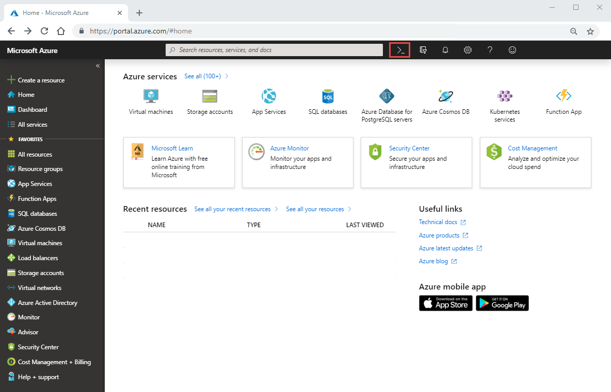
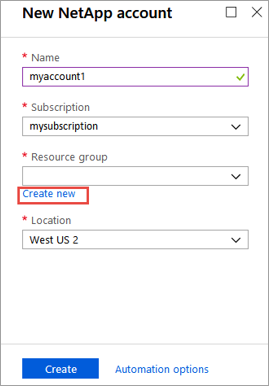
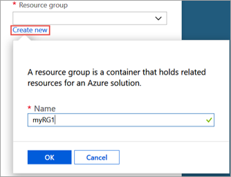
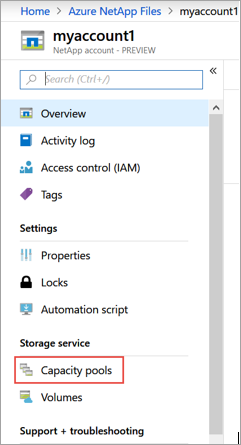
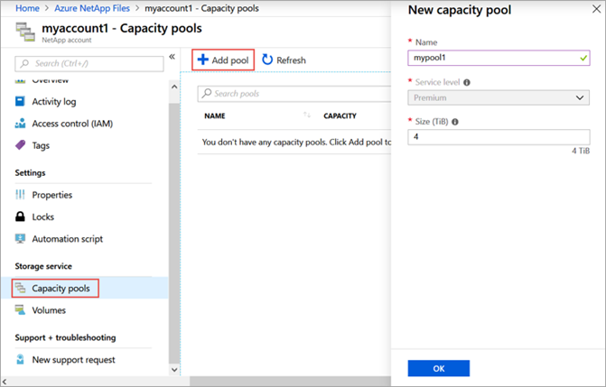
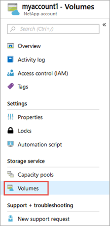
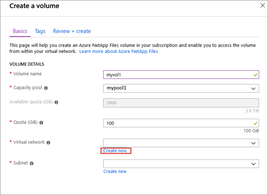
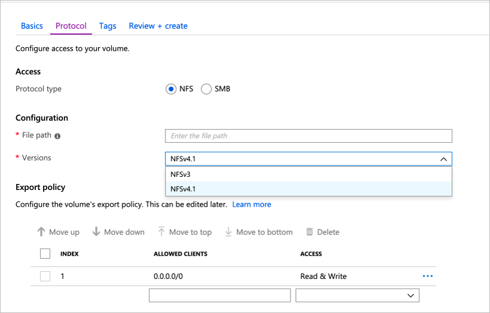

# Quickstart: Set up Azure NetApp Files and create an NFS volume 

This article shows you how to quickly set up Azure NetApp Files and create a volume. 

In this quickstart, you will set up the following items:

- Registration for Azure NetApp Files and NetApp Resource Provider
- A NetApp account
- A capacity pool
- An NFS volume for Azure NetApp Files

If you don't have an Azure subscription, create a [free account](https://azure.microsoft.com/free/?WT.mc_id=A261C142F) before you begin.

## Before you begin 

You need to be part of the Public Preview program and whitelisted for accessing the Microsoft.NetApp Resource Provider. For details about joining the Public Preview program, see the [Azure NetApp Files Public Preview signup page](https://aka.ms/nfspublicpreview). 

## Register for Azure NetApp Files and NetApp Resource Provider

1. From the Azure portal, click the Azure Cloud Shell icon on the upper right-hand corner.

    

2. Specify the subscription that has been whitelisted for Azure NetApp Files:
    
        az account set --subscription <subscriptionId>

3. Register the Azure Resource Provider: 
    
        az provider register --namespace Microsoft.NetApp --wait  

    The registration process can take some time to complete.

## Create a NetApp account

1. In the Azure portal’s search box, enter **Azure NetApp Files** and then select **Azure NetApp Files (preview)** from the list that appears.

      

2. Click **+ Add** to create a new NetApp account.

     

3. In the New NetApp Account window, provide the following information: 
   1. Enter **myaccount1** for the account name. 
   2. Select your subscription.
   3. Select **Create new** to create new resource group. Enter **myRG1** for the resource group name. Click **OK**. 
   4. Select your account location.  

        

      

4. Click **Create** to create your new NetApp account.

## Set up a capacity pool

1. From the Azure NetApp Files management blade, select your NetApp account (**myaccount1**).

      

2. From the Azure NetApp Files management blade of your NetApp account, click **Capacity pools**.

      

3. Click **+ Add pools**. 

      

4. Provide information for the capacity pool: 
    1. Enter **mypool1** as the pool name.
    2. Select **Premium** for the service level. 
    3. Specify **4 (TiB)** as the pool size. 

5. Click **OK**.

## Create an NFS volume for Azure NetApp Files

1. From the Azure NetApp Files management blade of your NetApp account, click **Volumes**.

      

2. Click **+ Add volume**.

      

3. In the Create a Volume window, provide information for the volume: 
   1. Enter **myvol1** as the volume name. 
   3. Select your capacity pool (**mypool1**).
   4. Use the default value for quota. 
   5. Under virtual network, click **Create new** to create a new Azure virtual network (Vnet).  Then fill in the following information:
       * Enter **myvnet1** as the Vnet name.
       * Specify an address space for your setting, for example, 10.7.0.0/16
       * Enter **myANFsubnet** as the subnet name.
       * Specify the subnet address range, for example, 10.7.0.0/24. Note that you cannot share the dedicated subnet with other resources.
       * Select **Microsoft.NetApp/volumes** for subnet delegation.
       * Click **OK** to create the Vnet.
   6. In subnet, select the newly created Vnet (**myvnet1**) as the delegate subnet.

        

        

4. Click **Protocol**, then select **NFS** as the protocol type for the volume.   

    Enter **myfilepath1** as the file path that will be used to create the export path for the volume. 

    

5. Click **Review + create**.

      

5. Review information for the volume, then click **Create**.  
    The created volume appears in the Volumes blade.

      

## Clean up resources

When you are done and if you want to, you can delete the resource group. The action of deleting a resource group is irreversible.  

  > IMPORTANT:  
  > All resources within the resource groups will be permanently deleted and cannot be undone. 
1. In the Azure portal’s search box, enter **Azure NetApp Files** and then select **Azure NetApp Files** from the list that appears.

2. In the list of subscriptions, click the resource group (myRG1) you want to delete. 

    

3. In the resource group page, click **Delete resource group**.

     

    A window opens and displays a warning about the resources that will be deleted with the resource group.

4. Enter the name of the resource group (myRG1) to confirm that you want to permanently delete the resource group and all resources in it, and then click **Delete**.

     

## Next steps  

> [!div class="nextstepaction"]
> [Manage volumes by using Azure NetApp Files](azure-netapp-files-manage-volumes.md)  
