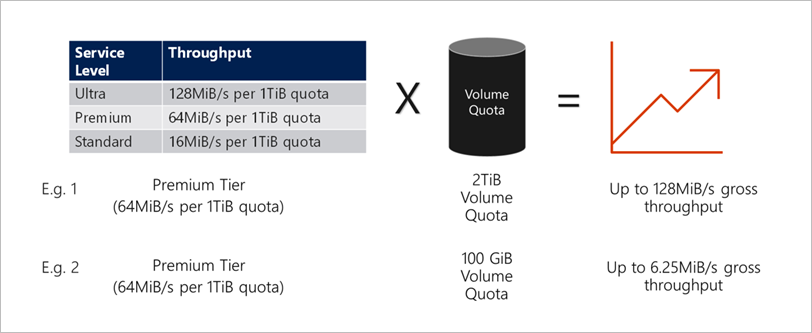

# Service levels for Azure NetApp Files
Service levels are an attribute of a capacity pool. Service levels are defined and differentiated by the allowed maximum throughput for a volume in the capacity pool based on the quota that is assigned to the volume.

## Supported service levels

Azure NetApp Files supports three service levels: *Ultra*, *Premium*, and *Standard*. 

* Ultra storage

    The Ultra storage tier provides up to 128 MiB/s of throughput per 1 TiB of volume quota assigned. 

* Premium storage

    The Premium storage tier provides up to 64 MiB/s of throughput per 1 TiB of volume quota assigned. 

* Standard storage

    The Standard storage tier provides up to 16 MiB/s of throughput per 1 TiB of volume quota assigned.

## Throughput limits

The throughput limit for a volume is determined by the combination of the following factors:
* The service level of the capacity pool to which the volume belongs
* The quota assigned to the volume  

This concept is illustrated in the diagram below:

In Example 1 above, a volume from a capacity pool with the Premium storage tier that is assigned 2 TiB of quota will be assigned a throughput limit of 128 MiB/s (2 TiB * 64 MiB/s). This scenario applies regardless of the capacity pool size or the actual volume consumption.

In Example 2 above, a volume from a capacity pool with the Premium storage tier that is assigned 100 GiB of quota will be assigned a throughput limit of 6.25 MiB/s (0.09765625 TiB * 64 MiB/s). This scenario applies regardless of the capacity pool size or the actual volume consumption.

## Next steps

- See the [Azure NetApp Files pricing page](https://azure.microsoft.com/pricing/details/storage/netapp/) for the price of different service levels
- See [Cost model for Azure NetApp Files](azure-netapp-files-cost-model.md) for the calculation of the capacity consumption in a capacity pool 
- [Set up a capacity pool](azure-netapp-files-set-up-capacity-pool.md)
- See [Service Level Agreement (SLA) for Azure NetApp Files](https://azure.microsoft.com/support/legal/sla/netapp/)