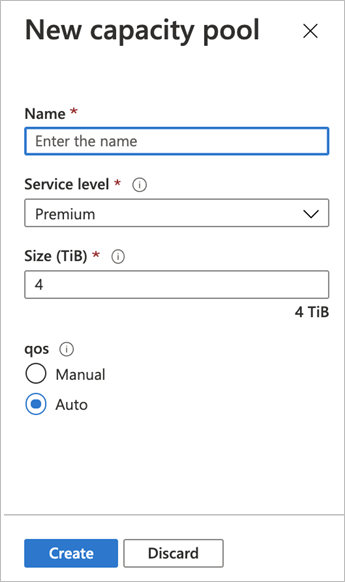

# Set up a capacity pool

In this article:

- [Prerequisites](#prerequisites)  
- [Create an NFS volume](#create_an_nfs_volume)  
- [Create a mount target](#create_a_mount_target)
- [Optional: Configure export policy](#configure_export_policy)

## Prerequisites

1. You must have a storage account.  
    [Create a storage account](../common/storage-quickstart-create-account.md)
2. You must have set up a capacity pool.

## Create an NFS volume

1.	From the navigation pane of the [Azure Portal](https://portal.azure.com/), select **More services** on the lower left-hand corner.
2.	In the More Services submenu, filter to **NFS volumes**.  
    You can "favorite" the NFS volumes view by clicking the star icon next to it.
3.	Click **+Add** to create an NFS volume.
4.	In the New NFS volume window, click **Create** and provide the required information:  

    

    The fields are as follows:
    - `Name`  
        This is the name of the NFS volume you are creating. It must be unique within a resource group.  
        The name must be at least 3 characters long.  It can use any alphanumeric characters.  
    - `File path`  
        The file path is used to create the export path for the new NFS volume. The export path is used to mount and access the NFS volume.  
        A mount target is the end point of the NFS service IP address. It is automatically generated.  
        The file path name can contain letters, numbers and hyphens ("-") only. It must be between 16 and 40 characters in length.  
    - `Service level`  
        This is the target performance for the NFS volume that is being created.
    - `Provisioned size`  
        This is the amount of logical storage in GB that is allocated to the NFS volume.  
    - `Subscription`  
        This is the Azure subscription that is to be associated with the NFS volume.  
    - `Resource group`  
        This is the resource group that is to be associated with the NFS volume.  
    - `Location`  
        This is the location where the NFS volume is created.  
    - `Virtual network`  
        This is the Azure virtual network (Vnet) from which you want to access the NFS volume. Azure NFS Service can be accessed only from a Vnet that is in the same location as the NFS volume.  

    To monitor the NFS volume deployment status, you can use the Notifications tab.

## Create a mount target
The Azure NetApp Files functionality enables you to use an NFS volume in multiple Azure Vnets by creating mount targets. The default mount target is created when an NFS volume is created.

1.	From the NFS volumes view, select the NFS volume for which you want to create a mount target.
2.	Click **Mount Targets** from the selected NFS volume to go to the Manage Mount Target view.
3.	Click **+Add** in the Manage Mount Target view.
4.	Enter parameters for the new NFS mount target:       
    - `The name of the mount target`  
        The mount target name must be at least 3 characters long. It can use any alphanumeric characters. The name must be unique within a resource group.
    - `Virtual network`  
        This is the Azure virtual network (Vnet) where you want the mount target to use.

## Optional: Configure export policy
    ~~~~~~~~~~ NEED DETAILS ~~~~~~~~~~