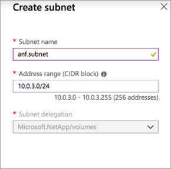
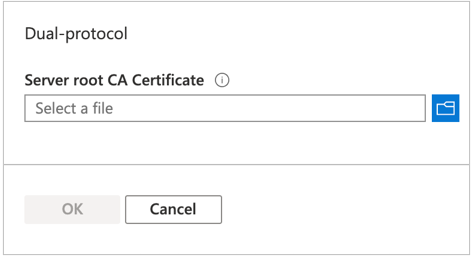
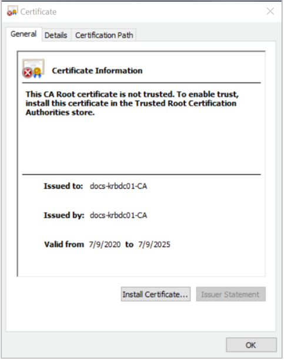

# Create a dual-protocol (NFSv3 and SMB) volume for Azure NetApp Files

Azure NetApp Files supports creating volumes using NFS (NFSv3 and NFSv4.1), SMBv3, or dual protocol. This article shows you how to create a volume that uses the dual protocol of NFSv3 and SMB with support for LDAP user mapping.  

## Before you begin 

* You must have already set up a capacity pool.  
    See [Set up a capacity pool](azure-netapp-files-set-up-capacity-pool.md).   
* A subnet must be delegated to Azure NetApp Files.  
    See [Delegate a subnet to Azure NetApp Files](azure-netapp-files-delegate-subnet.md).

## Considerations

* Ensure that you meet the [Requirements for Active Directory connections](azure-netapp-files-create-volumes-smb.md#requirements-for-active-directory-connections). 
* Ensure that the NFS client is up-to-date and running the latest updates for the operating system.

## Create a dual-protocol volume

1.	Click the **Volumes** blade from the Capacity Pools blade. Click **+ Add volume** to create a volume. 

     

2.	In the Create a Volume window, click **Create**, and provide information for the following fields:   
    * **Volume name**      
        Specify the name for the volume that you are creating.   

        A volume name must be unique within each capacity pool. It must be at least three characters long. You can use any alphanumeric characters.   

        You cannot use `default` as the volume name.

    * **Capacity pool**  
        Specify the capacity pool where you want the volume to be created.

    * **Quota**  
        Specify the amount of logical storage that is allocated to the volume.  

        The **Available quota** field shows the amount of unused space in the chosen capacity pool that you can use towards creating a new volume. The size of the new volume must not exceed the available quota.  

    * **Virtual network**  
        Specify the Azure virtual network (VNet) from which you want to access the volume.  

        The Vnet you specify must have a subnet delegated to Azure NetApp Files. The Azure NetApp Files service can be accessed only from the same Vnet or from a Vnet that is in the same region as the volume through Vnet peering. You can also access the volume from  your on-premises network through Express Route.   

    * **Subnet**  
        Specify the subnet that you want to use for the volume.  
        The subnet you specify must be delegated to Azure NetApp Files. 
        
        If you have not delegated a subnet, you can click **Create new** on the Create a Volume page. Then in the Create Subnet page, specify the subnet information, and select **Microsoft.NetApp/volumes** to delegate the subnet for Azure NetApp Files. In each Vnet, only one subnet can be delegated to Azure NetApp Files.   
 
        
    
        

    * If you want to apply an existing snapshot policy to the volume, click **Show advanced section** to expand it, and select a snapshot policy in the pull-down menu. 

        For information about creating a snapshot policy, see [Manage snapshot policies](azure-netapp-files-manage-snapshots.md#manage-snapshot-policies).

        

3. Click **Protocol**, and then complete the following actions:  
    * Select **dual-protocol (NFSv3 and SMB)** as the protocol type for the volume.   

    * Select the **Active Directory** connection from the drop-down list.  
    The Active Directory you use must have a server root CA certificate. 

    * Specify the **Volume path** for the volume.   
    This volume path is the name of the shared volume. The name must start with an alphabetical character, and it must be unique within each subscription and each region.  

    * Specify the **Security Style** to use: NTFS (default) or UNIX.

    * Optionally, [configure export policy for the NFS volume](azure-netapp-files-configure-export-policy.md).

    

4. Click **Review + Create** to review the volume details. Then click **Create** to create the volume.

    The volume you created appears in the Volumes page. 
 
    A volume inherits subscription, resource group, location attributes from its capacity pool. To monitor the volume deployment status, you can use the Notifications tab.

## Upload Active Directory Certificate Authority public root certificate  

1.	Follow [Install the Certification Authority](https://docs.microsoft.com/windows-server/networking/core-network-guide/cncg/server-certs/install-the-certification-authority) to install and configure ADDS Certificate Authority. 

2.	Follow [View certificates with the MMC snap-in](https://docs.microsoft.com/dotnet/framework/wcf/feature-details/how-to-view-certificates-with-the-mmc-snap-in) to use the MMC snap-in and the Certificate Manager tool.  
    Use the Certificate Manager snap-in to locate the root or issuing certificate for the local device.  
    You should run the Certificate Management snap-in commands from one of the following settings:  
    * A Windows based client that has joined the domain and has the root certificate installed 
    * Another machine in the domain containing the root certificate  

3. Export the root certificate.  
    Ensure that the certificate is exported in the Base-64 encoded X.509 (.CER) format: 

    

4. Go to the NetApp account of the dual-protocol volume, click **Active Directory connections**, and upload the root CA certificate by using the **Join Active Directory** window:  

    

    Ensure that the certificate authority name can be resolved by DNS. This name is the "Issued By" or "Issuer" field on the certificate:  

    

## Manage LDAP POSIX Attributes

You can manage POSIX attributes such as UID, Home Directory, and other values by using the Active Directory Users and Computers MMC snap-in.  The following example shows the Active Directory Attribute Editor:  

 

## Configure the NFS client 

Follow instructions in [Configure an NFS client for Azure NetApp Files](configure-nfs-clients.md) to configure the NFS client.  

## Next steps  

* [Dual-protocol FAQs](azure-netapp-files-faqs.md#dual-protocol-faqs)
* [Configure an NFS client for Azure NetApp Files](configure-nfs-clients.md) 
