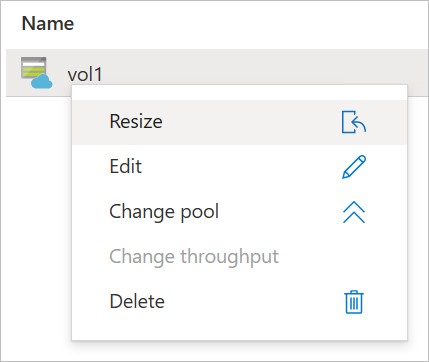

# Delete volume replications or volumes

This article describes how to delete volume replications. It also describes how to delete the source or destination volume.

## Delete volume replications

You can terminate the replication connection between the source and the destination volumes by deleting volume replication. You must delete the replication from the destination volume. The delete operation removes only authorization for replication; it does not remove the source or the destination volume. 

1. Ensure that the replication peering has been broken before you delete volume replication.    
    See [Display health status of replication relationship](cross-region-replication-display-health-status.md) and [Break replication peering](cross-region-replication-manage-disaster-recovery.md#break-replication-peering).  

1. To delete volume replication, select **Replication** from the source or the destination volume.  

2. Click **Delete**.    

3. Confirm deletion by typing **Yes** and clicking **Delete**.   

    

## Delete source or destination volumes

If you want to delete the source or destination volume, you must perform the following steps in the described order. Otherwise, the `Volume with replication cannot be deleted` error occurs.  

1. From the destination volume, [break the replication peering](cross-region-replication-manage-disaster-recovery.md#break-replication-peering) and then [delete the volume replication](#delete-volume-replications).   

2. Delete the destination or source volume as needed by right-click the volume name and select **Delete**.   

    

## Next steps  

* [Cross-region replication](cross-region-replication-introduction.md)
* [Requirements and considerations for using cross-region replication](cross-region-replication-requirements-considerations.md)
* [Display health status of replication relationship](cross-region-replication-display-health-status.md)
* [Troubleshoot cross-region-replication](troubleshoot-cross-region-replication.md)

