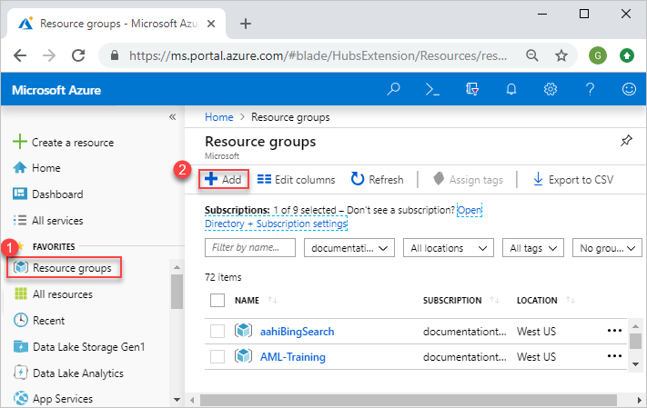
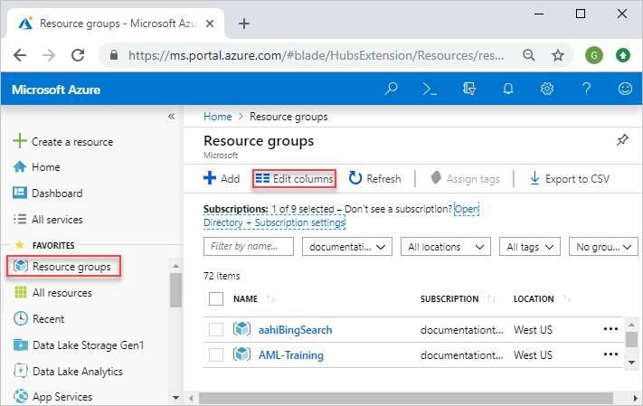

# Manage Azure Resource Manager resource groups by using the Azure portal

Learn how to use the [Azure portal](https://portal.azure.com) with [Azure Resource Manager](resource-group-overview.md) to manage your Azure resource groups.

For managing Azure resources, see [Manage Azure resources by using the Azure portal](./manage-resources-portal.md).

Other articles about managing resource groups:

- [Manage Azure resource groups by using Azure CLI](./manage-resources-cli.md)
- [Manage Azure resource groups by using Azure PowerShell](./manage-resources-powershell.md)

## What is a resource group

A resource group is a container that holds related resources for an Azure solution. The resource group can include all the resources for the solution, or only those resources that you want to manage as a group. You decide how you want to allocate resources to resource groups based on what makes the most sense for your organization. Generally, add resources that share the same lifecycle to the same resource group so you can easily deploy, update, and delete them as a group.

The resource group stores metadata about the resources. Therefore, when you specify a location for the resource group, you are specifying where that metadata is stored. For compliance reasons, you may need to ensure that your data is stored in a particular region.

## Create resource groups

1. Sign in to the [Azure portal](https://portal.azure.com).
2. Select **Resource groups**

    
3. Select **Add**.
4. Enter the following values:

    **Subscription**: Select your Azure subscription. 
    **Resource group**: Enter a new resource group name. 
    **Region**: Select an Azure location, such as **Central US**.

    
5. Select **Review + Create**
6. Select **Create**. It takes a few seconds to create a resource group.
7. Select **Refresh** from the top menu to refresh the resource group list, and then select the newly created resource group to open it. Or select **Notification**(the bell icon) from the top, and then select **Go to resource group** to open the newly created resource group

    

## List resource groups

1. Sign in to the [Azure portal](https://portal.azure.com).
2. To list the resource groups, select **Resource groups**

    

3. To customize the information displayed for the resource groups, select **Edit columns**. The following screenshot shows the addition columns you could add to the display:

## Delete resource groups

[!INCLUDE [Handle personal data](../../includes/gdpr-intro-sentence.md)]

1. Sign in to the [Azure portal](https://portal.azure.com).
2. Select **Resource groups**
3. Select the resource group you want to delete.
4. Select **Delete resource group**.

    

## Deploy resources to a resource group

You can use the Azure portal with Azure Resource Manager to deploy your Azure resources.  For more information, see [Deploy resources with Resource Manager templates and Azure portal](resource-group-template-deploy-portal.md).

## Move to another resource group

You can move the resources in the group to another resource group. For more information, see [Move resources to new resource group or subscription](resource-group-move-resources.md).

## Move to another subscription

You can move the resources in the resource group to another subscription. For more information, see [Move resources to new resource group or subscription](resource-group-move-resources.md).

## Lock resource groups

## Tag resource groups

You can apply tags to resource groups and resources to logically organize your assets. For information, see [Using tags to organize your Azure resources](./resource-group-using-tags.md#portal).

## Export resource groups to templates

After setting up your resource group, you may want to view the Resource Manager template for the resource group. Exporting the template offers two benefits:

1. You can easily automate future deployments of the solution because the template contains all the complete infrastructure.
2. You can become familiar with template syntax by looking at the JavaScript Object Notation (JSON) that represents your solution.

For step-by-step guidance, see [Export Azure Resource Manager template from existing resources](./resource-manager-export-template.md).

## Next steps

* To view activity logs, see [Audit operations with Resource Manager](resource-group-audit.md).
* To view details about a deployment, see [View deployment operations](resource-manager-deployment-operations.md).
* To deploy resources through the portal, see [Deploy resources with Resource Manager templates and Azure portal](resource-group-template-deploy-portal.md).
* To manage access to resources, see [Use role assignments to manage access to your Azure subscription resources](../role-based-access-control/role-assignments-portal.md).
* For guidance on how enterprises can use Resource Manager to effectively manage subscriptions, see [Azure enterprise scaffold - prescriptive subscription governance](/azure/architecture/cloud-adoption-guide/subscription-governance).