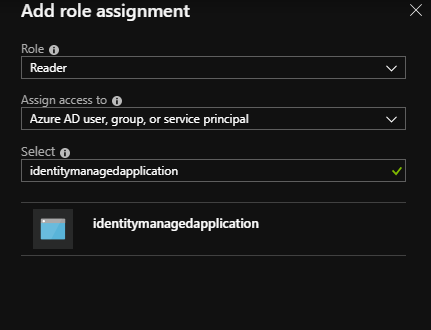
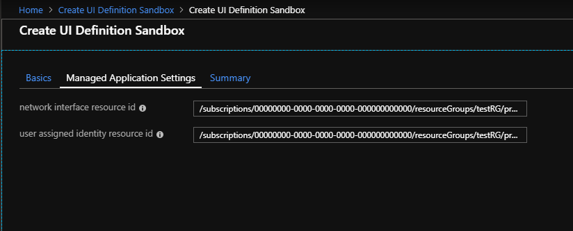

# Azure Managed Application with Managed Identity

> [!NOTE]
> Managed Identity support for Managed Applications is currently in preview. Please use the 2018-09-01-preview api version to utilize Managed Identity.

Learn how to configure a Managed Application to contain a Managed Identity. Managed Identity can be used to allow the customer to grant the Managed Application access to additional existing resources. The identity is managed by the Azure platform and does not require you to provision or rotate any secrets. For more about managed identities in Azure Active Directory (AAD), see [Managed identities for Azure resources](../../active-directory/managed-identities-azure-resources/overview.md).

Your application can be granted two types of identities:

- A **system-assigned identity** is tied to your application and is deleted if your app is deleted. An app can only have one system-assigned identity.
- A **user-assigned identity** is a standalone Azure resource that can be assigned to your app. An app can have multiple user-assigned identities.

## How to use Managed Identity

Managed Identity enables many scenarios for Managed Applications. Some common scenarios that can be solved are:

- Deploying a Managed Application linked to existing Azure resources. An example is deploying an Azure virtual machine (VM) within the Managed Application that is attached to an [existing network interface](../../virtual-network/virtual-network-network-interface-vm.md).
- Granting the Managed Application and publisher access to Azure resources outside the **managed resource group**.
- Providing an operational identity of Managed Applications for Activity Log and other services within Azure.

## Adding Managed Identity

Creating a Managed Application with a Managed Identity requires an additional property to be set on the Azure resource. The following example shows a sample **identity** property:

```json
{
"identity": {
    "type": "SystemAssigned, UserAssigned",
    "userAssignedIdentities": {
        "/subscriptions/00000000-0000-0000-0000-000000000000/resourceGroups/testRG/providers/Microsoft.ManagedIdentity/userassignedidentites/myuserassignedidentity": {}
    }
}
```

There are two common ways to create a Managed Application with **identity**: [CreateUIDefinition.json](./create-uidefinition-overview.md) and [Azure Resource Manager templates](../templates/template-syntax.md). For simple single create scenarios, CreateUIDefinition should be used to enable Managed Identity, because it provides a richer experience. However, when dealing with advanced or complex systems that require automated or multiple Managed Application deployments, templates can be used.

### Using CreateUIDefinition

A Managed Application can be configured with Managed Identity through the [CreateUIDefinition.json](./create-uidefinition-overview.md). In the [outputs section](./create-uidefinition-overview.md#outputs), the key `managedIdentity` can be used to override the identity property of the Managed Application template. The sample bellow will enable **system-assigned** identity on the Managed Application. More complex identity objects can be formed by using CreateUIDefinition elements to ask the consumer for inputs. These inputs can be used to construct Managed Applications with **user-assigned identity**.

```json
"outputs": {
    "managedIdentity": "[parse('{\"Type\":\"SystemAssigned\"}')]"
}
```

#### When to use CreateUIDefinition for Managed Identity

Below are some recommendations on when to use CreateUIDefinition for enabling Managed Identity on Managed Applications.

- The Managed Application creation goes through the Azure portal or marketplace.
- The Managed Identity requires complex consumer input.
- The Managed Identity is needed on creation of the Managed Application.

#### SystemAssigned CreateUIDefinition

A basic CreateUIDefinition that enables the SystemAssigned identity for the Managed Application.

```json
{
  "$schema": "https://schema.management.azure.com/schemas/0.1.2-preview/CreateUIDefinition.MultiVm.json#",
  "handler": "Microsoft.Azure.CreateUIDef",
  "version": "0.1.2-preview",
    "parameters": {
        "basics": [
            {}
        ],
        "steps": [
        ],
        "outputs": {
            "managedIdentity": "[parse('{\"Type\":\"SystemAssigned\"}')]"
        }
    }
}
```

#### UserAssigned CreateUIDefinition

A basic CreateUIDefinition that takes a **user-assigned identity** resource as input and enables the UserAssigned identity for the Managed Application.

```json
{
  "$schema": "https://schema.management.azure.com/schemas/0.1.2-preview/CreateUIDefinition.MultiVm.json#",
  "handler": "Microsoft.Azure.CreateUIDef",
  "version": "0.1.2-preview",
    "parameters": {
        "basics": [
            {}
        ],
        "steps": [
            {
                "name": "manageIdentity",
                "label": "Identity",
                "subLabel": {
                    "preValidation": "Manage Identities",
                    "postValidation": "Done"
                },
                "bladeTitle": "Identity",
                "elements": [
                    {
                        "name": "userAssignedText",
                        "type": "Microsoft.Common.TextBox",
                        "label": "User assigned managed identity",
                        "defaultValue": "/subscriptions/00000000-0000-0000-0000-000000000000/resourceGroups/testRG/providers/Microsoft.ManagedIdentity/userassignedidentites/myuserassignedidentity",
                        "visible": true
                    }
                ]
            }
        ],
        "outputs": {
            "managedIdentity": "[parse(concat('{\"Type\":\"UserAssigned\",\"UserAssignedIdentities\":{',string(steps('manageIdentity').userAssignedText),':{}}}'))]"
        }
    }
}
```

The CreateUIDefinition.json above generates a create user experience that has a textbox for a consumer to enter the **user-assigned identity** Azure resource ID. The generated experience would look like:


### Using Azure Resource Manager templates

> [!NOTE]
> Marketplace Managed Application templates are automatically generated for customers going through the Azure portal create experience.
> For these scenarios, the `managedIdentity` output key on the CreateUIDefinition must be used to enabled identity.

The Managed Identity can also be enabled through Azure Resource Manager templates. The sample bellow will enable **system-assigned** identity on the Managed Application. More complex identity objects can be formed by using Azure Resource Manager template parameters to provide inputs. These inputs can be used to construct Managed Applications with **user-assigned identity**.

#### When to use Azure Resource Manager templates for Managed Identity

Below are some recommendations on when to use Azure Resource Manager templates for enabling Managed Identity on Managed Applications.

- Managed Applications can be programmatically deployed based on a template.
- Custom role assignments for the Managed Identity are needed to provision the Managed Application.
- The Managed Application does not need the Azure portal and marketplace creation flow.

#### SystemAssigned template

A basic Azure Resource Manager template that deploys a Managed Application with **system-assigned** identity.

```json
"resources": [
    {
        "type": "Microsoft.Solutions/applications",
        "name": "[parameters('applicationName')]",
        "apiVersion": "2018-09-01-preview",
        "location": "[parameters('location')]",
        "identity": {
            "type": "SystemAssigned"
        },
        "properties": {
            "ManagedResourceGroupId": "[parameters('managedByResourceGroupId')]",
            "parameters": { }
        }
    }
]
```

### UserAssigned template

A basic Azure Resource Manager template that deploys a Managed Application with a **user-assigned identity**.

```json
"resources": [
    {
      "type": "Microsoft.ManagedIdentity/userAssignedIdentities",
      "name": "[parameters('managedIdentityName')]",
      "apiVersion": "2018-11-30",
      "location": "[parameters('location')]"
    },
    {
        "type": "Microsoft.Solutions/applications",
        "name": "[parameters('applicationName')]",
        "apiVersion": "2018-09-01-preview",
        "location": "[parameters('location')]",
        "identity": {
            "type": "UserAssigned",
            "userAssignedIdentities": {
                "[resourceID('Microsoft.ManagedIdentity/userAssignedIdentities/',parameters('managedIdentityName'))]": {}
            }
        },
        "properties": {
            "ManagedResourceGroupId": "[parameters('managedByResourceGroupId')]",
            "parameters": { }
        }
    }
]
```

## Granting access to Azure resources

Once a Managed Application is granted an identity, it can be granted access to existing azure resources. This process can be done through the Access control (IAM) interface in the Azure portal. The name of the Managed Application or **user-assigned identity** can be searched to add a role assignment.



## Linking existing Azure resources

> [!NOTE]
> A **user-assigned identity** must be [configured](../../active-directory/managed-identities-azure-resources/how-to-manage-ua-identity-portal.md) before deploying the Managed Application. In addition, linked resource deployment of Managed Applications is only supported for the **marketplace** kind.

Managed Identity can also be used to deploy a Managed Application that requires access to existing resources during its deployment. When the Managed Application is provisioned by the customer, **user-assigned identities** can be added to provide additional authorizations to the **mainTemplate** deployment.

### Authoring the CreateUIDefinition with a linked resource

When linking the deployment of the Managed Application to existing resources, both the existing Azure resource and a **user-assigned identity** with the applicable role assignment on that resource must be provided.

 A sample CreateUIDefinition that requires two inputs: a network interface resource ID and a user assigned identity resource id.

```json
{
    "$schema": "https://schema.management.azure.com/schemas/0.1.2-preview/CreateUIDefinition.MultiVm.json#",
    "handler": "Microsoft.Compute.MultiVm",
    "version": "0.1.2-preview",
    "parameters": {
        "basics": [
            {}
        ],
        "steps": [
            {
                "name": "managedApplicationSetting",
                "label": "Managed Application Settings",
                "subLabel": {
                    "preValidation": "Managed Application Settings",
                    "postValidation": "Done"
                },
                "bladeTitle": "Managed Application Settings",
                "elements": [
                    {
                        "name": "networkInterfaceId",
                        "type": "Microsoft.Common.TextBox",
                        "label": "network interface resource id",
                        "defaultValue": "/subscriptions/00000000-0000-0000-0000-000000000000/resourceGroups/testRG/providers/Microsoft.Network/networkInterfaces/existingnetworkinterface",
                        "toolTip": "Must represent the identity as an Azure Resource Manager resource identifer format ex. /subscriptions/sub1/resourcegroups/myGroup/providers/Microsoft.Network/networkInterfaces/networkinterface1",
                        "visible": true
                    },
                    {
                        "name": "userAssignedId",
                        "type": "Microsoft.Common.TextBox",
                        "label": "user assigned identity resource id",
                        "defaultValue": "/subscriptions/00000000-0000-0000-0000-000000000000/resourceGroups/testRG/providers/Microsoft.ManagedIdentity/userassignedidentites/myuserassignedidentity",
                        "toolTip": "Must represent the identity as an Azure Resource Manager resource identifer format ex. /subscriptions/sub1/resourcegroups/myGroup/providers/Microsoft.ManagedIdentity/userAssignedIdentities/identity1",
                        "visible": true
                    }
                ]
            }
        ],
        "outputs": {
            "existingNetworkInterfaceId": "[steps('managedApplicationSetting').networkInterfaceId]",
            "managedIdentity": "[parse(concat('{\"Type\":\"UserAssigned\",\"UserAssignedIdentities\":{',string(steps('managedApplicationSetting').userAssignedId),':{}}}'))]"
        }
    }
}
```

This CreateUIDefinition.json generates a create user experience that has two fields. The first field allows the user to enter in the Azure resource ID for the resource being linked to the Managed Application deployment. The second is for a consumer to enter the **user-assigned identity** Azure resource ID, which has access to the linked Azure resource. The generated experience would look like:



### Authoring the mainTemplate with a linked resource

In addition to updating the CreateUIDefinition, the main template also needs to be updated to accept the passed in linked resource ID. The main template can be updated to accept the new output by adding a new parameter. Since the `managedIdentity` output overrides the value on the generated Managed Application template, it is not passed to the main template and should not be included in the parameters section.

A sample main template that sets the network profile to an existing network interface provided by the CreateUIDefinition.

```json
{
    "$schema": "https://schema.management.azure.com/schemas/2015-01-01/deploymentTemplate.json#",
    "contentVersion": "1.0.0.0",
    "parameters": {
      "existingNetworkInterfaceId": { "type": "string" }
    },
    "variables": {
    },
    "resources": [
        {
            "apiVersion": "2016-04-30-preview",
            "type": "Microsoft.Compute/virtualMachines",
            "name": "myLinkedResourceVM",
            "location": "[resourceGroup().location]",
            "properties": {
                …,
                "networkProfile": {
                    "networkInterfaces": [
                        {
                            "id": "[parameters('existingNetworkInterfaceId')]"
                        }
                    ]
                }
            }
        }
    ]
}
```

### Consuming the Managed Application with a linked resource

Once the Managed Application package is created, the Managed Application can be consumed through the Azure portal. Before it can be consumed, there are several prerequisite steps.

- An instance of the required linked Azure resource must be created.
- The **user-assigned identity** must be [created and given role assignments](../../active-directory/managed-identities-azure-resources/how-to-manage-ua-identity-portal.md) to the linked resource.
- The existing linked resource ID and the **user-assigned identity** ID are provided to the CreateUIDefinition.

## Accessing the Managed Identity token

The token of the Managed Application can now be accessed through the `listTokens` api from the publisher tenant. An example request might look like:

``` HTTP
POST https://management.azure.com/subscriptions/{subscriptionId}/resourceGroups/{resourceGroup}/providers/Microsoft.Solutions/applications/{applicationName}/listTokens?api-version=2018-09-01-preview HTTP/1.1

{
    "authorizationAudience": "https://management.azure.com/",
    "userAssignedIdentities": [
        "/subscriptions/{subscriptionId}/resourceGroups/{resourceGroup}/providers/Microsoft.ManagedIdentity/userAssignedIdentities/{userAssignedIdentityName}"
    ]
}
```

Request Body Parameters:

Parameter | Required | Description
---|---|---
authorizationAudience | *no* | The App ID URI of the target resource. It also is the `aud` (audience) claim of the issued token. The default value is "https://management.azure.com/"
userAssignedIdentities | *no* | The list of user-assigned managed identities to retrieve a token for. If not specified, `listTokens` will return the token for the system-assigned managed identity.


A sample response might look like:

``` HTTP
HTTP/1.1 200 OK
Content-Type: application/json

{
    "value": [
        {
            "access_token": "eyJ0eXAi…",
            "expires_in": "2…",
            "expires_on": "1557…",
            "not_before": "1557…",
            "authorizationAudience": "https://management.azure.com/",
            "resourceId": "/subscriptions/{subscriptionId}/resourceGroups/{resourceGroup}/providers/Microsoft.Solutions/applications/{applicationName}",
            "token_type": "Bearer"
        }
    ]
}
```

The response will contain an array of tokens under the `value` property:

Parameter | Description
---|---
access_token | The requested access token.
expires_in | The number of seconds the access token will be valid.
expires_on | The timespan when the access token expires. This is represented as the number of seconds from epoch.
not_before | The timespan when the access token takes effect. This is represented as the number of seconds from epoch.
authorizationAudience | The `aud` (audience) the access token was request for. This is the same as what was provided in the `listTokens` request.
resourceId | The Azure resource ID for the issued token. This is either the managed application ID or the user-assigned identity ID.
token_type | The type of the token.

## Next steps

> [!div class="nextstepaction"]
> [How to configure a Managed Application with a Custom Provider](../custom-providers/overview.md)
