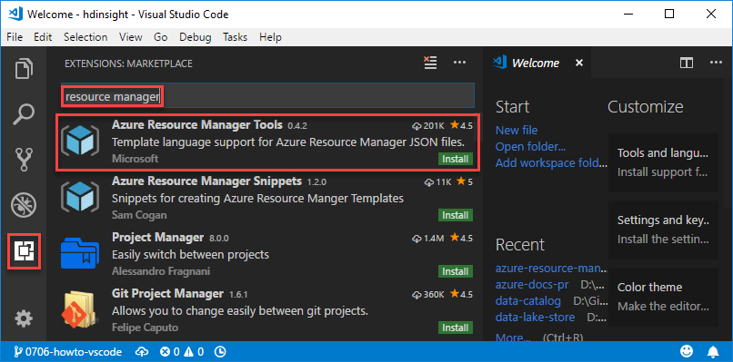
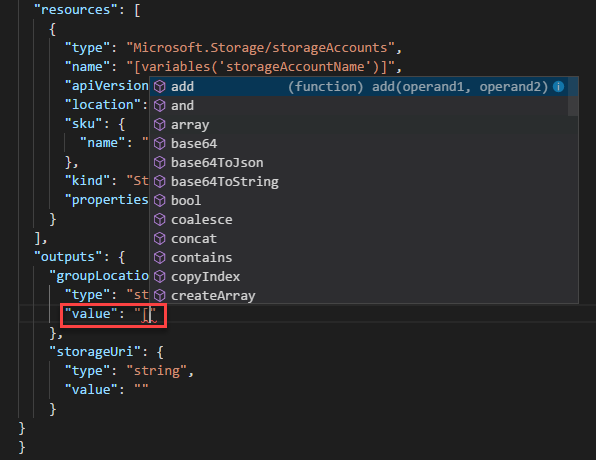
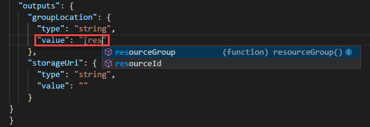
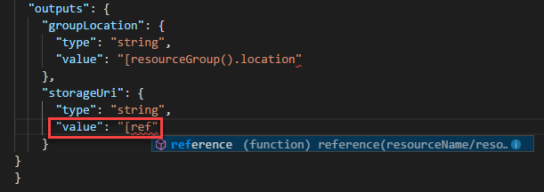

---
title: Use Visual Studio code to create Azure Resource Manager template | Microsoft Docs
description: Use the Azure Resource Manager tools extension to work on Resource Manager templates.
services: azure-resource-manager
documentationcenter: ''
author: mumian
manager: dougeby
editor: tysonn

ms.service: azure-resource-manager
ms.workload: multiple
ms.tgt_pltfrm: na
ms.devlang: na
ms.date: 07/06/2018
ms.topic: conceptual
ms.author: jgao
---

# Use Visual Studio Code to create Azure Resource Manager templates 

Learn how to create Azure Resource Manager templates by using Visual Studio code and the Azure Resource Manager Tools extension. You can create Resource Manager templates in VS Code without the extension, but the extension provides autocomplete options that simplify template development. It suggests template functions, parameters, and variables that are available in the template. To understand the concepts associated with deploying and managing your Azure solutions, see [Azure Resource Manager overview](resource-group-overview.md).

## Prerequisites

To complete this article, you need:

- [Visual Studio Code](https://code.visualstudio.com/).

## Install the extension

1. Open Visual Studio Code.
2. Press **CTRL+SHIFT+X** or select the extensions icon as shown in the following screenshot:

   
3. Search for **Azure Resource Manager Tools**, and then select **Install** as shown in the previous screenshot
4. Select **Reload** to finish the extension installation.

## Create or open a template

To create a new template file, select **File** > **New File** from Visual Studio Code.

In this article, you open an existing template from [Azure Quickstart templates](https://azure.microsoft.com/en-us/resources/templates/). The template is called [Create a standard storage account](https://azure.microsoft.com/resources/templates/101-storage-account-create/).

1. From Visual Studio Code, select **File**>**Open File**.
2. In **File name**, paste the following URL:

    ```
    https://raw.githubusercontent.com/Azure/azure-quickstart-templates/master/101-storage-account-create/azuredeploy.json
    ```
3. Select **Open** to open the file.
4. Select **File**>**Save As** to save a copy of the file in your local computer.

## Edit the template

The extension provides the IntelliSense for

- Template Language Expression (TLE) function names
- Parameter references
- Variable references
- resourceGroup() properties
- subscription() properties
- Properties of references to variables that are objects

1. From Visual Studio Code, replace the output section with the following code:

    ```json
    "outputs": { 
      "groupLocation": {
        "type": "string",
        "value": "[resourceGroup().location]"
      },
      "storageUri": {
        "type": "string",
        "value": "[reference(variables('storageAccountName')).primaryEndpoints.blob]"
      }
    }
    ```
2. Retype the value in **groupLocation**, and see how the IntelliSense reacts to your input:

    a. After you enter `[`, the IntelliSense lists the available template functions:

      
    b. Start typing **resourceGroup**. When the `resourceGroup()` function is displayed, press **[Tab]** or **[Enter]**.

      

    c. Add a period after the right parenthesis. The extension provides the properties that are available for the object returned by the `resourceGroup()` function. Select `location`.

      

3. Retype the value in **storageUri**, and see how the IntelliSense reacts to your input:

    a. Start typing **[reference**. When that function is selected, press **[Tab]** or **[Enter]**.

      

    b. After you type a single quotation mark inside **variables()**, the extension provides the names of variables you defined in the template.

       

    The preceding code won't work because `reference` returns an object, but your output value is set to *string*. You need to specify one of the values on that object. The reference function can be used with any resource type, so VS Code doesn't suggest properties for the object. Instead, you can find that one value [returned for a storage account](/rest/api/storagerp/storageaccounts/getproperties) is `.primaryEndpoints.blob`. 

4. Verify the output section is identical to the code sample shown under step 1 in this procedure.

To deploy the template, see:

- [Deploy resources with Resource Manager templates and Azure PowerShell](./resource-group-template-deploy.md).
- [Deploy resources with Resource Manager templates and Azure CLI](./resource-group-template-deploy-cli.md).

## Next steps
* To learn more about the structure of a template, see [Authoring Azure Resource Manager templates](resource-group-authoring-templates.md).
* To learn about the properties for a storage account, see [storage accounts template reference](/azure/templates/microsoft.storage/storageaccounts).
* To view complete templates for many different types of solutions, see the [Azure Quickstart Templates](https://azure.microsoft.com/documentation/templates/).
