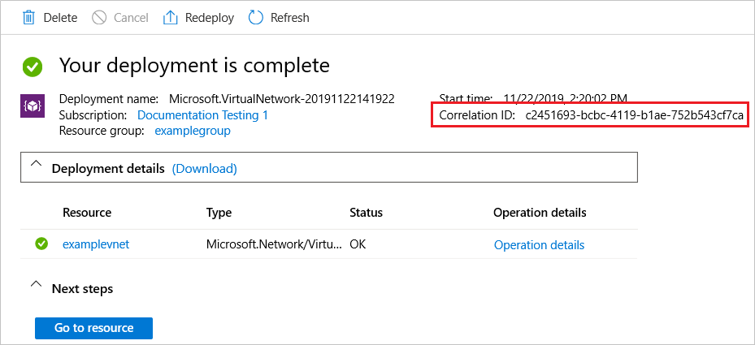

# View deployment history with Azure Resource Manager

Azure Resource Manager enables you to view your deployment history and examine specific operations in past deployments. You can see the resources that were deployed, and get information about any errors.

For help with resolving particular deployment errors, see [Resolve common errors when deploying resources to Azure with Azure Resource Manager](resource-manager-common-deployment-errors.md).

## Get deployments

To get details about a deployment from the deployment history use portal, PowerShell, Azure CLI, or REST API.

# [Portal](#tab/azure-portal)

1. Select the resource group you want to examine.

1. Select the link under **Deployments**.

   

1. Select one of the deployments from the deployment history.

   

1. A summary of the deployment is displayed, including the correlation ID. The correlation ID is used to track related events, and can be helpful when working with technical support to troubleshoot a deployment.

    

# [PowerShell](#tab/azure-powershell)

To list all deployments for a resource group, use the [Get-AzResourceGroupDeployment](/powershell/module/az.resources/Get-AzResourceGroupDeployment) command.

```azurepowershell-interactive
Get-AzResourceGroupDeployment -ResourceGroupName ExampleGroup
```

To get a specific deployment from a resource group, use the **DeploymentName** parameter.

```azurepowershell-interactive
Get-AzResourceGroupDeployment -ResourceGroupName ExampleGroup -DeploymentName ExampleDeployment
```

The correlation ID is used to track related events. It can be helpful when working with technical support to troubleshoot a deployment. To get the correlation ID, use:

```azurepowershell-interactive
(Get-AzResourceGroupDeployment -ResourceGroupName ExampleGroup -DeploymentName ExampleDeployment).CorrelationId
```

# [Azure CLI](#tab/azure-cli)

To list the deployment for a resource group, use [az group deployment list](/cli/azure/group/deployment).

```azurecli-interactive
az group deployment list --resource-group ExampleGroup
```

To get a specific deployment, use the [azure group deployment show](/cli/azure/group/deployment).

```azurecli-interactive
az group deployment show --resource-group ExampleGroup --name ExampleDeployment
```
  
The correlation ID is used to track related events, and can be helpful when working with technical support to troubleshoot a deployment.

```azurecli-interactive
az group deployment show -g ExampleGroup -n ExampleDeployment --query properties.correlationId
```

# [HTTP](#tab/http)

The following example shows how to get information about a deployment. For documentation about the latest API version, see the [Deployments - Get](/rest/api/resources/deployments/get) operation.

```
GET https://management.azure.com/subscriptions/{subscription-id}/resourcegroups/{resource-group-name}/providers/microsoft.resources/deployments/{deployment-name}?api-version={api-version}
```

In the response, note in particular the **provisioningState**, **correlationId**, and **error** elements. The **correlationId** is used to track related events, and can be helpful when working with technical support to troubleshoot a deployment.

```json
{ 
 ...
 "properties": {
   "provisioningState":"Failed",
   "correlationId":"d5062e45-6e9f-4fd3-a0a0-6b2c56b15757",
   ...
   "error":{
     "code":"DeploymentFailed","message":"At least one resource deployment operation failed. Please list deployment operations for details. Please see https://aka.ms/arm-debug for usage details.",
     "details":[{"code":"Conflict","message":"{\r\n  \"error\": {\r\n    \"message\": \"Conflict\",\r\n    \"code\": \"Conflict\"\r\n  }\r\n}"}]
   }  
 }
}
```

---

## Get deployment operations

To get details about a deployment from the deployment history use portal, PowerShell, Azure CLI, or REST API.

# [Portal](#tab/azure-portal)

1. To see deployment operations, select **Operation details**.

    

1. You see the details for that step of the deployment.

    

# [PowerShell](#tab/azure-powershell)

Each deployment includes multiple operations. Each operation represents a step in the deployment process. To discover what went wrong with a deployment, you usually need to see details about the deployment operations. You can see the status of the operations with **Get-AzResourceGroupDeploymentOperation**.

```azurepowershell-interactive
Get-AzResourceGroupDeploymentOperation -ResourceGroupName ExampleGroup -DeploymentName azuredeploy
```

# [Azure CLI](#tab/azure-cli)

To see the operations for a deployment, use:

```azurecli-interactive
az group deployment operation list -g ExampleGroup -n ExampleDeployment
```

# [HTTP](#tab/http)

The following example shows how to get deployment operations. For documentation about the latest API version, see the [Deployment Operations - List](/rest/api/resources/deploymentoperations/list) operation.

```
GET https://management.azure.com/subscriptions/{subscription-id}/resourcegroups/{resource-group-name}/providers/microsoft.resources/deployments/{deployment-name}/operations?$skiptoken={skiptoken}&api-version={api-version}
```
   
The response includes request and/or response information based on what you specified in the **debugSetting** property during deployment.

```json
{
 ...
 "properties": 
 {
   ...
   "request":{
     "content":{
       "location":"West US",
       "properties":{
         "accountType": "Standard_LRS"
       }
     }
   },
   "response":{
     "content":{
       "error":{
         "message":"Conflict","code":"Conflict"
       }
     }
   }
 }
}
```

---


## PowerShell


To get more details about failed operations, retrieve the properties for operations with **Failed** state.

```azurepowershell-interactive
(Get-AzResourceGroupDeploymentOperation -DeploymentName azuredeploy -ResourceGroupName ExampleGroup).Properties | Where-Object ProvisioningState -eq Failed
```

Which returns all the failed operations with each one in the following format:

```powershell
provisioningOperation : Create
provisioningState     : Failed
timestamp             : 2019-05-13T21:42:40.7151512Z
duration              : PT3.1449887S
trackingId            : f4ed72f8-4203-43dc-958a-15d041e8c233
serviceRequestId      : a426f689-5d5a-448d-a2f0-9784d14c900a
statusCode            : BadRequest
statusMessage         : @{error=}
targetResource        : @{id=/subscriptions/{guid}/resourceGroups/ExampleGroup/providers/
                       Microsoft.Network/publicIPAddresses/myPublicIP;
                       resourceType=Microsoft.Network/publicIPAddresses; resourceName=myPublicIP}
```

Note the serviceRequestId and the trackingId for the operation. The serviceRequestId can be helpful when working with technical support to troubleshoot a deployment. You'll use the trackingId in the next step to focus on a particular operation.

To get the status message of a particular failed operation, use the following command:

```azurepowershell-interactive
((Get-AzResourceGroupDeploymentOperation -DeploymentName azuredeploy -ResourceGroupName ExampleGroup).Properties | Where-Object trackingId -eq f4ed72f8-4203-43dc-958a-15d041e8c233).StatusMessage.error
```

Which returns:

```powershell
code           message                                                                        details
----           -------                                                                        -------
DnsRecordInUse DNS record dns.westus.cloudapp.azure.com is already used by another public IP. {}
```


## Next steps

* For help with resolving particular deployment errors, see [Resolve common errors when deploying resources to Azure with Azure Resource Manager](resource-manager-common-deployment-errors.md).
* To learn about using the activity logs to monitor other types of actions, see [View activity logs to manage Azure resources](resource-group-audit.md).
* To validate your deployment before executing it, see [Deploy a resource group with Azure Resource Manager template](resource-group-template-deploy.md).

