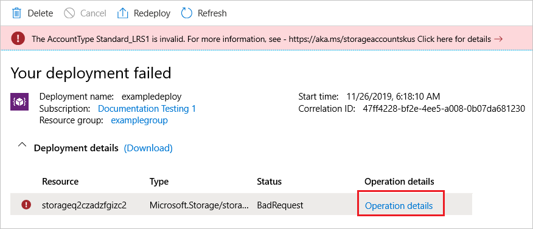
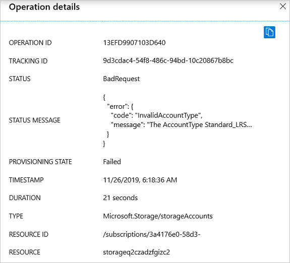

# View deployment history with Azure Resource Manager

Azure Resource Manager enables you to view your deployment history and examine specific operations in past deployments. You can see the resources that were deployed, and get information about any errors.

For help with resolving particular deployment errors, see [Resolve common errors when deploying resources to Azure with Azure Resource Manager](resource-manager-common-deployment-errors.md).

## Get deployments and correlation ID

You can view details about a deployment through the Azure portal, PowerShell, Azure CLI, or REST API. Each deployment has a correlation ID, which is used to track related events. It can be helpful when working with technical support to troubleshoot a deployment.

# [Portal](#tab/azure-portal)

1. Select the resource group you want to examine.

1. Select the link under **Deployments**.

   

1. Select one of the deployments from the deployment history.

   

1. A summary of the deployment is displayed, including the correlation ID. 

    

# [PowerShell](#tab/azure-powershell)

To list all deployments for a resource group, use the [Get-AzResourceGroupDeployment](/powershell/module/az.resources/Get-AzResourceGroupDeployment) command.

```azurepowershell-interactive
Get-AzResourceGroupDeployment -ResourceGroupName ExampleGroup
```

To get a specific deployment from a resource group, add the **DeploymentName** parameter.

```azurepowershell-interactive
Get-AzResourceGroupDeployment -ResourceGroupName ExampleGroup -DeploymentName ExampleDeployment
```

To get the correlation ID, use:

```azurepowershell-interactive
(Get-AzResourceGroupDeployment -ResourceGroupName ExampleGroup -DeploymentName ExampleDeployment).CorrelationId
```

# [Azure CLI](#tab/azure-cli)

To list the deployment for a resource group, use [az group deployment list](/cli/azure/group/deployment).

```azurecli-interactive
az group deployment list --resource-group ExampleGroup
```

To get a specific deployment, use the [azure group deployment show](/cli/azure/group/deployment).

```azurecli-interactive
az group deployment show --resource-group ExampleGroup --name ExampleDeployment
```
  
To get the correlation ID, use:

```azurecli-interactive
az group deployment show --resource-group ExampleGroup --name ExampleDeployment --query properties.correlationId
```

# [HTTP](#tab/http)

To list the deployments for a resource group, use the following operation. For the latest API version number to use in the request, see  [Deployments - List By Resource Group](/rest/api/resources/deployments/listbyresourcegroup). 

```
GET https://management.azure.com/subscriptions/{subscriptionId}/resourcegroups/{resourceGroupName}/providers/Microsoft.Resources/deployments/?api-version={api-version}
```

To get a specific deployment. use the following operation. For the latest API version number to use in the request, see [Deployments - Get](/rest/api/resources/deployments/get).

```
GET https://management.azure.com/subscriptions/{subscription-id}/resourcegroups/{resource-group-name}/providers/microsoft.resources/deployments/{deployment-name}?api-version={api-version}
```

The response includes the correlation ID.

```json
{
 ...
 "properties": {
   "mode": "Incremental",
   "provisioningState": "Failed",
   "timestamp": "2019-11-26T14:18:36.4518358Z",
   "duration": "PT26.2091817S",
   "correlationId": "47ff4228-bf2e-4ee5-a008-0b07da681230",
   ...
 }
}
```

---

## Get deployment operations and error message

Each deployment can include multiple operations. Each operation represents a step in the deployment process. To see more details about a deployment, view the deployment operations. When a deployment fails, the deployment operations include an error message.

# [Portal](#tab/azure-portal)

1. On the summary for a deployment, select **Operation details**.

    

1. You see the details for that step of the deployment. When an error occurs, the details include the error message.

    

# [PowerShell](#tab/azure-powershell)

To view the deployment operations for deployment to a resource group, use the [Get-AzResourceGroupDeploymentOperation](/powershell/module/az.resources/get-azdeploymentoperation) command.

```azurepowershell-interactive
Get-AzResourceGroupDeploymentOperation -ResourceGroupName ExampleGroup -DeploymentName ExampleDeploy
```

To view failed operations, filter operations with **Failed** state.

```azurepowershell-interactive
(Get-AzResourceGroupDeploymentOperation -ResourceGroupName ExampleGroup -DeploymentName ExampleDeploy).Properties | Where-Object ProvisioningState -eq Failed
```

To get the status message of failed operations, use the following command:

```azurepowershell-interactive
((Get-AzResourceGroupDeploymentOperation -ResourceGroupName ExampleGroup -DeploymentName ExampleDeploy ).Properties | Where-Object ProvisioningState -eq Failed).StatusMessage.error
```

# [Azure CLI](#tab/azure-cli)

To view the deployment operations for deployment to a resource group, use the [az group deployment operation list](/cli/azure/group/deployment/operation) command.

```azurecli-interactive
az group deployment operation list --resource-group ExampleGroup --name ExampleDeployment
```

To view failed operations, filter operations with **Failed** state.

```azurecli-interactive
az group deployment operation list --resource-group ExampleGroup --name ExampleDeploy --query "[?properties.provisioningState=='Failed']"
```

To get the status message of failed operations, use the following command:

```azurecli-interactive
az group deployment operation list --resource-group ExampleGroup --name ExampleDeploy --query "[?properties.provisioningState=='Failed'].properties.statusMessage.error"
```

# [HTTP](#tab/http)

To get deployment operations, use the following operation. For the latest API version number to use in the request, see [Deployment Operations - List](/rest/api/resources/deploymentoperations/list).

```
GET https://management.azure.com/subscriptions/{subscription-id}/resourcegroups/{resource-group-name}/providers/microsoft.resources/deployments/{deployment-name}/operations?$skiptoken={skiptoken}&api-version={api-version}
```

The response includes an error message.

```json
{
  "value": [
    {
      "id": "/subscriptions/xxxx/resourceGroups/examplegroup/providers/Microsoft.Resources/deployments/exampledeploy/operations/13EFD9907103D640",
      "operationId": "13EFD9907103D640",
      "properties": {
        "provisioningOperation": "Create",
        "provisioningState": "Failed",
        "timestamp": "2019-11-26T14:18:36.3177613Z",
        "duration": "PT21.0580179S",
        "trackingId": "9d3cdac4-54f8-486c-94bd-10c20867b8bc",
        "serviceRequestId": "01a9d0fe-896b-4c94-a30f-60b70a8f1ad9",
        "statusCode": "BadRequest",
        "statusMessage": {
          "error": {
            "code": "InvalidAccountType",
            "message": "The AccountType Standard_LRS1 is invalid. For more information, see - https://aka.ms/storageaccountskus"
          }
        },
        "targetResource": {
          "id": "/subscriptions/xxxx/resourceGroups/examplegroup/providers/Microsoft.Storage/storageAccounts/storageq2czadzfgizc2",
          "resourceType": "Microsoft.Storage/storageAccounts",
          "resourceName": "storageq2czadzfgizc2"
        }
      }
    },
    ...
  ]
}
```

---

## Next steps

* For help with resolving particular deployment errors, see [Resolve common errors when deploying resources to Azure with Azure Resource Manager](resource-manager-common-deployment-errors.md).
* To learn about using the activity logs to monitor other types of actions, see [View activity logs to manage Azure resources](resource-group-audit.md).
* To validate your deployment before executing it, see [Deploy a resource group with Azure Resource Manager template](resource-group-template-deploy.md).

