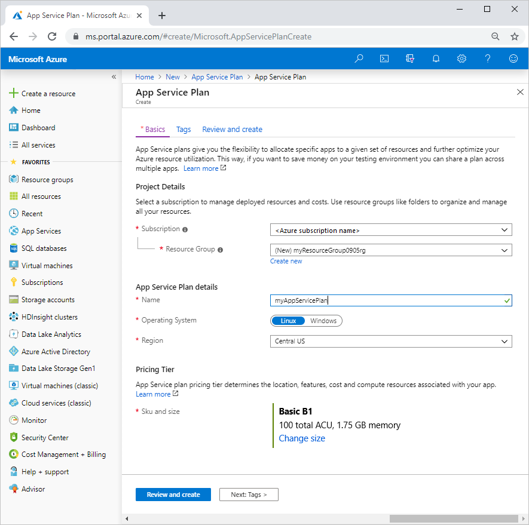
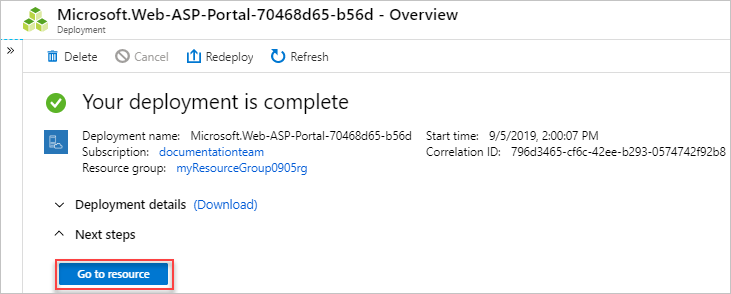
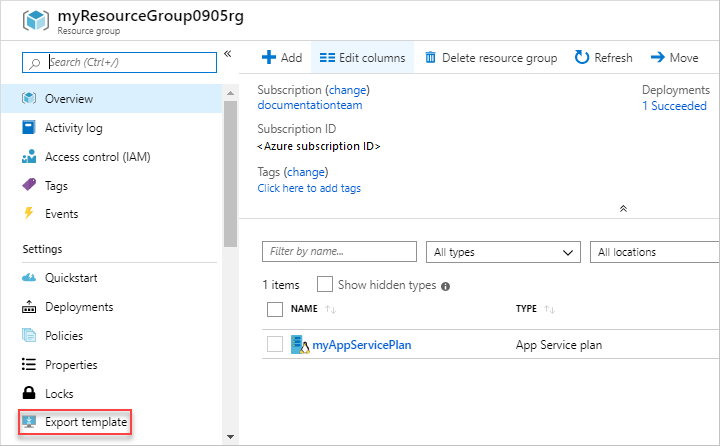
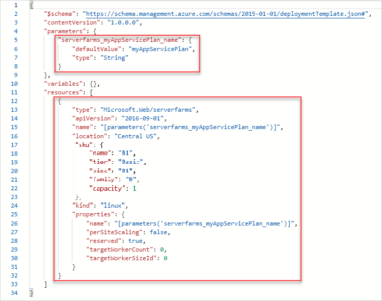

# Tutorial: Use exported template from the Azure portal

In this tutorial series, you've created a template to deploy an Azure storage account. In the next two tutorials, you add an *App Service plan* and a *website*. Instead of creating templates from scratch, you learn how to export templates from the Azure portal and how to use sample templates from the [Azure Quickstart templates](/resources/templates/). You customize those templates for your use. This tutorial focuses on exporting templates, and customizing the result for your template. It takes about 14 minutes to complete.

## Prerequisites

We recommend that you complete the [tutorial about outputs](template-tutorial-add-outputs.md), but it's not required.

You must have Visual Studio Code with the Resource Manager Tools extension, and either Azure PowerShell or Azure CLI. For more information, see [template tools](template-tutorial-create-first-template.md#get-tools).

## Review your template

At the end of the previous tutorial, your template had the following JSON:

[!code-json[](~/resourcemanager-templates/get-started-with-templates/add-outputs/azuredeploy.json)]

This template works well for deploying storage accounts, but you might want to add more resources to it. You can export a template from an existing resource to quickly get the JSON for that resource.

## Create App Service plan

1. Sign in to the [Azure portal](https://portal.azure.com).
1. Select **Create a resource**.
1. In **Search the Marketplace**, enter **App Service plan**, and then select **App Service plan**.  Don’t select **App Service plan (classic)**
1. Select **Create**.
1. Enter:

    - **Subscription**: select your Azure subscription.
    - **Resource Group**: Select **Create new** and then specify a name. Provide a different resource group name than the one you have been using in this tutorial series.
    - **Name**: enter a name for the App service plan.
    - **Operating System**: select **Linux**.
    - **Region**: select an Azure location. For example, **Central US**.
    - **Pricing tier**: to save costs, change the SKU to **Basic**.

    
1. Select **Review and create**.
1. Select **Create**. It takes a few moments to create the resource.

## Export template

1. Select **Go to resource**.

    

1. Select **Export template**.

    

   The export template feature takes the current state of a resource and generates a template to deploy it. Exporting a template can be a helpful of quickly getting the JSON you need to deploy a resource.

1. Copy the **Microsoft.Web/serverfarms** definition and the parameter definition to your template.

    

> [!IMPORTANT]
> Typically, the exported template is more verbose than you might want when creating a template. For example, the SKU object in the exported template has five properties. This template works, but you could just use the **name** property. You can start with the exported template, and then modify it as you like to fit your requirements.

## Revise existing template

The exported template gives you most of the JSON you need, but you need to customize it for your template. Pay particular attention to differences in parameters and variables between your template and the exported template. Obviously, the export process doesn't know the parameters and variables that you've already defined in your template.

The following example highlights the additions to your template. It contains the exported code plus some changes. First, it changes the name of the parameter to match your naming convention. Second, it uses your location parameter for the location of the app service plan. Third, it removes the **name** inside the **properties** object because this value is redundant with the **name** property at the resource level.

Copy the whole file and replace your template with its contents.

[!code-json[](~/resourcemanager-templates/get-started-with-templates/export-template/azuredeploy.json?range=1-72&highlight=23-26,45-64)]

## Deploy template

Use either Azure CLI or Azure PowerShell to deploy a template.

If you haven't created the resource group, see [Create resource group](template-tutorial-create-first-template.md#create-resource-group). The example assumes you've set the **templateFile** variable to the path to the template file, as shown in the [first tutorial](template-tutorial-create-first-template.md#deploy-template).

# [PowerShell](#tab/azure-powershell)

```azurepowershell
New-AzResourceGroupDeployment `
  -Name addappserviceplan `
  -ResourceGroupName myResourceGroup `
  -TemplateFile $templateFile `
  -storagePrefix "store" `
  -storageSKU Standard_LRS
```

# [Azure CLI](#tab/azure-cli)

```azurecli
az group deployment create \
  --name addappserviceplan \
  --resource-group myResourceGroup \
  --template-file $templateFile \
  --parameters storagePrefix=store storageSKU=Standard_LRS
```

---

## Verify deployment

You can verify the deployment by exploring the resource group from the Azure portal.

1. Sign in to the [Azure portal](https://portal.azure.com).
1. From the left menu, select **Resource groups**.
1. Select the resource group you deployed to.
1. The resource group contains a storage account and an App Service plan.

## Clean up resources

If you're moving on to the next tutorial, you don't need to delete the resource group.

If you're stopping now, you might want to clean up the resources you deployed by deleting the resource group.

1. From the Azure portal, select **Resource group** from the left menu.
2. Enter the resource group name in the **Filter by name** field.
3. Select the resource group name.
4. Select **Delete resource group** from the top menu.

## Next steps

You learned how to export a template from the Azure portal, and how to use the exported template for your template development. You can also use the Azure Quickstart templates to simplify template development.

> [!div class="nextstepaction"]
> [Use Azure Quickstart templates](template-tutorial-quickstart-template.md)