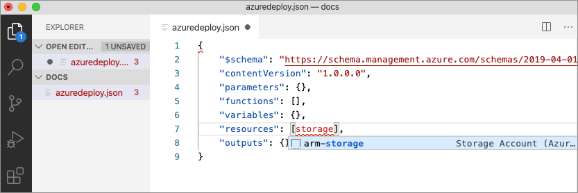
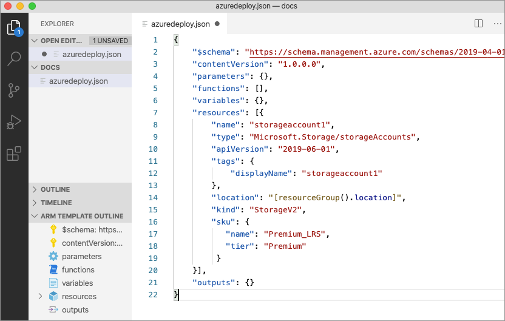
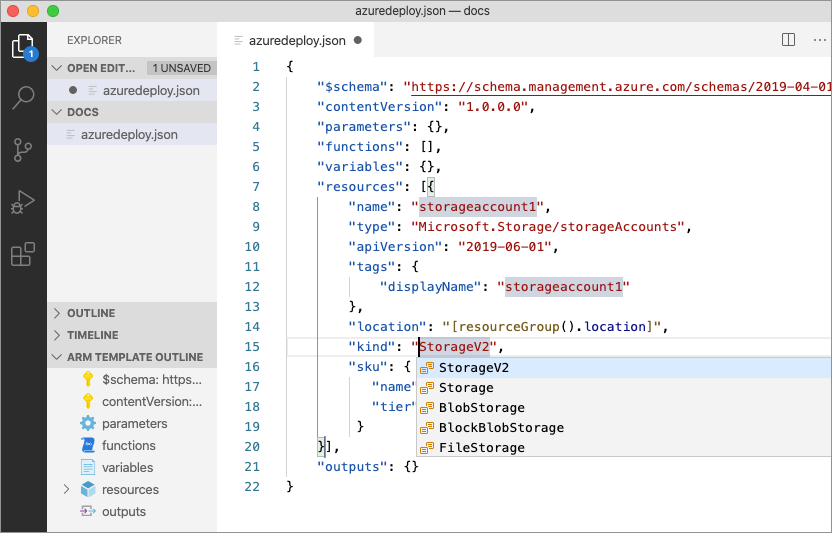
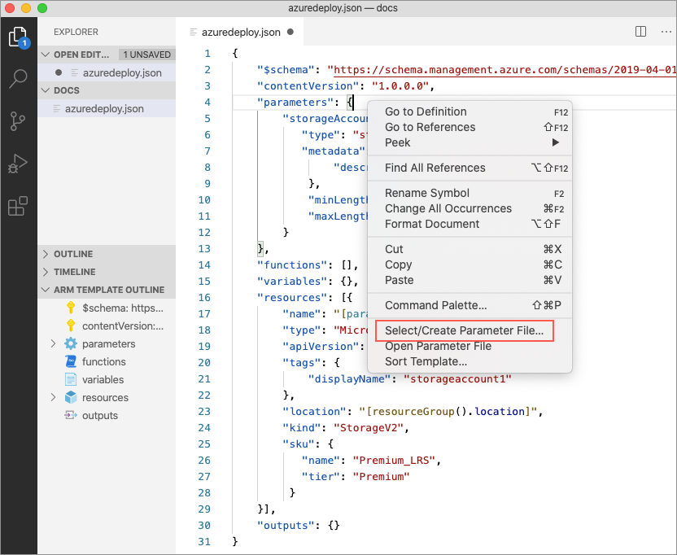

# Quickstart: Create Azure Resource Manager templates by using Visual Studio Code

Learn how to use Visual Studio Code and the Azure Resource Manager Tools extension to create and edit Azure Resource Manager templates. You can create Resource Manager templates in Visual Studio Code without the extension, but the extension provides autocomplete options that simplify template development. To understand the concepts associated with deploying and managing your Azure solutions, see [template deployment overview](overview.md).

If you don't have an Azure subscription, [create a free account](https://azure.microsoft.com/free/) before you begin.

## Create an empty ARM template

Create and open with Visual Studio Code a new file named *azuredeploy.json*. Enter `arm!` into the code editor which initiates ARM Tools snippets for scaffolding out an ARM template.

Select `arm!` to create a template scoped for an Azure resource group deployment.

This snippet creates the basic building blocks for an ARM template.

Notice that the VS Code language mode has changed from *JSON* to *Azure Resource Manager Template*. The ARM Tools extension includes a language server specific to ARM templates which provides ARM template specific auto-completion, validation, and other language services.

## Add storage account to template

Place the cursor in the template **resources** block, type in `storage`, and select the *arm-storage* snippet.

This adds a storage resource to the template.

The **tab** key can be used to tab through configurable properties on the storage account.

## Explore template completion and validation

One of the most powerful capabilities of the ARM Tools extension for VS Code is its integration with Azure schemas. Azure schemas provide the extension with resource configuration completion capability and the ability to validate that a resource has been properly configured.

Let's modify the storage account to see both of these capabilities in action. First, update the storage account kind to an invalid value such as `superStorage`. Notice that this throws a warning indicating that `superStorage` is a valid configuration for the storage account kind.

To use the completion capabilities, remove `superStorage`, place the cursor inside of the double quotes, and press `ctrl` + `space. This presents a list of valid storage account types.

## Add parameters to the template

Now create and use a parameter to specify the storage account name.

Place your cursor in the parameters block, add a carriage return, type `par`, and then select `arm-param-value`. This adds a generic parameter to the template.

Update the name of the parameter to `storageAccountName` and the description to `Storage Account Name`.

Notice that the template also has a warning indicating that the parameter is never used. This can be seen either by hovering over the yellow squiggle in the editor pane or by opening the VS Code problems panel.

Now update the storage resources name property to use the parameter. To do so, remove the current name. Enter a double quote and an opening square bracket `[`, which produces a list of ARM functions that can be used in ARM expressions. Type in `par` and select *parameters* from the list. 

Entering a single quote `'` inside of the round brackets produces a list of all parameters defined in the template, in this case, *storageAccountName*. Select the parameter.

Azure storage accounts names have a minimum length of 3 characters and a maximum of 24. An ARM template parameter can help enforce these constraints by defining both `minLength` and `maxLength`. To do so, update the parameter with these properties and appropriate values.

 
## Create a parameter file from the template

## Clean up resources

When the Azure resources are no longer needed, clean up the resources you deployed by deleting the resource group.

1. From the Azure portal, select **Resource group** from the left menu.
2. Enter the resource group name in the **Filter by name** field.
3. Select the resource group name.  You shall see a total of six resources in the resource group.
4. Select **Delete resource group** from the top menu.

## Next steps

> [!div class="nextstepaction"]
> [Beginner tutorials](./template-tutorial-create-first-template.md)